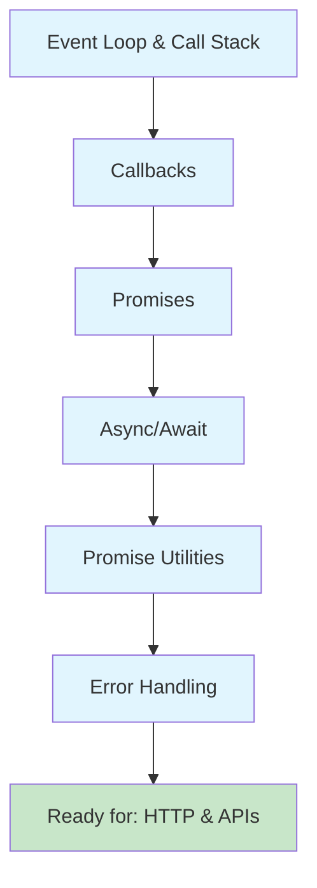
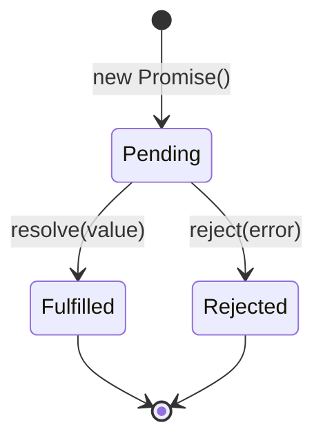

# Asynchronous JavaScript

## Overview

Asynchronous programming is at the heart of JavaScript's power. Whether fetching data from APIs, responding to user events, or running background tasks, understanding async patterns is essential for building responsive web applications—and critical for AI integration where API calls and streaming responses are the norm.

This lesson module covers the complete journey from understanding JavaScript's single-threaded event loop to mastering modern async patterns used in production applications.

### What you'll learn

| Lesson | Topic | Duration |
|--------|-------|----------|
| 01 | [Event Loop & Call Stack](./01-event-loop-call-stack.md) | 45 min |
| 02 | [Callbacks & Patterns](./02-callbacks-patterns.md) | 40 min |
| 03 | [Promises](./03-promises.md) | 50 min |
| 04 | [Async/Await](./04-async-await.md) | 45 min |
| 05 | [Promise Utilities](./05-promise-utilities.md) | 45 min |
| 06 | [Error Handling in Async Code](./06-error-handling-async.md) | 50 min |

**Total estimated time:** ~4.5 hours

### Prerequisites

- JavaScript Core Concepts ([Lesson 03](../03-javascript-core-concepts/))
- DOM Manipulation basics ([Lesson 04](../04-dom-manipulation/))
- Understanding of functions, closures, and scope

### Why this matters for AI development

Async JavaScript is especially critical for AI applications:

- **API calls** to OpenAI, Anthropic, and other LLM providers
- **Streaming responses** from chat completions
- **Parallel processing** of multiple AI requests
- **Rate limiting** and retry logic for API reliability
- **WebSocket connections** for real-time AI interactions

---

## Learning path



---

## Lessons in this module

### 1. Event Loop & Call Stack

Understand JavaScript's execution model—how the single thread handles async operations without blocking.

**Key concepts:**
- Call stack and stack frames
- Task queue (macrotasks) vs microtask queue
- Event loop processing order
- `setTimeout`/`setInterval` internals
- `requestAnimationFrame` for animations
- Blocking vs non-blocking patterns

[Start Lesson →](./01-event-loop-call-stack.md)

---

### 2. Callbacks & Patterns

Learn the original async pattern and why it led to Promises.

**Key concepts:**
- Callback function fundamentals
- Callback hell / pyramid of doom
- Error-first callback convention (Node.js style)
- Managing callback complexity
- When callbacks are still appropriate

[Start Lesson →](./02-callbacks-patterns.md)

---

### 3. Promises

Master the modern foundation of JavaScript async programming.

**Key concepts:**
- Promise states: pending, fulfilled, rejected
- Creating Promises with the constructor
- `.then()`, `.catch()`, `.finally()` handlers
- Promise chaining for sequential operations
- Error propagation through chains
- Static methods: `Promise.resolve()`, `Promise.reject()`

[Start Lesson →](./03-promises.md)

---

### 4. Async/Await

Write async code that looks synchronous with modern syntax.

**Key concepts:**
- `async` function declarations and expressions
- `await` operator and execution pausing
- Converting Promise chains to async/await
- Top-level await in modules
- Sequential vs parallel execution patterns
- The `return await` trap in try/catch

[Start Lesson →](./04-async-await.md)

---

### 5. Promise Utilities

Coordinate multiple async operations with built-in methods.

**Key concepts:**
- `Promise.all()` — wait for all, fail on first rejection
- `Promise.race()` — first to settle wins
- `Promise.allSettled()` — wait for all, get all results
- `Promise.any()` — first to fulfill wins
- Use cases: parallel loading, timeouts, fallbacks

[Start Lesson →](./05-promise-utilities.md)

---

### 6. Error Handling in Async Code

Build resilient async code that handles failures gracefully.

**Key concepts:**
- Error propagation in Promise chains
- try/catch placement with async/await
- Unhandled rejection detection
- Retry patterns with exponential backoff
- Timeout implementation with AbortController
- Circuit breaker pattern

[Start Lesson →](./06-error-handling-async.md)

---

## Quick reference

### Promise states



### Choosing the right utility

| Need | Use |
|------|-----|
| All must succeed | `Promise.all()` |
| First to complete | `Promise.race()` |
| All results, success or failure | `Promise.allSettled()` |
| First success only | `Promise.any()` |

### Common patterns

```javascript
// Parallel execution
const [a, b, c] = await Promise.all([fetchA(), fetchB(), fetchC()]);

// Timeout
const result = await Promise.race([fetchData(), timeout(5000)]);

// Retry with backoff
for (let i = 0; i < 3; i++) {
  try { return await fetchData(); }
  catch { await delay(1000 * 2 ** i); }
}
```

---

## Navigation

| Previous | Up | Next |
|----------|-----|------|
| [DOM Manipulation](../04-dom-manipulation/) | [Unit Overview](../00-overview.md) | [HTTP & API Communication](../06-http-api-communication.md) |

