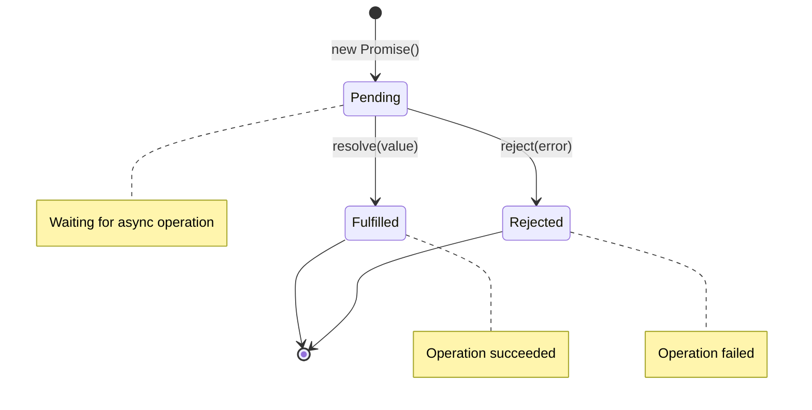
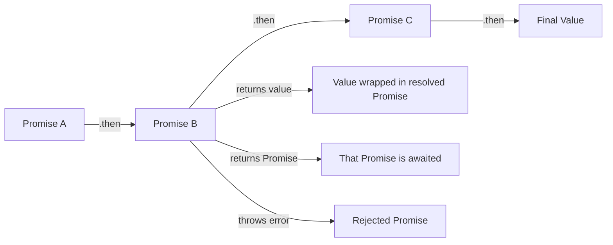
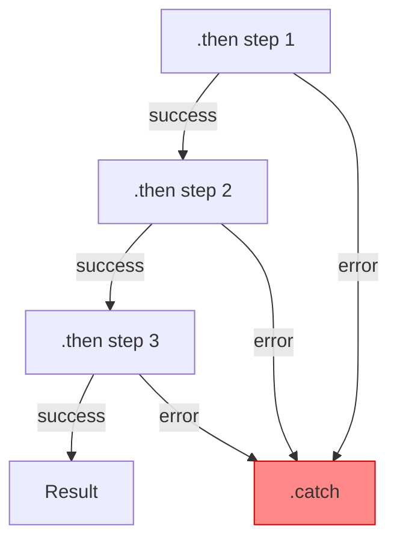

# Promises

## Introduction

Callbacks gave us a way to handle asynchronous operations, but they led to deeply nested, hard-to-read code. Promises solve this problem by providing a cleaner, more structured approach to async programming.

A Promise represents a value that may not be available yet but will be resolved at some point in the future—or explicitly rejected if something goes wrong. Think of it like ordering food at a restaurant: you get a ticket (the promise) that guarantees you'll receive your order (the value) when it's ready, or be notified if the kitchen can't fulfill it (rejection).

### What we'll cover

- The three states of a Promise and how they transition
- Creating Promises with the `Promise` constructor
- Consuming Promises with `then()`, `catch()`, and `finally()`
- Chaining Promises for sequential async operations
- Understanding how errors propagate through Promise chains

### Prerequisites

- Understanding of callbacks ([previous lesson](./02-callbacks-patterns.md))
- Familiarity with the event loop and microtask queue ([lesson 1](./01-event-loop-call-stack.md))
- Basic JavaScript functions and error handling

---

## Promise states

Every Promise exists in exactly one of three states at any given moment:



| State | Description | Transition |
|-------|-------------|------------|
| **Pending** | Initial state—operation in progress | Created with `new Promise()` |
| **Fulfilled** | Operation completed successfully | Called `resolve(value)` |
| **Rejected** | Operation failed | Called `reject(error)` |

Once a Promise transitions from **pending** to either **fulfilled** or **rejected**, it becomes *settled* and cannot change state again. This immutability is a key feature—a Promise that resolved with a value will always return that same value.

```javascript
const promise = new Promise((resolve, reject) => {
  resolve("first");
  resolve("second"); // Ignored - Promise already settled
  reject("error");   // Also ignored
});

promise.then(value => console.log(value));
```

**Output:**
```
first
```

> **Note:** The second `resolve()` and `reject()` calls have no effect because the Promise already settled with `"first"`.

---

## Creating Promises

### The Promise constructor

We create a Promise using the `Promise` constructor, which takes an *executor function* with two parameters: `resolve` and `reject`.

```javascript
const myPromise = new Promise((resolve, reject) => {
  // Async operation here
  const success = true;
  
  if (success) {
    resolve("Operation completed!");
  } else {
    reject(new Error("Operation failed"));
  }
});
```

The executor function runs **immediately** when the Promise is created—not when you attach handlers:

```javascript
console.log("1. Before Promise");

const promise = new Promise((resolve) => {
  console.log("2. Inside executor (runs immediately)");
  resolve("done");
});

console.log("3. After Promise created");

promise.then(value => console.log("4. Handler:", value));

console.log("5. After .then() attached");
```

**Output:**
```
1. Before Promise
2. Inside executor (runs immediately)
3. After Promise created
5. After .then() attached
4. Handler: done
```

> **🔑 Key concept:** The executor runs synchronously, but handlers (`then`, `catch`, `finally`) always run asynchronously in the microtask queue—even if the Promise is already settled.

### Wrapping async operations

The most common use case is wrapping callback-based APIs:

```javascript
function delay(ms) {
  return new Promise(resolve => {
    setTimeout(() => resolve(`Waited ${ms}ms`), ms);
  });
}

delay(1000).then(message => console.log(message));
```

**Output (after 1 second):**
```
Waited 1000ms
```

### Simulating API calls

Here's a realistic example simulating a database query:

```javascript
function fetchUser(userId) {
  return new Promise((resolve, reject) => {
    // Simulate network delay
    setTimeout(() => {
      const users = {
        1: { id: 1, name: "Alice", role: "admin" },
        2: { id: 2, name: "Bob", role: "user" }
      };
      
      const user = users[userId];
      
      if (user) {
        resolve(user);
      } else {
        reject(new Error(`User ${userId} not found`));
      }
    }, 500);
  });
}

// Usage
fetchUser(1)
  .then(user => console.log("Found:", user.name))
  .catch(error => console.error("Error:", error.message));
```

**Output (after 500ms):**
```
Found: Alice
```

---

## Consuming Promises with then, catch, and finally

### The then() method

The `then()` method registers callbacks for when a Promise settles. It takes two optional arguments:

```javascript
promise.then(onFulfilled, onRejected);
```

- `onFulfilled`: Called when Promise fulfills, receives the resolved value
- `onRejected`: Called when Promise rejects, receives the error

```javascript
const successPromise = Promise.resolve("Success!");
const failPromise = Promise.reject(new Error("Failed!"));

// Handling success
successPromise.then(
  value => console.log("Fulfilled:", value),
  error => console.log("Rejected:", error.message)
);

// Handling failure
failPromise.then(
  value => console.log("Fulfilled:", value),
  error => console.log("Rejected:", error.message)
);
```

**Output:**
```
Fulfilled: Success!
Rejected: Failed!
```

### The catch() method

While `then()` can handle rejections, `catch()` provides cleaner syntax for error handling:

```javascript
// These are equivalent:
promise.then(null, errorHandler);
promise.catch(errorHandler);
```

Using `catch()` makes code more readable:

```javascript
fetchUser(999)
  .then(user => console.log(user))
  .catch(error => console.error("Could not fetch user:", error.message));
```

**Output:**
```
Could not fetch user: User 999 not found
```

### The finally() method

The `finally()` method runs regardless of whether the Promise fulfilled or rejected—perfect for cleanup operations:

```javascript
function fetchData() {
  console.log("Loading...");
  
  return fetchUser(1)
    .then(user => {
      console.log("User:", user.name);
      return user;
    })
    .catch(error => {
      console.error("Error:", error.message);
      throw error; // Re-throw to keep Promise rejected
    })
    .finally(() => {
      console.log("Loading complete (cleanup)");
    });
}

fetchData();
```

**Output:**
```
Loading...
User: Alice
Loading complete (cleanup)
```

> **Note:** `finally()` doesn't receive any arguments—it doesn't know if the Promise fulfilled or rejected. It's purely for cleanup that should happen either way.

### Return values from handlers

Each handler in the Promise chain can transform the value passed to the next handler:

```javascript
Promise.resolve(5)
  .then(x => x * 2)      // Returns 10
  .then(x => x + 3)      // Returns 13
  .then(x => console.log("Result:", x));
```

**Output:**
```
Result: 13
```

---

## Promise chaining

Promise chaining enables sequential async operations without nesting. Each `then()` returns a new Promise, allowing us to chain operations in a flat, readable structure.

### The chaining flow



### Returning values vs Promises

When a `then()` handler returns:
- A **regular value**: It's automatically wrapped in a resolved Promise
- A **Promise**: The chain waits for that Promise to settle
- **Throws an error**: The chain moves to the next `catch()`

```javascript
// Returning values - automatically wrapped
Promise.resolve(1)
  .then(x => x + 1)           // Returns 2 (wrapped in Promise)
  .then(x => console.log(x)); // Logs: 2

// Returning Promises - chain waits
Promise.resolve(1)
  .then(x => {
    return new Promise(resolve => {
      setTimeout(() => resolve(x + 1), 1000);
    });
  })
  .then(x => console.log(x)); // Logs: 2 (after 1 second)
```

### Sequential async operations

Here's a practical example showing sequential API calls:

```javascript
function fetchUser(userId) {
  return new Promise(resolve => {
    setTimeout(() => {
      resolve({ id: userId, name: "Alice", departmentId: 101 });
    }, 300);
  });
}

function fetchDepartment(deptId) {
  return new Promise(resolve => {
    setTimeout(() => {
      resolve({ id: deptId, name: "Engineering", managerId: 42 });
    }, 300);
  });
}

function fetchManager(managerId) {
  return new Promise(resolve => {
    setTimeout(() => {
      resolve({ id: managerId, name: "Carol", title: "VP Engineering" });
    }, 300);
  });
}

// Chained execution - flat and readable
fetchUser(1)
  .then(user => {
    console.log("User:", user.name);
    return fetchDepartment(user.departmentId);
  })
  .then(dept => {
    console.log("Department:", dept.name);
    return fetchManager(dept.managerId);
  })
  .then(manager => {
    console.log("Manager:", manager.name);
  })
  .catch(error => {
    console.error("Error in chain:", error.message);
  });
```

**Output (over ~900ms total):**
```
User: Alice
Department: Engineering
Manager: Carol
```

Compare this to the callback hell version—the Promise chain is flat and each step is clearly visible.

### Accumulating data through the chain

Sometimes you need access to values from earlier in the chain:

```javascript
fetchUser(1)
  .then(user => {
    return fetchDepartment(user.departmentId)
      .then(dept => ({ user, dept })); // Combine both values
  })
  .then(({ user, dept }) => {
    console.log(`${user.name} works in ${dept.name}`);
  });
```

**Output:**
```
Alice works in Engineering
```

> **Tip:** While this works, `async/await` (covered in the next lesson) provides a cleaner way to access multiple values.

---

## Error propagation in Promise chains

Errors in Promise chains behave like exceptions—they "bubble up" to the nearest `catch()`:



### Errors skip then handlers

When an error occurs, the chain skips all `then()` handlers until it finds a `catch()`:

```javascript
Promise.resolve("start")
  .then(value => {
    console.log("Step 1:", value);
    throw new Error("Something went wrong!");
  })
  .then(value => {
    console.log("Step 2:", value); // SKIPPED
  })
  .then(value => {
    console.log("Step 3:", value); // SKIPPED
  })
  .catch(error => {
    console.log("Caught:", error.message);
  });
```

**Output:**
```
Step 1: start
Caught: Something went wrong!
```

### Rejection propagation

Rejected Promises propagate the same way as thrown errors:

```javascript
function riskyOperation() {
  return new Promise((resolve, reject) => {
    reject(new Error("Database connection failed"));
  });
}

riskyOperation()
  .then(data => console.log("Data:", data))     // SKIPPED
  .then(data => console.log("More:", data))     // SKIPPED
  .catch(error => console.log("Caught:", error.message));
```

**Output:**
```
Caught: Database connection failed
```

### Recovering from errors

A `catch()` handler can recover from an error by returning a value:

```javascript
function fetchUserOrDefault(userId) {
  return fetchUser(userId)
    .catch(error => {
      console.log("User not found, using default");
      return { id: 0, name: "Guest", role: "guest" }; // Recovery value
    });
}

fetchUserOrDefault(999)
  .then(user => console.log("User:", user.name));
```

**Output:**
```
User not found, using default
User: Guest
```

### Re-throwing errors

If `catch()` throws or returns a rejected Promise, the error continues down the chain:

```javascript
fetchUser(999)
  .catch(error => {
    console.log("First catch:", error.message);
    throw new Error("Cannot proceed without user");
  })
  .then(user => console.log("User:", user)) // SKIPPED
  .catch(error => {
    console.log("Second catch:", error.message);
  });
```

**Output:**
```
First catch: User 999 not found
Second catch: Cannot proceed without user
```

### Multiple catch handlers

You can have multiple `catch()` handlers to handle errors at different stages:

```javascript
fetchUser(1)
  .then(user => {
    if (!user.email) {
      throw new Error("User has no email");
    }
    return sendEmail(user.email);
  })
  .catch(error => {
    // Handle user-related errors
    console.log("User error:", error.message);
    return "fallback@example.com";
  })
  .then(email => {
    console.log("Sending to:", email);
    return sendNotification(email);
  })
  .catch(error => {
    // Handle notification errors
    console.log("Notification error:", error.message);
  });
```

---

## Static Promise methods

JavaScript provides several static methods for creating pre-settled Promises or working with multiple Promises.

### Promise.resolve() and Promise.reject()

Create already-settled Promises:

```javascript
// Create a fulfilled Promise
const resolved = Promise.resolve("Immediate value");
resolved.then(v => console.log(v)); // "Immediate value"

// Create a rejected Promise
const rejected = Promise.reject(new Error("Immediate error"));
rejected.catch(e => console.log(e.message)); // "Immediate error"
```

These are useful for:
- Starting a Promise chain with a known value
- Converting values to Promises for consistent handling
- Testing and mocking async functions

### Checking if something is a Promise

```javascript
function isPromise(value) {
  return value && typeof value.then === "function";
}

console.log(isPromise(Promise.resolve())); // true
console.log(isPromise({ then: () => {} })); // true (thenable)
console.log(isPromise("string")); // false
```

> **Note:** JavaScript checks for "thenables"—any object with a `then` method—not just native Promises. This enables interoperability with Promise libraries.

---

## Best practices

| Practice | Why It Matters |
|----------|----------------|
| Always return in `then()` handlers | Forgotten returns break the chain—next handler receives `undefined` |
| Always add a `catch()` at the end | Unhandled rejections cause silent failures or crashes |
| Create new Errors with `new Error()` | Stack traces help debugging—don't reject with strings |
| Don't nest Promises unnecessarily | Return Promises to keep chains flat |
| Use `finally()` for cleanup | Guaranteed execution whether success or failure |

---

## Common pitfalls

| ❌ Mistake | ✅ Solution |
|-----------|-------------|
| Forgetting to return in `then()` | `return fetchData()` not just `fetchData()` |
| Nesting Promises (Promise hell) | Return Promises and chain with `.then()` |
| Using `catch()` as second `then()` arg | Use separate `.catch()` for clarity |
| Ignoring rejected Promises | Always handle with `.catch()` or try/catch |
| Rejecting with strings | `reject(new Error("message"))` for stack traces |
| Calling resolve/reject multiple times | Remember: first call wins, rest are ignored |

### The forgotten return problem

One of the most common bugs:

```javascript
// ❌ WRONG - Forgotten return
fetchUser(1)
  .then(user => {
    fetchDepartment(user.deptId); // No return!
  })
  .then(dept => {
    console.log(dept); // undefined!
  });

// ✅ CORRECT - Return the Promise
fetchUser(1)
  .then(user => {
    return fetchDepartment(user.deptId);
  })
  .then(dept => {
    console.log(dept); // { id: 101, name: "Engineering" }
  });
```

---

## Hands-on exercise

### Your task

Build a `RetryablePromise` utility that automatically retries failed async operations with exponential backoff.

### Requirements

1. Create a function `retryOperation(operation, maxRetries, baseDelay)` that:
   - Executes the `operation` function (which returns a Promise)
   - Retries up to `maxRetries` times on failure
   - Uses exponential backoff: wait `baseDelay * 2^attempt` ms between retries
   - Logs each attempt and delay

2. Test with a simulated flaky API that fails randomly

3. Return the successful result or throw after all retries exhausted

### Expected result

```
Attempt 1 failed: Random failure (25% chance)
Waiting 200ms before retry...
Attempt 2 failed: Random failure (25% chance)
Waiting 400ms before retry...
Attempt 3 succeeded!
Result: { data: "Success!" }
```

<details>
<summary>💡 Hints (click to expand)</summary>

- Use recursion or a loop to manage retry attempts
- Create a `delay` function that returns a Promise
- Calculate delay as: `baseDelay * Math.pow(2, attempt)`
- Chain `.catch()` to handle failures and trigger retries
- Track attempt count to know when to give up

</details>

<details>
<summary>✅ Solution (click to expand)</summary>

```javascript
// Utility: delay function
function delay(ms) {
  return new Promise(resolve => setTimeout(resolve, ms));
}

// Simulated flaky API (75% failure rate for testing)
function flakyApi() {
  return new Promise((resolve, reject) => {
    setTimeout(() => {
      if (Math.random() > 0.75) {
        resolve({ data: "Success!" });
      } else {
        reject(new Error("Random failure (75% chance)"));
      }
    }, 100);
  });
}

// Retry utility with exponential backoff
function retryOperation(operation, maxRetries = 3, baseDelay = 100) {
  let attempt = 0;
  
  function execute() {
    attempt++;
    
    return operation()
      .then(result => {
        console.log(`Attempt ${attempt} succeeded!`);
        return result;
      })
      .catch(error => {
        console.log(`Attempt ${attempt} failed: ${error.message}`);
        
        if (attempt >= maxRetries) {
          throw new Error(`All ${maxRetries} attempts failed. Last error: ${error.message}`);
        }
        
        const waitTime = baseDelay * Math.pow(2, attempt - 1);
        console.log(`Waiting ${waitTime}ms before retry...`);
        
        return delay(waitTime).then(execute);
      });
  }
  
  return execute();
}

// Usage
retryOperation(flakyApi, 5, 100)
  .then(result => console.log("Result:", result))
  .catch(error => console.error("Final error:", error.message));
```

**Sample output:**
```
Attempt 1 failed: Random failure (75% chance)
Waiting 100ms before retry...
Attempt 2 failed: Random failure (75% chance)
Waiting 200ms before retry...
Attempt 3 failed: Random failure (75% chance)
Waiting 400ms before retry...
Attempt 4 succeeded!
Result: { data: 'Success!' }
```

</details>

### Bonus challenges

- [ ] Add a timeout per attempt (reject if operation takes too long)
- [ ] Implement a "circuit breaker" that stops retrying after consecutive failures
- [ ] Add configurable retry conditions (only retry on certain error types)

---

## Summary

✅ Promises represent async values with three states: **pending**, **fulfilled**, **rejected**

✅ The Promise constructor takes an executor with `resolve` and `reject` functions

✅ Use `then()` for success, `catch()` for errors, `finally()` for cleanup

✅ Promise chains enable flat, readable sequential async operations

✅ Errors propagate through the chain until caught by a `catch()` handler

✅ Always return values in `then()` handlers and add a `catch()` at the end

**Next:** [Async/Await](./04-async-await.md) — Cleaner syntax for writing async code

---

## Further reading

- [MDN: Using Promises](https://developer.mozilla.org/en-US/docs/Web/JavaScript/Guide/Using_promises) — Comprehensive guide
- [MDN: Promise](https://developer.mozilla.org/en-US/docs/Web/JavaScript/Reference/Global_Objects/Promise) — API reference
- [JavaScript.info: Promises](https://javascript.info/promise-basics) — Interactive tutorial
- [Previous: Callbacks & Patterns](./02-callbacks-patterns.md) — Understanding the problem Promises solve
- [Next: Async/Await](./04-async-await.md) — Modern async syntax

---

<!-- 
Sources Consulted:
- MDN Promise: https://developer.mozilla.org/en-US/docs/Web/JavaScript/Reference/Global_Objects/Promise
- MDN Using Promises: https://developer.mozilla.org/en-US/docs/Web/JavaScript/Guide/Using_promises
- MDN Promise.prototype.then: https://developer.mozilla.org/en-US/docs/Web/JavaScript/Reference/Global_Objects/Promise/then
- JavaScript.info Promises: https://javascript.info/promise-basics
-->
