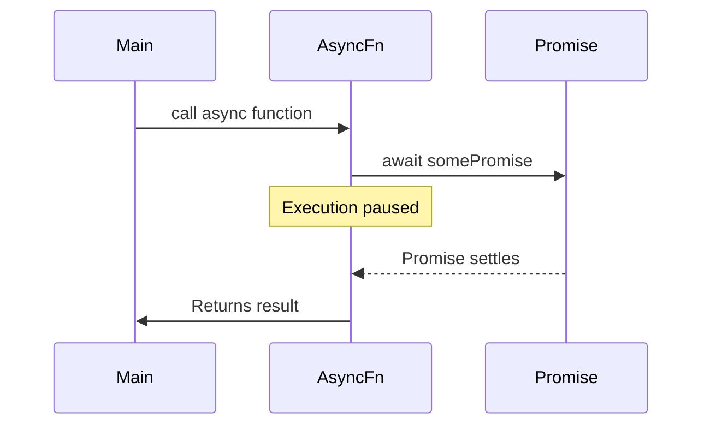
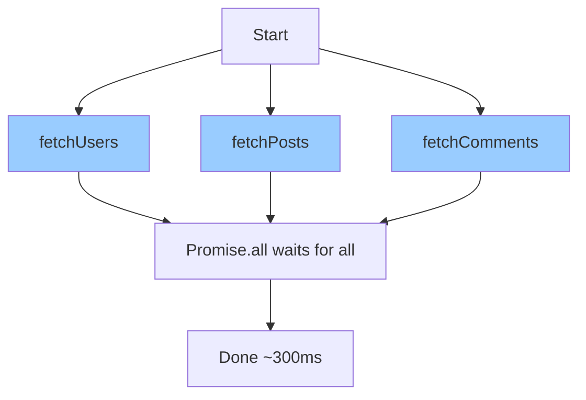

# Async/Await

## Introduction

While Promises solved the callback hell problem, chaining multiple `.then()` calls can still become verbose and hard to follow. Async/await provides syntactic sugar that makes asynchronous code look and behave more like synchronous code.

Introduced in ES2017, async/await doesn't replace Promises—it builds on top of them. Every async function returns a Promise, and `await` pauses execution until a Promise settles. The result is code that's dramatically easier to read, write, and debug.

### What we'll cover

- The `async` function declaration and what it returns
- Using `await` to pause until Promises resolve
- Converting Promise chains to async/await
- Top-level await in modules
- Sequential vs parallel execution patterns
- Common patterns and anti-patterns

### Prerequisites

- Solid understanding of Promises ([previous lesson](./03-promises.md))
- Familiarity with Promise chaining and error handling
- Basic JavaScript try/catch syntax

---

## The async keyword

Adding `async` before a function declaration does two things:

1. **The function always returns a Promise**
2. **Allows using `await` inside the function**

```javascript
// Regular function
function regular() {
  return "hello";
}

// Async function
async function asyncFn() {
  return "hello";
}

console.log(regular());        // "hello" (string)
console.log(asyncFn());        // Promise { "hello" }

asyncFn().then(v => console.log(v)); // "hello"
```

**Output:**
```
hello
Promise { 'hello' }
hello
```

### Return values are wrapped in Promises

Whatever you return from an async function gets wrapped in `Promise.resolve()`:

```javascript
async function examples() {
  return 42;  // Becomes Promise.resolve(42)
}

async function returnsPromise() {
  return Promise.resolve(42);  // Already a Promise, not double-wrapped
}

// Both behave identically
examples().then(console.log);       // 42
returnsPromise().then(console.log); // 42
```

### Throwing inside async functions

If you throw an error inside an async function, the returned Promise rejects:

```javascript
async function willReject() {
  throw new Error("Something went wrong");
}

willReject()
  .then(v => console.log("Success:", v))
  .catch(e => console.log("Error:", e.message));
```

**Output:**
```
Error: Something went wrong
```

### Async function expressions and arrows

You can use `async` with function expressions and arrow functions:

```javascript
// Async function expression
const asyncExpr = async function() {
  return "expression";
};

// Async arrow function
const asyncArrow = async () => {
  return "arrow";
};

// Async method in object
const obj = {
  async method() {
    return "method";
  }
};

// Async method in class
class MyClass {
  async doSomething() {
    return "class method";
  }
}
```

---

## The await keyword

The `await` keyword pauses async function execution until a Promise settles:



### Basic usage

```javascript
function delay(ms) {
  return new Promise(resolve => setTimeout(resolve, ms));
}

async function demo() {
  console.log("Starting...");
  await delay(1000);
  console.log("After 1 second");
  await delay(1000);
  console.log("After 2 seconds");
  return "Done!";
}

demo().then(result => console.log(result));
```

**Output (over 2 seconds):**
```
Starting...
After 1 second
After 2 seconds
Done!
```

### Await with non-Promise values

You can `await` any value. Non-Promise values are wrapped in `Promise.resolve()`:

```javascript
async function awaitNonPromise() {
  const a = await 42;           // Same as await Promise.resolve(42)
  const b = await "hello";      // Same as await Promise.resolve("hello")
  const c = await { x: 1 };     // Same as await Promise.resolve({ x: 1 })
  
  console.log(a, b, c);
}

awaitNonPromise();
```

**Output:**
```
42 hello { x: 1 }
```

> **Note:** While you *can* await non-Promises, doing so has no practical benefit and may confuse readers. Only await actual Promises.

### Await only works inside async functions

Using `await` outside an async function throws a syntax error:

```javascript
// ❌ SyntaxError: await is only valid in async functions
function notAsync() {
  await delay(1000);
}

// ✅ Correct: wrap in async function
async function isAsync() {
  await delay(1000);
}
```

---

## Converting Promise chains to async/await

Let's transform the Promise chain from the previous lesson:

### Before: Promise chain

```javascript
function fetchUser(userId) {
  return new Promise(resolve => {
    setTimeout(() => resolve({ id: userId, name: "Alice", deptId: 101 }), 300);
  });
}

function fetchDepartment(deptId) {
  return new Promise(resolve => {
    setTimeout(() => resolve({ id: deptId, name: "Engineering", managerId: 42 }), 300);
  });
}

function fetchManager(managerId) {
  return new Promise(resolve => {
    setTimeout(() => resolve({ id: managerId, name: "Carol", title: "VP" }), 300);
  });
}

// Promise chain version
fetchUser(1)
  .then(user => {
    console.log("User:", user.name);
    return fetchDepartment(user.deptId);
  })
  .then(dept => {
    console.log("Dept:", dept.name);
    return fetchManager(dept.managerId);
  })
  .then(manager => {
    console.log("Manager:", manager.name);
  })
  .catch(error => {
    console.error("Error:", error.message);
  });
```

### After: Async/await

```javascript
async function getOrgChart() {
  try {
    const user = await fetchUser(1);
    console.log("User:", user.name);
    
    const dept = await fetchDepartment(user.deptId);
    console.log("Dept:", dept.name);
    
    const manager = await fetchManager(dept.managerId);
    console.log("Manager:", manager.name);
    
    return { user, dept, manager };
  } catch (error) {
    console.error("Error:", error.message);
  }
}

getOrgChart();
```

**Output (both versions):**
```
User: Alice
Dept: Engineering
Manager: Carol
```

The async/await version is:
- **More readable**: Looks like synchronous code
- **Easier to debug**: Variables are in scope
- **Simpler data access**: No need to pass data through `.then()` chains

---

## Error handling with try/catch

With async/await, we use standard try/catch blocks for error handling:

```javascript
async function fetchUserData(userId) {
  try {
    const user = await fetchUser(userId);
    const posts = await fetchUserPosts(user.id);
    return { user, posts };
  } catch (error) {
    console.error("Failed to fetch user data:", error.message);
    throw error; // Re-throw if caller should handle it
  } finally {
    console.log("Cleanup: closing connections...");
  }
}
```

### Catching specific errors

```javascript
async function processPayment(amount) {
  try {
    const auth = await authenticate();
    const result = await chargeCard(auth.token, amount);
    return result;
  } catch (error) {
    if (error.code === "AUTH_FAILED") {
      console.log("Please log in again");
      return redirectToLogin();
    } else if (error.code === "INSUFFICIENT_FUNDS") {
      console.log("Card declined");
      return showDeclinedMessage();
    } else {
      // Unexpected error
      throw error;
    }
  }
}
```

### Try/catch placement

You can wrap individual awaits or groups of related operations:

```javascript
async function fetchDashboard() {
  // Wrap individual operations
  let user;
  try {
    user = await fetchUser(1);
  } catch (error) {
    user = { name: "Guest" }; // Fallback
  }
  
  // Wrap related operations together
  let stats;
  try {
    const activity = await fetchActivity(user.id);
    const metrics = await fetchMetrics(user.id);
    stats = { activity, metrics };
  } catch (error) {
    stats = null; // No stats available
    console.log("Could not load stats");
  }
  
  return { user, stats };
}
```

---

## Top-level await

In ES2022+, you can use `await` at the top level of ES modules:

```javascript
// config.js (ES module)
const response = await fetch("/api/config");
export const config = await response.json();

console.log("Config loaded:", config.appName);
```

### Requirements for top-level await

1. **Must be in an ES module** (not CommonJS)
2. The module's loading is paused until the await resolves
3. Other modules importing this one also wait

```html
<!-- index.html -->
<script type="module">
  // Top-level await works here
  const data = await fetch("/api/data").then(r => r.json());
  console.log(data);
</script>
```

### Use cases

```javascript
// Database connection at startup
export const db = await connectToDatabase();

// Dynamic imports
const module = await import(`./locale/${userLang}.js`);

// Conditional initialization
export const cache = await (process.env.USE_REDIS
  ? connectRedis()
  : createMemoryCache()
);
```

> **Warning:** Top-level await can delay your application's startup. Use sparingly and only for essential initialization.

---

## Sequential vs parallel execution

One of the most important decisions with async/await is whether operations should run in sequence or in parallel.

### Sequential execution (one at a time)

When each operation depends on the previous result:

```javascript
// ✅ Correct for dependent operations
async function sequential() {
  const user = await fetchUser(1);           // Wait ~300ms
  const dept = await fetchDepartment(user.deptId);  // Wait ~300ms more
  const manager = await fetchManager(dept.managerId); // Wait ~300ms more
  // Total: ~900ms
  
  return { user, dept, manager };
}
```


### Parallel execution (all at once)

When operations are independent of each other:

```javascript
// ✅ Correct for independent operations
async function parallel() {
  const [users, posts, comments] = await Promise.all([
    fetchUsers(),      // Start immediately
    fetchPosts(),      // Start immediately
    fetchComments()    // Start immediately
  ]);
  // Total: ~300ms (slowest one)
  
  return { users, posts, comments };
}
```



### Common mistake: accidental sequential execution

```javascript
// ❌ WRONG - Sequential (slow)
async function slow() {
  const users = await fetchUsers();    // Wait
  const posts = await fetchPosts();    // Then wait
  const comments = await fetchComments(); // Then wait
  // Total: ~900ms
}

// ✅ CORRECT - Parallel (fast)
async function fast() {
  const [users, posts, comments] = await Promise.all([
    fetchUsers(),
    fetchPosts(),
    fetchComments()
  ]);
  // Total: ~300ms
}
```

### Starting parallel, awaiting later

You can start Promises in parallel and await them later:

```javascript
async function mixedApproach() {
  // Start both immediately
  const usersPromise = fetchUsers();
  const postsPromise = fetchPosts();
  
  // Do some synchronous work
  console.log("Requests started...");
  
  // Now await results
  const users = await usersPromise;
  const posts = await postsPromise;
  
  return { users, posts };
}
```

### Parallel with early processing

Process results as they arrive, not when all complete:

```javascript
async function parallelWithEarlyProcessing() {
  const userPromise = fetchUsers();
  const postPromise = fetchPosts();
  
  // Process users as soon as they're ready
  const users = await userPromise;
  console.log("Users ready, processing...");
  const processedUsers = processUsers(users);
  
  // Then process posts
  const posts = await postPromise;
  console.log("Posts ready, processing...");
  const processedPosts = processPosts(posts);
  
  return { processedUsers, processedPosts };
}
```

---

## Async iteration with for-await-of

For iterating over async iterables (like readable streams):

```javascript
async function processStream(stream) {
  for await (const chunk of stream) {
    console.log("Received chunk:", chunk.length, "bytes");
  }
  console.log("Stream ended");
}

// Simulated async iterable
async function* asyncGenerator() {
  yield await fetchChunk(1);
  yield await fetchChunk(2);
  yield await fetchChunk(3);
}

for await (const item of asyncGenerator()) {
  console.log(item);
}
```

### Processing arrays with async forEach

Regular `forEach` doesn't await:

```javascript
const userIds = [1, 2, 3];

// ❌ WRONG - forEach doesn't wait
userIds.forEach(async (id) => {
  const user = await fetchUser(id);
  console.log(user); // Order unpredictable
});
console.log("Done"); // Logs before users!

// ✅ CORRECT - Use for...of for sequential
async function sequential() {
  for (const id of userIds) {
    const user = await fetchUser(id);
    console.log(user); // In order
  }
  console.log("Done"); // After all users
}

// ✅ CORRECT - Use Promise.all for parallel
async function parallel() {
  const users = await Promise.all(
    userIds.map(id => fetchUser(id))
  );
  console.log(users); // All at once
  console.log("Done");
}
```

---

## Best practices

| Practice | Why It Matters |
|----------|----------------|
| Use try/catch for error handling | Consistent with synchronous code patterns |
| Start independent operations in parallel | Avoid unnecessary sequential delays |
| Don't mix `.then()` and `await` unnecessarily | Pick one style for consistency |
| Remember async functions return Promises | Callers must await or use `.then()` |
| Use `Promise.all()` for parallel operations | Single await for multiple operations |
| Avoid async forEach | Use `for...of` or `Promise.all` with `map` |

---

## Common pitfalls

| ❌ Mistake | ✅ Solution |
|-----------|-------------|
| Forgetting to await | `const data = await fetch()` not `const data = fetch()` |
| Sequential when parallel is possible | Use `Promise.all()` for independent operations |
| Using async forEach | Use `for...of` loop or `Promise.all(arr.map(...))` |
| Not handling errors | Wrap in try/catch or add `.catch()` to the call |
| Returning await unnecessarily | `return fetchData()` not `return await fetchData()` (in most cases) |
| Blocking the event loop | Don't `await` in sync-heavy loops |

### The await vs return await debate

In most cases, you don't need `return await`:

```javascript
// ❌ Unnecessary await
async function unnecessary() {
  return await fetchData();  // await is redundant
}

// ✅ Simpler
async function simpler() {
  return fetchData();  // Still returns a Promise
}

// ⚠️ EXCEPTION: Inside try/catch, you DO need await
async function withTryCatch() {
  try {
    return await fetchData();  // Need await to catch errors here
  } catch (error) {
    console.log("Caught:", error.message);
    return null;
  }
}
```

---

## Hands-on exercise

### Your task

Build an API rate limiter that processes requests sequentially with delays, handling both success and failure cases gracefully.

### Requirements

1. Create a `RateLimiter` class that:
   - Accepts `requestsPerSecond` in the constructor
   - Has an `execute(asyncFn)` method that queues and executes functions
   - Ensures minimum delay between executions
   - Returns results or throws errors appropriately

2. Process an array of API calls respecting the rate limit

3. Handle and report failed requests without stopping the queue

### Expected result

```
[0ms] Starting request 1
[0ms] Request 1 completed: User 1
[200ms] Starting request 2
[200ms] Request 2 completed: User 2
[400ms] Starting request 3
[400ms] Request 3 failed: User 999 not found
[600ms] Starting request 4
[600ms] Request 4 completed: User 4
All requests processed. Success: 3, Failed: 1
```

<details>
<summary>💡 Hints (click to expand)</summary>

- Calculate delay as `1000 / requestsPerSecond` milliseconds
- Track when the last request finished to calculate remaining wait time
- Use async/await with a delay Promise between requests
- Store results in an array with success/failure status
- Use `Date.now()` to track timing

</details>

<details>
<summary>✅ Solution (click to expand)</summary>

```javascript
class RateLimiter {
  constructor(requestsPerSecond) {
    this.minDelay = 1000 / requestsPerSecond;
    this.lastRequestTime = 0;
  }
  
  async execute(asyncFn) {
    // Calculate wait time
    const now = Date.now();
    const timeSinceLastRequest = now - this.lastRequestTime;
    const waitTime = Math.max(0, this.minDelay - timeSinceLastRequest);
    
    if (waitTime > 0) {
      await new Promise(resolve => setTimeout(resolve, waitTime));
    }
    
    this.lastRequestTime = Date.now();
    return asyncFn();
  }
}

// Simulated API
function fetchUser(id) {
  return new Promise((resolve, reject) => {
    setTimeout(() => {
      if (id === 999) {
        reject(new Error(`User ${id} not found`));
      } else {
        resolve(`User ${id}`);
      }
    }, 50);
  });
}

// Process multiple requests with rate limiting
async function processRequests() {
  const limiter = new RateLimiter(5); // 5 requests per second = 200ms between
  const userIds = [1, 2, 999, 4];
  const startTime = Date.now();
  
  const results = {
    success: 0,
    failed: 0,
    data: []
  };
  
  for (let i = 0; i < userIds.length; i++) {
    const userId = userIds[i];
    const elapsed = Date.now() - startTime;
    console.log(`[${elapsed}ms] Starting request ${i + 1}`);
    
    try {
      const result = await limiter.execute(() => fetchUser(userId));
      console.log(`[${Date.now() - startTime}ms] Request ${i + 1} completed: ${result}`);
      results.success++;
      results.data.push({ userId, status: "success", data: result });
    } catch (error) {
      console.log(`[${Date.now() - startTime}ms] Request ${i + 1} failed: ${error.message}`);
      results.failed++;
      results.data.push({ userId, status: "failed", error: error.message });
    }
  }
  
  console.log(`\nAll requests processed. Success: ${results.success}, Failed: ${results.failed}`);
  return results;
}

processRequests();
```

**Output:**
```
[0ms] Starting request 1
[52ms] Request 1 completed: User 1
[200ms] Starting request 2
[252ms] Request 2 completed: User 2
[400ms] Starting request 3
[452ms] Request 3 failed: User 999 not found
[600ms] Starting request 4
[652ms] Request 4 completed: User 4

All requests processed. Success: 3, Failed: 1
```

</details>

### Bonus challenges

- [ ] Add concurrent execution with a maximum number of parallel requests
- [ ] Implement request prioritization (high-priority requests jump the queue)
- [ ] Add retry logic with exponential backoff for failed requests

---

## Summary

✅ **`async` functions** always return Promises and enable `await` inside

✅ **`await` pauses** execution until the Promise settles, making code read synchronously

✅ **Error handling** uses standard try/catch blocks—cleaner than `.catch()` chains

✅ **Top-level await** works in ES modules for initialization patterns

✅ **Parallel execution** with `Promise.all()` is faster for independent operations

✅ **Sequential execution** is required when operations depend on previous results

**Next:** [Promise Utilities](./05-promise-utilities.md) — Promise.all, race, allSettled, and any

---

## Further reading

- [MDN: async function](https://developer.mozilla.org/en-US/docs/Web/JavaScript/Reference/Statements/async_function) — Full specification
- [MDN: await](https://developer.mozilla.org/en-US/docs/Web/JavaScript/Reference/Operators/await) — Await operator details
- [JavaScript.info: Async/await](https://javascript.info/async-await) — Interactive tutorial
- [Previous: Promises](./03-promises.md) — Understanding what async/await builds on
- [Next: Promise Utilities](./05-promise-utilities.md) — Combining multiple Promises

---

<!-- 
Sources Consulted:
- MDN async function: https://developer.mozilla.org/en-US/docs/Web/JavaScript/Reference/Statements/async_function
- MDN await: https://developer.mozilla.org/en-US/docs/Web/JavaScript/Reference/Operators/await
- MDN for-await-of: https://developer.mozilla.org/en-US/docs/Web/JavaScript/Reference/Statements/for-await...of
- JavaScript.info async/await: https://javascript.info/async-await
-->
