# Promise Utilities

## Introduction

So far, we've worked with single Promises. But real-world applications often need to coordinate multiple async operations: fetching data from several APIs, loading resources in parallel, or racing operations against timeouts.

JavaScript provides four static Promise methods for combining multiple Promises: `Promise.all()`, `Promise.race()`, `Promise.allSettled()`, and `Promise.any()`. Each has distinct behavior and use cases that can dramatically simplify your async code.

### What we'll cover

- `Promise.all()` — Wait for all Promises to fulfill
- `Promise.race()` — Get the first Promise to settle
- `Promise.allSettled()` — Wait for all to settle, regardless of outcome
- `Promise.any()` — Get the first Promise to fulfill
- Real-world use cases and patterns for each
- Choosing the right utility for your situation

### Prerequisites

- Understanding of Promises ([lesson 3](./03-promises.md))
- Familiarity with async/await ([previous lesson](./04-async-await.md))
- Basic array methods (`map`, `filter`)

---

## Promise.all()

`Promise.all()` takes an iterable of Promises and returns a single Promise that:
- **Fulfills** when ALL input Promises fulfill (with an array of results)
- **Rejects** when ANY input Promise rejects (with that rejection reason)

```mermaid
flowchart TD
    subgraph Input["Promise.all([p1, p2, p3])"]
        P1[Promise 1]
        P2[Promise 2]
        P3[Promise 3]
    end
    
    P1 -->|fulfilled| Wait[Wait for all]
    P2 -->|fulfilled| Wait
    P3 -->|fulfilled| Wait
    Wait -->|all fulfilled| Success["✅ [result1, result2, result3]"]
    
    P1 -->|rejected| Fail
    P2 -->|rejected| Fail
    P3 -->|rejected| Fail
    Fail["❌ First rejection"]
```



### Basic usage

```javascript
const promise1 = Promise.resolve(1);
const promise2 = Promise.resolve(2);
const promise3 = Promise.resolve(3);

Promise.all([promise1, promise2, promise3])
  .then(results => console.log(results));
```

**Output:**
```
[1, 2, 3]
```

### Order is preserved

Results appear in the same order as input Promises, regardless of completion order:

```javascript
function delay(ms, value) {
  return new Promise(resolve => setTimeout(() => resolve(value), ms));
}

// Different completion times
Promise.all([
  delay(300, "slow"),   // Finishes third
  delay(100, "fast"),   // Finishes first
  delay(200, "medium")  // Finishes second
]).then(results => console.log(results));
```

**Output:**
```
["slow", "fast", "medium"]
```

> **Note:** Even though "fast" resolves first, results maintain input order.

### Fail-fast behavior

If any Promise rejects, `Promise.all()` immediately rejects:

```javascript
Promise.all([
  Promise.resolve("success 1"),
  Promise.reject(new Error("failure")),
  Promise.resolve("success 2")  // Still runs, but result is lost
])
  .then(results => console.log("Results:", results))
  .catch(error => console.log("Error:", error.message));
```

**Output:**
```
Error: failure
```

### Practical example: parallel API calls

```javascript
async function fetchDashboardData(userId) {
  try {
    const [user, posts, notifications] = await Promise.all([
      fetch(`/api/users/${userId}`).then(r => r.json()),
      fetch(`/api/users/${userId}/posts`).then(r => r.json()),
      fetch(`/api/users/${userId}/notifications`).then(r => r.json())
    ]);
    
    return { user, posts, notifications };
  } catch (error) {
    console.error("Failed to load dashboard:", error.message);
    throw error;
  }
}
```

### Use cases for Promise.all()

| Use Case | Example |
|----------|---------|
| Parallel API calls | Fetching multiple endpoints simultaneously |
| Batch processing | Processing multiple items in parallel |
| Resource loading | Loading images, scripts, or data files together |
| Validation | Running multiple validation checks |
| Database operations | Multiple independent queries |

---

## Promise.race()

`Promise.race()` returns a Promise that settles as soon as ANY input Promise settles—whether it fulfills or rejects.


### Basic usage

```javascript
Promise.race([
  delay(300, "slow"),
  delay(100, "fast"),
  delay(200, "medium")
]).then(winner => console.log("Winner:", winner));
```

**Output:**
```
Winner: fast
```

### Race includes rejections

Unlike `Promise.any()`, a rejection can "win" the race:

```javascript
Promise.race([
  delay(200, "success"),
  new Promise((_, reject) => setTimeout(() => reject(new Error("fast failure")), 100))
])
  .then(result => console.log("Result:", result))
  .catch(error => console.log("Error:", error.message));
```

**Output:**
```
Error: fast failure
```

### Timeout pattern

One of the most common uses of `Promise.race()` is implementing timeouts:

```javascript
function withTimeout(promise, ms) {
  const timeout = new Promise((_, reject) => {
    setTimeout(() => reject(new Error(`Timeout after ${ms}ms`)), ms);
  });
  
  return Promise.race([promise, timeout]);
}

// Usage
async function fetchWithTimeout() {
  try {
    const data = await withTimeout(
      fetch("/api/slow-endpoint").then(r => r.json()),
      5000  // 5 second timeout
    );
    console.log("Data:", data);
  } catch (error) {
    console.log("Error:", error.message);
  }
}
```

### Cancellable operations

```javascript
function cancellableFetch(url, signal) {
  const fetchPromise = fetch(url, { signal });
  const cancelPromise = new Promise((_, reject) => {
    signal.addEventListener("abort", () => {
      reject(new Error("Request cancelled"));
    });
  });
  
  return Promise.race([fetchPromise, cancelPromise]);
}

// Usage
const controller = new AbortController();

cancellableFetch("/api/data", controller.signal)
  .then(response => console.log("Got response"))
  .catch(error => console.log("Cancelled:", error.message));

// Cancel after 1 second
setTimeout(() => controller.abort(), 1000);
```

### Use cases for Promise.race()

| Use Case | Example |
|----------|---------|
| Timeouts | Cancel if operation takes too long |
| First response | Use whichever server responds first |
| User cancellation | Allow users to abort long operations |
| Heartbeat/keepalive | Check if connection is still alive |
| Progressive loading | Show first available result |

---

## Promise.allSettled()

`Promise.allSettled()` waits for ALL Promises to settle (fulfill or reject) and returns an array of result objects describing each outcome.

```mermaid
flowchart TD
    subgraph Input["Promise.allSettled([p1, p2, p3])"]
        P1["Promise 1 ✅"]
        P2["Promise 2 ❌"]
        P3["Promise 3 ✅"]
    end
    
    P1 --> Wait[Wait for ALL to settle]
    P2 --> Wait
    P3 --> Wait
    Wait --> Results["Always resolves with array"]
    Results --> R1["{status: 'fulfilled', value: ...}"]
    Results --> R2["{status: 'rejected', reason: ...}"]
    Results --> R3["{status: 'fulfilled', value: ...}"]
```



### Result structure

Each result object has:
- `status`: Either `"fulfilled"` or `"rejected"`
- `value`: The fulfillment value (only if `status === "fulfilled"`)
- `reason`: The rejection reason (only if `status === "rejected"`)

```javascript
Promise.allSettled([
  Promise.resolve("success"),
  Promise.reject(new Error("failure")),
  Promise.resolve("another success")
]).then(results => {
  results.forEach((result, i) => {
    if (result.status === "fulfilled") {
      console.log(`Promise ${i + 1}: ✅ ${result.value}`);
    } else {
      console.log(`Promise ${i + 1}: ❌ ${result.reason.message}`);
    }
  });
});
```

**Output:**
```
Promise 1: ✅ success
Promise 2: ❌ failure
Promise 3: ✅ another success
```

### Never rejects

Unlike `Promise.all()`, `Promise.allSettled()` always fulfills:

```javascript
Promise.allSettled([
  Promise.reject(new Error("error 1")),
  Promise.reject(new Error("error 2")),
  Promise.reject(new Error("error 3"))
]).then(results => {
  console.log("All settled (no catch needed)");
  console.log("Failures:", results.filter(r => r.status === "rejected").length);
});
```

**Output:**
```
All settled (no catch needed)
Failures: 3
```

### Batch operations with partial failure

Perfect for operations where some failures are acceptable:

```javascript
async function sendNotifications(userIds) {
  const results = await Promise.allSettled(
    userIds.map(id => sendNotification(id))
  );
  
  const succeeded = results.filter(r => r.status === "fulfilled");
  const failed = results.filter(r => r.status === "rejected");
  
  console.log(`Notifications: ${succeeded.length} sent, ${failed.length} failed`);
  
  // Log failures for retry/debugging
  failed.forEach((result, i) => {
    console.error(`Failed for user ${userIds[i]}: ${result.reason.message}`);
  });
  
  return {
    successCount: succeeded.length,
    failureCount: failed.length,
    failures: failed.map((r, i) => ({ userId: userIds[i], error: r.reason }))
  };
}
```

### Collecting results with error details

```javascript
async function fetchMultipleAPIs(urls) {
  const results = await Promise.allSettled(
    urls.map(url => fetch(url).then(r => r.json()))
  );
  
  return results.map((result, i) => ({
    url: urls[i],
    success: result.status === "fulfilled",
    data: result.status === "fulfilled" ? result.value : null,
    error: result.status === "rejected" ? result.reason.message : null
  }));
}

// Usage
const apiResults = await fetchMultipleAPIs([
  "/api/users",
  "/api/invalid-endpoint",
  "/api/posts"
]);

console.table(apiResults);
```

### Use cases for Promise.allSettled()

| Use Case | Example |
|----------|---------|
| Batch operations | Sending emails, where some may fail |
| Graceful degradation | Load what you can, skip failures |
| Reporting | Generate report of successes/failures |
| Cleanup tasks | Run multiple cleanup operations |
| Health checks | Check multiple services, report all statuses |

---

## Promise.any()

`Promise.any()` returns the first Promise to FULFILL, ignoring rejections. It only rejects if ALL input Promises reject.

```mermaid
flowchart TD
    subgraph Input["Promise.any([p1, p2, p3])"]
        P1["Promise 1 ❌ 100ms"]
        P2["Promise 2 ✅ 200ms"]
        P3["Promise 3 ✅ 300ms"]
    end
    
    P1 -->|rejected, keep waiting| Wait[First fulfillment wins]
    P2 -->|fulfilled!| Wait
    P3 -->|still pending| Wait
    Wait --> Result["✅ Result from Promise 2"]
```



### Basic usage

```javascript
Promise.any([
  Promise.reject(new Error("error 1")),
  delay(200, "success 1"),
  delay(100, "success 2")  // First to fulfill
]).then(result => console.log("First success:", result));
```

**Output:**
```
First success: success 2
```

### Ignores rejections until all fail

```javascript
Promise.any([
  Promise.reject(new Error("error 1")),
  Promise.reject(new Error("error 2")),
  delay(100, "finally a success!")
]).then(result => console.log("Result:", result));
```

**Output:**
```
Result: finally a success!
```

### AggregateError when all reject

If ALL Promises reject, `Promise.any()` rejects with an `AggregateError`:

```javascript
Promise.any([
  Promise.reject(new Error("error 1")),
  Promise.reject(new Error("error 2")),
  Promise.reject(new Error("error 3"))
])
  .then(result => console.log("Result:", result))
  .catch(error => {
    console.log("All failed:", error.message);
    console.log("Errors:", error.errors.map(e => e.message));
  });
```

**Output:**
```
All failed: All promises were rejected
Errors: ["error 1", "error 2", "error 3"]
```

### Fastest server pattern

Try multiple servers, use whichever responds first:

```javascript
async function fetchFromFastestServer(endpoints) {
  try {
    const data = await Promise.any(
      endpoints.map(url => 
        fetch(url).then(r => {
          if (!r.ok) throw new Error(`HTTP ${r.status}`);
          return r.json();
        })
      )
    );
    console.log("Got data from fastest server");
    return data;
  } catch (error) {
    console.error("All servers failed:", error.errors);
    throw error;
  }
}

// Try multiple CDNs
const data = await fetchFromFastestServer([
  "https://cdn1.example.com/data.json",
  "https://cdn2.example.com/data.json",
  "https://cdn3.example.com/data.json"
]);
```

### Fallback chain

Try primary, fall back to secondary:

```javascript
async function getConfig() {
  return Promise.any([
    fetch("/api/config").then(r => r.json()),                    // Primary
    fetch("https://backup.example.com/config").then(r => r.json()), // Backup
    Promise.resolve({ theme: "default", lang: "en" })            // Fallback defaults
  ]);
}
```

### Use cases for Promise.any()

| Use Case | Example |
|----------|---------|
| Redundant servers | Use first server to respond successfully |
| Fallback chains | Try primary, then backup, then defaults |
| CDN selection | Use fastest/closest CDN |
| Service discovery | Find first available service |
| A/B performance testing | Which implementation is faster? |

---

## Comparison summary

| Method | Fulfills When | Rejects When | Result Type |
|--------|---------------|--------------|-------------|
| `Promise.all()` | All fulfill | Any rejects (fail-fast) | Array of values |
| `Promise.race()` | First settles (fulfill) | First settles (reject) | Single value/error |
| `Promise.allSettled()` | All settle | Never | Array of {status, value/reason} |
| `Promise.any()` | First fulfills | All reject | Single value or AggregateError |

### Decision flowchart


---

## Combining utilities

You can combine these utilities for complex scenarios:

### Parallel with timeout

```javascript
async function fetchAllWithTimeout(urls, timeoutMs) {
  const timeout = new Promise((_, reject) => 
    setTimeout(() => reject(new Error("Timeout")), timeoutMs)
  );
  
  const fetches = Promise.all(
    urls.map(url => fetch(url).then(r => r.json()))
  );
  
  return Promise.race([fetches, timeout]);
}
```

### Partial success with timeout

```javascript
async function fetchWithPartialTimeout(urls, timeoutMs) {
  const results = await Promise.allSettled(
    urls.map(url => 
      Promise.race([
        fetch(url).then(r => r.json()),
        new Promise((_, reject) => 
          setTimeout(() => reject(new Error("Timeout")), timeoutMs)
        )
      ])
    )
  );
  
  return results
    .filter(r => r.status === "fulfilled")
    .map(r => r.value);
}
```

---

## Best practices

| Practice | Why It Matters |
|----------|----------------|
| Use `Promise.all()` for dependent parallel work | Fail fast if any critical operation fails |
| Use `Promise.allSettled()` for batch jobs | Get complete picture of successes and failures |
| Use `Promise.race()` for timeouts | Prevent operations from hanging indefinitely |
| Use `Promise.any()` for redundancy | Get first success, ignore temporary failures |
| Check result types carefully | `allSettled` returns objects, others return values |

---

## Common pitfalls

| ❌ Mistake | ✅ Solution |
|-----------|-------------|
| Using `all()` when partial failure is OK | Use `allSettled()` for graceful degradation |
| Using `race()` expecting only success | Remember: rejections can win the race |
| Forgetting `AggregateError` with `any()` | Handle the case where all Promises reject |
| Not handling empty arrays | Most throw or fulfill with undefined for `[]` |
| Mixing up result structures | `all/race/any` → value, `allSettled` → object |

### Empty array behavior

```javascript
// Promise.all - fulfills with empty array
Promise.all([]).then(r => console.log("all:", r));
// Output: all: []

// Promise.race - never settles (pending forever!)
Promise.race([]).then(r => console.log("race:", r));
// No output - stays pending

// Promise.allSettled - fulfills with empty array
Promise.allSettled([]).then(r => console.log("allSettled:", r));
// Output: allSettled: []

// Promise.any - rejects with AggregateError
Promise.any([]).catch(e => console.log("any:", e.message));
// Output: any: All promises were rejected
```

> **Warning:** Be careful with `Promise.race([])` — it creates a Promise that never settles!

---

## Hands-on exercise

### Your task

Build a robust image preloader that loads multiple images in parallel with individual timeouts, progress tracking, and graceful degradation.

### Requirements

1. Create a function `preloadImages(imageUrls, options)` that:
   - Loads images in parallel with a configurable concurrency limit
   - Has a per-image timeout
   - Reports progress (images loaded / total)
   - Returns successful images and failure details
   - Works even if some images fail to load

2. Test with a mix of valid URLs and some that will fail

3. Log progress as each image loads or fails

### Expected result

```
Progress: 1/5 (20%) - image1.jpg loaded
Progress: 2/5 (40%) - image2.jpg failed: Timeout
Progress: 3/5 (60%) - image3.jpg loaded
Progress: 4/5 (80%) - image4.jpg loaded
Progress: 5/5 (100%) - image5.jpg failed: 404 Not Found

Preloading complete:
  Loaded: 3 images
  Failed: 2 images
```

<details>
<summary>💡 Hints (click to expand)</summary>

- Use `Promise.allSettled()` to handle partial failures
- Create a `loadImage()` function that returns a Promise
- Use `Promise.race()` for per-image timeout
- Track progress with a counter and callback
- For concurrency limit, process in batches or use a semaphore pattern

</details>

<details>
<summary>✅ Solution (click to expand)</summary>

```javascript
// Simulated image loader (replace with actual Image() in browser)
function loadImage(url, timeoutMs) {
  const load = new Promise((resolve, reject) => {
    // Simulate network delay and random failures
    const delay = Math.random() * 500 + 100;
    setTimeout(() => {
      if (url.includes("fail")) {
        reject(new Error("404 Not Found"));
      } else if (url.includes("slow") && delay > 400) {
        // Will likely timeout
        resolve({ url, width: 800, height: 600 });
      } else {
        resolve({ url, width: 800, height: 600 });
      }
    }, delay);
  });
  
  const timeout = new Promise((_, reject) => 
    setTimeout(() => reject(new Error("Timeout")), timeoutMs)
  );
  
  return Promise.race([load, timeout]);
}

async function preloadImages(imageUrls, options = {}) {
  const {
    timeout = 2000,
    concurrency = 3,
    onProgress = () => {}
  } = options;
  
  let completed = 0;
  const total = imageUrls.length;
  
  async function loadWithProgress(url) {
    try {
      const image = await loadImage(url, timeout);
      completed++;
      const fileName = url.split("/").pop();
      onProgress({
        completed,
        total,
        percent: Math.round((completed / total) * 100),
        url,
        status: "loaded",
        message: `${fileName} loaded`
      });
      return { url, status: "loaded", image };
    } catch (error) {
      completed++;
      const fileName = url.split("/").pop();
      onProgress({
        completed,
        total,
        percent: Math.round((completed / total) * 100),
        url,
        status: "failed",
        message: `${fileName} failed: ${error.message}`
      });
      return { url, status: "failed", error: error.message };
    }
  }
  
  // Process with concurrency limit
  const results = [];
  for (let i = 0; i < imageUrls.length; i += concurrency) {
    const batch = imageUrls.slice(i, i + concurrency);
    const batchResults = await Promise.all(
      batch.map(url => loadWithProgress(url))
    );
    results.push(...batchResults);
  }
  
  const loaded = results.filter(r => r.status === "loaded");
  const failed = results.filter(r => r.status === "failed");
  
  return {
    loaded: loaded.map(r => r.image),
    failed: failed.map(r => ({ url: r.url, error: r.error })),
    summary: {
      total,
      loadedCount: loaded.length,
      failedCount: failed.length
    }
  };
}

// Usage
const images = [
  "/images/image1.jpg",
  "/images/fail-image2.jpg",  // Will fail
  "/images/image3.jpg",
  "/images/image4.jpg",
  "/images/slow-image5.jpg"   // Might timeout
];

preloadImages(images, {
  timeout: 300,  // Short timeout for demo
  concurrency: 2,
  onProgress: (progress) => {
    console.log(`Progress: ${progress.completed}/${progress.total} (${progress.percent}%) - ${progress.message}`);
  }
}).then(result => {
  console.log("\nPreloading complete:");
  console.log(`  Loaded: ${result.summary.loadedCount} images`);
  console.log(`  Failed: ${result.summary.failedCount} images`);
});
```

**Sample output:**
```
Progress: 1/5 (20%) - image1.jpg loaded
Progress: 2/5 (40%) - fail-image2.jpg failed: 404 Not Found
Progress: 3/5 (60%) - image3.jpg loaded
Progress: 4/5 (80%) - image4.jpg loaded
Progress: 5/5 (100%) - slow-image5.jpg failed: Timeout

Preloading complete:
  Loaded: 3 images
  Failed: 2 images
```

</details>

### Bonus challenges

- [ ] Add retry logic for failed images with exponential backoff
- [ ] Implement priority loading (critical images first)
- [ ] Add a cancellation mechanism using AbortController

---

## Summary

✅ **`Promise.all()`** waits for all, rejects on first failure — use for critical parallel operations

✅ **`Promise.race()`** returns first to settle — use for timeouts and cancellation

✅ **`Promise.allSettled()`** waits for all, never rejects — use for batch operations with partial failure

✅ **`Promise.any()`** returns first to fulfill — use for redundancy and fallbacks

✅ Choose based on: Do you need all results? Are failures acceptable? Do you want first success?

**Next:** [Error Handling in Async Code](./06-error-handling-async.md) — Comprehensive error strategies

---

## Further reading

- [MDN: Promise.all()](https://developer.mozilla.org/en-US/docs/Web/JavaScript/Reference/Global_Objects/Promise/all) — Full reference
- [MDN: Promise.race()](https://developer.mozilla.org/en-US/docs/Web/JavaScript/Reference/Global_Objects/Promise/race) — Race semantics
- [MDN: Promise.allSettled()](https://developer.mozilla.org/en-US/docs/Web/JavaScript/Reference/Global_Objects/Promise/allSettled) — ES2020 addition
- [MDN: Promise.any()](https://developer.mozilla.org/en-US/docs/Web/JavaScript/Reference/Global_Objects/Promise/any) — ES2021 addition
- [Previous: Async/Await](./04-async-await.md) — Foundation for using these utilities

---

<!-- 
Sources Consulted:
- MDN Promise.all: https://developer.mozilla.org/en-US/docs/Web/JavaScript/Reference/Global_Objects/Promise/all
- MDN Promise.race: https://developer.mozilla.org/en-US/docs/Web/JavaScript/Reference/Global_Objects/Promise/race
- MDN Promise.allSettled: https://developer.mozilla.org/en-US/docs/Web/JavaScript/Reference/Global_Objects/Promise/allSettled
- MDN Promise.any: https://developer.mozilla.org/en-US/docs/Web/JavaScript/Reference/Global_Objects/Promise/any
- MDN AggregateError: https://developer.mozilla.org/en-US/docs/Web/JavaScript/Reference/Global_Objects/AggregateError
-->
