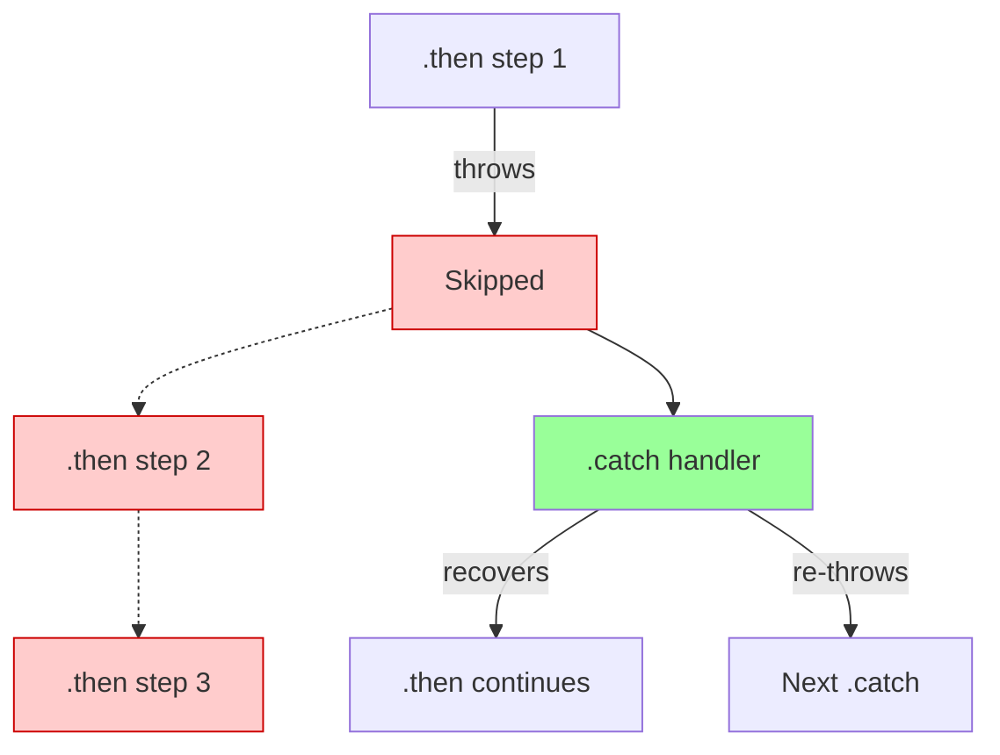
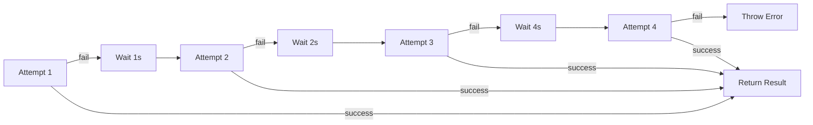
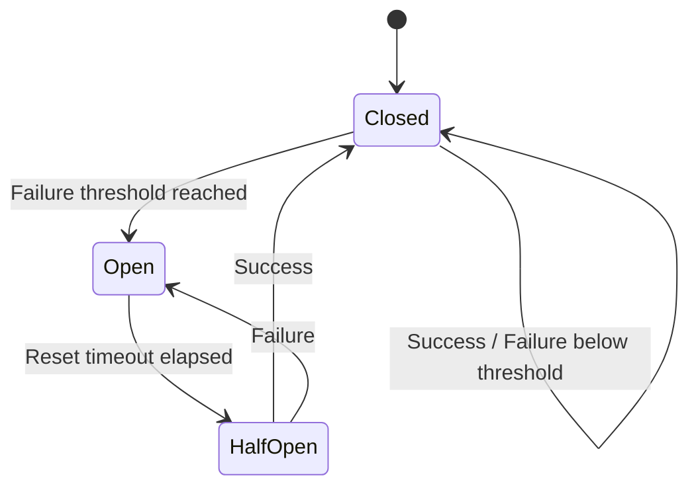

# Error Handling in Async Code

## Introduction

Asynchronous code introduces unique challenges for error handling. Unlike synchronous code where a try/catch block catches everything in its scope, async errors can slip through in unexpected ways—unhandled Promise rejections, swallowed errors in callbacks, and race conditions that only manifest under certain timing.

Robust error handling in async code requires understanding how errors propagate through Promises, when try/catch works (and doesn't), and patterns for retries, timeouts, and graceful degradation.

### What we'll cover

- Error propagation in Promise chains vs async/await
- Unhandled rejections and how to catch them globally
- The try/catch placement problem
- Retry patterns with exponential backoff
- Timeouts and cancellation
- Error boundaries and graceful degradation

### Prerequisites

- Solid understanding of Promises ([lesson 3](./03-promises.md))
- Familiarity with async/await ([lesson 4](./04-async-await.md))
- Understanding of Promise utilities ([previous lesson](./05-promise-utilities.md))

---

## Error propagation in Promises

Errors in Promise chains propagate until they hit a `.catch()` handler. This "bubbling" behavior is fundamental to Promise error handling.



### Thrown errors become rejections

Inside a `.then()` handler, thrown errors automatically reject the returned Promise:

```javascript
Promise.resolve("start")
  .then(value => {
    console.log("Step 1:", value);
    throw new Error("Something broke!");
  })
  .then(value => {
    console.log("Step 2:", value);  // Never runs
  })
  .catch(error => {
    console.log("Caught:", error.message);
  });
```

**Output:**
```
Step 1: start
Caught: Something broke!
```

### Returning rejected Promises

Returning a rejected Promise has the same effect:

```javascript
Promise.resolve("start")
  .then(value => {
    return Promise.reject(new Error("Explicit rejection"));
  })
  .then(value => {
    console.log("Never runs");
  })
  .catch(error => {
    console.log("Caught:", error.message);
  });
```

**Output:**
```
Caught: Explicit rejection
```

### Recovery in catch handlers

A `.catch()` handler can recover from errors by returning a value:

```javascript
function fetchWithFallback(url) {
  return fetch(url)
    .then(response => response.json())
    .catch(error => {
      console.log("Fetch failed, using fallback:", error.message);
      return { data: "fallback data", fromCache: true };
    });
}

fetchWithFallback("/api/broken")
  .then(data => console.log("Got data:", data));
```

**Output:**
```
Fetch failed, using fallback: Failed to fetch
Got data: { data: "fallback data", fromCache: true }
```

### Re-throwing to continue propagation

If you handle an error but can't recover, re-throw it:

```javascript
fetchData()
  .catch(error => {
    console.log("Logging error:", error.message);
    throw error;  // Continue propagation
  })
  .then(data => {
    console.log("Data:", data);  // Skipped if error
  })
  .catch(error => {
    console.log("Final handler:", error.message);
  });
```

---

## Error handling with async/await

With async/await, we use standard try/catch blocks—but placement matters.

### Basic try/catch

```javascript
async function fetchUser(userId) {
  try {
    const response = await fetch(`/api/users/${userId}`);
    
    if (!response.ok) {
      throw new Error(`HTTP ${response.status}`);
    }
    
    const user = await response.json();
    return user;
  } catch (error) {
    console.error("Failed to fetch user:", error.message);
    throw error;  // Re-throw for caller to handle
  }
}
```

### The try/catch placement problem

A common mistake is not understanding what try/catch actually catches:

```javascript
async function problematic() {
  try {
    const data = fetchData();  // ❌ Missing await!
    return data;
  } catch (error) {
    console.log("This won't catch async errors");
  }
}

async function correct() {
  try {
    const data = await fetchData();  // ✅ Await included
    return data;
  } catch (error) {
    console.log("This catches async errors:", error.message);
  }
}
```

### Return vs return await

There's an important difference inside try/catch:

```javascript
// ❌ Error escapes the try/catch
async function noAwait() {
  try {
    return fetchData();  // Returns Promise, doesn't await
  } catch (error) {
    console.log("Won't catch fetchData errors");
  }
}

// ✅ Error is caught
async function withAwait() {
  try {
    return await fetchData();  // Awaits, catches errors
  } catch (error) {
    console.log("Catches fetchData errors:", error.message);
    return null;
  }
}
```

> **🔑 Key concept:** Outside try/catch, `return await` is unnecessary. Inside try/catch, you need `return await` to catch errors from the returned Promise.

### Multiple await statements

You can handle errors from multiple awaits in one try/catch:

```javascript
async function processOrder(orderId) {
  try {
    const order = await fetchOrder(orderId);
    const inventory = await checkInventory(order.items);
    const payment = await processPayment(order.total);
    const shipping = await scheduleShipping(order);
    
    return { order, inventory, payment, shipping };
  } catch (error) {
    // Handle any of the above failures
    console.error("Order processing failed:", error.message);
    throw error;
  }
}
```

### Granular error handling

For different error handling per operation:

```javascript
async function processOrderGranular(orderId) {
  let order, inventory, payment;
  
  try {
    order = await fetchOrder(orderId);
  } catch (error) {
    throw new Error(`Order fetch failed: ${error.message}`);
  }
  
  try {
    inventory = await checkInventory(order.items);
  } catch (error) {
    // Recoverable - allow backorder
    inventory = { available: false, backorder: true };
    console.log("Item unavailable, placing backorder");
  }
  
  try {
    payment = await processPayment(order.total);
  } catch (error) {
    // Critical - cannot recover
    await notifyCustomer(order.customerId, "Payment failed");
    throw new Error(`Payment failed: ${error.message}`);
  }
  
  return { order, inventory, payment };
}
```

---

## Unhandled rejections

Unhandled Promise rejections are Promises that reject without a `.catch()` or try/catch to handle them.

### The silent failure problem

```javascript
// ❌ No error handler - rejection is unhandled
async function silentFailure() {
  const response = await fetch("/api/broken");
  return response.json();
}

silentFailure();  // If this fails, no one knows!
console.log("Code continues...");  // This still runs
```

### Global rejection handlers

Catch unhandled rejections globally as a safety net:

```javascript
// Browser
window.addEventListener("unhandledrejection", event => {
  console.error("Unhandled rejection:", event.reason);
  event.preventDefault();  // Prevent default logging
  
  // Log to monitoring service
  logToMonitoring({
    type: "unhandled_rejection",
    error: event.reason,
    promise: event.promise
  });
});

// Node.js
process.on("unhandledRejection", (reason, promise) => {
  console.error("Unhandled rejection at:", promise, "reason:", reason);
  
  // In production, you might want to exit
  // process.exit(1);
});
```

### Tracking Promise origins

In complex apps, it's hard to know where an unhandled rejection originated. Add context:

```javascript
function createTrackedPromise(operation, asyncFn) {
  return asyncFn().catch(error => {
    error.operation = operation;
    error.timestamp = Date.now();
    throw error;
  });
}

// Usage
const userPromise = createTrackedPromise("fetchUser", () => 
  fetch("/api/users/1").then(r => r.json())
);
```

---

## Retry patterns

Network requests fail. Services go down. Retrying with backoff is essential for resilient applications.

### Simple retry

```javascript
async function retry(fn, maxAttempts = 3) {
  for (let attempt = 1; attempt <= maxAttempts; attempt++) {
    try {
      return await fn();
    } catch (error) {
      if (attempt === maxAttempts) {
        throw error;
      }
      console.log(`Attempt ${attempt} failed, retrying...`);
    }
  }
}

// Usage
const data = await retry(() => fetch("/api/data").then(r => r.json()));
```

### Exponential backoff

Wait longer between each retry to avoid overwhelming recovering services:

```javascript
function delay(ms) {
  return new Promise(resolve => setTimeout(resolve, ms));
}

async function retryWithBackoff(fn, options = {}) {
  const {
    maxAttempts = 3,
    baseDelay = 1000,
    maxDelay = 30000,
    factor = 2
  } = options;
  
  for (let attempt = 1; attempt <= maxAttempts; attempt++) {
    try {
      return await fn();
    } catch (error) {
      if (attempt === maxAttempts) {
        throw error;
      }
      
      // Calculate delay with exponential backoff
      const delayMs = Math.min(
        baseDelay * Math.pow(factor, attempt - 1),
        maxDelay
      );
      
      console.log(`Attempt ${attempt} failed. Retrying in ${delayMs}ms...`);
      await delay(delayMs);
    }
  }
}

// Usage: 1s, 2s, 4s delays
const result = await retryWithBackoff(
  () => fetch("/api/flaky").then(r => r.json()),
  { maxAttempts: 4, baseDelay: 1000 }
);
```



### Retry with jitter

Add randomness to prevent "thundering herd" when many clients retry simultaneously:

```javascript
async function retryWithJitter(fn, options = {}) {
  const {
    maxAttempts = 3,
    baseDelay = 1000,
    maxDelay = 30000,
    jitter = 0.3  // 30% randomness
  } = options;
  
  for (let attempt = 1; attempt <= maxAttempts; attempt++) {
    try {
      return await fn();
    } catch (error) {
      if (attempt === maxAttempts) {
        throw error;
      }
      
      const exponentialDelay = baseDelay * Math.pow(2, attempt - 1);
      const jitterAmount = exponentialDelay * jitter * Math.random();
      const delayMs = Math.min(exponentialDelay + jitterAmount, maxDelay);
      
      console.log(`Attempt ${attempt} failed. Retrying in ${Math.round(delayMs)}ms...`);
      await delay(delayMs);
    }
  }
}
```

### Conditional retry

Only retry for certain error types:

```javascript
async function retryOnTransient(fn, options = {}) {
  const {
    maxAttempts = 3,
    baseDelay = 1000,
    isRetryable = (error) => true  // Retry all by default
  } = options;
  
  for (let attempt = 1; attempt <= maxAttempts; attempt++) {
    try {
      return await fn();
    } catch (error) {
      // Don't retry non-retryable errors
      if (!isRetryable(error)) {
        throw error;
      }
      
      if (attempt === maxAttempts) {
        throw error;
      }
      
      await delay(baseDelay * attempt);
    }
  }
}

// Only retry network/server errors, not 4xx client errors
const result = await retryOnTransient(
  () => fetch("/api/data").then(r => {
    if (!r.ok) {
      const error = new Error(`HTTP ${r.status}`);
      error.status = r.status;
      throw error;
    }
    return r.json();
  }),
  {
    isRetryable: (error) => !error.status || error.status >= 500
  }
);
```

---

## Timeout patterns

Prevent operations from hanging indefinitely with timeouts.

### Basic timeout with Promise.race

```javascript
function withTimeout(promise, ms, message = "Operation timed out") {
  const timeout = new Promise((_, reject) => {
    setTimeout(() => reject(new Error(message)), ms);
  });
  
  return Promise.race([promise, timeout]);
}

// Usage
try {
  const data = await withTimeout(
    fetch("/api/slow").then(r => r.json()),
    5000,
    "API request timed out after 5 seconds"
  );
  console.log("Data:", data);
} catch (error) {
  console.error(error.message);
}
```

### Timeout with cleanup

The basic timeout doesn't cancel the actual operation. For cancellable operations, use AbortController:

```javascript
async function fetchWithTimeout(url, ms) {
  const controller = new AbortController();
  const timeoutId = setTimeout(() => controller.abort(), ms);
  
  try {
    const response = await fetch(url, { signal: controller.signal });
    clearTimeout(timeoutId);  // Clear timeout on success
    return response.json();
  } catch (error) {
    clearTimeout(timeoutId);
    
    if (error.name === "AbortError") {
      throw new Error(`Request to ${url} timed out after ${ms}ms`);
    }
    throw error;
  }
}
```

### Timeout wrapper class

```javascript
class TimeoutController {
  constructor(ms) {
    this.ms = ms;
    this.controller = new AbortController();
    this.timeoutId = null;
  }
  
  get signal() {
    return this.controller.signal;
  }
  
  start() {
    this.timeoutId = setTimeout(() => {
      this.controller.abort();
    }, this.ms);
    return this;
  }
  
  clear() {
    if (this.timeoutId) {
      clearTimeout(this.timeoutId);
      this.timeoutId = null;
    }
  }
  
  abort() {
    this.clear();
    this.controller.abort();
  }
}

// Usage
const timeout = new TimeoutController(5000).start();

try {
  const response = await fetch("/api/data", { signal: timeout.signal });
  timeout.clear();
  const data = await response.json();
} catch (error) {
  if (error.name === "AbortError") {
    console.log("Request timed out");
  }
} finally {
  timeout.clear();
}
```

---

## Error boundaries and graceful degradation

When errors are unavoidable, degrade gracefully instead of crashing.

### Error boundary pattern

Isolate failures to prevent cascading errors:

```javascript
async function safeExecute(fn, fallback = null) {
  try {
    return await fn();
  } catch (error) {
    console.error("Operation failed:", error.message);
    return typeof fallback === "function" ? fallback(error) : fallback;
  }
}

// Usage - isolated failures
async function loadDashboard() {
  const [user, notifications, analytics] = await Promise.all([
    safeExecute(() => fetchUser(), { name: "Guest" }),
    safeExecute(() => fetchNotifications(), []),
    safeExecute(() => fetchAnalytics(), null)  // OK to be null
  ]);
  
  return { user, notifications, analytics };
}
```

### Partial success handling

When some operations can fail without breaking the whole flow:

```javascript
async function loadPageData() {
  // Critical - must succeed
  const pageContent = await fetchPageContent();
  
  // Optional - use defaults if they fail
  const [sidebar, ads, recommendations] = await Promise.allSettled([
    fetchSidebar(),
    fetchAds(),
    fetchRecommendations()
  ]).then(results => results.map((result, i) => {
    if (result.status === "fulfilled") {
      return result.value;
    }
    console.warn(`Optional data ${i} failed:`, result.reason.message);
    return null;
  }));
  
  return {
    pageContent,
    sidebar: sidebar || defaultSidebar,
    ads: ads || [],
    recommendations: recommendations || []
  };
}
```

### Circuit breaker pattern

Stop calling a failing service temporarily:

```javascript
class CircuitBreaker {
  constructor(options = {}) {
    this.failureThreshold = options.failureThreshold || 5;
    this.resetTimeout = options.resetTimeout || 30000;
    this.failures = 0;
    this.state = "CLOSED";  // CLOSED, OPEN, HALF_OPEN
    this.nextAttempt = 0;
  }
  
  async execute(fn) {
    if (this.state === "OPEN") {
      if (Date.now() < this.nextAttempt) {
        throw new Error("Circuit breaker is OPEN");
      }
      this.state = "HALF_OPEN";
    }
    
    try {
      const result = await fn();
      this.onSuccess();
      return result;
    } catch (error) {
      this.onFailure();
      throw error;
    }
  }
  
  onSuccess() {
    this.failures = 0;
    this.state = "CLOSED";
  }
  
  onFailure() {
    this.failures++;
    if (this.failures >= this.failureThreshold) {
      this.state = "OPEN";
      this.nextAttempt = Date.now() + this.resetTimeout;
      console.log(`Circuit breaker OPEN until ${new Date(this.nextAttempt)}`);
    }
  }
}

// Usage
const apiBreaker = new CircuitBreaker({ failureThreshold: 3, resetTimeout: 10000 });

async function callAPI() {
  return apiBreaker.execute(() => 
    fetch("/api/unreliable").then(r => r.json())
  );
}
```



---

## Best practices

| Practice | Why It Matters |
|----------|----------------|
| Always handle Promise rejections | Unhandled rejections crash Node.js apps |
| Use specific error types | Easier to handle different errors differently |
| Add context to errors | Stack traces aren't always enough |
| Implement global error handlers | Catch what slips through |
| Use timeouts for external calls | Never wait forever |
| Log errors with context | Include request IDs, user info, timestamps |

---

## Common pitfalls

| ❌ Mistake | ✅ Solution |
|-----------|-------------|
| Silent error swallowing | Log errors, re-throw if not recovered |
| Missing await in try/catch | Use `return await` when you need to catch |
| Catching too broadly | Handle specific errors, re-throw unknown ones |
| Infinite retry loops | Set max attempts and backoff limits |
| Not cleaning up on timeout | Use AbortController to actually cancel |
| Throwing strings | `throw new Error("message")` not `throw "message"` |

### Error swallowing anti-pattern

```javascript
// ❌ BAD - Error is swallowed
async function badHandler() {
  try {
    await riskyOperation();
  } catch (error) {
    console.log("Error");  // Lost all error info!
  }
}

// ✅ GOOD - Error is logged and re-thrown or returned
async function goodHandler() {
  try {
    await riskyOperation();
  } catch (error) {
    console.error("riskyOperation failed:", error);
    logToMonitoring(error);
    throw error;  // or return a meaningful fallback
  }
}
```

### Creating informative errors

```javascript
class APIError extends Error {
  constructor(message, { status, url, method, body } = {}) {
    super(message);
    this.name = "APIError";
    this.status = status;
    this.url = url;
    this.method = method;
    this.body = body;
    this.timestamp = new Date().toISOString();
  }
}

async function fetchAPI(url, options = {}) {
  const response = await fetch(url, options);
  
  if (!response.ok) {
    throw new APIError(`HTTP ${response.status}: ${response.statusText}`, {
      status: response.status,
      url: url,
      method: options.method || "GET",
      body: options.body
    });
  }
  
  return response.json();
}
```

---

## Hands-on exercise

### Your task

Build a resilient API client with retry, timeout, circuit breaker, and comprehensive error handling.

### Requirements

1. Create a `ResilientClient` class that:
   - Retries failed requests with exponential backoff
   - Times out after a configurable duration
   - Opens a circuit breaker after consecutive failures
   - Logs all errors with context
   - Returns typed error responses

2. Implement these methods:
   - `get(url)` - GET request
   - `post(url, data)` - POST request
   - `getStatus()` - Returns circuit breaker state

3. Test with various failure scenarios

### Expected result

```
[GET /api/users] Attempt 1 failed: Network error. Retrying in 1000ms...
[GET /api/users] Attempt 2 failed: Network error. Retrying in 2000ms...
[GET /api/users] Attempt 3 succeeded
Result: { users: [...] }

[POST /api/data] Timeout after 5000ms
[POST /api/data] Circuit breaker: 1/3 failures
[POST /api/data] Timeout after 5000ms
[POST /api/data] Circuit breaker: 2/3 failures
[POST /api/data] Timeout after 5000ms
[POST /api/data] Circuit breaker OPEN for 30 seconds

[GET /api/health] Circuit breaker is OPEN, request blocked
```

<details>
<summary>💡 Hints (click to expand)</summary>

- Combine the patterns from this lesson: retry, timeout, circuit breaker
- Use composition: wrap the base fetch with each layer
- Store circuit breaker state as instance properties
- Create a custom error class with all relevant context
- Use AbortController for proper timeout handling

</details>

<details>
<summary>✅ Solution (click to expand)</summary>

```javascript
class ClientError extends Error {
  constructor(message, context = {}) {
    super(message);
    this.name = "ClientError";
    this.context = context;
    this.timestamp = new Date().toISOString();
  }
}

class ResilientClient {
  constructor(options = {}) {
    this.baseURL = options.baseURL || "";
    this.timeout = options.timeout || 5000;
    this.maxRetries = options.maxRetries || 3;
    this.retryDelay = options.retryDelay || 1000;
    this.failureThreshold = options.failureThreshold || 3;
    this.resetTimeout = options.resetTimeout || 30000;
    
    // Circuit breaker state
    this.failures = 0;
    this.circuitState = "CLOSED";
    this.nextAttempt = 0;
  }
  
  log(message) {
    console.log(`[${new Date().toISOString()}] ${message}`);
  }
  
  getStatus() {
    return {
      circuitState: this.circuitState,
      failures: this.failures,
      nextAttempt: this.circuitState === "OPEN" 
        ? new Date(this.nextAttempt).toISOString() 
        : null
    };
  }
  
  async request(method, url, data = null) {
    const fullURL = `${this.baseURL}${url}`;
    
    // Check circuit breaker
    if (this.circuitState === "OPEN") {
      if (Date.now() < this.nextAttempt) {
        this.log(`[${method} ${url}] Circuit breaker is OPEN, request blocked`);
        throw new ClientError("Circuit breaker is OPEN", {
          url: fullURL,
          method,
          circuitState: this.circuitState
        });
      }
      this.circuitState = "HALF_OPEN";
      this.log(`[${method} ${url}] Circuit breaker HALF_OPEN, testing...`);
    }
    
    // Retry loop
    for (let attempt = 1; attempt <= this.maxRetries; attempt++) {
      try {
        const result = await this.fetchWithTimeout(method, fullURL, data);
        this.onSuccess();
        return result;
      } catch (error) {
        this.log(`[${method} ${url}] Attempt ${attempt} failed: ${error.message}`);
        
        // Don't retry if circuit is now open
        if (this.circuitState === "OPEN") {
          throw error;
        }
        
        // Retry logic
        if (attempt < this.maxRetries) {
          const delay = this.retryDelay * Math.pow(2, attempt - 1);
          this.log(`[${method} ${url}] Retrying in ${delay}ms...`);
          await this.delay(delay);
        } else {
          this.onFailure();
          throw new ClientError(`All ${this.maxRetries} attempts failed`, {
            url: fullURL,
            method,
            lastError: error.message,
            attempts: this.maxRetries
          });
        }
      }
    }
  }
  
  async fetchWithTimeout(method, url, data) {
    const controller = new AbortController();
    const timeoutId = setTimeout(() => controller.abort(), this.timeout);
    
    try {
      const options = {
        method,
        signal: controller.signal,
        headers: { "Content-Type": "application/json" }
      };
      
      if (data) {
        options.body = JSON.stringify(data);
      }
      
      const response = await fetch(url, options);
      clearTimeout(timeoutId);
      
      if (!response.ok) {
        throw new ClientError(`HTTP ${response.status}`, {
          status: response.status,
          url
        });
      }
      
      return response.json();
    } catch (error) {
      clearTimeout(timeoutId);
      
      if (error.name === "AbortError") {
        throw new ClientError(`Timeout after ${this.timeout}ms`, { url, method });
      }
      throw error;
    }
  }
  
  onSuccess() {
    this.failures = 0;
    if (this.circuitState === "HALF_OPEN") {
      this.log("Circuit breaker CLOSED");
    }
    this.circuitState = "CLOSED";
  }
  
  onFailure() {
    this.failures++;
    this.log(`Circuit breaker: ${this.failures}/${this.failureThreshold} failures`);
    
    if (this.failures >= this.failureThreshold) {
      this.circuitState = "OPEN";
      this.nextAttempt = Date.now() + this.resetTimeout;
      this.log(`Circuit breaker OPEN for ${this.resetTimeout / 1000} seconds`);
    }
  }
  
  delay(ms) {
    return new Promise(resolve => setTimeout(resolve, ms));
  }
  
  get(url) {
    return this.request("GET", url);
  }
  
  post(url, data) {
    return this.request("POST", url, data);
  }
}

// Usage
const client = new ResilientClient({
  baseURL: "https://api.example.com",
  timeout: 5000,
  maxRetries: 3,
  retryDelay: 1000,
  failureThreshold: 3,
  resetTimeout: 30000
});

// Test
async function test() {
  try {
    const users = await client.get("/users");
    console.log("Users:", users);
  } catch (error) {
    console.error("Failed:", error.message, error.context);
  }
  
  console.log("Client status:", client.getStatus());
}

test();
```

</details>

### Bonus challenges

- [ ] Add request deduplication (don't make duplicate in-flight requests)
- [ ] Implement request priority queue
- [ ] Add response caching with TTL

---

## Summary

✅ **Errors propagate** through Promise chains until caught by `.catch()`

✅ **Use `return await`** inside try/catch to catch errors from returned Promises

✅ **Global rejection handlers** catch what slips through, but fix the source

✅ **Retry with exponential backoff** and jitter for resilient API calls

✅ **Use timeouts** with AbortController to prevent indefinite hangs

✅ **Circuit breakers** prevent cascading failures when services are down

**Next:** [HTTP & API Communication](../06-http-api-communication.md) — Making real API requests

---

## Further reading

- [MDN: Error handling](https://developer.mozilla.org/en-US/docs/Web/JavaScript/Guide/Control_flow_and_error_handling) — JavaScript error basics
- [MDN: AbortController](https://developer.mozilla.org/en-US/docs/Web/API/AbortController) — Request cancellation
- [web.dev: Resilient networking](https://web.dev/articles/reliable) — Network resilience patterns
- [Previous: Promise Utilities](./05-promise-utilities.md) — Combining multiple Promises
- [Back to Overview](./00-asynchronous-javascript.md) — Async JavaScript summary

---

<!-- 
Sources Consulted:
- MDN Error handling: https://developer.mozilla.org/en-US/docs/Web/JavaScript/Guide/Control_flow_and_error_handling
- MDN AbortController: https://developer.mozilla.org/en-US/docs/Web/API/AbortController
- MDN unhandledrejection: https://developer.mozilla.org/en-US/docs/Web/API/Window/unhandledrejection_event
- Node.js unhandledRejection: https://nodejs.org/api/process.html#event-unhandledrejection
- Circuit Breaker Pattern: https://learn.microsoft.com/en-us/azure/architecture/patterns/circuit-breaker
-->
