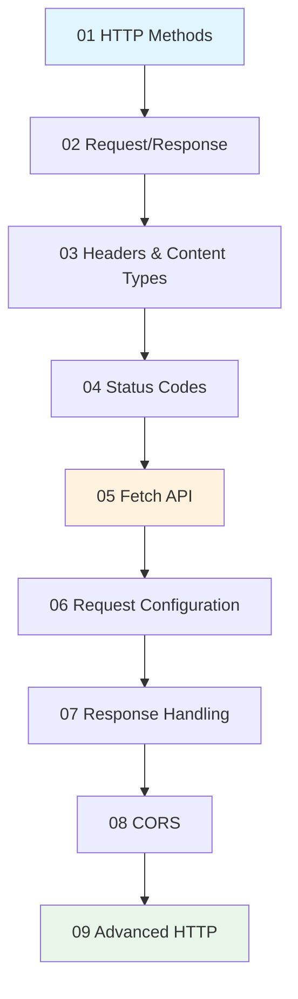

# HTTP & API Communication

## Overview

HTTP is the foundation of web communication. This module covers everything you need to know about making HTTP requests, from basic fetch calls to production-grade patterns like retry strategies, caching, and error handling.

By the end of this module, you'll be able to build robust API clients that handle real-world challenges like network failures, rate limiting, and cross-origin requests.

### Prerequisites

- [JavaScript Core Concepts](../03-javascript-core-concepts.md)
- [DOM Manipulation](../04-dom-manipulation.md)
- [Asynchronous JavaScript](../05-asynchronous-javascript/) (Promises, async/await)

### What You'll Learn

- HTTP methods and when to use each one
- Request and response anatomy
- Working with headers and content types
- Understanding and handling status codes
- The Fetch API and all its options
- CORS and cross-origin requests
- Advanced patterns: retries, caching, circuit breakers

---

## Learning Path



---

## Lessons

| # | Lesson | Duration | Topics |
|---|--------|----------|--------|
| 01 | [HTTP Methods](./01-http-methods.md) | 25 min | GET, POST, PUT, PATCH, DELETE, HEAD, OPTIONS, idempotency |
| 02 | [Request & Response Structure](./02-request-response-structure.md) | 25 min | Request line, headers, body, Response object, content negotiation |
| 03 | [Headers & Content Types](./03-headers-content-types.md) | 25 min | Content-Type, Accept, Authorization, MIME types, custom headers |
| 04 | [Status Codes](./04-status-codes.md) | 30 min | 1xx-5xx categories, error handling patterns, retry logic |
| 05 | [Fetch API](./05-fetch-api.md) | 35 min | fetch() syntax, Request/Response objects, AbortController |
| 06 | [Request Configuration](./06-request-configuration.md) | 30 min | Credentials, mode, cache, body types, FormData |
| 07 | [Response Handling](./07-response-handling.md) | 30 min | JSON/text/blob parsing, streaming, validation, caching |
| 08 | [CORS](./08-cors.md) | 30 min | Same-origin policy, preflight requests, CORS headers |
| 09 | [Advanced HTTP Patterns](./09-advanced-http.md) | 40 min | Retry, backoff, queuing, interceptors, circuit breakers |

**Total Module Time:** ~4.5 hours

---

## Key Concepts

### HTTP Methods

| Method | Purpose | Idempotent | Safe |
|--------|---------|------------|------|
| GET | Retrieve data | ✅ | ✅ |
| POST | Create resource | ❌ | ❌ |
| PUT | Replace resource | ✅ | ❌ |
| PATCH | Partial update | ❌ | ❌ |
| DELETE | Remove resource | ✅ | ❌ |

### Status Code Categories

| Range | Category | Examples |
|-------|----------|----------|
| 2xx | Success | 200 OK, 201 Created, 204 No Content |
| 3xx | Redirection | 301 Moved, 304 Not Modified |
| 4xx | Client Error | 400 Bad Request, 401 Unauthorized, 404 Not Found |
| 5xx | Server Error | 500 Internal Error, 503 Service Unavailable |

### The Fetch Pattern

```javascript
// Basic pattern for all HTTP requests
async function apiRequest(url, options = {}) {
  const response = await fetch(url, options);
  
  if (!response.ok) {
    throw new Error(`HTTP ${response.status}`);
  }
  
  return response.json();
}
```

---

## Hands-On Projects

Each lesson includes practical exercises. By the end of this module, you'll have built:

1. **HTTP Method Tester** - Interactive tool to test different HTTP methods
2. **Request Inspector** - Debug tool showing request/response details
3. **Header Utility Library** - Reusable functions for header management
4. **Status Code Handler** - Comprehensive error handling system
5. **Fetch Client** - Full-featured HTTP client with interceptors
6. **Request Builder** - Fluent API for constructing requests
7. **Response Handler** - Validation and transformation pipeline
8. **CORS Debugger** - Tool for diagnosing CORS issues
9. **Production API Client** - Complete client with retry, caching, circuit breaker

---

## 🤖 AI/ML Context

HTTP communication is fundamental to AI-powered applications:

- **LLM API calls** use HTTP POST with JSON bodies
- **Streaming responses** deliver tokens as they're generated
- **Rate limiting** requires proper backoff strategies
- **Authentication** protects API keys and user data
- **Error handling** ensures graceful degradation

```javascript
// Example: Calling an LLM API
const response = await fetch('https://api.openai.com/v1/chat/completions', {
  method: 'POST',
  headers: {
    'Content-Type': 'application/json',
    'Authorization': `Bearer ${apiKey}`
  },
  body: JSON.stringify({
    model: 'gpt-4',
    messages: [{ role: 'user', content: 'Hello!' }]
  })
});
```

---

## Navigation

| Previous | Up | Next |
|----------|-------|------|
| [Asynchronous JavaScript](../05-asynchronous-javascript/) | [Unit Overview](../00-overview.md) | [Real-Time Communication](../07-real-time-communication.md) |

---

## Resources

- [MDN: HTTP](https://developer.mozilla.org/en-US/docs/Web/HTTP) - Complete HTTP reference
- [MDN: Fetch API](https://developer.mozilla.org/en-US/docs/Web/API/Fetch_API) - Fetch documentation
- [HTTP Status Codes](https://httpstatuses.com/) - Quick reference
- [web.dev: Network Reliability](https://web.dev/reliable/) - Best practices
