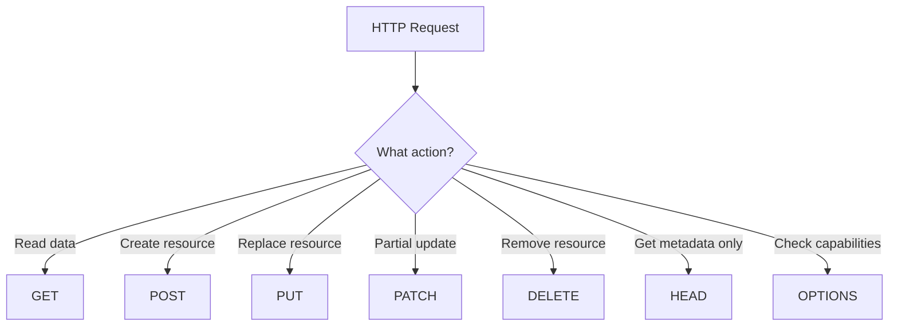
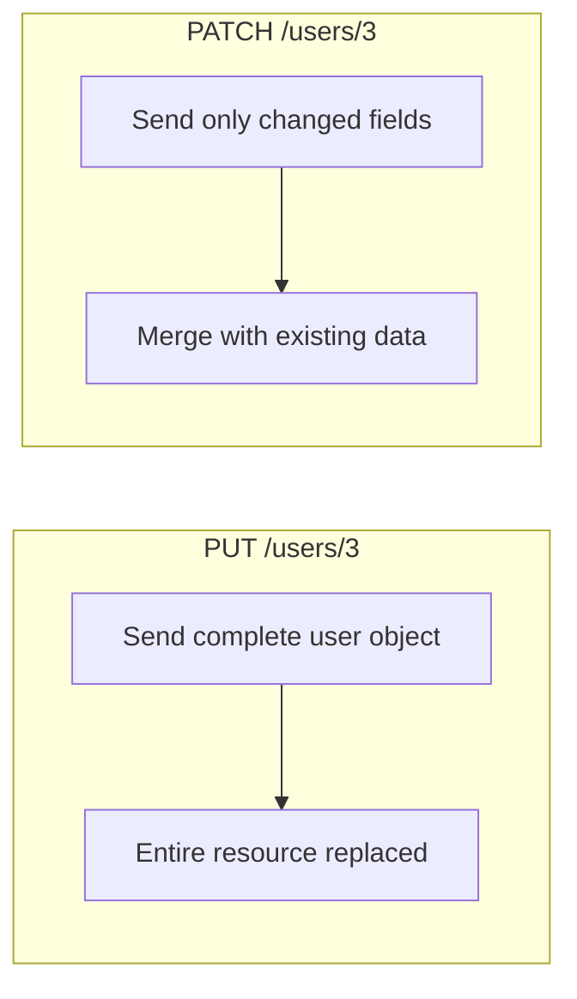
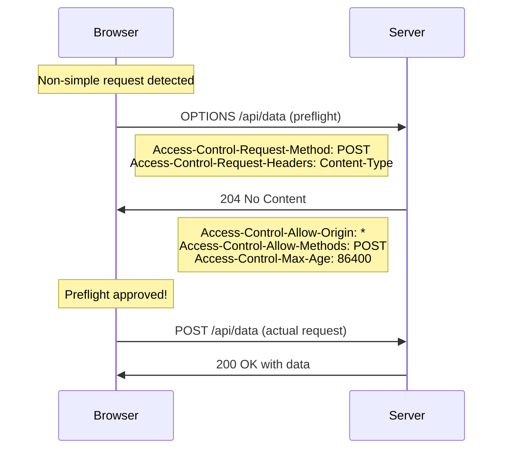
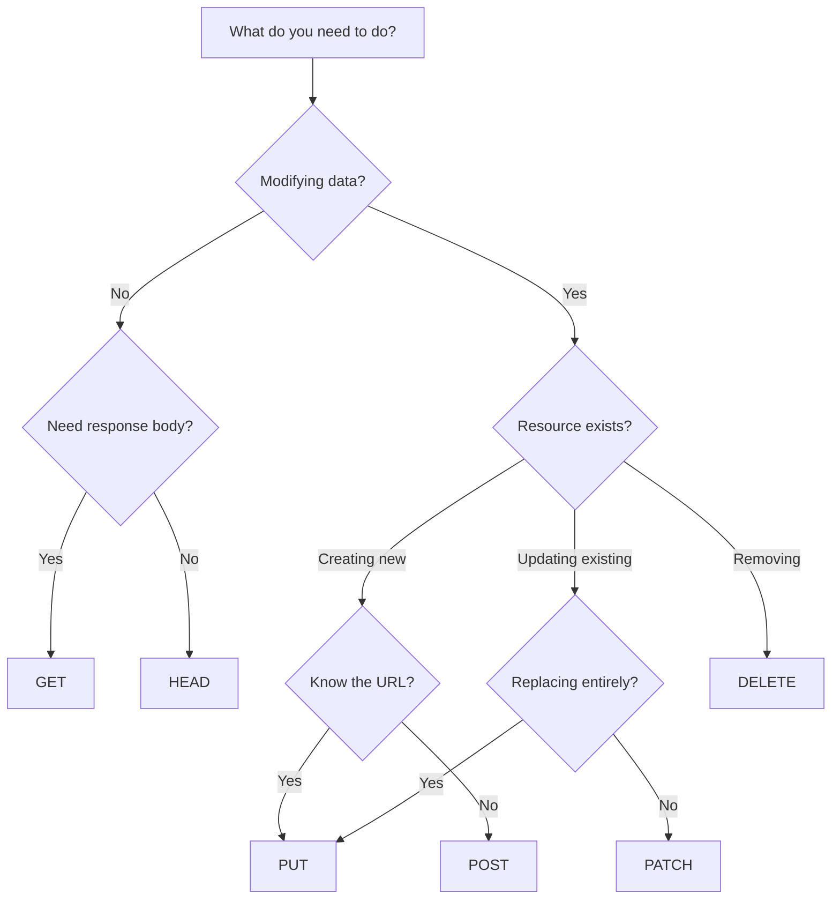

# HTTP Methods

## Introduction

Every time you browse a website, submit a form, or interact with an API, your browser sends HTTP requests using specific **methods** (also called "verbs") that tell the server what action you want to perform. Understanding these methods is fundamental to working with web APIs and building applications that communicate over the network.

HTTP methods are the backbone of RESTful API design, determining whether you're reading data, creating resources, updating information, or deleting content. Choosing the right method isn't just about convention—it affects caching, security, and how browsers and proxies handle your requests.

### What We'll Cover

- The purpose and characteristics of each HTTP method
- Safe, idempotent, and cacheable methods
- When to use GET, POST, PUT, PATCH, and DELETE
- HEAD and OPTIONS for metadata and CORS
- Real-world patterns for API interactions

### Prerequisites

- Basic understanding of how the web works (URLs, browsers, servers)
- Familiarity with JavaScript fundamentals
- Completion of [Asynchronous JavaScript](../05-asynchronous-javascript/00-asynchronous-javascript.md) lessons

---

## Understanding HTTP Methods

HTTP defines a set of request methods that indicate the **intended action** for a given resource. Each method has specific semantics that determine:

- What the request should accomplish
- Whether it modifies server state
- How browsers and caches should handle it



### Method Categories

Methods are categorized by three important properties:

| Property | Description | Methods |
|----------|-------------|---------|
| **Safe** | Doesn't modify server state | GET, HEAD, OPTIONS |
| **Idempotent** | Same result regardless of repetition | GET, HEAD, OPTIONS, PUT, DELETE |
| **Cacheable** | Response can be stored and reused | GET, HEAD (POST conditionally) |

> **Note:** Understanding these properties helps you design robust APIs and handle errors appropriately. For example, idempotent methods can be safely retried on failure.

---

## GET: Retrieving Resources

The `GET` method requests a representation of the specified resource. It's the most common HTTP method and is used every time you load a webpage or fetch data from an API.

### Characteristics

- **Safe**: GET requests should never modify server state
- **Idempotent**: Multiple identical requests produce the same result
- **Cacheable**: Responses are often cached by browsers and CDNs
- **No request body**: Data is sent via URL query parameters

### Basic Usage

```javascript
// Simple GET request
const response = await fetch('https://api.example.com/users');
const users = await response.json();
console.log(users);
```

**Output:**
```json
[
  { "id": 1, "name": "Alice", "email": "alice@example.com" },
  { "id": 2, "name": "Bob", "email": "bob@example.com" }
]
```

### With Query Parameters

```javascript
// GET with query parameters for filtering
const params = new URLSearchParams({
  page: 1,
  limit: 10,
  status: 'active'
});

const response = await fetch(`https://api.example.com/users?${params}`);
// URL: https://api.example.com/users?page=1&limit=10&status=active
```

### When to Use GET

| ✅ Use GET For | ❌ Don't Use GET For |
|----------------|---------------------|
| Fetching resources | Creating new resources |
| Reading data | Modifying data |
| Search queries | Sending sensitive data |
| API data retrieval | Large data payloads |

> **Warning:** Never include sensitive data like passwords or tokens in GET URLs. Query parameters are logged in server logs, browser history, and can be cached.

---

## POST: Creating Resources

The `POST` method submits data to the server to create a new resource. Unlike GET, POST requests include a request body containing the data to be processed.

### Characteristics

- **Not safe**: POST modifies server state
- **Not idempotent**: Repeating a POST may create duplicate resources
- **Not typically cached**: Each request is treated as unique
- **Has request body**: Data sent in the request body

### Basic Usage

```javascript
// Create a new user
const newUser = {
  name: 'Charlie',
  email: 'charlie@example.com',
  role: 'developer'
};

const response = await fetch('https://api.example.com/users', {
  method: 'POST',
  headers: {
    'Content-Type': 'application/json'
  },
  body: JSON.stringify(newUser)
});

const createdUser = await response.json();
console.log(createdUser);
```

**Output:**
```json
{
  "id": 3,
  "name": "Charlie",
  "email": "charlie@example.com",
  "role": "developer",
  "createdAt": "2025-01-15T10:30:00Z"
}
```

### Handling the Response

Successful POST requests typically return:

| Status Code | Meaning | When Used |
|-------------|---------|-----------|
| `201 Created` | Resource created | Standard success response |
| `200 OK` | Action completed | When returning existing resource |
| `202 Accepted` | Queued for processing | Async operations |
| `204 No Content` | Success, no body | When no response needed |

```javascript
async function createUser(userData) {
  const response = await fetch('https://api.example.com/users', {
    method: 'POST',
    headers: { 'Content-Type': 'application/json' },
    body: JSON.stringify(userData)
  });

  if (response.status === 201) {
    // Resource created - check Location header for URL
    const location = response.headers.get('Location');
    console.log(`User created at: ${location}`);
    return await response.json();
  }

  if (!response.ok) {
    const error = await response.json();
    throw new Error(error.message);
  }
}
```

> **🤖 AI Context:** When building AI applications, you'll use POST extensively to send prompts to LLM APIs, upload documents for processing, and submit data for embedding generation.

---

## PUT: Replacing Resources

The `PUT` method replaces **all current representations** of the target resource with the request payload. It's used for full updates where you're providing the complete new state of a resource.

### Characteristics

- **Not safe**: PUT modifies server state
- **Idempotent**: Same PUT repeated produces same result
- **Not cacheable**: Responses typically not cached
- **Has request body**: Complete resource representation

### Basic Usage

```javascript
// Replace entire user resource
const updatedUser = {
  id: 3,
  name: 'Charlie Brown',
  email: 'charlie.brown@example.com',
  role: 'senior-developer',
  department: 'engineering'
};

const response = await fetch('https://api.example.com/users/3', {
  method: 'PUT',
  headers: { 'Content-Type': 'application/json' },
  body: JSON.stringify(updatedUser)
});

if (response.ok) {
  console.log('User completely replaced');
}
```

### PUT vs POST for Creation

PUT can also create resources when you know the exact URL:

```javascript
// Create user at specific ID (if allowed by API)
const response = await fetch('https://api.example.com/users/custom-id-123', {
  method: 'PUT',
  headers: { 'Content-Type': 'application/json' },
  body: JSON.stringify({
    name: 'New User',
    email: 'new@example.com'
  })
});

// Status 201 if created, 200 if replaced existing
console.log(response.status);
```

### Why Idempotency Matters

Because PUT is idempotent, you can safely retry failed requests:

```javascript
async function updateUserWithRetry(userId, userData, maxRetries = 3) {
  for (let attempt = 1; attempt <= maxRetries; attempt++) {
    try {
      const response = await fetch(`https://api.example.com/users/${userId}`, {
        method: 'PUT',
        headers: { 'Content-Type': 'application/json' },
        body: JSON.stringify(userData)
      });

      if (response.ok) {
        return await response.json();
      }
    } catch (error) {
      console.log(`Attempt ${attempt} failed, retrying...`);
      if (attempt === maxRetries) throw error;
    }
  }
}
```

> **Important:** PUT should send the **complete** resource. Any fields you omit may be removed or reset to defaults.

---

## PATCH: Partial Updates

The `PATCH` method applies **partial modifications** to a resource. Unlike PUT, you only send the fields that need to change, not the entire resource.

### Characteristics

- **Not safe**: PATCH modifies server state
- **Not idempotent**: Results may differ based on current state
- **Not cacheable**: Responses typically not cached
- **Has request body**: Only changed fields

### Basic Usage

```javascript
// Update only the user's email
const partialUpdate = {
  email: 'charlie.new@example.com'
};

const response = await fetch('https://api.example.com/users/3', {
  method: 'PATCH',
  headers: { 'Content-Type': 'application/json' },
  body: JSON.stringify(partialUpdate)
});

const updatedUser = await response.json();
// Other fields remain unchanged
```

**Output:**
```json
{
  "id": 3,
  "name": "Charlie Brown",
  "email": "charlie.new@example.com",
  "role": "senior-developer",
  "department": "engineering"
}
```

### PUT vs PATCH Comparison



| Aspect | PUT | PATCH |
|--------|-----|-------|
| **Payload** | Complete resource | Only changed fields |
| **Missing fields** | Removed/reset | Unchanged |
| **Idempotent** | Yes | No (usually) |
| **Bandwidth** | Higher | Lower |
| **Use case** | Full replacement | Incremental updates |

### JSON Patch Format

Some APIs use the standardized JSON Patch format (RFC 6902):

```javascript
// JSON Patch operations
const operations = [
  { op: 'replace', path: '/email', value: 'new@example.com' },
  { op: 'add', path: '/tags/-', value: 'verified' },
  { op: 'remove', path: '/temporaryField' }
];

const response = await fetch('https://api.example.com/users/3', {
  method: 'PATCH',
  headers: { 'Content-Type': 'application/json-patch+json' },
  body: JSON.stringify(operations)
});
```

> **Tip:** Check your API documentation—some APIs use simple merge patches (send changed fields), while others use JSON Patch format with explicit operations.

---

## DELETE: Removing Resources

The `DELETE` method removes the specified resource from the server.

### Characteristics

- **Not safe**: DELETE modifies server state
- **Idempotent**: Deleting the same resource twice has the same effect
- **Not cacheable**: Responses typically not cached
- **Usually no body**: Though some APIs accept a body

### Basic Usage

```javascript
// Delete a user
const response = await fetch('https://api.example.com/users/3', {
  method: 'DELETE'
});

if (response.status === 204) {
  console.log('User deleted successfully');
} else if (response.status === 404) {
  console.log('User not found (already deleted?)');
}
```

### Common Response Patterns

| Status Code | Meaning | Response Body |
|-------------|---------|---------------|
| `200 OK` | Deleted, returning details | Deleted resource info |
| `204 No Content` | Deleted, no response | Empty |
| `202 Accepted` | Deletion queued | Status information |
| `404 Not Found` | Resource doesn't exist | Error message |

### Idempotency in Practice

Because DELETE is idempotent, these scenarios are equivalent:

```javascript
// First delete - removes the resource
await fetch('/api/users/3', { method: 'DELETE' }); // 204 No Content

// Second delete - resource already gone
await fetch('/api/users/3', { method: 'DELETE' }); // 404 Not Found (or 204)

// Both result in the same server state: user 3 doesn't exist
```

> **Note:** Some APIs return `204` for deleting already-deleted resources (truly idempotent), while others return `404`. Both approaches are valid.

---

## HEAD: Metadata Only

The `HEAD` method requests the headers that would be returned for a GET request, but **without the response body**. It's useful for checking if a resource exists or getting metadata without downloading content.

### Characteristics

- **Safe**: HEAD doesn't modify server state
- **Idempotent**: Same result for repeated requests
- **Cacheable**: Responses can be cached
- **No response body**: Only headers returned

### Use Cases

```javascript
// Check if a file exists and get its size before downloading
const response = await fetch('https://example.com/large-file.zip', {
  method: 'HEAD'
});

if (response.ok) {
  const size = response.headers.get('Content-Length');
  const type = response.headers.get('Content-Type');
  const modified = response.headers.get('Last-Modified');
  
  console.log(`File size: ${(size / 1024 / 1024).toFixed(2)} MB`);
  console.log(`Type: ${type}`);
  console.log(`Last modified: ${modified}`);
}
```

**Output:**
```
File size: 156.23 MB
Type: application/zip
Last modified: Mon, 13 Jan 2025 08:00:00 GMT
```

### Practical Applications

| Use Case | Why HEAD? |
|----------|-----------|
| Check resource exists | Faster than GET |
| Get file size | Download progress UI |
| Check Last-Modified | Cache validation |
| Validate URLs | Link checking tools |

---

## OPTIONS: CORS Preflight

The `OPTIONS` method describes the communication options for the target resource. It's primarily used by browsers for CORS preflight requests.

### Characteristics

- **Safe**: OPTIONS doesn't modify server state
- **Idempotent**: Same result for repeated requests
- **Not cacheable**: Typically not cached (but preflight results are)
- **No request body**: Information in headers

### CORS Preflight Flow



### When Browsers Send OPTIONS

The browser automatically sends a preflight OPTIONS request when:

- Using methods other than GET, HEAD, or POST
- Using POST with content types other than `application/x-www-form-urlencoded`, `multipart/form-data`, or `text/plain`
- Setting custom headers like `Authorization` or `Content-Type: application/json`

```javascript
// This triggers a preflight request because of the Content-Type header
const response = await fetch('https://api.example.com/users', {
  method: 'POST',
  headers: {
    'Content-Type': 'application/json',  // Non-simple header
    'Authorization': 'Bearer token123'    // Non-simple header
  },
  body: JSON.stringify({ name: 'Test' })
});
```

> **Note:** You don't manually send OPTIONS requests—browsers handle this automatically for CORS. We'll explore CORS in depth in [Lesson 8: CORS](./08-cors.md).

---

## Method Selection Guide

Choosing the right HTTP method is crucial for building intuitive APIs and ensuring proper behavior with caches and proxies.



### Quick Reference

| Action | Method | Example URL | Request Body |
|--------|--------|-------------|--------------|
| List all users | GET | `/users` | None |
| Get one user | GET | `/users/123` | None |
| Create user | POST | `/users` | User data |
| Replace user | PUT | `/users/123` | Complete user |
| Update user | PATCH | `/users/123` | Changed fields |
| Delete user | DELETE | `/users/123` | None |
| Check user exists | HEAD | `/users/123` | None |

---

## Best Practices

### 1. Respect Method Semantics

```javascript
// ✅ DO: Use appropriate methods
async function userAPI(userId) {
  // Read
  const user = await fetch(`/api/users/${userId}`).then(r => r.json());
  
  // Update
  await fetch(`/api/users/${userId}`, {
    method: 'PATCH',
    headers: { 'Content-Type': 'application/json' },
    body: JSON.stringify({ name: 'Updated' })
  });
  
  // Delete
  await fetch(`/api/users/${userId}`, { method: 'DELETE' });
}

// ❌ DON'T: Use POST for everything
async function badAPI() {
  // Using POST for read operation - wrong!
  await fetch('/api/getUser', { method: 'POST' });
  
  // Using POST for delete - wrong!
  await fetch('/api/deleteUser', { method: 'POST' });
}
```

### 2. Handle Idempotency for Retries

```javascript
// Safe to retry idempotent methods
async function resilientRequest(url, options = {}) {
  const idempotentMethods = ['GET', 'HEAD', 'PUT', 'DELETE', 'OPTIONS'];
  const method = options.method || 'GET';
  
  for (let attempt = 1; attempt <= 3; attempt++) {
    try {
      const response = await fetch(url, options);
      if (response.ok) return response;
      
      // Only retry server errors for idempotent methods
      if (response.status >= 500 && idempotentMethods.includes(method)) {
        console.log(`Retry ${attempt}/3...`);
        continue;
      }
      
      return response;
    } catch (error) {
      if (attempt === 3 || !idempotentMethods.includes(method)) {
        throw error;
      }
    }
  }
}
```

### 3. Use Correct Status Codes

| Method | Success | Common Errors |
|--------|---------|---------------|
| GET | 200 | 404, 401, 403 |
| POST | 201, 200 | 400, 409, 422 |
| PUT | 200, 204 | 404, 409, 422 |
| PATCH | 200, 204 | 404, 409, 422 |
| DELETE | 204, 200 | 404, 409 |

---

## Common Pitfalls

| ❌ Mistake | ✅ Solution |
|-----------|-------------|
| Using GET with body | Send data via query params or use POST |
| Using POST for read operations | Use GET for retrieving data |
| Omitting Content-Type for POST | Always set appropriate Content-Type |
| Treating PATCH like PUT | Send only changed fields with PATCH |
| Not handling non-2xx responses | Check `response.ok` before parsing |
| Sensitive data in GET URLs | Use POST with body for sensitive data |

---

## Hands-on Exercise

### Your Task

Build a complete CRUD (Create, Read, Update, Delete) client for a simple task management API. The client should properly use all HTTP methods and handle responses appropriately.

### Requirements

1. Create a `TaskAPI` class with methods for all CRUD operations
2. Use the correct HTTP method for each operation
3. Handle both success and error responses
4. Implement retry logic for idempotent operations

### API Endpoints

- `GET /api/tasks` - List all tasks
- `GET /api/tasks/:id` - Get single task
- `POST /api/tasks` - Create task
- `PUT /api/tasks/:id` - Replace task
- `PATCH /api/tasks/:id` - Update task
- `DELETE /api/tasks/:id` - Delete task

### Expected Result

A working `TaskAPI` class that correctly uses HTTP methods and handles API responses.

<details>
<summary>💡 Hints (click to expand)</summary>

- Use `URLSearchParams` for query parameters in GET requests
- Check `response.ok` before parsing the response body
- Return the parsed JSON for success, throw for errors
- The retry logic should only apply to GET, PUT, and DELETE

</details>

<details>
<summary>✅ Solution (click to expand)</summary>

```javascript
class TaskAPI {
  constructor(baseURL = '/api/tasks') {
    this.baseURL = baseURL;
  }

  // Helper for fetch with retry for idempotent methods
  async fetchWithRetry(url, options = {}, maxRetries = 3) {
    const idempotentMethods = ['GET', 'HEAD', 'PUT', 'DELETE', 'OPTIONS'];
    const method = options.method || 'GET';
    
    for (let attempt = 1; attempt <= maxRetries; attempt++) {
      try {
        const response = await fetch(url, options);
        
        if (response.ok) {
          // Handle 204 No Content
          if (response.status === 204) return null;
          return await response.json();
        }
        
        // Parse error response
        const error = await response.json().catch(() => ({}));
        
        // Retry on server errors for idempotent methods
        if (response.status >= 500 && idempotentMethods.includes(method)) {
          if (attempt < maxRetries) {
            console.log(`Server error, retrying (${attempt}/${maxRetries})...`);
            await new Promise(r => setTimeout(r, 1000 * attempt));
            continue;
          }
        }
        
        throw new Error(error.message || `HTTP ${response.status}`);
      } catch (error) {
        if (attempt === maxRetries) throw error;
        if (!idempotentMethods.includes(method)) throw error;
      }
    }
  }

  // GET /api/tasks
  async list(filters = {}) {
    const params = new URLSearchParams(filters);
    const url = params.toString() 
      ? `${this.baseURL}?${params}` 
      : this.baseURL;
    
    return this.fetchWithRetry(url);
  }

  // GET /api/tasks/:id
  async get(id) {
    return this.fetchWithRetry(`${this.baseURL}/${id}`);
  }

  // POST /api/tasks
  async create(taskData) {
    return this.fetchWithRetry(this.baseURL, {
      method: 'POST',
      headers: { 'Content-Type': 'application/json' },
      body: JSON.stringify(taskData)
    });
  }

  // PUT /api/tasks/:id
  async replace(id, taskData) {
    return this.fetchWithRetry(`${this.baseURL}/${id}`, {
      method: 'PUT',
      headers: { 'Content-Type': 'application/json' },
      body: JSON.stringify(taskData)
    });
  }

  // PATCH /api/tasks/:id
  async update(id, changes) {
    return this.fetchWithRetry(`${this.baseURL}/${id}`, {
      method: 'PATCH',
      headers: { 'Content-Type': 'application/json' },
      body: JSON.stringify(changes)
    });
  }

  // DELETE /api/tasks/:id
  async delete(id) {
    return this.fetchWithRetry(`${this.baseURL}/${id}`, {
      method: 'DELETE'
    });
  }

  // HEAD /api/tasks/:id (bonus: check if exists)
  async exists(id) {
    try {
      const response = await fetch(`${this.baseURL}/${id}`, {
        method: 'HEAD'
      });
      return response.ok;
    } catch {
      return false;
    }
  }
}

// Usage example
const api = new TaskAPI();

async function demo() {
  // Create a task
  const task = await api.create({
    title: 'Learn HTTP Methods',
    completed: false
  });
  console.log('Created:', task);

  // Update it partially
  await api.update(task.id, { completed: true });
  console.log('Updated');

  // Get the updated task
  const updated = await api.get(task.id);
  console.log('Fetched:', updated);

  // Delete it
  await api.delete(task.id);
  console.log('Deleted');

  // Check it no longer exists
  const exists = await api.exists(task.id);
  console.log('Still exists?', exists); // false
}
```

</details>

### Bonus Challenges

- [ ] Add timeout support using `AbortController`
- [ ] Implement optimistic updates with rollback on failure
- [ ] Add request/response logging for debugging

---

## Summary

✅ **GET** retrieves resources and is safe, idempotent, and cacheable

✅ **POST** creates new resources and is neither safe nor idempotent

✅ **PUT** replaces entire resources and is idempotent (safe to retry)

✅ **PATCH** applies partial modifications to existing resources

✅ **DELETE** removes resources and is idempotent

✅ **HEAD** retrieves headers without body—useful for metadata checks

✅ **OPTIONS** describes communication options—used for CORS preflight

**Next:** [Request & Response Structure](./02-request-response-structure.md)

---

## Further Reading

- [MDN: HTTP Methods](https://developer.mozilla.org/en-US/docs/Web/HTTP/Methods) - Comprehensive method reference
- [RFC 9110: HTTP Semantics](https://httpwg.org/specs/rfc9110.html) - Official HTTP specification
- [RESTful API Design](https://restfulapi.net/) - Best practices for API design

---

<!-- 
Sources Consulted:
- MDN HTTP Methods: https://developer.mozilla.org/en-US/docs/Web/HTTP/Methods
- MDN Using Fetch: https://developer.mozilla.org/en-US/docs/Web/API/Fetch_API/Using_Fetch
- RFC 9110 HTTP Semantics: https://httpwg.org/specs/rfc9110.html
-->
