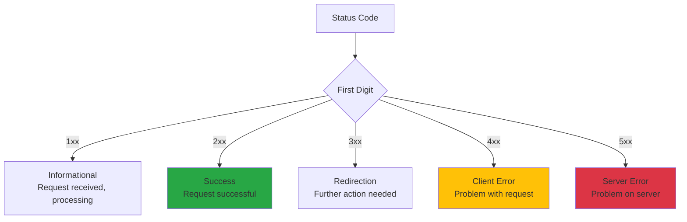
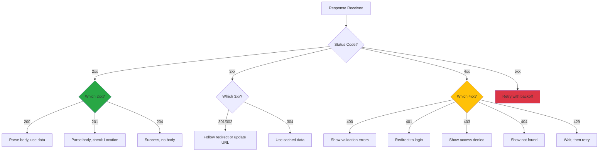

# HTTP Status Codes

## Introduction

HTTP status codes are three-digit numbers that servers return to indicate the result of a request. They're your first clue when debugging API issues—a `404` tells you the resource doesn't exist, a `401` means you need to authenticate, and a `500` indicates a server problem.

Understanding status codes helps you build robust error handling, provide meaningful feedback to users, and quickly diagnose issues in your applications. Whether you're consuming APIs or building them, status codes are the universal language of HTTP communication.

### What We'll Cover

- The five categories of status codes (1xx-5xx)
- Common codes you'll encounter daily
- How to handle different status codes in JavaScript
- Error response patterns and best practices
- Building resilient error handling

### Prerequisites

- Understanding of [HTTP Methods](./01-http-methods.md)
- Understanding of [Request & Response Structure](./02-request-response-structure.md)
- Basic JavaScript async/await syntax

---

## Status Code Categories

Status codes are organized into five classes, each indicating a different type of response:



| Range | Category | Meaning | Action Needed |
|-------|----------|---------|---------------|
| **1xx** | Informational | Request received, continuing | Wait for final response |
| **2xx** | Success | Request succeeded | Process the response |
| **3xx** | Redirection | Need to take additional action | Follow redirect or use cache |
| **4xx** | Client Error | Problem with the request | Fix request and retry |
| **5xx** | Server Error | Server failed to fulfill request | Retry later |

---

## 2xx Success Codes

Success codes indicate that the request was received, understood, and accepted.

### 200 OK

The standard success response. The meaning depends on the HTTP method:

```javascript
// GET - Resource retrieved successfully
const response = await fetch('/api/users/123');
if (response.status === 200) {
  const user = await response.json();
  console.log('User:', user);
}

// PUT/PATCH - Update successful, returns updated resource
// DELETE - (less common) Deletion successful with details
```

### 201 Created

A new resource was successfully created. Typically includes a `Location` header:

```javascript
const response = await fetch('/api/users', {
  method: 'POST',
  headers: { 'Content-Type': 'application/json' },
  body: JSON.stringify({ name: 'Alice' })
});

if (response.status === 201) {
  const newUser = await response.json();
  const location = response.headers.get('Location');
  console.log(`User created at: ${location}`);
  console.log('User data:', newUser);
}
```

### 204 No Content

Request succeeded but there's no content to return. Common for DELETE operations:

```javascript
const response = await fetch('/api/users/123', { method: 'DELETE' });

if (response.status === 204) {
  console.log('User deleted successfully');
  // Don't call response.json() - there's no body!
}
```

> **Important:** Never call `response.json()` on a 204 response—it will throw an error because there's no body to parse.

### Other 2xx Codes

| Code | Name | Use Case |
|------|------|----------|
| **202** | Accepted | Request queued for async processing |
| **206** | Partial Content | Range request (streaming media) |

```javascript
// 202 - Async operation started
const response = await fetch('/api/reports/generate', { method: 'POST' });
if (response.status === 202) {
  const { jobId, statusUrl } = await response.json();
  console.log(`Job started. Check status at: ${statusUrl}`);
}
```

---

## 3xx Redirection Codes

Redirection codes indicate that further action is needed to complete the request.

### 301 Moved Permanently

The resource has permanently moved to a new URL:

```javascript
// fetch() follows redirects automatically by default
const response = await fetch('/old-path');
console.log(response.url);        // New URL after redirect
console.log(response.redirected); // true
```

### 302 Found (Temporary Redirect)

The resource is temporarily at a different URL:

```javascript
// Commonly used for login redirects
const response = await fetch('/dashboard');
if (response.redirected) {
  // May have been redirected to login page
  console.log('Redirected to:', response.url);
}
```

### 304 Not Modified

Used with conditional requests—the cached version is still valid:

```javascript
// First request - get ETag
const response1 = await fetch('/api/data');
const etag = response1.headers.get('ETag');

// Later - conditional request
const response2 = await fetch('/api/data', {
  headers: { 'If-None-Match': etag }
});

if (response2.status === 304) {
  console.log('Data unchanged - use cached version');
  // Response body is empty, use your cached data
}
```

### Controlling Redirect Behavior

```javascript
// Don't follow redirects automatically
const response = await fetch('/api/shortlink/abc', {
  redirect: 'manual'  // 'follow' (default), 'manual', 'error'
});

if (response.status === 301 || response.status === 302) {
  const newUrl = response.headers.get('Location');
  console.log('Would redirect to:', newUrl);
}
```

---

## 4xx Client Error Codes

Client errors indicate that the request itself has a problem.

### 400 Bad Request

The request is malformed or contains invalid data:

```javascript
const response = await fetch('/api/users', {
  method: 'POST',
  headers: { 'Content-Type': 'application/json' },
  body: JSON.stringify({ email: 'invalid-email' })  // Invalid data
});

if (response.status === 400) {
  const error = await response.json();
  console.log('Validation errors:', error.errors);
  // { errors: [{ field: 'email', message: 'Invalid email format' }] }
}
```

### 401 Unauthorized

Authentication is required but missing or invalid:

```javascript
const response = await fetch('/api/protected');

if (response.status === 401) {
  // Redirect to login or refresh token
  console.log('Authentication required');
  window.location.href = '/login';
}
```

> **Note:** Despite the name "Unauthorized," 401 actually means "Unauthenticated." The server doesn't know who you are.

### 403 Forbidden

Authentication succeeded, but you don't have permission:

```javascript
const response = await fetch('/api/admin/settings');

if (response.status === 403) {
  // User is logged in but lacks permission
  console.log('Access denied - insufficient permissions');
  showError('You do not have permission to access this resource');
}
```

### 404 Not Found

The requested resource doesn't exist:

```javascript
const response = await fetch('/api/users/999999');

if (response.status === 404) {
  console.log('User not found');
  // Could mean: user never existed OR was deleted
}
```

### 409 Conflict

The request conflicts with current state:

```javascript
const response = await fetch('/api/users', {
  method: 'POST',
  headers: { 'Content-Type': 'application/json' },
  body: JSON.stringify({ email: 'existing@example.com' })
});

if (response.status === 409) {
  const error = await response.json();
  console.log('Conflict:', error.message);
  // "A user with this email already exists"
}
```

### 422 Unprocessable Entity

The request is syntactically valid but semantically incorrect:

```javascript
const response = await fetch('/api/orders', {
  method: 'POST',
  headers: { 'Content-Type': 'application/json' },
  body: JSON.stringify({
    productId: 123,
    quantity: 100  // Valid format, but exceeds available stock
  })
});

if (response.status === 422) {
  const error = await response.json();
  console.log('Business logic error:', error.message);
  // "Cannot order 100 items - only 5 in stock"
}
```

### 429 Too Many Requests

You've exceeded the rate limit:

```javascript
const response = await fetch('/api/data');

if (response.status === 429) {
  const retryAfter = response.headers.get('Retry-After');
  console.log(`Rate limited. Retry after ${retryAfter} seconds`);
  
  // Wait and retry
  await new Promise(resolve => setTimeout(resolve, retryAfter * 1000));
  return fetch('/api/data');  // Retry
}
```

### Quick Reference: 4xx Codes

| Code | Name | Meaning | User Action |
|------|------|---------|-------------|
| **400** | Bad Request | Invalid request data | Fix input and retry |
| **401** | Unauthorized | Need to authenticate | Log in |
| **403** | Forbidden | No permission | Request access |
| **404** | Not Found | Resource doesn't exist | Check URL |
| **405** | Method Not Allowed | Wrong HTTP method | Use correct method |
| **409** | Conflict | State conflict | Resolve conflict |
| **422** | Unprocessable Entity | Business rule violation | Fix data |
| **429** | Too Many Requests | Rate limited | Wait and retry |

---

## 5xx Server Error Codes

Server errors indicate that the server failed to fulfill a valid request.

### 500 Internal Server Error

A generic server-side error:

```javascript
const response = await fetch('/api/data');

if (response.status === 500) {
  console.error('Server error - try again later');
  // Log for debugging, but don't expose details to users
}
```

### 502 Bad Gateway

The server received an invalid response from an upstream server:

```javascript
// Common with reverse proxies, load balancers
if (response.status === 502) {
  console.error('Gateway error - upstream server unavailable');
}
```

### 503 Service Unavailable

The server is temporarily overloaded or under maintenance:

```javascript
if (response.status === 503) {
  const retryAfter = response.headers.get('Retry-After');
  console.log('Service unavailable');
  
  if (retryAfter) {
    console.log(`Try again after ${retryAfter} seconds`);
  }
}
```

### 504 Gateway Timeout

The server didn't receive a timely response from an upstream server:

```javascript
if (response.status === 504) {
  console.error('Gateway timeout - upstream server took too long');
  // Consider: increase timeout, retry, or use cached data
}
```

### Quick Reference: 5xx Codes

| Code | Name | Meaning | Client Action |
|------|------|---------|---------------|
| **500** | Internal Server Error | Generic server error | Retry later |
| **502** | Bad Gateway | Upstream server error | Retry later |
| **503** | Service Unavailable | Server overloaded/maintenance | Check Retry-After |
| **504** | Gateway Timeout | Upstream timeout | Retry later |

---

## Handling Status Codes in JavaScript

### Basic Pattern

```javascript
async function apiRequest(url, options = {}) {
  const response = await fetch(url, options);
  
  // Check for success (2xx)
  if (response.ok) {
    // Handle empty responses
    if (response.status === 204) {
      return null;
    }
    return response.json();
  }
  
  // Handle errors
  throw await createApiError(response);
}

async function createApiError(response) {
  let message = `HTTP ${response.status}`;
  let data = null;
  
  try {
    data = await response.json();
    message = data.message || data.error || message;
  } catch {
    // Response isn't JSON
  }
  
  const error = new Error(message);
  error.status = response.status;
  error.data = data;
  return error;
}
```

### Comprehensive Error Handler

```javascript
class ApiClient {
  constructor(baseUrl) {
    this.baseUrl = baseUrl;
  }

  async request(path, options = {}) {
    const url = `${this.baseUrl}${path}`;
    
    try {
      const response = await fetch(url, options);
      return await this.handleResponse(response);
    } catch (error) {
      return this.handleNetworkError(error);
    }
  }

  async handleResponse(response) {
    // Success
    if (response.ok) {
      if (response.status === 204) return { success: true };
      return await response.json();
    }

    // Get error details
    let errorData;
    try {
      errorData = await response.json();
    } catch {
      errorData = { message: response.statusText };
    }

    // Handle by status code
    switch (response.status) {
      case 400:
        throw new ValidationError(errorData);
      
      case 401:
        this.handleUnauthorized();
        throw new AuthenticationError(errorData);
      
      case 403:
        throw new ForbiddenError(errorData);
      
      case 404:
        throw new NotFoundError(errorData);
      
      case 409:
        throw new ConflictError(errorData);
      
      case 422:
        throw new UnprocessableError(errorData);
      
      case 429:
        throw new RateLimitError(errorData, response.headers.get('Retry-After'));
      
      case 500:
      case 502:
      case 503:
      case 504:
        throw new ServerError(errorData, response.status);
      
      default:
        throw new ApiError(errorData, response.status);
    }
  }

  handleNetworkError(error) {
    if (error.name === 'TypeError') {
      throw new NetworkError('Unable to reach server');
    }
    throw error;
  }

  handleUnauthorized() {
    // Clear stored auth, redirect to login, etc.
    localStorage.removeItem('token');
    window.dispatchEvent(new CustomEvent('auth:expired'));
  }
}

// Custom error classes
class ApiError extends Error {
  constructor(data, status) {
    super(data.message || 'API Error');
    this.name = 'ApiError';
    this.status = status;
    this.data = data;
  }
}

class ValidationError extends ApiError {
  constructor(data) {
    super(data, 400);
    this.name = 'ValidationError';
    this.errors = data.errors || [];
  }
}

class AuthenticationError extends ApiError {
  constructor(data) {
    super(data, 401);
    this.name = 'AuthenticationError';
  }
}

class RateLimitError extends ApiError {
  constructor(data, retryAfter) {
    super(data, 429);
    this.name = 'RateLimitError';
    this.retryAfter = parseInt(retryAfter) || 60;
  }
}
```

### Using the API Client

```javascript
const api = new ApiClient('https://api.example.com');

async function createUser(userData) {
  try {
    const user = await api.request('/users', {
      method: 'POST',
      headers: { 'Content-Type': 'application/json' },
      body: JSON.stringify(userData)
    });
    return user;
  } catch (error) {
    if (error instanceof ValidationError) {
      // Show validation errors to user
      error.errors.forEach(err => {
        showFieldError(err.field, err.message);
      });
    } else if (error instanceof ConflictError) {
      showError('A user with this email already exists');
    } else if (error instanceof RateLimitError) {
      showError(`Please wait ${error.retryAfter} seconds before trying again`);
    } else if (error instanceof ServerError) {
      showError('Something went wrong. Please try again later.');
    } else {
      showError('An unexpected error occurred');
    }
    throw error;
  }
}
```

---

## Retry Strategies

### Retry for Server Errors

```javascript
async function fetchWithRetry(url, options = {}, maxRetries = 3) {
  const retryableStatuses = [500, 502, 503, 504];
  
  for (let attempt = 1; attempt <= maxRetries; attempt++) {
    try {
      const response = await fetch(url, options);
      
      // Success or client error - don't retry
      if (response.ok || response.status < 500) {
        return response;
      }
      
      // Server error - maybe retry
      if (!retryableStatuses.includes(response.status)) {
        return response;
      }
      
      // Last attempt - return error response
      if (attempt === maxRetries) {
        return response;
      }
      
      // Check Retry-After header
      const retryAfter = response.headers.get('Retry-After');
      const delay = retryAfter 
        ? parseInt(retryAfter) * 1000
        : Math.min(1000 * Math.pow(2, attempt), 10000);  // Exponential backoff
      
      console.log(`Retry ${attempt}/${maxRetries} in ${delay}ms`);
      await new Promise(resolve => setTimeout(resolve, delay));
      
    } catch (error) {
      // Network error - retry
      if (attempt === maxRetries) throw error;
      
      const delay = 1000 * Math.pow(2, attempt);
      await new Promise(resolve => setTimeout(resolve, delay));
    }
  }
}
```

### Rate Limit Handling

```javascript
async function fetchWithRateLimitHandling(url, options = {}) {
  const response = await fetch(url, options);
  
  if (response.status === 429) {
    const retryAfter = parseInt(response.headers.get('Retry-After') || '60');
    
    console.log(`Rate limited. Waiting ${retryAfter} seconds...`);
    await new Promise(resolve => setTimeout(resolve, retryAfter * 1000));
    
    // Retry once after waiting
    return fetch(url, options);
  }
  
  return response;
}
```

---

## Status Code Decision Flow



---

## Best Practices

### 1. Always Check response.ok

```javascript
// ✅ DO: Check before parsing
const response = await fetch('/api/data');
if (!response.ok) {
  throw new Error(`HTTP ${response.status}`);
}
const data = await response.json();

// ❌ DON'T: Assume success
const data = await fetch('/api/data').then(r => r.json());
// Will try to parse error page as JSON!
```

### 2. Handle 204 No Content

```javascript
// ✅ DO: Check for empty body
const response = await fetch('/api/resource', { method: 'DELETE' });
if (response.status === 204) {
  return null;  // No body to parse
}
return response.json();

// ❌ DON'T: Always parse JSON
const data = await response.json();  // Throws on 204!
```

### 3. Provide User-Friendly Messages

```javascript
// ✅ DO: Map codes to user messages
const userMessages = {
  400: 'Please check your input and try again.',
  401: 'Please log in to continue.',
  403: 'You don\'t have permission to do this.',
  404: 'The requested item was not found.',
  429: 'Too many requests. Please wait a moment.',
  500: 'Something went wrong. Please try again later.'
};

function getUserMessage(status) {
  return userMessages[status] || 'An unexpected error occurred.';
}
```

### 4. Log Details for Debugging

```javascript
// ✅ DO: Log full details for debugging
async function handleError(response) {
  const error = {
    status: response.status,
    statusText: response.statusText,
    url: response.url,
    body: await response.text().catch(() => null)
  };
  
  console.error('API Error:', error);
  
  // But show friendly message to user
  showError(getUserMessage(response.status));
}
```

---

## Common Pitfalls

| ❌ Mistake | ✅ Solution |
|-----------|-------------|
| Not checking `response.ok` | Always verify status before parsing |
| Parsing 204 responses as JSON | Check status before calling `.json()` |
| Showing raw error messages | Map to user-friendly messages |
| Not handling 429 rate limits | Check Retry-After and wait |
| Retrying 4xx errors | Only retry 5xx and network errors |
| Ignoring redirect status | Check `response.redirected` when relevant |

---

## Hands-on Exercise

### Your Task

Build a robust HTTP client with comprehensive status code handling that provides both developer-friendly debugging and user-friendly error messages.

### Requirements

1. Create an `HttpClient` class that wraps fetch
2. Handle all common status codes appropriately
3. Implement retry logic for 5xx errors with exponential backoff
4. Handle 429 rate limits with Retry-After header
5. Provide user-friendly error messages
6. Log detailed debugging information

### Expected Result

A client that gracefully handles all HTTP responses and provides clear feedback.

<details>
<summary>💡 Hints (click to expand)</summary>

- Use a Map or object for status code to message mapping
- Implement exponential backoff: delay = baseDelay * 2^attempt
- Parse the Retry-After header (can be seconds or a date)
- Consider making the client configurable (base URL, retry count)

</details>

<details>
<summary>✅ Solution (click to expand)</summary>

```javascript
class HttpClient {
  constructor(options = {}) {
    this.baseUrl = options.baseUrl || '';
    this.maxRetries = options.maxRetries || 3;
    this.baseDelay = options.baseDelay || 1000;
    this.onUnauthorized = options.onUnauthorized || (() => {});
    
    this.userMessages = {
      400: 'Please check your input and try again.',
      401: 'Please log in to continue.',
      403: 'You don\'t have permission to perform this action.',
      404: 'The requested resource was not found.',
      409: 'This action conflicts with existing data.',
      422: 'The submitted data is invalid.',
      429: 'Too many requests. Please slow down.',
      500: 'Something went wrong on our end. Please try again.',
      502: 'Service temporarily unavailable. Please try again.',
      503: 'Service is under maintenance. Please try again later.',
      504: 'Request timed out. Please try again.'
    };
  }

  async request(path, options = {}) {
    const url = `${this.baseUrl}${path}`;
    const startTime = Date.now();
    
    try {
      const response = await this.executeWithRetry(url, options);
      return await this.handleResponse(response, startTime);
    } catch (error) {
      this.logError(error, url, options, startTime);
      throw error;
    }
  }

  async executeWithRetry(url, options) {
    let lastError;
    
    for (let attempt = 1; attempt <= this.maxRetries; attempt++) {
      try {
        const response = await fetch(url, options);
        
        // Handle rate limiting
        if (response.status === 429) {
          const delay = this.parseRetryAfter(response);
          console.log(`Rate limited. Waiting ${delay}ms (attempt ${attempt})`);
          await this.sleep(delay);
          continue;
        }
        
        // Retry on server errors
        if (response.status >= 500 && attempt < this.maxRetries) {
          const delay = this.calculateBackoff(attempt);
          console.log(`Server error ${response.status}. Retrying in ${delay}ms (attempt ${attempt})`);
          await this.sleep(delay);
          continue;
        }
        
        return response;
        
      } catch (error) {
        lastError = error;
        
        // Network error - retry
        if (attempt < this.maxRetries) {
          const delay = this.calculateBackoff(attempt);
          console.log(`Network error. Retrying in ${delay}ms (attempt ${attempt})`);
          await this.sleep(delay);
          continue;
        }
      }
    }
    
    throw lastError || new Error('Request failed after retries');
  }

  async handleResponse(response, startTime) {
    const duration = Date.now() - startTime;
    
    // Log success
    if (response.ok) {
      console.log(`✓ ${response.status} ${response.url} (${duration}ms)`);
      
      if (response.status === 204) {
        return { success: true, data: null };
      }
      
      const data = await response.json();
      return { success: true, data };
    }
    
    // Log and handle error
    console.log(`✗ ${response.status} ${response.url} (${duration}ms)`);
    
    const error = await this.createError(response);
    
    // Special handling for 401
    if (response.status === 401) {
      this.onUnauthorized(error);
    }
    
    throw error;
  }

  async createError(response) {
    let errorData = {};
    
    try {
      errorData = await response.json();
    } catch {
      errorData = { message: response.statusText };
    }
    
    const error = new Error(this.userMessages[response.status] || 'An error occurred');
    error.name = this.getErrorName(response.status);
    error.status = response.status;
    error.statusText = response.statusText;
    error.url = response.url;
    error.data = errorData;
    error.userMessage = this.userMessages[response.status];
    error.developerMessage = errorData.message || errorData.error;
    
    return error;
  }

  getErrorName(status) {
    const names = {
      400: 'ValidationError',
      401: 'AuthenticationError',
      403: 'AuthorizationError',
      404: 'NotFoundError',
      409: 'ConflictError',
      422: 'UnprocessableError',
      429: 'RateLimitError',
      500: 'ServerError',
      502: 'BadGatewayError',
      503: 'ServiceUnavailableError',
      504: 'GatewayTimeoutError'
    };
    return names[status] || 'HttpError';
  }

  parseRetryAfter(response) {
    const retryAfter = response.headers.get('Retry-After');
    
    if (!retryAfter) {
      return 60000; // Default 1 minute
    }
    
    // Could be seconds or HTTP date
    const seconds = parseInt(retryAfter);
    if (!isNaN(seconds)) {
      return seconds * 1000;
    }
    
    // Try parsing as date
    const date = new Date(retryAfter);
    if (!isNaN(date.getTime())) {
      return Math.max(0, date.getTime() - Date.now());
    }
    
    return 60000;
  }

  calculateBackoff(attempt) {
    const delay = this.baseDelay * Math.pow(2, attempt - 1);
    const jitter = Math.random() * 1000;
    return Math.min(delay + jitter, 30000); // Max 30 seconds
  }

  sleep(ms) {
    return new Promise(resolve => setTimeout(resolve, ms));
  }

  logError(error, url, options, startTime) {
    const duration = Date.now() - startTime;
    
    console.error('HTTP Request Failed:', {
      url,
      method: options.method || 'GET',
      duration: `${duration}ms`,
      error: {
        name: error.name,
        status: error.status,
        message: error.message,
        data: error.data
      }
    });
  }

  // Convenience methods
  async get(path, options = {}) {
    return this.request(path, { ...options, method: 'GET' });
  }

  async post(path, data, options = {}) {
    return this.request(path, {
      ...options,
      method: 'POST',
      headers: { 'Content-Type': 'application/json', ...options.headers },
      body: JSON.stringify(data)
    });
  }

  async put(path, data, options = {}) {
    return this.request(path, {
      ...options,
      method: 'PUT',
      headers: { 'Content-Type': 'application/json', ...options.headers },
      body: JSON.stringify(data)
    });
  }

  async delete(path, options = {}) {
    return this.request(path, { ...options, method: 'DELETE' });
  }
}

// Usage
const client = new HttpClient({
  baseUrl: 'https://api.example.com',
  maxRetries: 3,
  onUnauthorized: () => {
    window.location.href = '/login';
  }
});

// Make requests
try {
  const { data } = await client.get('/users');
  console.log('Users:', data);
} catch (error) {
  // Show user-friendly message
  showToast(error.userMessage);
  
  // Log developer details
  console.error('Developer info:', error.developerMessage);
}
```

</details>

### Bonus Challenges

- [ ] Add request/response interceptors
- [ ] Implement request deduplication (prevent duplicate in-flight requests)
- [ ] Add circuit breaker pattern for failing endpoints

---

## Summary

✅ **2xx** codes indicate success—always check for 204 before parsing body

✅ **3xx** codes require further action—fetch follows redirects by default

✅ **4xx** codes are client errors—fix the request, don't blindly retry

✅ **5xx** codes are server errors—retry with exponential backoff

✅ Use `response.ok` to check for success (status 200-299)

✅ Parse error responses to get detailed error information

✅ Show user-friendly messages, log developer details

✅ Handle **429** rate limits by respecting the Retry-After header

**Next:** [Fetch API](./05-fetch-api.md)

---

## Further Reading

- [MDN: HTTP Status Codes](https://developer.mozilla.org/en-US/docs/Web/HTTP/Status) - Complete status code reference
- [HTTP Cats](https://http.cat/) - Fun visual reference for status codes
- [RFC 9110: HTTP Semantics](https://httpwg.org/specs/rfc9110.html#status.codes) - Official specification

---

<!-- 
Sources Consulted:
- MDN HTTP Status Codes: https://developer.mozilla.org/en-US/docs/Web/HTTP/Status
- MDN Using Fetch: https://developer.mozilla.org/en-US/docs/Web/API/Fetch_API/Using_Fetch
- RFC 9110 HTTP Semantics: https://httpwg.org/specs/rfc9110.html
-->
