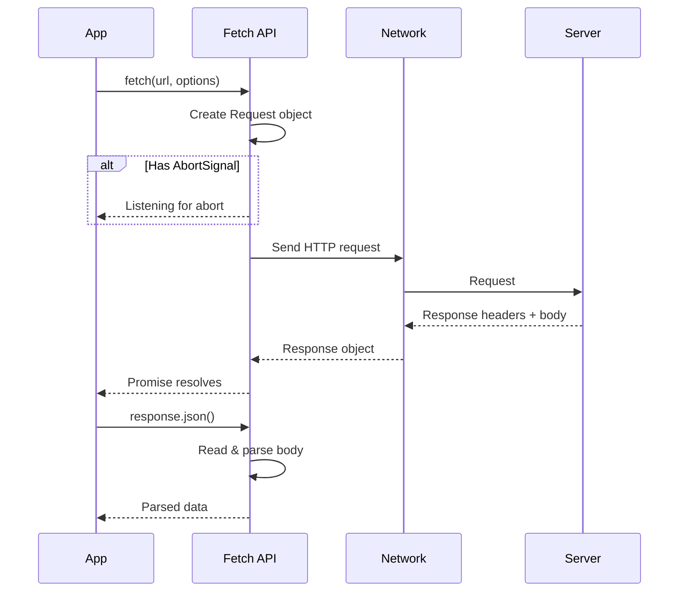

# The Fetch API

## Introduction

The Fetch API is the modern standard for making HTTP requests in JavaScript. It replaces the older XMLHttpRequest with a cleaner, Promise-based interface that integrates seamlessly with async/await syntax.

Every web application that communicates with a server uses the Fetch API (or a library built on top of it). Understanding fetch deeply—including request configuration, response handling, and cancellation—is essential for building responsive, reliable web applications.

### What We'll Cover

- Basic fetch syntax and options
- Creating and configuring Request objects
- Working with Response objects
- Canceling requests with AbortController
- Common patterns and utilities

### Prerequisites

- Understanding of [HTTP Methods](./01-http-methods.md)
- Understanding of [Status Codes](./04-status-codes.md)
- JavaScript Promises and async/await

---

## Basic Fetch Syntax

The `fetch()` function takes a URL and returns a Promise that resolves to a Response object:

```javascript
// Simple GET request
const response = await fetch('https://api.example.com/data');
const data = await response.json();
console.log(data);
```

### The Two-Step Pattern

Fetch always requires two steps—getting the response, then reading the body:

```javascript
// Step 1: Get the Response object (when headers arrive)
const response = await fetch('/api/users');

// Step 2: Read the body (when body fully received)
const users = await response.json();
```

> **Note:** The first await resolves when the response *headers* arrive. The second await is needed because reading the body is also asynchronous.

### With Options

```javascript
const response = await fetch('/api/users', {
  method: 'POST',
  headers: {
    'Content-Type': 'application/json',
    'Authorization': 'Bearer token123'
  },
  body: JSON.stringify({ name: 'Alice', email: 'alice@example.com' })
});
```

---

## Fetch Options Reference

The second argument to fetch is an options object:

```javascript
fetch(url, {
  // HTTP method
  method: 'POST',  // GET, POST, PUT, DELETE, PATCH, etc.
  
  // Request headers
  headers: {
    'Content-Type': 'application/json',
    'Accept': 'application/json'
  },
  
  // Request body (not for GET/HEAD)
  body: JSON.stringify(data),
  
  // Credentials mode
  credentials: 'same-origin',  // 'omit', 'same-origin', 'include'
  
  // CORS mode
  mode: 'cors',  // 'cors', 'no-cors', 'same-origin'
  
  // Redirect handling
  redirect: 'follow',  // 'follow', 'manual', 'error'
  
  // Cache mode
  cache: 'default',  // 'default', 'no-store', 'reload', 'no-cache', 'force-cache'
  
  // Referrer policy
  referrerPolicy: 'strict-origin-when-cross-origin',
  
  // Abort signal
  signal: abortController.signal
});
```

### Options Quick Reference

| Option | Values | Default | Purpose |
|--------|--------|---------|---------|
| `method` | GET, POST, PUT, etc. | GET | HTTP method |
| `headers` | Object or Headers | — | Request headers |
| `body` | String, FormData, Blob, etc. | — | Request body |
| `credentials` | omit, same-origin, include | same-origin | Cookie handling |
| `mode` | cors, no-cors, same-origin | cors | CORS behavior |
| `redirect` | follow, manual, error | follow | Redirect handling |
| `cache` | default, no-store, reload, etc. | default | Caching behavior |
| `signal` | AbortSignal | — | For cancellation |

---

## The Request Object

You can create a Request object separately for more control:

```javascript
// Create a reusable request
const request = new Request('/api/users', {
  method: 'POST',
  headers: { 'Content-Type': 'application/json' },
  body: JSON.stringify({ name: 'Alice' })
});

// Use it with fetch
const response = await fetch(request);

// Clone for multiple uses (body can only be read once)
const response2 = await fetch(request.clone());
```

### Request Properties

```javascript
const request = new Request('/api/users?page=1', {
  method: 'POST',
  headers: { 'Content-Type': 'application/json' },
  body: JSON.stringify({ name: 'Alice' })
});

// Read-only properties
console.log(request.url);        // Full URL
console.log(request.method);     // 'POST'
console.log(request.headers);    // Headers object
console.log(request.bodyUsed);   // false (until body is read)
console.log(request.credentials);// 'same-origin'
console.log(request.mode);       // 'cors'

// Read body (can only do this once)
const body = await request.json();
console.log(request.bodyUsed);   // true
```

### Modifying Requests

Requests are immutable, but you can create modified copies:

```javascript
// Original request
const baseRequest = new Request('/api/data', {
  headers: { 'X-API-Key': 'secret' }
});

// Create modified copy
const postRequest = new Request(baseRequest, {
  method: 'POST',
  body: JSON.stringify({ key: 'value' })
});
```

---

## The Response Object

The Response object represents the server's response:

```javascript
const response = await fetch('/api/users');

// Status information
console.log(response.status);      // 200
console.log(response.statusText);  // 'OK'
console.log(response.ok);          // true (status 200-299)

// URL and type
console.log(response.url);         // Final URL (after redirects)
console.log(response.type);        // 'basic', 'cors', 'opaque'
console.log(response.redirected);  // true if redirected

// Headers
console.log(response.headers.get('Content-Type'));

// Body status
console.log(response.bodyUsed);    // false (until read)
```

### Response Types

| Type | Description |
|------|-------------|
| `basic` | Same-origin response, all headers accessible |
| `cors` | Cross-origin response, restricted headers |
| `opaque` | Cross-origin with `mode: 'no-cors'`, no data accessible |
| `error` | Network error, no data |

### Reading the Body

Response provides several methods to read the body, each returning a Promise:

```javascript
const response = await fetch('/api/data');

// As JSON (most common)
const data = await response.json();

// As text
const text = await response.text();

// As binary data
const blob = await response.blob();

// As ArrayBuffer
const buffer = await response.arrayBuffer();

// As form data
const formData = await response.formData();
```

> **Important:** You can only read the body once! After calling any of these methods, `bodyUsed` becomes true and calling again throws an error.

```javascript
const response = await fetch('/api/data');

const data = await response.json();
const text = await response.text(); // Error! Body already used

// Solution: Clone the response first
const response = await fetch('/api/data');
const clone = response.clone();
const data = await response.json();
const text = await clone.text();  // Works!
```

---

## Creating Responses

You can create Response objects programmatically (useful for mocking and Service Workers):

```javascript
// Simple response
const response = new Response('Hello, world!', {
  status: 200,
  statusText: 'OK',
  headers: { 'Content-Type': 'text/plain' }
});

// JSON response
const jsonResponse = new Response(JSON.stringify({ message: 'Success' }), {
  headers: { 'Content-Type': 'application/json' }
});

// Static factory methods
Response.error();  // Network error response
Response.redirect(url, 301);  // Redirect response
Response.json({ data: 'value' });  // JSON response (newer browsers)
```

---

## The Headers Object

Headers provides a clean interface for working with HTTP headers:

```javascript
// Create headers
const headers = new Headers();
headers.set('Content-Type', 'application/json');
headers.append('Accept', 'application/json');

// Create from object
const headers = new Headers({
  'Content-Type': 'application/json',
  'Authorization': 'Bearer token'
});

// Use with fetch
fetch('/api/data', { headers });
```

### Headers Methods

```javascript
const headers = new Headers({
  'Content-Type': 'application/json',
  'Accept-Language': 'en-US, en;q=0.9'
});

// Check if header exists
headers.has('Content-Type');  // true

// Get header value
headers.get('Content-Type');  // 'application/json'

// Set header (overwrites)
headers.set('Authorization', 'Bearer token');

// Append header (adds, may create duplicates)
headers.append('Accept', 'text/html');

// Delete header
headers.delete('Accept-Language');

// Iterate headers
for (const [name, value] of headers) {
  console.log(`${name}: ${value}`);
}
```

---

## Canceling Requests with AbortController

AbortController lets you cancel in-flight requests:

```javascript
// Create controller
const controller = new AbortController();

// Pass signal to fetch
const response = await fetch('/api/data', {
  signal: controller.signal
});

// Cancel the request
controller.abort();
```

### Handling Abort Errors

```javascript
const controller = new AbortController();

try {
  const response = await fetch('/api/data', {
    signal: controller.signal
  });
  const data = await response.json();
} catch (error) {
  if (error.name === 'AbortError') {
    console.log('Request was cancelled');
  } else {
    console.error('Fetch error:', error);
  }
}
```

### Common Use Cases

#### Timeout

```javascript
async function fetchWithTimeout(url, options = {}, timeout = 5000) {
  const controller = new AbortController();
  
  const timeoutId = setTimeout(() => {
    controller.abort();
  }, timeout);
  
  try {
    const response = await fetch(url, {
      ...options,
      signal: controller.signal
    });
    return response;
  } finally {
    clearTimeout(timeoutId);
  }
}

// Usage
try {
  const response = await fetchWithTimeout('/api/slow-endpoint', {}, 3000);
} catch (error) {
  if (error.name === 'AbortError') {
    console.log('Request timed out');
  }
}
```

#### Cancel on Component Unmount (React)

```javascript
useEffect(() => {
  const controller = new AbortController();
  
  async function loadData() {
    try {
      const response = await fetch('/api/data', {
        signal: controller.signal
      });
      const data = await response.json();
      setData(data);
    } catch (error) {
      if (error.name !== 'AbortError') {
        setError(error);
      }
    }
  }
  
  loadData();
  
  // Cleanup: abort on unmount
  return () => controller.abort();
}, []);
```

#### Cancel Previous Request

```javascript
let currentController = null;

async function search(query) {
  // Cancel previous search
  if (currentController) {
    currentController.abort();
  }
  
  // Create new controller
  currentController = new AbortController();
  
  try {
    const response = await fetch(`/api/search?q=${query}`, {
      signal: currentController.signal
    });
    return await response.json();
  } catch (error) {
    if (error.name === 'AbortError') {
      return null;  // Cancelled, ignore
    }
    throw error;
  }
}

// Rapid calls - only the last one completes
search('a');    // Cancelled
search('ap');   // Cancelled
search('app');  // Completes
```

### AbortSignal.timeout()

Modern browsers support a shorthand for timeout:

```javascript
// Create a signal that auto-aborts after 5 seconds
const response = await fetch('/api/data', {
  signal: AbortSignal.timeout(5000)
});
```

### Combining Signals

Abort if *either* condition is met:

```javascript
const controller = new AbortController();

// Abort if user cancels OR timeout
const response = await fetch('/api/data', {
  signal: AbortSignal.any([
    controller.signal,
    AbortSignal.timeout(5000)
  ])
});

// User can still cancel manually
cancelButton.onclick = () => controller.abort();
```

---

## Common Fetch Patterns

### GET with Query Parameters

```javascript
function buildUrl(base, params) {
  const url = new URL(base);
  Object.entries(params).forEach(([key, value]) => {
    if (value !== undefined && value !== null) {
      url.searchParams.append(key, value);
    }
  });
  return url.toString();
}

const url = buildUrl('/api/users', {
  page: 1,
  limit: 10,
  search: 'alice'
});
// '/api/users?page=1&limit=10&search=alice'

const response = await fetch(url);
```

### POST JSON

```javascript
async function postJson(url, data) {
  const response = await fetch(url, {
    method: 'POST',
    headers: { 'Content-Type': 'application/json' },
    body: JSON.stringify(data)
  });
  
  if (!response.ok) {
    throw new Error(`HTTP ${response.status}`);
  }
  
  return response.json();
}

const user = await postJson('/api/users', { name: 'Alice' });
```

### File Upload

```javascript
async function uploadFile(file) {
  const formData = new FormData();
  formData.append('file', file);
  formData.append('name', file.name);
  
  // Don't set Content-Type - browser sets it with boundary
  const response = await fetch('/api/upload', {
    method: 'POST',
    body: formData
  });
  
  return response.json();
}

// Usage with input element
const input = document.querySelector('input[type="file"]');
input.addEventListener('change', async () => {
  const result = await uploadFile(input.files[0]);
  console.log('Uploaded:', result);
});
```

### Streaming Response

```javascript
async function streamResponse(url) {
  const response = await fetch(url);
  const reader = response.body.getReader();
  const decoder = new TextDecoder();
  
  let result = '';
  
  while (true) {
    const { done, value } = await reader.read();
    
    if (done) break;
    
    const chunk = decoder.decode(value, { stream: true });
    result += chunk;
    console.log('Received chunk:', chunk);
  }
  
  return result;
}
```

---

## Request/Response Flow



---

## Error Handling

Fetch only rejects on network failures, not HTTP errors:

```javascript
// ❌ This doesn't catch 404, 500, etc.
try {
  const response = await fetch('/api/data');
  const data = await response.json();  // May throw on error pages
} catch (error) {
  // Only catches network errors!
}

// ✅ Proper error handling
async function fetchJson(url) {
  const response = await fetch(url);
  
  if (!response.ok) {
    const error = new Error(`HTTP ${response.status}`);
    error.response = response;
    throw error;
  }
  
  return response.json();
}

try {
  const data = await fetchJson('/api/data');
} catch (error) {
  if (error.response) {
    console.log('HTTP error:', error.response.status);
  } else {
    console.log('Network error:', error.message);
  }
}
```

---

## Best Practices

### 1. Always Check response.ok

```javascript
// ✅ DO
const response = await fetch(url);
if (!response.ok) {
  throw new Error(`HTTP ${response.status}`);
}
const data = await response.json();

// ❌ DON'T
const data = await fetch(url).then(r => r.json());
```

### 2. Use AbortController for Cancellation

```javascript
// ✅ DO: Cancel requests that are no longer needed
const controller = new AbortController();
fetch(url, { signal: controller.signal });
// When appropriate: controller.abort();

// ❌ DON'T: Let abandoned requests complete
fetch(url);  // No way to cancel
```

### 3. Handle JSON Parse Errors

```javascript
// ✅ DO: Handle non-JSON responses gracefully
async function safeJson(response) {
  const text = await response.text();
  try {
    return JSON.parse(text);
  } catch {
    return null;
  }
}
```

### 4. Set Appropriate Timeouts

```javascript
// ✅ DO: Prevent indefinite waits
const response = await fetch(url, {
  signal: AbortSignal.timeout(10000)
});
```

---

## Common Pitfalls

| ❌ Mistake | ✅ Solution |
|-----------|-------------|
| Not checking `response.ok` | Always verify status before parsing |
| Reading body twice | Clone response before first read |
| Not handling AbortError | Check `error.name === 'AbortError'` |
| Setting Content-Type for FormData | Let browser set it automatically |
| No timeout on requests | Use AbortSignal.timeout() |
| Ignoring credentials option | Set `credentials: 'include'` for cookies |

---

## Hands-on Exercise

### Your Task

Build a `FetchClient` class that wraps the Fetch API with sensible defaults, automatic timeout, retry logic, and convenient methods for common operations.

### Requirements

1. Support base URL configuration
2. Add automatic timeout (configurable)
3. Implement request/response interceptors
4. Add convenience methods (get, post, put, delete)
5. Handle errors consistently
6. Support request cancellation

### Expected Result

A robust fetch wrapper that simplifies API communication.

<details>
<summary>💡 Hints (click to expand)</summary>

- Store interceptors in arrays and run them sequentially
- Use AbortController for timeout
- Clone requests/responses before passing to interceptors
- Consider making the class configurable via constructor options

</details>

<details>
<summary>✅ Solution (click to expand)</summary>

```javascript
class FetchClient {
  constructor(options = {}) {
    this.baseUrl = options.baseUrl || '';
    this.timeout = options.timeout || 30000;
    this.defaultHeaders = options.headers || {};
    
    this.requestInterceptors = [];
    this.responseInterceptors = [];
  }

  // Interceptor registration
  addRequestInterceptor(fn) {
    this.requestInterceptors.push(fn);
    return () => {
      const index = this.requestInterceptors.indexOf(fn);
      if (index > -1) this.requestInterceptors.splice(index, 1);
    };
  }

  addResponseInterceptor(fn) {
    this.responseInterceptors.push(fn);
    return () => {
      const index = this.responseInterceptors.indexOf(fn);
      if (index > -1) this.responseInterceptors.splice(index, 1);
    };
  }

  // Main request method
  async request(path, options = {}) {
    const url = `${this.baseUrl}${path}`;
    
    // Merge headers
    const headers = new Headers(this.defaultHeaders);
    if (options.headers) {
      const optHeaders = new Headers(options.headers);
      for (const [key, value] of optHeaders) {
        headers.set(key, value);
      }
    }
    
    // Create request config
    let config = {
      ...options,
      headers
    };
    
    // Run request interceptors
    for (const interceptor of this.requestInterceptors) {
      config = await interceptor(config) || config;
    }
    
    // Set up abort controller for timeout
    const controller = new AbortController();
    const timeoutId = setTimeout(() => controller.abort(), this.timeout);
    
    // Combine with any provided signal
    if (options.signal) {
      options.signal.addEventListener('abort', () => controller.abort());
    }
    
    try {
      let response = await fetch(url, {
        ...config,
        signal: controller.signal
      });
      
      // Run response interceptors
      for (const interceptor of this.responseInterceptors) {
        response = await interceptor(response.clone()) || response;
      }
      
      return response;
    } finally {
      clearTimeout(timeoutId);
    }
  }

  // Convenience methods
  async get(path, options = {}) {
    const response = await this.request(path, {
      ...options,
      method: 'GET'
    });
    return this.handleResponse(response);
  }

  async post(path, data, options = {}) {
    const response = await this.request(path, {
      ...options,
      method: 'POST',
      headers: {
        'Content-Type': 'application/json',
        ...options.headers
      },
      body: JSON.stringify(data)
    });
    return this.handleResponse(response);
  }

  async put(path, data, options = {}) {
    const response = await this.request(path, {
      ...options,
      method: 'PUT',
      headers: {
        'Content-Type': 'application/json',
        ...options.headers
      },
      body: JSON.stringify(data)
    });
    return this.handleResponse(response);
  }

  async patch(path, data, options = {}) {
    const response = await this.request(path, {
      ...options,
      method: 'PATCH',
      headers: {
        'Content-Type': 'application/json',
        ...options.headers
      },
      body: JSON.stringify(data)
    });
    return this.handleResponse(response);
  }

  async delete(path, options = {}) {
    const response = await this.request(path, {
      ...options,
      method: 'DELETE'
    });
    return this.handleResponse(response);
  }

  // Response handler
  async handleResponse(response) {
    if (!response.ok) {
      const error = new Error(`HTTP ${response.status}`);
      error.status = response.status;
      error.response = response;
      
      try {
        error.data = await response.json();
      } catch {
        error.data = null;
      }
      
      throw error;
    }
    
    // Handle empty responses
    if (response.status === 204) {
      return null;
    }
    
    // Parse JSON
    const contentType = response.headers.get('Content-Type');
    if (contentType?.includes('application/json')) {
      return response.json();
    }
    
    return response.text();
  }

  // Create child client with extended config
  extend(options = {}) {
    return new FetchClient({
      baseUrl: options.baseUrl || this.baseUrl,
      timeout: options.timeout || this.timeout,
      headers: {
        ...this.defaultHeaders,
        ...options.headers
      }
    });
  }
}

// Usage
const api = new FetchClient({
  baseUrl: 'https://api.example.com',
  timeout: 10000,
  headers: {
    'Accept': 'application/json'
  }
});

// Add auth interceptor
api.addRequestInterceptor(async (config) => {
  const token = localStorage.getItem('token');
  if (token) {
    config.headers.set('Authorization', `Bearer ${token}`);
  }
  return config;
});

// Add logging interceptor
api.addResponseInterceptor(async (response) => {
  console.log(`${response.status} ${response.url}`);
  return response;
});

// Make requests
try {
  const users = await api.get('/users');
  const newUser = await api.post('/users', { name: 'Alice' });
  await api.delete('/users/123');
} catch (error) {
  console.error('API Error:', error.status, error.data);
}

// Create authenticated client
const authApi = api.extend({
  headers: { 'X-Custom': 'value' }
});
```

</details>

### Bonus Challenges

- [ ] Add request deduplication (prevent duplicate in-flight requests)
- [ ] Implement request queuing for rate limiting
- [ ] Add retry logic with exponential backoff
- [ ] Support request caching with TTL

---

## Summary

✅ **fetch()** returns a Promise that resolves to a Response object

✅ **Response.ok** is true for status codes 200-299

✅ **Body can only be read once**—clone the response if needed

✅ **AbortController** cancels requests—use for timeouts and cleanup

✅ **AbortSignal.timeout()** provides a simple timeout mechanism

✅ Fetch only rejects on **network errors**, not HTTP errors

✅ Always **check response.ok** before parsing the body

✅ Use **Headers, Request, Response** objects for advanced control

**Next:** [Request Configuration](./06-request-configuration.md)

---

## Further Reading

- [MDN: Using Fetch](https://developer.mozilla.org/en-US/docs/Web/API/Fetch_API/Using_Fetch) - Comprehensive guide
- [MDN: AbortController](https://developer.mozilla.org/en-US/docs/Web/API/AbortController) - Cancellation API
- [MDN: Request](https://developer.mozilla.org/en-US/docs/Web/API/Request) - Request object reference

---

<!-- 
Sources Consulted:
- MDN Using Fetch: https://developer.mozilla.org/en-US/docs/Web/API/Fetch_API/Using_Fetch
- MDN AbortController: https://developer.mozilla.org/en-US/docs/Web/API/AbortController
- MDN Request: https://developer.mozilla.org/en-US/docs/Web/API/Request
- MDN Response: https://developer.mozilla.org/en-US/docs/Web/API/Response
-->
