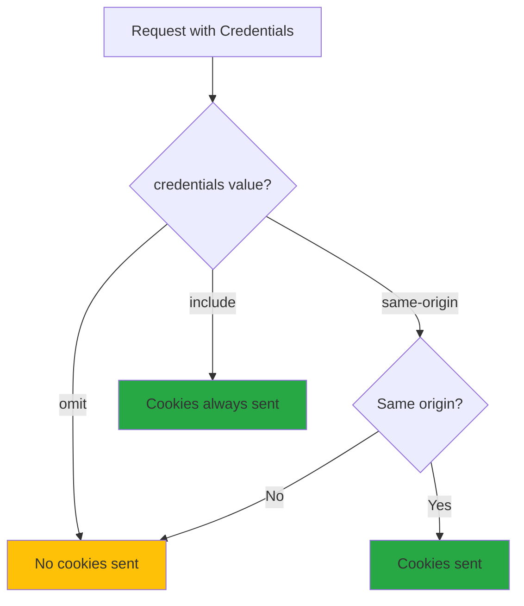
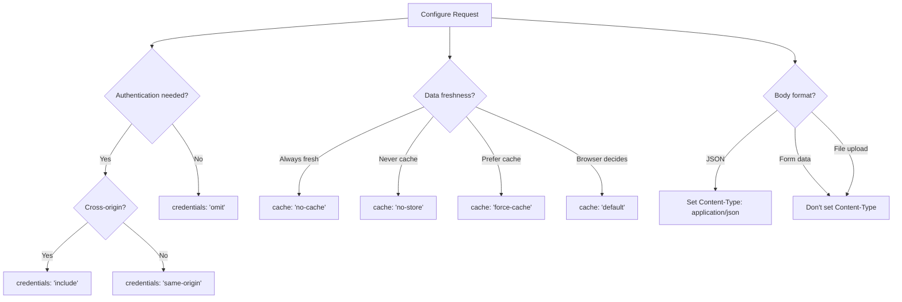

# Request Configuration

## Introduction

While the Fetch API's basic syntax is simple, its true power lies in the configuration options. Understanding how to properly configure requests—credentials, caching, CORS mode, and body formatting—is essential for building secure, performant applications.

This lesson dives deep into each configuration option, explaining when and why to use each setting. You'll learn how to handle authentication, optimize caching, upload files, and configure cross-origin requests correctly.

### What We'll Cover

- Credential handling and cookie management
- Request modes and CORS configuration
- Cache control strategies
- Body types and formatting
- Redirect and referrer policies
- Building a configurable request factory

### Prerequisites

- Understanding of [The Fetch API](./05-fetch-api.md)
- Understanding of [Headers & Content Types](./03-headers-content-types.md)
- Basic knowledge of cookies and authentication

---

## Credentials Configuration

The `credentials` option controls whether cookies and authentication headers are sent with the request:

```javascript
fetch('/api/data', {
  credentials: 'include'  // 'omit' | 'same-origin' | 'include'
});
```

### Credential Modes

| Value | Behavior | Use Case |
|-------|----------|----------|
| `omit` | Never send cookies or auth headers | Public APIs, anonymous requests |
| `same-origin` | Send only for same-origin requests | Default behavior |
| `include` | Always send, including cross-origin | Authenticated cross-origin APIs |



### Same-Origin (Default)

```javascript
// Cookies sent only to same origin
fetch('/api/user');  // ✅ Cookies sent

// Same origin, different port = different origin!
fetch('http://localhost:3001/api');  // ❌ No cookies (different port)
```

### Include for Cross-Origin Authentication

```javascript
// API on different domain needs authentication
fetch('https://api.myapp.com/user', {
  credentials: 'include'  // Send cookies cross-origin
});
```

> **Important:** When using `credentials: 'include'` with CORS, the server must respond with `Access-Control-Allow-Credentials: true` and cannot use `Access-Control-Allow-Origin: *`.

### Omit for Public APIs

```javascript
// No need to send authentication
fetch('https://api.github.com/repos/facebook/react', {
  credentials: 'omit'
});
```

---

## Request Mode

The `mode` option controls CORS behavior:

```javascript
fetch('/api/data', {
  mode: 'cors'  // 'cors' | 'no-cors' | 'same-origin'
});
```

### Mode Values

| Value | Behavior | Response Type |
|-------|----------|---------------|
| `cors` | Standard CORS | `cors` or `basic` |
| `no-cors` | Allows opaque response | `opaque` |
| `same-origin` | Fails if cross-origin | `basic` |

### CORS Mode (Default)

```javascript
// Standard cross-origin request
const response = await fetch('https://api.example.com/data', {
  mode: 'cors'
});

// Server must include CORS headers or request fails
```

### No-CORS Mode

Returns an "opaque" response where you can't read the data—useful only for side effects:

```javascript
// Fire-and-forget: tracking pixels, beacons
fetch('https://analytics.example.com/track', {
  mode: 'no-cors',
  method: 'POST',
  body: JSON.stringify({ event: 'page_view' })
});

// Response is opaque - can't read status or body
```

> **Warning:** `no-cors` responses are almost entirely inaccessible. You can't read the body, status, or most headers. Only use this for fire-and-forget requests.

### Same-Origin Mode

```javascript
// Fails immediately if cross-origin
try {
  await fetch('https://external-api.com/data', {
    mode: 'same-origin'
  });
} catch (error) {
  console.log('Cross-origin not allowed');
}
```

---

## Cache Configuration

The `cache` option controls how the request interacts with the HTTP cache:

```javascript
fetch('/api/data', {
  cache: 'no-cache'  // Various options
});
```

### Cache Modes

| Value | Behavior | Use Case |
|-------|----------|----------|
| `default` | Normal browser caching | General use |
| `no-store` | Never cache, never use cache | Sensitive data |
| `reload` | Ignore cache, store response | Force refresh |
| `no-cache` | Validate with server before using | Always fresh |
| `force-cache` | Use cache if available | Offline-first |
| `only-if-cached` | Only use cache, fail otherwise | Offline mode |

### Default Caching

```javascript
// Browser decides based on cache headers
fetch('/api/static-data');  // May use cached response
```

### Always Fresh Data

```javascript
// Always validate with server (304 or new data)
fetch('/api/user/profile', {
  cache: 'no-cache'
});
```

### Force Fresh Data

```javascript
// Ignore cache completely, fetch new data
fetch('/api/notifications', {
  cache: 'reload'
});
```

### Never Store Sensitive Data

```javascript
// Don't cache authentication or sensitive responses
fetch('/api/auth/session', {
  cache: 'no-store',
  credentials: 'include'
});
```

### Offline-First

```javascript
// Use cache if available
fetch('/api/articles', {
  cache: 'force-cache'
});

// Only cache, fail if not cached (useful with service workers)
fetch('/api/cached-data', {
  cache: 'only-if-cached',
  mode: 'same-origin'  // Required for only-if-cached
});
```

---

## Request Body

The `body` option accepts various types of data:

### JSON (Most Common)

```javascript
fetch('/api/users', {
  method: 'POST',
  headers: { 'Content-Type': 'application/json' },
  body: JSON.stringify({
    name: 'Alice',
    email: 'alice@example.com'
  })
});
```

### Form Data

```javascript
// Form submission
const formData = new FormData();
formData.append('username', 'alice');
formData.append('password', 'secret');

fetch('/api/login', {
  method: 'POST',
  body: formData  // Content-Type set automatically
});

// From a form element
const form = document.querySelector('form');
const formData = new FormData(form);
fetch('/api/submit', {
  method: 'POST',
  body: formData
});
```

> **Note:** Don't set Content-Type header when using FormData. The browser sets it automatically with the correct boundary string.

### File Upload

```javascript
// Single file
const fileInput = document.querySelector('input[type="file"]');
const formData = new FormData();
formData.append('file', fileInput.files[0]);

fetch('/api/upload', {
  method: 'POST',
  body: formData
});

// Multiple files
const files = fileInput.files;
const formData = new FormData();
for (const file of files) {
  formData.append('files', file);
}

fetch('/api/upload-multiple', {
  method: 'POST',
  body: formData
});
```

### URL-Encoded Data

```javascript
// Traditional form encoding
const params = new URLSearchParams();
params.append('grant_type', 'password');
params.append('username', 'alice');
params.append('password', 'secret');

fetch('/oauth/token', {
  method: 'POST',
  headers: { 
    'Content-Type': 'application/x-www-form-urlencoded' 
  },
  body: params
});
```

### Binary Data

```javascript
// ArrayBuffer
const buffer = new ArrayBuffer(1024);
// ... fill buffer with data
fetch('/api/binary', {
  method: 'POST',
  headers: { 'Content-Type': 'application/octet-stream' },
  body: buffer
});

// Blob
const blob = new Blob(['Hello, World!'], { type: 'text/plain' });
fetch('/api/blob', {
  method: 'POST',
  body: blob
});
```

### Streaming Request Body

```javascript
// ReadableStream as body (newer browsers)
const stream = new ReadableStream({
  start(controller) {
    controller.enqueue(new TextEncoder().encode('chunk 1'));
    controller.enqueue(new TextEncoder().encode('chunk 2'));
    controller.close();
  }
});

fetch('/api/stream', {
  method: 'POST',
  headers: { 'Content-Type': 'text/plain' },
  body: stream,
  duplex: 'half'  // Required for streaming
});
```

### Body Type Summary

| Type | Content-Type | Auto-Set Header |
|------|--------------|-----------------|
| `JSON.stringify()` | application/json | ❌ Manual |
| `FormData` | multipart/form-data | ✅ Automatic |
| `URLSearchParams` | application/x-www-form-urlencoded | ✅ Automatic |
| `Blob` | Blob's type | ✅ If blob has type |
| `ArrayBuffer` | — | ❌ Manual |
| `ReadableStream` | — | ❌ Manual |

---

## Redirect Handling

The `redirect` option controls how redirects (3xx responses) are handled:

```javascript
fetch('/old-url', {
  redirect: 'follow'  // 'follow' | 'manual' | 'error'
});
```

### Redirect Modes

| Value | Behavior | response.redirected |
|-------|----------|---------------------|
| `follow` | Automatically follow (default) | true if redirected |
| `manual` | Don't follow, return redirect | — |
| `error` | Throw on redirect | — |

### Auto-Follow (Default)

```javascript
const response = await fetch('/old-url', {
  redirect: 'follow'
});

// Final URL after all redirects
console.log(response.url);
console.log(response.redirected);  // true if redirected
```

### Manual Redirect Handling

```javascript
const response = await fetch('/short-link', {
  redirect: 'manual'
});

// Response type is 'opaqueredirect' - can't read location
// Useful for detecting redirects without following
if (response.type === 'opaqueredirect') {
  console.log('Would redirect');
}
```

### Error on Redirect

```javascript
try {
  await fetch('/url-that-redirects', {
    redirect: 'error'
  });
} catch (error) {
  console.log('Redirect attempted but not allowed');
}
```

---

## Referrer Policy

Controls what referrer information is sent with the request:

```javascript
fetch('/api/data', {
  referrerPolicy: 'strict-origin-when-cross-origin'
});
```

### Referrer Policy Values

| Value | Behavior |
|-------|----------|
| `no-referrer` | Never send referrer |
| `no-referrer-when-downgrade` | No referrer on HTTPS→HTTP |
| `origin` | Send only origin (no path) |
| `origin-when-cross-origin` | Full URL same-origin, origin cross-origin |
| `same-origin` | Referrer only for same-origin |
| `strict-origin` | Origin only, no downgrade |
| `strict-origin-when-cross-origin` | Default, most secure |
| `unsafe-url` | Always send full URL |

```javascript
// Don't reveal page URL to external APIs
fetch('https://api.external.com/data', {
  referrerPolicy: 'no-referrer'
});

// Send origin only
fetch('https://api.example.com/data', {
  referrerPolicy: 'origin'
  // Sends: Referer: https://myapp.com (no path)
});
```

---

## Integrity Checking

The `integrity` option enables Subresource Integrity (SRI) verification:

```javascript
fetch('https://cdn.example.com/library.js', {
  integrity: 'sha384-oqVuAfXRKap7fdgcCY5uykM6+R9GqQ8K/uxy9rx7HNQlGYl1kPzQho1wx4JwY8wC'
});
```

If the response doesn't match the hash, the request fails:

```javascript
try {
  await fetch('https://cdn.example.com/script.js', {
    integrity: 'sha256-abc123...'
  });
} catch (error) {
  console.log('Integrity check failed!');
}
```

---

## Keepalive

The `keepalive` option allows requests to outlive the page:

```javascript
// Send analytics before page unloads
window.addEventListener('beforeunload', () => {
  fetch('/api/analytics', {
    method: 'POST',
    body: JSON.stringify({ event: 'page_exit' }),
    keepalive: true  // Request continues even if page closes
  });
});
```

> **Note:** Keepalive requests have size limits (~64KB) and limited capabilities.

For analytics, prefer `navigator.sendBeacon()`:

```javascript
window.addEventListener('beforeunload', () => {
  navigator.sendBeacon('/api/analytics', JSON.stringify({
    event: 'page_exit',
    timestamp: Date.now()
  }));
});
```

---

## Priority Hints

The `priority` option hints at request importance:

```javascript
// High priority (above-the-fold content)
fetch('/api/critical-data', {
  priority: 'high'
});

// Low priority (prefetching)
fetch('/api/prefetch-data', {
  priority: 'low'
});
```

---

## Complete Configuration Example

```javascript
const response = await fetch('https://api.example.com/users', {
  // HTTP method
  method: 'POST',
  
  // Headers
  headers: {
    'Content-Type': 'application/json',
    'Accept': 'application/json',
    'Authorization': 'Bearer token123'
  },
  
  // Body
  body: JSON.stringify({ name: 'Alice' }),
  
  // Credentials (cookies)
  credentials: 'include',
  
  // CORS mode
  mode: 'cors',
  
  // Cache strategy
  cache: 'no-cache',
  
  // Redirect handling
  redirect: 'follow',
  
  // Referrer policy
  referrerPolicy: 'strict-origin-when-cross-origin',
  
  // Cancellation
  signal: AbortSignal.timeout(10000),
  
  // Priority
  priority: 'high'
});
```

---

## Configuration Decision Flow



---

## Request Factory Pattern

Build a configurable request factory for consistent API calls:

```javascript
function createRequestFactory(baseConfig = {}) {
  const defaultHeaders = new Headers(baseConfig.headers || {});
  
  return function createRequest(path, options = {}) {
    const url = `${baseConfig.baseUrl || ''}${path}`;
    
    // Merge headers
    const headers = new Headers(defaultHeaders);
    if (options.headers) {
      for (const [key, value] of new Headers(options.headers)) {
        headers.set(key, value);
      }
    }
    
    // Build config
    const config = {
      method: options.method || 'GET',
      headers,
      credentials: options.credentials || baseConfig.credentials || 'same-origin',
      mode: options.mode || baseConfig.mode || 'cors',
      cache: options.cache || baseConfig.cache || 'default',
      redirect: options.redirect || 'follow',
      signal: options.signal
    };
    
    // Add body for non-GET requests
    if (options.body && config.method !== 'GET') {
      if (typeof options.body === 'object' && !(options.body instanceof FormData)) {
        config.body = JSON.stringify(options.body);
        headers.set('Content-Type', 'application/json');
      } else {
        config.body = options.body;
      }
    }
    
    return new Request(url, config);
  };
}

// Usage
const createApiRequest = createRequestFactory({
  baseUrl: 'https://api.example.com',
  credentials: 'include',
  headers: {
    'Accept': 'application/json',
    'X-API-Version': '2'
  }
});

const request = createApiRequest('/users', {
  method: 'POST',
  body: { name: 'Alice' }
});

const response = await fetch(request);
```

---

## Best Practices

### 1. Explicit Credentials

```javascript
// ✅ DO: Be explicit about credentials
fetch('/api/user', { credentials: 'include' });

// ❌ DON'T: Assume default behavior
fetch('/api/user');  // May or may not send cookies
```

### 2. Appropriate Cache Strategy

```javascript
// ✅ DO: Match cache to data type
fetch('/api/user-settings', { cache: 'no-store' });  // Sensitive
fetch('/api/static-content', { cache: 'force-cache' });  // Rarely changes

// ❌ DON'T: Use same cache for everything
```

### 3. Don't Set Content-Type for FormData

```javascript
// ✅ DO: Let browser set Content-Type for FormData
fetch('/api/upload', {
  method: 'POST',
  body: formData  // Browser sets multipart/form-data with boundary
});

// ❌ DON'T: Manually set Content-Type for FormData
fetch('/api/upload', {
  method: 'POST',
  headers: { 'Content-Type': 'multipart/form-data' },  // Missing boundary!
  body: formData
});
```

### 4. Use Appropriate Mode

```javascript
// ✅ DO: Use 'cors' for APIs (allows reading response)
fetch('https://api.example.com/data', { mode: 'cors' });

// ✅ DO: Use 'no-cors' only for fire-and-forget
fetch('https://tracker.example.com/pixel.gif', { mode: 'no-cors' });
```

---

## Common Pitfalls

| ❌ Mistake | ✅ Solution |
|-----------|-------------|
| Setting Content-Type for FormData | Let browser set it automatically |
| Using `no-cors` expecting to read response | Use `cors` mode for readable responses |
| Forgetting `credentials: 'include'` | Always set explicitly for cross-origin auth |
| Using `cache: 'no-cache'` for sensitive data | Use `cache: 'no-store'` to prevent caching |
| Ignoring `redirect: 'follow'` behavior | Check `response.redirected` when relevant |

---

## Hands-on Exercise

### Your Task

Build a `RequestBuilder` class that uses the builder pattern to create fully configured fetch requests with a fluent, chainable API.

### Requirements

1. Support all common configuration options
2. Provide chainable methods (`.withAuth()`, `.asJson()`, etc.)
3. Handle query parameters
4. Support both sync config and async execution
5. Include TypeScript-friendly design (method returns this)

### Expected Result

```javascript
const request = new RequestBuilder('https://api.example.com')
  .path('/users')
  .method('POST')
  .withAuth('Bearer token123')
  .asJson({ name: 'Alice' })
  .withCredentials('include')
  .withTimeout(5000)
  .build();
```

<details>
<summary>💡 Hints (click to expand)</summary>

- Return `this` from each method for chaining
- Store configuration in instance properties
- Build the final Request object in `.build()`
- Consider adding `.fetch()` that builds and executes

</details>

<details>
<summary>✅ Solution (click to expand)</summary>

```javascript
class RequestBuilder {
  constructor(baseUrl = '') {
    this.baseUrl = baseUrl;
    this.pathSegment = '';
    this.queryParams = new URLSearchParams();
    this.config = {
      method: 'GET',
      headers: new Headers(),
      credentials: 'same-origin',
      mode: 'cors',
      cache: 'default',
      redirect: 'follow'
    };
    this.timeoutMs = null;
  }

  // URL configuration
  path(path) {
    this.pathSegment = path;
    return this;
  }

  query(params) {
    Object.entries(params).forEach(([key, value]) => {
      if (value !== undefined && value !== null) {
        this.queryParams.append(key, String(value));
      }
    });
    return this;
  }

  // Method configuration
  method(method) {
    this.config.method = method.toUpperCase();
    return this;
  }

  get() { return this.method('GET'); }
  post() { return this.method('POST'); }
  put() { return this.method('PUT'); }
  patch() { return this.method('PATCH'); }
  delete() { return this.method('DELETE'); }

  // Header configuration
  header(name, value) {
    this.config.headers.set(name, value);
    return this;
  }

  headers(headers) {
    Object.entries(headers).forEach(([key, value]) => {
      this.config.headers.set(key, value);
    });
    return this;
  }

  // Authentication
  withAuth(token) {
    if (token.startsWith('Bearer ') || token.startsWith('Basic ')) {
      this.config.headers.set('Authorization', token);
    } else {
      this.config.headers.set('Authorization', `Bearer ${token}`);
    }
    return this;
  }

  withBasicAuth(username, password) {
    const encoded = btoa(`${username}:${password}`);
    this.config.headers.set('Authorization', `Basic ${encoded}`);
    return this;
  }

  withApiKey(key, headerName = 'X-API-Key') {
    this.config.headers.set(headerName, key);
    return this;
  }

  // Body configuration
  asJson(data) {
    this.config.headers.set('Content-Type', 'application/json');
    this.config.headers.set('Accept', 'application/json');
    this.config.body = JSON.stringify(data);
    return this;
  }

  asFormData(data) {
    if (data instanceof FormData) {
      this.config.body = data;
    } else {
      const formData = new FormData();
      Object.entries(data).forEach(([key, value]) => {
        formData.append(key, value);
      });
      this.config.body = formData;
    }
    // Don't set Content-Type - browser will set with boundary
    return this;
  }

  asUrlEncoded(data) {
    const params = new URLSearchParams();
    Object.entries(data).forEach(([key, value]) => {
      params.append(key, String(value));
    });
    this.config.headers.set('Content-Type', 'application/x-www-form-urlencoded');
    this.config.body = params;
    return this;
  }

  body(data, contentType) {
    this.config.body = data;
    if (contentType) {
      this.config.headers.set('Content-Type', contentType);
    }
    return this;
  }

  // Behavior configuration
  withCredentials(mode = 'include') {
    this.config.credentials = mode;
    return this;
  }

  withMode(mode) {
    this.config.mode = mode;
    return this;
  }

  withCache(mode) {
    this.config.cache = mode;
    return this;
  }

  noCache() {
    this.config.cache = 'no-cache';
    return this;
  }

  noStore() {
    this.config.cache = 'no-store';
    return this;
  }

  withTimeout(ms) {
    this.timeoutMs = ms;
    return this;
  }

  withSignal(signal) {
    this.config.signal = signal;
    return this;
  }

  // Build URL
  buildUrl() {
    let url = `${this.baseUrl}${this.pathSegment}`;
    const queryString = this.queryParams.toString();
    if (queryString) {
      url += `?${queryString}`;
    }
    return url;
  }

  // Build Request object
  build() {
    const url = this.buildUrl();
    const config = { ...this.config };
    
    // Add timeout signal
    if (this.timeoutMs && !config.signal) {
      config.signal = AbortSignal.timeout(this.timeoutMs);
    }
    
    return new Request(url, config);
  }

  // Execute request
  async fetch() {
    const request = this.build();
    return fetch(request);
  }

  // Execute and parse JSON
  async fetchJson() {
    const response = await this.fetch();
    
    if (!response.ok) {
      const error = new Error(`HTTP ${response.status}`);
      error.response = response;
      throw error;
    }
    
    if (response.status === 204) {
      return null;
    }
    
    return response.json();
  }

  // Clone builder for variations
  clone() {
    const cloned = new RequestBuilder(this.baseUrl);
    cloned.pathSegment = this.pathSegment;
    cloned.queryParams = new URLSearchParams(this.queryParams);
    cloned.config = {
      ...this.config,
      headers: new Headers(this.config.headers)
    };
    cloned.timeoutMs = this.timeoutMs;
    return cloned;
  }
}

// Usage examples

// GET request
const users = await new RequestBuilder('https://api.example.com')
  .path('/users')
  .query({ page: 1, limit: 10 })
  .withAuth('token123')
  .withTimeout(5000)
  .fetchJson();

// POST request
const newUser = await new RequestBuilder('https://api.example.com')
  .path('/users')
  .post()
  .asJson({ name: 'Alice', email: 'alice@example.com' })
  .withCredentials('include')
  .fetchJson();

// File upload
const formData = new FormData();
formData.append('file', fileInput.files[0]);

const result = await new RequestBuilder('https://api.example.com')
  .path('/upload')
  .post()
  .asFormData(formData)
  .withAuth('token123')
  .fetchJson();

// Create reusable base builder
const apiBuilder = new RequestBuilder('https://api.example.com')
  .withAuth('token123')
  .withCredentials('include')
  .noCache();

// Clone and customize
const getUsers = await apiBuilder.clone()
  .path('/users')
  .fetchJson();

const createUser = await apiBuilder.clone()
  .path('/users')
  .post()
  .asJson({ name: 'Bob' })
  .fetchJson();
```

</details>

### Bonus Challenges

- [ ] Add retry configuration (`.withRetry(3, 1000)`)
- [ ] Support for request interceptors
- [ ] Add response transformation (`.transform(data => data.items)`)
- [ ] Implement request caching by URL

---

## Summary

✅ **credentials** controls cookie handling—use `include` for cross-origin auth

✅ **mode** controls CORS—use `cors` for readable responses

✅ **cache** controls HTTP caching—match strategy to data sensitivity

✅ **Don't set Content-Type for FormData**—browser sets it automatically

✅ **body** accepts JSON strings, FormData, Blobs, and more

✅ **redirect: 'follow'** is default—check `response.redirected` if needed

✅ **keepalive** allows requests to outlive the page (prefer `sendBeacon` for analytics)

✅ Use **factory patterns** for consistent request configuration

**Next:** [Response Handling](./07-response-handling.md)

---

## Further Reading

- [MDN: Fetch API Options](https://developer.mozilla.org/en-US/docs/Web/API/fetch#parameters) - Complete options reference
- [MDN: Request](https://developer.mozilla.org/en-US/docs/Web/API/Request) - Request object documentation
- [MDN: Using FormData](https://developer.mozilla.org/en-US/docs/Web/API/FormData/Using_FormData_Objects) - Form data guide

---

<!-- 
Sources Consulted:
- MDN fetch() Parameters: https://developer.mozilla.org/en-US/docs/Web/API/fetch#parameters
- MDN Request: https://developer.mozilla.org/en-US/docs/Web/API/Request
- MDN FormData: https://developer.mozilla.org/en-US/docs/Web/API/FormData
- MDN Cache modes: https://developer.mozilla.org/en-US/docs/Web/API/Request/cache
-->
