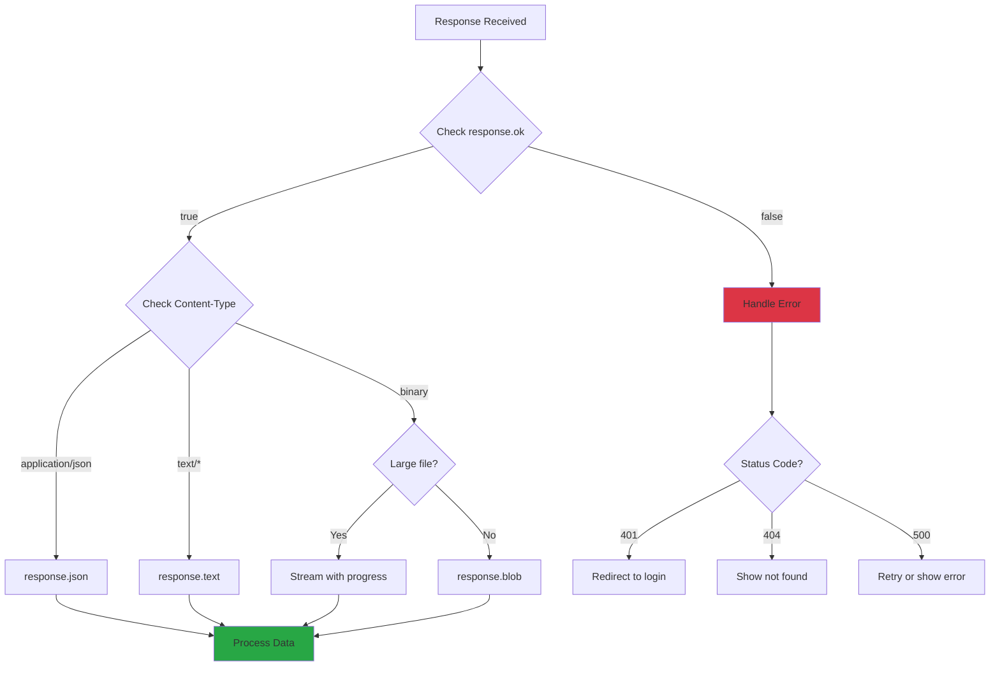

# Response Handling

## Introduction

Getting a response from the server is only half the battle—you need to properly parse, validate, and extract the data. Response handling encompasses reading different body formats, managing streaming data, handling errors gracefully, and optimizing for performance.

This lesson covers everything from basic JSON parsing to advanced streaming techniques, giving you the skills to handle any response your APIs throw at you.

### What We'll Cover

- Parsing different response formats (JSON, text, binary)
- Working with response streams
- Error handling patterns
- Response validation
- Progress tracking for large downloads
- Caching and memoization strategies

### Prerequisites

- Understanding of [The Fetch API](./05-fetch-api.md)
- Understanding of [Status Codes](./04-status-codes.md)
- JavaScript async/await and Promises

---

## Response Body Methods

The Response object provides several methods to read the body, each returning a Promise:

```javascript
const response = await fetch('/api/data');

// Parse as JSON
const json = await response.json();

// Read as text
const text = await response.text();

// Read as binary blob
const blob = await response.blob();

// Read as ArrayBuffer
const buffer = await response.arrayBuffer();

// Parse as FormData
const formData = await response.formData();
```

### Method Quick Reference

| Method | Returns | Use Case |
|--------|---------|----------|
| `.json()` | Object/Array | API responses, structured data |
| `.text()` | String | HTML, plain text, manual parsing |
| `.blob()` | Blob | Files, images, media |
| `.arrayBuffer()` | ArrayBuffer | Binary data processing |
| `.formData()` | FormData | Multipart form responses |

> **Important:** The body can only be read once! After calling any method, `response.bodyUsed` becomes `true` and calling again throws an error.

---

## JSON Responses

The most common response format for APIs:

```javascript
const response = await fetch('/api/users');

if (!response.ok) {
  throw new Error(`HTTP ${response.status}`);
}

const users = await response.json();
console.log(users);
```

### Safe JSON Parsing

```javascript
async function parseJsonSafe(response) {
  const text = await response.text();
  
  if (!text) {
    return null;  // Empty response
  }
  
  try {
    return JSON.parse(text);
  } catch (error) {
    console.error('Invalid JSON:', text.substring(0, 100));
    throw new Error('Response is not valid JSON');
  }
}

// Usage
const data = await parseJsonSafe(response);
```

### Handling Empty Responses

```javascript
async function fetchJson(url) {
  const response = await fetch(url);
  
  if (!response.ok) {
    throw new Error(`HTTP ${response.status}`);
  }
  
  // Handle 204 No Content
  if (response.status === 204) {
    return null;
  }
  
  // Check Content-Length
  const contentLength = response.headers.get('Content-Length');
  if (contentLength === '0') {
    return null;
  }
  
  return response.json();
}
```

### Verify Content-Type

```javascript
async function expectJson(response) {
  const contentType = response.headers.get('Content-Type');
  
  if (!contentType?.includes('application/json')) {
    const text = await response.text();
    throw new Error(`Expected JSON but got ${contentType}: ${text.substring(0, 100)}`);
  }
  
  return response.json();
}
```

---

## Text Responses

For HTML, XML, plain text, or when you need raw access:

```javascript
const response = await fetch('/page.html');
const html = await response.text();
document.getElementById('content').innerHTML = html;
```

### Parsing XML

```javascript
async function fetchXml(url) {
  const response = await fetch(url);
  const text = await response.text();
  
  const parser = new DOMParser();
  const doc = parser.parseFromString(text, 'application/xml');
  
  // Check for parse errors
  const parseError = doc.querySelector('parsererror');
  if (parseError) {
    throw new Error('Invalid XML');
  }
  
  return doc;
}

// Usage
const doc = await fetchXml('/data.xml');
const items = doc.querySelectorAll('item');
```

### Parsing CSV

```javascript
async function fetchCsv(url) {
  const response = await fetch(url);
  const text = await response.text();
  
  const lines = text.trim().split('\n');
  const headers = lines[0].split(',');
  
  return lines.slice(1).map(line => {
    const values = line.split(',');
    return headers.reduce((obj, header, i) => {
      obj[header.trim()] = values[i]?.trim();
      return obj;
    }, {});
  });
}

// Usage
const rows = await fetchCsv('/data.csv');
// [{ name: 'Alice', age: '30' }, { name: 'Bob', age: '25' }]
```

---

## Binary Responses

### Blob for Files

```javascript
async function downloadFile(url, filename) {
  const response = await fetch(url);
  const blob = await response.blob();
  
  // Create download link
  const downloadUrl = URL.createObjectURL(blob);
  const link = document.createElement('a');
  link.href = downloadUrl;
  link.download = filename;
  
  // Trigger download
  document.body.appendChild(link);
  link.click();
  document.body.removeChild(link);
  
  // Clean up
  URL.revokeObjectURL(downloadUrl);
}

// Usage
await downloadFile('/api/report.pdf', 'report.pdf');
```

### Display Images

```javascript
async function loadImage(url) {
  const response = await fetch(url);
  const blob = await response.blob();
  
  const img = document.createElement('img');
  img.src = URL.createObjectURL(blob);
  
  // Clean up when image loads
  img.onload = () => URL.revokeObjectURL(img.src);
  
  return img;
}
```

### ArrayBuffer for Processing

```javascript
async function processAudio(url) {
  const response = await fetch(url);
  const buffer = await response.arrayBuffer();
  
  const audioContext = new AudioContext();
  const audioBuffer = await audioContext.decodeAudioData(buffer);
  
  // Process audio...
  return audioBuffer;
}
```

---

## Streaming Responses

For large files or real-time data, process the response as it arrives:

```javascript
async function streamResponse(url) {
  const response = await fetch(url);
  const reader = response.body.getReader();
  const decoder = new TextDecoder();
  
  let result = '';
  
  while (true) {
    const { done, value } = await reader.read();
    
    if (done) break;
    
    const chunk = decoder.decode(value, { stream: true });
    result += chunk;
    console.log('Received:', chunk.length, 'bytes');
  }
  
  return result;
}
```

### Progress Tracking

```javascript
async function fetchWithProgress(url, onProgress) {
  const response = await fetch(url);
  
  // Get total size from header
  const contentLength = response.headers.get('Content-Length');
  const total = contentLength ? parseInt(contentLength) : 0;
  
  let loaded = 0;
  const reader = response.body.getReader();
  const chunks = [];
  
  while (true) {
    const { done, value } = await reader.read();
    
    if (done) break;
    
    chunks.push(value);
    loaded += value.length;
    
    if (total) {
      onProgress({
        loaded,
        total,
        percent: Math.round((loaded / total) * 100)
      });
    }
  }
  
  // Combine chunks
  const allChunks = new Uint8Array(loaded);
  let position = 0;
  for (const chunk of chunks) {
    allChunks.set(chunk, position);
    position += chunk.length;
  }
  
  return allChunks;
}

// Usage
const data = await fetchWithProgress('/large-file.zip', progress => {
  console.log(`Downloaded: ${progress.percent}%`);
  updateProgressBar(progress.percent);
});
```

### Streaming JSON Lines (NDJSON)

```javascript
async function* streamJsonLines(url) {
  const response = await fetch(url);
  const reader = response.body.getReader();
  const decoder = new TextDecoder();
  
  let buffer = '';
  
  while (true) {
    const { done, value } = await reader.read();
    
    if (done) break;
    
    buffer += decoder.decode(value, { stream: true });
    const lines = buffer.split('\n');
    
    // Process complete lines
    buffer = lines.pop();  // Keep incomplete line in buffer
    
    for (const line of lines) {
      if (line.trim()) {
        yield JSON.parse(line);
      }
    }
  }
  
  // Process remaining buffer
  if (buffer.trim()) {
    yield JSON.parse(buffer);
  }
}

// Usage
for await (const item of streamJsonLines('/api/stream')) {
  console.log('Received:', item);
  processItem(item);
}
```

### Server-Sent Events Style

```javascript
async function* streamEvents(url) {
  const response = await fetch(url);
  const reader = response.body.getReader();
  const decoder = new TextDecoder();
  
  let buffer = '';
  
  while (true) {
    const { done, value } = await reader.read();
    
    if (done) break;
    
    buffer += decoder.decode(value, { stream: true });
    
    // Parse SSE format
    const events = buffer.split('\n\n');
    buffer = events.pop();
    
    for (const eventText of events) {
      const event = parseSSE(eventText);
      if (event) yield event;
    }
  }
}

function parseSSE(text) {
  const event = {};
  
  for (const line of text.split('\n')) {
    if (line.startsWith('event:')) {
      event.type = line.slice(6).trim();
    } else if (line.startsWith('data:')) {
      event.data = line.slice(5).trim();
    } else if (line.startsWith('id:')) {
      event.id = line.slice(3).trim();
    }
  }
  
  return event.data ? event : null;
}
```

---

## Response Flow Diagram



---

## Error Handling

### Comprehensive Error Handler

```javascript
class ApiError extends Error {
  constructor(response, data) {
    super(data?.message || `HTTP ${response.status}`);
    this.name = 'ApiError';
    this.status = response.status;
    this.statusText = response.statusText;
    this.data = data;
    this.url = response.url;
  }
}

async function handleResponse(response) {
  // Network success - check HTTP status
  if (!response.ok) {
    let errorData;
    
    try {
      const contentType = response.headers.get('Content-Type');
      if (contentType?.includes('application/json')) {
        errorData = await response.json();
      } else {
        errorData = { message: await response.text() };
      }
    } catch {
      errorData = { message: response.statusText };
    }
    
    throw new ApiError(response, errorData);
  }
  
  // Handle empty response
  if (response.status === 204) {
    return { success: true, data: null };
  }
  
  // Parse based on content type
  const contentType = response.headers.get('Content-Type');
  
  if (contentType?.includes('application/json')) {
    return { success: true, data: await response.json() };
  }
  
  if (contentType?.includes('text/')) {
    return { success: true, data: await response.text() };
  }
  
  // Binary data
  return { success: true, data: await response.blob() };
}

// Usage
try {
  const { data } = await handleResponse(response);
  console.log('Success:', data);
} catch (error) {
  if (error instanceof ApiError) {
    console.log('API Error:', error.status, error.data);
  } else {
    console.log('Network Error:', error.message);
  }
}
```

### Error Recovery Patterns

```javascript
async function fetchWithFallback(primaryUrl, fallbackUrl) {
  try {
    const response = await fetch(primaryUrl);
    if (!response.ok) throw new Error('Primary failed');
    return response.json();
  } catch (primaryError) {
    console.warn('Primary failed, trying fallback:', primaryError);
    
    try {
      const response = await fetch(fallbackUrl);
      if (!response.ok) throw new Error('Fallback failed');
      return response.json();
    } catch (fallbackError) {
      throw new Error('Both primary and fallback failed');
    }
  }
}
```

---

## Response Validation

### Schema Validation

```javascript
function validateUser(data) {
  const errors = [];
  
  if (typeof data.id !== 'number') {
    errors.push('id must be a number');
  }
  
  if (typeof data.name !== 'string' || data.name.length === 0) {
    errors.push('name must be a non-empty string');
  }
  
  if (typeof data.email !== 'string' || !data.email.includes('@')) {
    errors.push('email must be valid');
  }
  
  if (errors.length > 0) {
    throw new Error(`Validation failed: ${errors.join(', ')}`);
  }
  
  return data;
}

async function fetchUser(id) {
  const response = await fetch(`/api/users/${id}`);
  if (!response.ok) throw new Error(`HTTP ${response.status}`);
  
  const data = await response.json();
  return validateUser(data);
}
```

### With Type Guards (TypeScript Pattern)

```javascript
function isUser(data) {
  return (
    typeof data === 'object' &&
    data !== null &&
    typeof data.id === 'number' &&
    typeof data.name === 'string' &&
    typeof data.email === 'string'
  );
}

function isUserArray(data) {
  return Array.isArray(data) && data.every(isUser);
}

async function fetchUsers() {
  const response = await fetch('/api/users');
  const data = await response.json();
  
  if (!isUserArray(data)) {
    throw new Error('Invalid response format');
  }
  
  return data;
}
```

---

## Response Cloning

Clone responses when you need to read the body multiple times:

```javascript
const response = await fetch('/api/data');

// Clone before reading
const clone = response.clone();

// Read original as JSON
const json = await response.json();

// Read clone as text (for logging)
const text = await clone.text();
console.log('Raw response:', text);
```

### Logging Middleware

```javascript
async function fetchWithLogging(url, options) {
  const response = await fetch(url, options);
  const clone = response.clone();
  
  // Log response
  console.log('Response:', {
    url: response.url,
    status: response.status,
    headers: Object.fromEntries(response.headers),
    body: await clone.text()
  });
  
  return response;
}
```

---

## Caching Responses

### Simple In-Memory Cache

```javascript
const cache = new Map();

async function cachedFetch(url, options = {}) {
  const cacheKey = `${options.method || 'GET'}:${url}`;
  
  // Check cache
  if (cache.has(cacheKey)) {
    const { data, timestamp } = cache.get(cacheKey);
    const age = Date.now() - timestamp;
    
    if (age < 60000) {  // 1 minute TTL
      console.log('Cache hit:', cacheKey);
      return data;
    }
    
    cache.delete(cacheKey);
  }
  
  // Fetch fresh data
  const response = await fetch(url, options);
  if (!response.ok) throw new Error(`HTTP ${response.status}`);
  
  const data = await response.json();
  
  // Cache result
  cache.set(cacheKey, {
    data,
    timestamp: Date.now()
  });
  
  return data;
}
```

### Cache with ETag

```javascript
const etagCache = new Map();

async function fetchWithEtag(url) {
  const cached = etagCache.get(url);
  
  const headers = {};
  if (cached?.etag) {
    headers['If-None-Match'] = cached.etag;
  }
  
  const response = await fetch(url, { headers });
  
  // 304 Not Modified - use cached data
  if (response.status === 304 && cached) {
    console.log('Using cached data (304)');
    return cached.data;
  }
  
  if (!response.ok) {
    throw new Error(`HTTP ${response.status}`);
  }
  
  const data = await response.json();
  const etag = response.headers.get('ETag');
  
  if (etag) {
    etagCache.set(url, { data, etag });
  }
  
  return data;
}
```

---

## Response Transformation

### Data Normalization

```javascript
function normalizeUser(apiUser) {
  return {
    id: apiUser.id,
    fullName: `${apiUser.first_name} ${apiUser.last_name}`,
    email: apiUser.email_address,
    createdAt: new Date(apiUser.created_at),
    avatar: apiUser.profile_image_url || '/default-avatar.png'
  };
}

async function fetchUsers() {
  const response = await fetch('/api/users');
  const { data } = await response.json();
  
  return data.map(normalizeUser);
}
```

### Pagination Handling

```javascript
async function* fetchAllPages(baseUrl) {
  let page = 1;
  let hasMore = true;
  
  while (hasMore) {
    const response = await fetch(`${baseUrl}?page=${page}`);
    const data = await response.json();
    
    yield* data.items;
    
    hasMore = data.hasNextPage;
    page++;
  }
}

// Usage
const allUsers = [];
for await (const user of fetchAllPages('/api/users')) {
  allUsers.push(user);
}
```

---

## Best Practices

### 1. Always Check response.ok

```javascript
// ✅ DO
const response = await fetch(url);
if (!response.ok) {
  throw new Error(`HTTP ${response.status}`);
}
const data = await response.json();

// ❌ DON'T
const data = await fetch(url).then(r => r.json());
```

### 2. Verify Content-Type

```javascript
// ✅ DO
const contentType = response.headers.get('Content-Type');
if (!contentType?.includes('application/json')) {
  throw new Error(`Unexpected content type: ${contentType}`);
}

// ❌ DON'T
const data = await response.json();  // May fail on HTML error page
```

### 3. Handle Empty Responses

```javascript
// ✅ DO
if (response.status === 204) {
  return null;
}
return response.json();

// ❌ DON'T
return response.json();  // Throws on empty body
```

### 4. Clone Before Multiple Reads

```javascript
// ✅ DO
const clone = response.clone();
const json = await response.json();
const text = await clone.text();

// ❌ DON'T
const json = await response.json();
const text = await response.text();  // Error: body already used
```

---

## Common Pitfalls

| ❌ Mistake | ✅ Solution |
|-----------|-------------|
| Reading body twice | Clone response before first read |
| Not checking response.ok | Always verify before parsing |
| Parsing 204 as JSON | Check status before calling .json() |
| Ignoring Content-Type | Verify expected format |
| Not handling parse errors | Wrap .json() in try-catch |
| Memory leaks with Blob URLs | Call URL.revokeObjectURL() |

---

## Hands-on Exercise

### Your Task

Build a `ResponseHandler` class that provides robust response parsing with validation, transformation, caching, and error handling.

### Requirements

1. Parse responses based on Content-Type
2. Validate response data against a schema
3. Transform data with customizable normalizers
4. Cache responses with TTL support
5. Provide detailed error information

### Expected Result

```javascript
const handler = new ResponseHandler()
  .expectJson()
  .validate(userSchema)
  .transform(normalizeUser)
  .cache({ ttl: 60000 });

const users = await handler.handle(response);
```

<details>
<summary>💡 Hints (click to expand)</summary>

- Use a builder pattern for configuration
- Store validation and transform functions
- Create a cache key from the response URL
- Return both raw and transformed data for debugging

</details>

<details>
<summary>✅ Solution (click to expand)</summary>

```javascript
class ResponseHandler {
  constructor() {
    this.expectedType = null;
    this.validator = null;
    this.transformer = null;
    this.cacheConfig = null;
    this.cache = new Map();
  }

  // Configuration methods
  expectJson() {
    this.expectedType = 'application/json';
    return this;
  }

  expectText() {
    this.expectedType = 'text/';
    return this;
  }

  expectBlob() {
    this.expectedType = 'blob';
    return this;
  }

  validate(schema) {
    if (typeof schema === 'function') {
      this.validator = schema;
    } else {
      this.validator = (data) => this.validateObject(data, schema);
    }
    return this;
  }

  transform(fn) {
    this.transformer = fn;
    return this;
  }

  cache(options = {}) {
    this.cacheConfig = {
      ttl: options.ttl || 60000,
      key: options.key || null
    };
    return this;
  }

  // Main handler
  async handle(response) {
    // Check cache first
    if (this.cacheConfig) {
      const cached = this.getFromCache(response.url);
      if (cached) {
        return { success: true, data: cached, fromCache: true };
      }
    }

    // Check response status
    if (!response.ok) {
      return this.handleError(response);
    }

    // Handle empty response
    if (response.status === 204) {
      return { success: true, data: null };
    }

    // Verify content type
    const contentType = response.headers.get('Content-Type') || '';
    if (this.expectedType && !contentType.includes(this.expectedType)) {
      throw new Error(`Expected ${this.expectedType} but got ${contentType}`);
    }

    // Parse response
    let rawData = await this.parseBody(response, contentType);

    // Validate
    if (this.validator) {
      const validation = this.validator(rawData);
      if (validation !== true && typeof validation === 'object') {
        throw new Error(`Validation failed: ${JSON.stringify(validation)}`);
      }
    }

    // Transform
    let data = rawData;
    if (this.transformer) {
      data = Array.isArray(rawData)
        ? rawData.map(this.transformer)
        : this.transformer(rawData);
    }

    // Cache result
    if (this.cacheConfig) {
      this.setInCache(response.url, data);
    }

    return {
      success: true,
      data,
      raw: rawData,
      headers: Object.fromEntries(response.headers)
    };
  }

  async parseBody(response, contentType) {
    if (contentType.includes('application/json')) {
      return response.json();
    }
    if (contentType.includes('text/')) {
      return response.text();
    }
    return response.blob();
  }

  async handleError(response) {
    let errorData = {};

    try {
      const contentType = response.headers.get('Content-Type') || '';
      if (contentType.includes('application/json')) {
        errorData = await response.json();
      } else {
        errorData = { message: await response.text() };
      }
    } catch {
      errorData = { message: response.statusText };
    }

    const error = new Error(errorData.message || `HTTP ${response.status}`);
    error.status = response.status;
    error.statusText = response.statusText;
    error.data = errorData;
    error.url = response.url;

    throw error;
  }

  validateObject(data, schema) {
    const errors = [];

    for (const [key, rules] of Object.entries(schema)) {
      const value = data[key];

      if (rules.required && (value === undefined || value === null)) {
        errors.push(`${key} is required`);
        continue;
      }

      if (value !== undefined && rules.type) {
        const actualType = Array.isArray(value) ? 'array' : typeof value;
        if (actualType !== rules.type) {
          errors.push(`${key} must be ${rules.type}`);
        }
      }

      if (rules.validate && !rules.validate(value)) {
        errors.push(`${key} failed validation`);
      }
    }

    return errors.length > 0 ? errors : true;
  }

  getFromCache(url) {
    const key = this.cacheConfig.key || url;
    const cached = this.cache.get(key);

    if (!cached) return null;

    const age = Date.now() - cached.timestamp;
    if (age > this.cacheConfig.ttl) {
      this.cache.delete(key);
      return null;
    }

    return cached.data;
  }

  setInCache(url, data) {
    const key = this.cacheConfig.key || url;
    this.cache.set(key, {
      data,
      timestamp: Date.now()
    });
  }

  clearCache() {
    this.cache.clear();
    return this;
  }

  // Create new handler with same config
  clone() {
    const handler = new ResponseHandler();
    handler.expectedType = this.expectedType;
    handler.validator = this.validator;
    handler.transformer = this.transformer;
    handler.cacheConfig = this.cacheConfig ? { ...this.cacheConfig } : null;
    return handler;
  }
}

// Usage example

// Define schema
const userSchema = {
  id: { required: true, type: 'number' },
  name: { required: true, type: 'string' },
  email: { required: true, type: 'string', validate: v => v.includes('@') }
};

// Define transformer
const normalizeUser = (user) => ({
  id: user.id,
  displayName: user.name,
  email: user.email.toLowerCase(),
  avatar: user.avatar_url || '/default.png'
});

// Create handler
const userHandler = new ResponseHandler()
  .expectJson()
  .validate(userSchema)
  .transform(normalizeUser)
  .cache({ ttl: 30000 });

// Use handler
async function getUser(id) {
  const response = await fetch(`/api/users/${id}`);
  const result = await userHandler.handle(response);
  
  console.log('User:', result.data);
  console.log('From cache:', result.fromCache);
  
  return result.data;
}

// List handler (reuse config)
const usersHandler = userHandler.clone();

async function getUsers() {
  const response = await fetch('/api/users');
  const result = await usersHandler.handle(response);
  
  return result.data;  // Array of normalized users
}
```

</details>

### Bonus Challenges

- [ ] Add pagination support (automatically fetch all pages)
- [ ] Implement response deduplication (prevent parallel fetches for same URL)
- [ ] Add retry logic for failed validations (refetch once)
- [ ] Support streaming with progress callbacks

---

## Summary

✅ **response.json(), .text(), .blob()** parse body in different formats

✅ **Body can only be read once**—clone response for multiple reads

✅ **Check Content-Type** before parsing to avoid errors

✅ **Handle 204 No Content** separately—no body to parse

✅ **Streaming** enables progress tracking and memory-efficient processing

✅ **Validate responses** to catch API changes early

✅ **Transform data** to normalize API responses

✅ **Cache responses** to reduce network requests

**Next:** [CORS](./08-cors.md)

---

## Further Reading

- [MDN: Response](https://developer.mozilla.org/en-US/docs/Web/API/Response) - Response object reference
- [MDN: ReadableStream](https://developer.mozilla.org/en-US/docs/Web/API/ReadableStream) - Streaming API
- [MDN: Streams API](https://developer.mozilla.org/en-US/docs/Web/API/Streams_API) - Complete streams guide

---

<!-- 
Sources Consulted:
- MDN Response: https://developer.mozilla.org/en-US/docs/Web/API/Response
- MDN ReadableStream: https://developer.mozilla.org/en-US/docs/Web/API/ReadableStream
- MDN Using Fetch: https://developer.mozilla.org/en-US/docs/Web/API/Fetch_API/Using_Fetch
- MDN Streams API: https://developer.mozilla.org/en-US/docs/Web/API/Streams_API
-->
