# Cross-Origin Resource Sharing (CORS)

## Introduction

CORS is a security mechanism that controls how web pages can request resources from different origins. Understanding CORS is essential because almost every modern web application fetches data from APIs on different domains—and CORS errors are among the most common issues developers face.

This lesson explains why CORS exists, how it works, what the different headers mean, and how to handle CORS correctly in your applications.

### What We'll Cover

- The Same-Origin Policy and why it exists
- How CORS works (simple vs. preflight requests)
- CORS headers and their meanings
- Common CORS errors and how to fix them
- Handling CORS in frontend code
- Credentials and cookies with CORS

### Prerequisites

- Understanding of [The Fetch API](./05-fetch-api.md)
- Understanding of [Headers & Content Types](./03-headers-content-types.md)
- Basic understanding of HTTP requests

---

## The Same-Origin Policy

Browsers enforce the Same-Origin Policy (SOP) to prevent malicious websites from accessing data on other sites. Two URLs have the same origin if they share the same:

- **Protocol** (http vs https)
- **Host** (domain name)
- **Port** (80, 443, 3000, etc.)


### Origin Examples

| URL | Same origin as `https://myapp.com`? | Reason |
|-----|-------------------------------------|--------|
| `https://myapp.com/page` | ✅ Yes | Same protocol, host, port |
| `https://myapp.com:443/api` | ✅ Yes | Port 443 is default for HTTPS |
| `http://myapp.com/api` | ❌ No | Different protocol |
| `https://api.myapp.com/data` | ❌ No | Different subdomain |
| `https://myapp.com:3000/api` | ❌ No | Different port |
| `https://other-site.com/api` | ❌ No | Different domain |

### Why Same-Origin Policy Exists

Without SOP, a malicious page could:

1. User visits evil.com while logged into bank.com
2. evil.com makes fetch requests to bank.com/api/accounts
3. Browser sends bank.com cookies automatically
4. evil.com reads the user's bank data

SOP prevents step 4—the browser blocks evil.com from reading bank.com responses.

---

## How CORS Works

CORS is the mechanism that allows controlled cross-origin requests. The server explicitly tells the browser which origins can access its resources.

### Simple Requests

Some requests are "simple" and don't require a preflight check:

**Simple request criteria:**
- Methods: GET, HEAD, or POST
- Headers: Only Accept, Accept-Language, Content-Language, Content-Type
- Content-Type: Only text/plain, multipart/form-data, or application/x-www-form-urlencoded

```javascript
// This is a simple request
fetch('https://api.example.com/data', {
  method: 'GET'
});
```

**Simple request flow:**


### Preflight Requests

Complex requests require a preflight—an OPTIONS request to check if the actual request is allowed:

**Triggers for preflight:**
- Methods other than GET, HEAD, POST
- Custom headers (Authorization, X-API-Key, etc.)
- Content-Type: application/json
- Any header outside the "simple" list

```javascript
// This triggers a preflight
fetch('https://api.example.com/data', {
  method: 'POST',
  headers: {
    'Content-Type': 'application/json',  // Triggers preflight
    'Authorization': 'Bearer token'       // Also triggers preflight
  },
  body: JSON.stringify({ name: 'Alice' })
});
```

**Preflight flow:**


---

## CORS Headers

### Response Headers

| Header | Purpose | Example |
|--------|---------|---------|
| `Access-Control-Allow-Origin` | Allowed origins | `*` or `https://myapp.com` |
| `Access-Control-Allow-Methods` | Allowed HTTP methods | `GET, POST, PUT, DELETE` |
| `Access-Control-Allow-Headers` | Allowed request headers | `Content-Type, Authorization` |
| `Access-Control-Allow-Credentials` | Allow cookies | `true` |
| `Access-Control-Max-Age` | Preflight cache time (seconds) | `86400` |
| `Access-Control-Expose-Headers` | Headers browser can read | `X-Total-Count` |

### Request Headers (Set by Browser)

| Header | Purpose | Example |
|--------|---------|---------|
| `Origin` | Request origin | `https://myapp.com` |
| `Access-Control-Request-Method` | Method for actual request | `POST` |
| `Access-Control-Request-Headers` | Headers for actual request | `Content-Type, Authorization` |

### Access-Control-Allow-Origin

The most important CORS header. Specifies which origins can access the resource:

```http
# Allow any origin
Access-Control-Allow-Origin: *

# Allow specific origin
Access-Control-Allow-Origin: https://myapp.com
```

> **Important:** You cannot use `*` with `credentials: 'include'`. Must specify the exact origin.

### Access-Control-Allow-Credentials

Required for requests with cookies or auth headers:

```http
Access-Control-Allow-Origin: https://myapp.com
Access-Control-Allow-Credentials: true
```

```javascript
// Frontend must also set credentials
fetch('https://api.example.com/user', {
  credentials: 'include'  // Required to send cookies
});
```

### Access-Control-Expose-Headers

By default, browsers only expose "simple" response headers. To access custom headers:

```http
Access-Control-Expose-Headers: X-Total-Count, X-Request-Id
```

```javascript
const response = await fetch('https://api.example.com/users');
// Without Expose-Headers, these would be null
const total = response.headers.get('X-Total-Count');
const requestId = response.headers.get('X-Request-Id');
```

---

## Common CORS Errors

### Error: No 'Access-Control-Allow-Origin' Header

```
Access to fetch at 'https://api.example.com' from origin 'https://myapp.com' 
has been blocked by CORS policy: No 'Access-Control-Allow-Origin' header is 
present on the requested resource.
```

**Cause:** Server doesn't include CORS headers.

**Fix:** Server must add:
```http
Access-Control-Allow-Origin: https://myapp.com
```

### Error: Origin Not Allowed

```
Access to fetch at 'https://api.example.com' from origin 'https://myapp.com' 
has been blocked by CORS policy: The 'Access-Control-Allow-Origin' header has 
a value 'https://other-site.com' that is not equal to the supplied origin.
```

**Cause:** Server allows a different origin.

**Fix:** Server must allow your origin or use `*`.

### Error: Method Not Allowed

```
Access to fetch at 'https://api.example.com' from origin 'https://myapp.com' 
has been blocked by CORS policy: Method DELETE is not allowed by 
Access-Control-Allow-Methods in preflight response.
```

**Cause:** Preflight response doesn't allow the HTTP method.

**Fix:** Server must include the method:
```http
Access-Control-Allow-Methods: GET, POST, PUT, DELETE
```

### Error: Header Not Allowed

```
Access to fetch at 'https://api.example.com' from origin 'https://myapp.com' 
has been blocked by CORS policy: Request header field x-api-key is not 
allowed by Access-Control-Allow-Headers in preflight response.
```

**Cause:** Custom header not allowed in preflight.

**Fix:** Server must include the header:
```http
Access-Control-Allow-Headers: Content-Type, Authorization, X-API-Key
```

### Error: Credentials with Wildcard

```
Access to fetch at 'https://api.example.com' from origin 'https://myapp.com' 
has been blocked by CORS policy: The value of the 'Access-Control-Allow-Origin' 
header in the response must not be the wildcard '*' when the request's 
credentials mode is 'include'.
```

**Cause:** Using `credentials: 'include'` with `Access-Control-Allow-Origin: *`.

**Fix:** Server must specify the exact origin:
```http
Access-Control-Allow-Origin: https://myapp.com
Access-Control-Allow-Credentials: true
```

---

## CORS Decision Flow

```mermaid
flowchart TD
    A[Cross-Origin Request] --> B{Simple Request?}
    
    B -->|Yes| C[Send request with Origin header]
    B -->|No| D[Send OPTIONS preflight]
    
    D --> E{Preflight allowed?}
    E -->|No| F[CORS Error]
    E -->|Yes| C
    
    C --> G{Response has ACAO header?}
    G -->|No| F
    G -->|Yes| H{Origin matches or *?}
    
    H -->|No| F
    H -->|Yes| I{Credentials needed?}
    
    I -->|No| J[✅ Success]
    I -->|Yes| K{ACAC: true AND<br/>not wildcard?}
    
    K -->|No| F
    K -->|Yes| J
    
    style F fill:#dc3545
    style J fill:#28a745
```



---

## Handling CORS in Frontend Code

### Basic Cross-Origin Request

```javascript
// Simple GET request
const response = await fetch('https://api.example.com/data');
const data = await response.json();
```

### With Authentication

```javascript
// With credentials (cookies, auth headers)
const response = await fetch('https://api.example.com/user', {
  credentials: 'include',  // Send cookies
  headers: {
    'Authorization': 'Bearer token123'
  }
});
```

### Handling CORS Errors

```javascript
async function fetchCrossDomain(url, options = {}) {
  try {
    const response = await fetch(url, options);
    return response;
  } catch (error) {
    // Network errors include CORS failures
    if (error instanceof TypeError) {
      console.error('Network or CORS error:', error.message);
      
      // Check if it's likely a CORS issue
      if (error.message.includes('Failed to fetch')) {
        throw new Error(
          'Request blocked. This may be a CORS issue. ' +
          'Check that the server allows requests from this origin.'
        );
      }
    }
    throw error;
  }
}
```

### Detecting CORS Issues

```javascript
async function checkCors(url) {
  try {
    // Try a simple HEAD request
    const response = await fetch(url, { method: 'HEAD' });
    console.log('CORS allowed:', response.ok);
    return true;
  } catch (error) {
    console.log('CORS blocked or network error');
    return false;
  }
}
```

---

## CORS with Different Request Types

### GET Request

```javascript
// Usually works without issues (if server allows origin)
fetch('https://api.example.com/data');
```

### POST with JSON (Preflight)

```javascript
// Triggers preflight due to Content-Type
fetch('https://api.example.com/users', {
  method: 'POST',
  headers: { 'Content-Type': 'application/json' },
  body: JSON.stringify({ name: 'Alice' })
});
```

### Form Data (No Preflight)

```javascript
// No preflight - uses "simple" content type
const formData = new FormData();
formData.append('name', 'Alice');

fetch('https://api.example.com/users', {
  method: 'POST',
  body: formData  // multipart/form-data - no preflight
});
```

### With Custom Headers (Preflight)

```javascript
// Custom header triggers preflight
fetch('https://api.example.com/data', {
  headers: {
    'X-API-Key': 'secret123'
  }
});
```

---

## CORS Proxy Solutions

When you can't modify the server, use a proxy:

### Development Proxy

```javascript
// vite.config.js
export default {
  server: {
    proxy: {
      '/api': {
        target: 'https://external-api.com',
        changeOrigin: true,
        rewrite: (path) => path.replace(/^\/api/, '')
      }
    }
  }
};

// Now fetch from /api instead of external-api.com
fetch('/api/data');  // Proxied to https://external-api.com/data
```

### Production CORS Proxy

```javascript
// Use your own backend as a proxy
// Frontend
fetch('/api/proxy?url=https://external-api.com/data');

// Backend (Node.js/Express)
app.get('/api/proxy', async (req, res) => {
  const response = await fetch(req.query.url);
  const data = await response.json();
  res.json(data);
});
```

> **Warning:** Public CORS proxies (cors-anywhere, etc.) should only be used for development. They're unreliable and may expose data.

---

## CORS and Caching

Preflight responses can be cached to improve performance:

```http
Access-Control-Max-Age: 86400
```

This tells the browser to cache the preflight result for 24 hours.

### Cache Considerations

```javascript
// Browser caches preflight by:
// - Origin
// - URL
// - Request method
// - Request headers

// Different headers = different preflight
fetch('/api', { headers: { 'X-Header-1': 'a' } });  // Preflight 1
fetch('/api', { headers: { 'X-Header-2': 'b' } });  // Preflight 2
```

---

## Best Practices

### 1. Be Specific with Origins

```http
# ✅ DO: Specify exact origins
Access-Control-Allow-Origin: https://myapp.com

# ❌ DON'T: Use wildcard for authenticated APIs
Access-Control-Allow-Origin: *
```

### 2. Only Allow Needed Methods

```http
# ✅ DO: Only allow methods your API uses
Access-Control-Allow-Methods: GET, POST

# ❌ DON'T: Allow everything
Access-Control-Allow-Methods: *
```

### 3. Avoid Wildcard with Credentials

```http
# ❌ This doesn't work
Access-Control-Allow-Origin: *
Access-Control-Allow-Credentials: true

# ✅ This works
Access-Control-Allow-Origin: https://myapp.com
Access-Control-Allow-Credentials: true
```

### 4. Expose Only Necessary Headers

```http
# ✅ DO: Only expose headers frontend needs
Access-Control-Expose-Headers: X-Total-Count

# ❌ DON'T: Expose sensitive headers
Access-Control-Expose-Headers: X-Internal-Debug-Info
```

### 5. Use Max-Age for Performance

```http
# Cache preflight for 24 hours
Access-Control-Max-Age: 86400
```

---

## Common Pitfalls

| ❌ Mistake | ✅ Solution |
|-----------|-------------|
| Using `*` with credentials | Specify exact origin |
| Not allowing all needed headers | Include all custom headers in Allow-Headers |
| Forgetting OPTIONS method | Handle OPTIONS preflight requests |
| Not exposing custom headers | Use Access-Control-Expose-Headers |
| Blocking preflight in auth middleware | Allow OPTIONS without auth |
| Assuming CORS is a security feature | It's for browser enforcement only |

---

## CORS Security Notes

> **Important:** CORS is browser-enforced. It does NOT protect your API from non-browser clients (curl, Postman, scripts).

```bash
# This works regardless of CORS headers
curl https://api.example.com/data
```

**CORS protects:**
- Users from malicious websites reading their data

**CORS does NOT protect:**
- Your API from direct access
- Against server-side attacks
- Against CSRF (use CSRF tokens for that)

---

## Hands-on Exercise

### Your Task

Build a `CorsDebugger` utility that helps diagnose CORS issues by:
1. Testing if an endpoint allows cross-origin requests
2. Checking which methods are allowed
3. Checking which headers are allowed
4. Reporting detailed diagnostics

### Requirements

1. Test simple GET request
2. Test preflight for different methods
3. Test preflight for different headers
4. Return detailed diagnostic information
5. Handle errors gracefully

### Expected Result

```javascript
const result = await CorsDebugger.diagnose('https://api.example.com/data');
console.log(result);
// {
//   url: 'https://api.example.com/data',
//   allowsOrigin: true,
//   allowedOrigin: 'https://myapp.com',
//   allowedMethods: ['GET', 'POST', 'PUT', 'DELETE'],
//   allowedHeaders: ['Content-Type', 'Authorization'],
//   allowsCredentials: true,
//   maxAge: 86400,
//   issues: []
// }
```

<details>
<summary>💡 Hints (click to expand)</summary>

- Use OPTIONS request to check preflight
- Parse CORS headers from response
- Test each method individually if needed
- Catch and categorize different error types

</details>

<details>
<summary>✅ Solution (click to expand)</summary>

```javascript
class CorsDebugger {
  static async diagnose(url, options = {}) {
    const result = {
      url,
      timestamp: new Date().toISOString(),
      origin: window.location.origin,
      allowsOrigin: false,
      allowedOrigin: null,
      allowedMethods: [],
      allowedHeaders: [],
      exposedHeaders: [],
      allowsCredentials: false,
      maxAge: null,
      issues: [],
      tests: []
    };

    // Test 1: Simple GET
    await this.testSimpleGet(url, result);

    // Test 2: Preflight for common methods
    await this.testPreflight(url, result, options);

    // Analyze results
    this.analyzeResults(result);

    return result;
  }

  static async testSimpleGet(url, result) {
    const test = {
      name: 'Simple GET Request',
      success: false,
      error: null
    };

    try {
      const response = await fetch(url, { method: 'GET' });
      
      test.status = response.status;
      test.success = true;
      
      // Check CORS headers
      result.allowedOrigin = response.headers.get('Access-Control-Allow-Origin');
      result.allowsOrigin = result.allowedOrigin === '*' || 
                            result.allowedOrigin === window.location.origin;
      
      if (!result.allowsOrigin && result.allowedOrigin) {
        result.issues.push({
          type: 'origin_mismatch',
          message: `Origin ${window.location.origin} not allowed. Server allows: ${result.allowedOrigin}`
        });
      }
      
    } catch (error) {
      test.error = error.message;
      
      if (error.message.includes('Failed to fetch')) {
        result.issues.push({
          type: 'blocked',
          message: 'Request blocked - likely CORS or network error'
        });
      }
    }

    result.tests.push(test);
  }

  static async testPreflight(url, result, options) {
    const methodsToTest = options.methods || ['GET', 'POST', 'PUT', 'DELETE', 'PATCH'];
    const headersToTest = options.headers || [
      'Content-Type',
      'Authorization',
      'X-Requested-With',
      'X-API-Key'
    ];

    const test = {
      name: 'Preflight Request',
      success: false,
      error: null
    };

    try {
      // Send preflight
      const response = await fetch(url, {
        method: 'OPTIONS',
        headers: {
          'Access-Control-Request-Method': 'POST',
          'Access-Control-Request-Headers': headersToTest.join(', ')
        }
      });

      test.status = response.status;
      test.success = response.ok || response.status === 204;

      // Parse CORS headers
      const allowMethods = response.headers.get('Access-Control-Allow-Methods');
      const allowHeaders = response.headers.get('Access-Control-Allow-Headers');
      const exposeHeaders = response.headers.get('Access-Control-Expose-Headers');
      const allowCredentials = response.headers.get('Access-Control-Allow-Credentials');
      const maxAge = response.headers.get('Access-Control-Max-Age');

      if (allowMethods) {
        result.allowedMethods = allowMethods.split(',').map(m => m.trim().toUpperCase());
      }

      if (allowHeaders) {
        result.allowedHeaders = allowHeaders.split(',').map(h => h.trim());
      }

      if (exposeHeaders) {
        result.exposedHeaders = exposeHeaders.split(',').map(h => h.trim());
      }

      result.allowsCredentials = allowCredentials === 'true';
      result.maxAge = maxAge ? parseInt(maxAge) : null;

      // Check for missing methods
      for (const method of methodsToTest) {
        if (!result.allowedMethods.includes(method)) {
          result.issues.push({
            type: 'method_not_allowed',
            message: `Method ${method} not in Access-Control-Allow-Methods`
          });
        }
      }

      // Check for missing headers
      for (const header of headersToTest) {
        const allowed = result.allowedHeaders.some(
          h => h.toLowerCase() === header.toLowerCase() || h === '*'
        );
        if (!allowed) {
          result.issues.push({
            type: 'header_not_allowed',
            message: `Header ${header} not in Access-Control-Allow-Headers`
          });
        }
      }

    } catch (error) {
      test.error = error.message;
      result.issues.push({
        type: 'preflight_failed',
        message: `Preflight request failed: ${error.message}`
      });
    }

    result.tests.push(test);
  }

  static analyzeResults(result) {
    // Check for common issues
    
    if (result.allowedOrigin === '*' && result.allowsCredentials) {
      result.issues.push({
        type: 'invalid_config',
        message: 'Cannot use wildcard (*) origin with credentials'
      });
    }

    if (!result.maxAge) {
      result.issues.push({
        type: 'performance',
        message: 'No Access-Control-Max-Age header - preflights not cached'
      });
    }

    if (result.allowedMethods.length === 0) {
      result.issues.push({
        type: 'missing_header',
        message: 'No Access-Control-Allow-Methods header found'
      });
    }

    // Summary
    result.summary = {
      corsEnabled: result.allowsOrigin,
      preflightWorks: result.tests.find(t => t.name === 'Preflight Request')?.success || false,
      issueCount: result.issues.length,
      status: result.issues.length === 0 ? 'OK' : 
              result.issues.some(i => i.type === 'blocked') ? 'BLOCKED' : 'ISSUES'
    };
  }

  // Quick check methods
  static async canFetch(url) {
    try {
      await fetch(url, { method: 'HEAD' });
      return true;
    } catch {
      return false;
    }
  }

  static async canPost(url) {
    try {
      const response = await fetch(url, {
        method: 'OPTIONS',
        headers: {
          'Access-Control-Request-Method': 'POST',
          'Access-Control-Request-Headers': 'Content-Type'
        }
      });
      
      const methods = response.headers.get('Access-Control-Allow-Methods') || '';
      return methods.toUpperCase().includes('POST');
    } catch {
      return false;
    }
  }

  // Format results for display
  static formatResults(result) {
    const lines = [
      `CORS Diagnostic for: ${result.url}`,
      `Origin: ${result.origin}`,
      '',
      `Status: ${result.summary.status}`,
      `CORS Enabled: ${result.allowsOrigin ? '✅' : '❌'}`,
      `Preflight Works: ${result.summary.preflightWorks ? '✅' : '❌'}`,
      '',
      'Allowed Origin: ' + (result.allowedOrigin || 'Not specified'),
      'Allowed Methods: ' + (result.allowedMethods.join(', ') || 'None'),
      'Allowed Headers: ' + (result.allowedHeaders.join(', ') || 'None'),
      'Credentials: ' + (result.allowsCredentials ? 'Yes' : 'No'),
      'Max Age: ' + (result.maxAge ? `${result.maxAge}s` : 'Not set'),
    ];

    if (result.issues.length > 0) {
      lines.push('', 'Issues:');
      result.issues.forEach((issue, i) => {
        lines.push(`  ${i + 1}. [${issue.type}] ${issue.message}`);
      });
    }

    return lines.join('\n');
  }
}

// Usage
const result = await CorsDebugger.diagnose('https://api.example.com/users');
console.log(CorsDebugger.formatResults(result));

// Quick checks
const canFetch = await CorsDebugger.canFetch('https://api.example.com/data');
const canPost = await CorsDebugger.canPost('https://api.example.com/users');
```

</details>

### Bonus Challenges

- [ ] Add support for testing with credentials
- [ ] Test individual methods and headers
- [ ] Generate server configuration suggestions
- [ ] Create a visual CORS debugger UI

---

## Summary

✅ **Same-Origin Policy** blocks cross-origin requests by default

✅ **CORS** allows servers to specify which origins can access resources

✅ **Simple requests** go directly; **complex requests** need preflight

✅ **Access-Control-Allow-Origin** is the key header—must match or be `*`

✅ **Credentials require** `Access-Control-Allow-Credentials: true` AND explicit origin

✅ **Access-Control-Expose-Headers** controls which headers JavaScript can read

✅ CORS is **browser-enforced**—not a server security mechanism

✅ Use **development proxies** when you can't modify the server

**Next:** [Advanced HTTP Patterns](./09-advanced-http.md)

---

## Further Reading

- [MDN: CORS](https://developer.mozilla.org/en-US/docs/Web/HTTP/CORS) - Complete CORS guide
- [web.dev: Cross-Origin Resource Sharing](https://web.dev/cross-origin-resource-sharing/) - Visual guide
- [MDN: Same-Origin Policy](https://developer.mozilla.org/en-US/docs/Web/Security/Same-origin_policy) - Security context

---

<!-- 
Sources Consulted:
- MDN CORS: https://developer.mozilla.org/en-US/docs/Web/HTTP/CORS
- MDN Same-Origin Policy: https://developer.mozilla.org/en-US/docs/Web/Security/Same-origin_policy
- web.dev CORS: https://web.dev/cross-origin-resource-sharing/
- MDN Using Fetch: https://developer.mozilla.org/en-US/docs/Web/API/Fetch_API/Using_Fetch
-->
