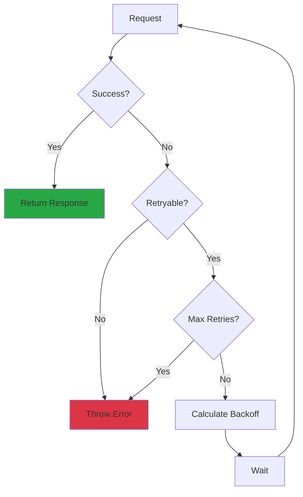
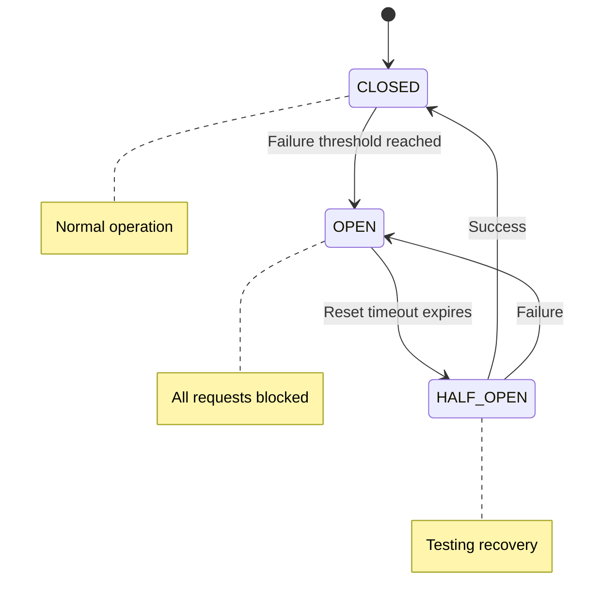

# Advanced HTTP Patterns

## Introduction

Building production-grade applications requires more than basic fetch calls. You need robust error handling, intelligent retries, request queuing, caching strategies, and clean abstractions that make your code maintainable.

This lesson covers advanced patterns that professional developers use to build reliable, performant, and maintainable HTTP communication layers.

### What We'll Cover

- Retry strategies with exponential backoff
- Request queuing and rate limiting
- Request/response interceptors
- Client-side caching strategies
- Request deduplication
- Building a complete HTTP client

### Prerequisites

- Understanding of [The Fetch API](./05-fetch-api.md)
- Understanding of [Request Configuration](./06-request-configuration.md)
- Understanding of [Response Handling](./07-response-handling.md)
- JavaScript Promises and async patterns

---

## Retry Strategies

### Basic Retry

```javascript
async function fetchWithRetry(url, options = {}, maxRetries = 3) {
  for (let attempt = 1; attempt <= maxRetries; attempt++) {
    try {
      const response = await fetch(url, options);
      
      // Success or client error - don't retry
      if (response.ok || response.status < 500) {
        return response;
      }
      
      // Server error - throw to trigger retry
      throw new Error(`HTTP ${response.status}`);
      
    } catch (error) {
      if (attempt === maxRetries) {
        throw error;
      }
      console.log(`Attempt ${attempt} failed, retrying...`);
    }
  }
}
```

### Exponential Backoff

Increase delay between retries to avoid overwhelming a recovering server:

```javascript
async function fetchWithBackoff(url, options = {}, config = {}) {
  const {
    maxRetries = 3,
    baseDelay = 1000,
    maxDelay = 30000,
    retryableStatuses = [500, 502, 503, 504, 429]
  } = config;

  for (let attempt = 1; attempt <= maxRetries; attempt++) {
    try {
      const response = await fetch(url, options);
      
      if (!retryableStatuses.includes(response.status)) {
        return response;
      }
      
      // Check Retry-After header
      const retryAfter = response.headers.get('Retry-After');
      if (retryAfter && attempt < maxRetries) {
        const delay = parseRetryAfter(retryAfter);
        console.log(`Rate limited. Waiting ${delay}ms`);
        await sleep(delay);
        continue;
      }
      
      throw new Error(`HTTP ${response.status}`);
      
    } catch (error) {
      if (attempt === maxRetries) {
        throw error;
      }
      
      // Calculate delay with jitter
      const delay = calculateBackoff(attempt, baseDelay, maxDelay);
      console.log(`Attempt ${attempt} failed. Retrying in ${delay}ms`);
      await sleep(delay);
    }
  }
}

function calculateBackoff(attempt, baseDelay, maxDelay) {
  // Exponential backoff: 1s, 2s, 4s, 8s...
  const exponentialDelay = baseDelay * Math.pow(2, attempt - 1);
  
  // Add jitter (±25%) to prevent thundering herd
  const jitter = exponentialDelay * 0.25 * (Math.random() - 0.5);
  
  return Math.min(exponentialDelay + jitter, maxDelay);
}

function parseRetryAfter(header) {
  const seconds = parseInt(header);
  if (!isNaN(seconds)) {
    return seconds * 1000;
  }
  
  // Try parsing as date
  const date = new Date(header);
  if (!isNaN(date.getTime())) {
    return Math.max(0, date.getTime() - Date.now());
  }
  
  return 60000; // Default 1 minute
}

function sleep(ms) {
  return new Promise(resolve => setTimeout(resolve, ms));
}
```

### Retry Flow Diagram



---

## Request Queuing

Queue requests to respect rate limits and manage concurrent connections:

```javascript
class RequestQueue {
  constructor(options = {}) {
    this.concurrency = options.concurrency || 5;
    this.queue = [];
    this.running = 0;
    this.rateLimitDelay = options.rateLimitDelay || 0;
  }

  async add(request) {
    return new Promise((resolve, reject) => {
      this.queue.push({ request, resolve, reject });
      this.process();
    });
  }

  async process() {
    if (this.running >= this.concurrency || this.queue.length === 0) {
      return;
    }

    this.running++;
    const { request, resolve, reject } = this.queue.shift();

    try {
      const response = await request();
      resolve(response);
    } catch (error) {
      reject(error);
    } finally {
      this.running--;
      
      if (this.rateLimitDelay) {
        await sleep(this.rateLimitDelay);
      }
      
      this.process();
    }
  }

  // Convenience method
  async fetch(url, options) {
    return this.add(() => fetch(url, options));
  }

  // Clear pending requests
  clear() {
    const pending = this.queue.length;
    this.queue.forEach(({ reject }) => {
      reject(new Error('Queue cleared'));
    });
    this.queue = [];
    return pending;
  }

  // Get queue status
  status() {
    return {
      pending: this.queue.length,
      running: this.running,
      concurrency: this.concurrency
    };
  }
}

// Usage
const queue = new RequestQueue({ concurrency: 3, rateLimitDelay: 100 });

// All requests go through the queue
const results = await Promise.all([
  queue.fetch('/api/users/1'),
  queue.fetch('/api/users/2'),
  queue.fetch('/api/users/3'),
  queue.fetch('/api/users/4'),
  queue.fetch('/api/users/5')
]);
// Only 3 run at a time, with 100ms delay between
```

### Priority Queue

```javascript
class PriorityQueue extends RequestQueue {
  add(request, priority = 0) {
    return new Promise((resolve, reject) => {
      const item = { request, resolve, reject, priority };
      
      // Insert based on priority (higher = more urgent)
      const index = this.queue.findIndex(q => q.priority < priority);
      if (index === -1) {
        this.queue.push(item);
      } else {
        this.queue.splice(index, 0, item);
      }
      
      this.process();
    });
  }
}

// Usage
const queue = new PriorityQueue({ concurrency: 2 });

queue.add(() => fetch('/api/background'), 0);    // Low priority
queue.add(() => fetch('/api/user'), 10);         // High priority (runs first)
queue.add(() => fetch('/api/critical'), 100);    // Highest priority
```

---

## Request/Response Interceptors

Interceptors allow you to transform requests before they're sent and responses before they're returned:

```javascript
class InterceptedFetch {
  constructor() {
    this.requestInterceptors = [];
    this.responseInterceptors = [];
  }

  addRequestInterceptor(fn) {
    this.requestInterceptors.push(fn);
    return () => {
      const index = this.requestInterceptors.indexOf(fn);
      if (index > -1) this.requestInterceptors.splice(index, 1);
    };
  }

  addResponseInterceptor(fn) {
    this.responseInterceptors.push(fn);
    return () => {
      const index = this.responseInterceptors.indexOf(fn);
      if (index > -1) this.responseInterceptors.splice(index, 1);
    };
  }

  async fetch(url, options = {}) {
    // Apply request interceptors
    let config = { url, ...options };
    for (const interceptor of this.requestInterceptors) {
      config = await interceptor(config) || config;
    }

    // Make request
    let response = await fetch(config.url, config);

    // Apply response interceptors
    for (const interceptor of this.responseInterceptors) {
      response = await interceptor(response.clone(), config) || response;
    }

    return response;
  }
}

// Usage
const http = new InterceptedFetch();

// Add auth header to all requests
http.addRequestInterceptor(async (config) => {
  const token = await getAuthToken();
  config.headers = {
    ...config.headers,
    Authorization: `Bearer ${token}`
  };
  return config;
});

// Log all requests
http.addRequestInterceptor((config) => {
  console.log(`→ ${config.method || 'GET'} ${config.url}`);
  return config;
});

// Handle auth errors globally
http.addResponseInterceptor(async (response, config) => {
  if (response.status === 401) {
    // Try to refresh token
    const newToken = await refreshToken();
    if (newToken) {
      // Retry original request
      config.headers.Authorization = `Bearer ${newToken}`;
      return fetch(config.url, config);
    }
  }
  return response;
});

// Log responses
http.addResponseInterceptor((response) => {
  console.log(`← ${response.status} ${response.url}`);
  return response;
});
```

---

## Request Deduplication

Prevent duplicate in-flight requests:

```javascript
class DeduplicatedFetch {
  constructor() {
    this.pending = new Map();
  }

  getCacheKey(url, options = {}) {
    // Create unique key from URL and relevant options
    const method = options.method || 'GET';
    const body = options.body || '';
    return `${method}:${url}:${body}`;
  }

  async fetch(url, options = {}) {
    const key = this.getCacheKey(url, options);
    
    // Return existing promise if request is in-flight
    if (this.pending.has(key)) {
      console.log(`Deduplicating: ${key}`);
      return this.pending.get(key);
    }

    // Create new request
    const promise = fetch(url, options)
      .then(response => response.clone())
      .finally(() => {
        this.pending.delete(key);
      });

    this.pending.set(key, promise);
    return promise;
  }

  // Get pending request count
  pendingCount() {
    return this.pending.size;
  }
}

// Usage
const http = new DeduplicatedFetch();

// These become ONE request
const [user1, user2, user3] = await Promise.all([
  http.fetch('/api/user/123'),
  http.fetch('/api/user/123'),
  http.fetch('/api/user/123')
]);
```

---

## Client-Side Caching

### Time-Based Cache

```javascript
class CachedFetch {
  constructor(defaultTTL = 60000) {
    this.cache = new Map();
    this.defaultTTL = defaultTTL;
  }

  async fetch(url, options = {}) {
    const method = options.method || 'GET';
    
    // Only cache GET requests
    if (method !== 'GET') {
      return fetch(url, options);
    }

    const cacheKey = url;
    const cached = this.cache.get(cacheKey);

    // Check if cache is valid
    if (cached && Date.now() < cached.expiresAt) {
      console.log(`Cache hit: ${cacheKey}`);
      return new Response(JSON.stringify(cached.data), {
        status: 200,
        headers: { 'Content-Type': 'application/json' }
      });
    }

    // Fetch fresh data
    const response = await fetch(url, options);
    
    if (response.ok) {
      const data = await response.clone().json();
      const ttl = this.getTTL(response, options);
      
      this.cache.set(cacheKey, {
        data,
        expiresAt: Date.now() + ttl
      });
    }

    return response;
  }

  getTTL(response, options) {
    // Check Cache-Control header
    const cacheControl = response.headers.get('Cache-Control');
    if (cacheControl) {
      const maxAge = cacheControl.match(/max-age=(\d+)/);
      if (maxAge) {
        return parseInt(maxAge[1]) * 1000;
      }
    }
    
    return options.ttl || this.defaultTTL;
  }

  invalidate(pattern) {
    if (typeof pattern === 'string') {
      this.cache.delete(pattern);
    } else if (pattern instanceof RegExp) {
      for (const key of this.cache.keys()) {
        if (pattern.test(key)) {
          this.cache.delete(key);
        }
      }
    }
  }

  clear() {
    this.cache.clear();
  }
}
```

### Stale-While-Revalidate

Return cached data immediately while fetching fresh data in the background:

```javascript
class SWRFetch {
  constructor() {
    this.cache = new Map();
  }

  async fetch(url, options = {}) {
    const cached = this.cache.get(url);
    
    // Start background revalidation
    const revalidate = this.revalidate(url, options);

    // Return stale data immediately if available
    if (cached) {
      console.log(`SWR: Returning stale for ${url}`);
      return new Response(JSON.stringify(cached.data), {
        status: 200,
        headers: { 'Content-Type': 'application/json' }
      });
    }

    // No cache - wait for fresh data
    return revalidate;
  }

  async revalidate(url, options) {
    try {
      const response = await fetch(url, options);
      
      if (response.ok) {
        const data = await response.clone().json();
        this.cache.set(url, {
          data,
          timestamp: Date.now()
        });
      }
      
      return response;
    } catch (error) {
      // On error, return cached data if available
      const cached = this.cache.get(url);
      if (cached) {
        return new Response(JSON.stringify(cached.data), {
          status: 200,
          headers: { 
            'Content-Type': 'application/json',
            'X-Cache': 'stale'
          }
        });
      }
      throw error;
    }
  }

  subscribe(url, callback, interval = 30000) {
    // Initial fetch
    this.fetch(url).then(r => r.json()).then(callback);

    // Periodic revalidation
    const id = setInterval(async () => {
      const response = await this.revalidate(url, {});
      const data = await response.json();
      callback(data);
    }, interval);

    return () => clearInterval(id);
  }
}

// Usage
const swr = new SWRFetch();

// Returns immediately with cached data, updates in background
const response = await swr.fetch('/api/dashboard');

// Subscribe to updates
const unsubscribe = swr.subscribe('/api/notifications', (data) => {
  updateNotificationBadge(data.count);
}, 10000);
```

---

## Circuit Breaker Pattern

Prevent cascading failures by temporarily stopping requests to a failing endpoint:

```javascript
class CircuitBreaker {
  constructor(options = {}) {
    this.failureThreshold = options.failureThreshold || 5;
    this.resetTimeout = options.resetTimeout || 30000;
    this.halfOpenRequests = options.halfOpenRequests || 1;
    
    this.failures = 0;
    this.lastFailure = null;
    this.state = 'CLOSED';  // CLOSED, OPEN, HALF_OPEN
    this.halfOpenAttempts = 0;
  }

  async execute(fn) {
    // Check if circuit should close
    if (this.state === 'OPEN') {
      if (Date.now() - this.lastFailure >= this.resetTimeout) {
        this.state = 'HALF_OPEN';
        this.halfOpenAttempts = 0;
        console.log('Circuit HALF_OPEN - testing...');
      } else {
        throw new Error('Circuit is OPEN - request blocked');
      }
    }

    // Limit half-open requests
    if (this.state === 'HALF_OPEN') {
      if (this.halfOpenAttempts >= this.halfOpenRequests) {
        throw new Error('Circuit HALF_OPEN - too many test requests');
      }
      this.halfOpenAttempts++;
    }

    try {
      const result = await fn();
      this.onSuccess();
      return result;
    } catch (error) {
      this.onFailure();
      throw error;
    }
  }

  onSuccess() {
    if (this.state === 'HALF_OPEN') {
      console.log('Circuit CLOSED - service recovered');
    }
    this.failures = 0;
    this.state = 'CLOSED';
  }

  onFailure() {
    this.failures++;
    this.lastFailure = Date.now();

    if (this.failures >= this.failureThreshold) {
      this.state = 'OPEN';
      console.log(`Circuit OPEN - ${this.failures} failures`);
    }
  }

  getState() {
    return {
      state: this.state,
      failures: this.failures,
      lastFailure: this.lastFailure
    };
  }
}

// Usage
const apiBreaker = new CircuitBreaker({
  failureThreshold: 5,
  resetTimeout: 30000
});

async function fetchWithBreaker(url, options) {
  return apiBreaker.execute(async () => {
    const response = await fetch(url, options);
    if (!response.ok) {
      throw new Error(`HTTP ${response.status}`);
    }
    return response;
  });
}

// After 5 failures, circuit opens and blocks requests for 30s
try {
  await fetchWithBreaker('/api/unstable-service');
} catch (error) {
  if (error.message.includes('Circuit is OPEN')) {
    // Use fallback or show degraded experience
    return getCachedData();
  }
}
```

### Circuit Breaker States



---

## Complete HTTP Client

Combining all patterns into a production-ready client:

```javascript
class HttpClient {
  constructor(options = {}) {
    this.baseUrl = options.baseUrl || '';
    this.defaultHeaders = options.headers || {};
    this.timeout = options.timeout || 30000;
    this.maxRetries = options.maxRetries || 3;
    
    // Features
    this.requestInterceptors = [];
    this.responseInterceptors = [];
    this.cache = new Map();
    this.pending = new Map();
    this.circuitBreakers = new Map();
  }

  // Interceptors
  onRequest(fn) {
    this.requestInterceptors.push(fn);
    return () => {
      const i = this.requestInterceptors.indexOf(fn);
      if (i > -1) this.requestInterceptors.splice(i, 1);
    };
  }

  onResponse(fn) {
    this.responseInterceptors.push(fn);
    return () => {
      const i = this.responseInterceptors.indexOf(fn);
      if (i > -1) this.responseInterceptors.splice(i, 1);
    };
  }

  // Main request method
  async request(path, options = {}) {
    const url = `${this.baseUrl}${path}`;
    
    // Build config
    let config = {
      url,
      method: options.method || 'GET',
      headers: { ...this.defaultHeaders, ...options.headers },
      body: options.body,
      credentials: options.credentials,
      cache: options.cache,
      signal: options.signal
    };

    // Apply request interceptors
    for (const interceptor of this.requestInterceptors) {
      config = await interceptor(config) || config;
    }

    // Deduplication for GET requests
    const cacheKey = this.getCacheKey(config);
    if (config.method === 'GET') {
      // Check cache
      const cached = this.getFromCache(cacheKey, options.cacheTTL);
      if (cached) {
        return this.createResponse(cached, true);
      }

      // Check pending
      if (this.pending.has(cacheKey)) {
        return this.pending.get(cacheKey);
      }
    }

    // Create request promise
    const promise = this.executeRequest(config, options);
    
    // Store in pending for deduplication
    if (config.method === 'GET') {
      this.pending.set(cacheKey, promise);
      promise.finally(() => this.pending.delete(cacheKey));
    }

    return promise;
  }

  async executeRequest(config, options) {
    const { url, ...fetchOptions } = config;
    const breaker = this.getCircuitBreaker(new URL(url).origin);

    try {
      return await breaker.execute(async () => {
        return await this.fetchWithRetry(url, fetchOptions, options);
      });
    } catch (error) {
      if (error.message.includes('Circuit is OPEN')) {
        // Try to return cached data
        const cached = this.cache.get(this.getCacheKey(config));
        if (cached) {
          console.log('Circuit open - returning stale data');
          return this.createResponse(cached.data, true);
        }
      }
      throw error;
    }
  }

  async fetchWithRetry(url, options, config) {
    const maxRetries = config.retries ?? this.maxRetries;
    const baseDelay = config.retryDelay ?? 1000;

    for (let attempt = 1; attempt <= maxRetries; attempt++) {
      try {
        // Add timeout
        const controller = new AbortController();
        const timeoutId = setTimeout(
          () => controller.abort(),
          config.timeout || this.timeout
        );

        const response = await fetch(url, {
          ...options,
          signal: controller.signal
        });

        clearTimeout(timeoutId);

        // Apply response interceptors
        let result = response;
        for (const interceptor of this.responseInterceptors) {
          result = await interceptor(result.clone(), options) || result;
        }

        // Handle success
        if (result.ok) {
          // Cache successful GET responses
          if (options.method === 'GET' && config.cacheTTL) {
            const data = await result.clone().json();
            this.setInCache(this.getCacheKey({ url, ...options }), data, config.cacheTTL);
          }
          return result;
        }

        // Client error - don't retry
        if (result.status < 500) {
          return result;
        }

        // Server error - retry
        throw new Error(`HTTP ${result.status}`);

      } catch (error) {
        if (attempt === maxRetries) throw error;
        
        if (error.name === 'AbortError') {
          throw new Error('Request timeout');
        }

        const delay = baseDelay * Math.pow(2, attempt - 1);
        await this.sleep(delay);
      }
    }
  }

  // Cache management
  getCacheKey(config) {
    return `${config.method || 'GET'}:${config.url}`;
  }

  getFromCache(key, ttl) {
    const cached = this.cache.get(key);
    if (!cached) return null;
    
    if (ttl && Date.now() > cached.expiresAt) {
      this.cache.delete(key);
      return null;
    }
    
    return cached.data;
  }

  setInCache(key, data, ttl) {
    this.cache.set(key, {
      data,
      expiresAt: Date.now() + ttl
    });
  }

  // Circuit breaker per origin
  getCircuitBreaker(origin) {
    if (!this.circuitBreakers.has(origin)) {
      this.circuitBreakers.set(origin, new CircuitBreaker());
    }
    return this.circuitBreakers.get(origin);
  }

  // Helper methods
  createResponse(data, fromCache = false) {
    return new Response(JSON.stringify(data), {
      status: 200,
      headers: {
        'Content-Type': 'application/json',
        'X-Cache': fromCache ? 'HIT' : 'MISS'
      }
    });
  }

  sleep(ms) {
    return new Promise(resolve => setTimeout(resolve, ms));
  }

  // Convenience methods
  async get(path, options = {}) {
    return this.request(path, { ...options, method: 'GET' });
  }

  async post(path, data, options = {}) {
    return this.request(path, {
      ...options,
      method: 'POST',
      headers: { 'Content-Type': 'application/json', ...options.headers },
      body: JSON.stringify(data)
    });
  }

  async put(path, data, options = {}) {
    return this.request(path, {
      ...options,
      method: 'PUT',
      headers: { 'Content-Type': 'application/json', ...options.headers },
      body: JSON.stringify(data)
    });
  }

  async delete(path, options = {}) {
    return this.request(path, { ...options, method: 'DELETE' });
  }

  // JSON helpers
  async getJson(path, options = {}) {
    const response = await this.get(path, options);
    if (!response.ok) throw new Error(`HTTP ${response.status}`);
    return response.json();
  }

  async postJson(path, data, options = {}) {
    const response = await this.post(path, data, options);
    if (!response.ok) throw new Error(`HTTP ${response.status}`);
    return response.status === 204 ? null : response.json();
  }
}

// Usage
const api = new HttpClient({
  baseUrl: 'https://api.example.com',
  headers: { 'Accept': 'application/json' },
  timeout: 10000,
  maxRetries: 3
});

// Add auth interceptor
api.onRequest(async (config) => {
  const token = await getAuthToken();
  config.headers.Authorization = `Bearer ${token}`;
  return config;
});

// Add logging
api.onResponse((response) => {
  console.log(`${response.status} ${response.url}`);
  return response;
});

// Make requests
const users = await api.getJson('/users', { cacheTTL: 60000 });
const newUser = await api.postJson('/users', { name: 'Alice' });
```

---

## Best Practices

### 1. Use Exponential Backoff

```javascript
// ✅ DO: Increase delay between retries
const delay = baseDelay * Math.pow(2, attempt);

// ❌ DON'T: Fixed delay
await sleep(1000);  // Same delay every time
```

### 2. Add Jitter to Prevent Thundering Herd

```javascript
// ✅ DO: Add randomness
const jitter = delay * 0.25 * (Math.random() - 0.5);
await sleep(delay + jitter);

// ❌ DON'T: Exact delays
await sleep(delay);  // All clients retry at same time
```

### 3. Respect Retry-After Header

```javascript
// ✅ DO: Honor server's request
const retryAfter = response.headers.get('Retry-After');
if (retryAfter) {
  await sleep(parseRetryAfter(retryAfter));
}
```

### 4. Cache Appropriately

```javascript
// ✅ DO: Cache based on content type
if (isStaticContent(url)) {
  cache.set(url, data, 3600000);  // 1 hour
} else {
  cache.set(url, data, 60000);    // 1 minute
}
```

### 5. Use Circuit Breakers for Critical Services

```javascript
// ✅ DO: Prevent cascading failures
const response = await circuitBreaker.execute(() => fetch(url));
```

---

## Common Pitfalls

| ❌ Mistake | ✅ Solution |
|-----------|-------------|
| Retrying on 4xx errors | Only retry 5xx and network errors |
| Fixed retry delays | Use exponential backoff with jitter |
| Unlimited retries | Set a max retry count |
| No timeout | Always set request timeout |
| Caching POST responses | Only cache GET requests |
| No circuit breaker | Use circuit breaker for external services |

---

## Hands-on Exercise

### Your Task

Build a complete `ApiClient` class that combines all the patterns from this lesson into a production-ready HTTP client.

### Requirements

1. Retry with exponential backoff
2. Request/response interceptors
3. Request deduplication
4. Response caching with TTL
5. Circuit breaker per origin
6. Timeout handling
7. Convenient methods (get, post, put, delete)

### Expected Result

```javascript
const api = new ApiClient({
  baseUrl: 'https://api.example.com',
  timeout: 5000,
  retries: 3
});

api.addInterceptor('request', addAuth);
api.addInterceptor('response', logResponse);

const user = await api.get('/users/1', { cache: 60000 });
```

<details>
<summary>💡 Hints (click to expand)</summary>

- Start with the HttpClient example and extend it
- Store interceptors in arrays, run them in sequence
- Use Map for caching with composite keys
- Create CircuitBreaker instances per origin

</details>

<details>
<summary>✅ Solution (click to expand)</summary>

See the complete `HttpClient` implementation above. The solution combines:

- **Retry with backoff**: `fetchWithRetry` method with exponential delay
- **Interceptors**: `onRequest` and `onResponse` methods
- **Deduplication**: `pending` Map tracking in-flight requests
- **Caching**: `cache` Map with TTL support
- **Circuit breaker**: Per-origin breakers in `circuitBreakers` Map
- **Timeout**: AbortController with setTimeout
- **Convenience methods**: `get`, `post`, `put`, `delete`, `getJson`, `postJson`

</details>

### Bonus Challenges

- [ ] Add request priority queue
- [ ] Implement offline support with IndexedDB
- [ ] Add request batching for multiple IDs
- [ ] Create React hooks for the client

---

## Summary

✅ **Exponential backoff** prevents overwhelming failing servers

✅ **Request queuing** manages concurrency and rate limits

✅ **Interceptors** enable cross-cutting concerns like auth and logging

✅ **Deduplication** prevents wasteful duplicate requests

✅ **Client-side caching** reduces network requests

✅ **Stale-while-revalidate** provides instant responses

✅ **Circuit breakers** prevent cascading failures

✅ Combine patterns into a **complete HTTP client** for production use

**Next:** [Real-Time Communication](../07-real-time-communication.md)

---

## Further Reading

- [MDN: Fetch API](https://developer.mozilla.org/en-US/docs/Web/API/Fetch_API) - Complete reference
- [Patterns for Resilient Services](https://docs.microsoft.com/en-us/azure/architecture/patterns/circuit-breaker) - Circuit breaker pattern
- [Exponential Backoff](https://cloud.google.com/storage/docs/exponential-backoff) - Google's guide

---

<!-- 
Sources Consulted:
- MDN Fetch API: https://developer.mozilla.org/en-US/docs/Web/API/Fetch_API
- Google Cloud Exponential Backoff: https://cloud.google.com/storage/docs/exponential-backoff
- Microsoft Circuit Breaker Pattern: https://docs.microsoft.com/en-us/azure/architecture/patterns/circuit-breaker
-->
