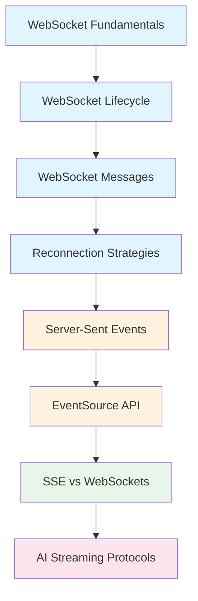

# Real-Time Communication

## Overview

Real-time communication enables instant data exchange between clients and servers. While HTTP's request-response model works for most web applications, scenarios like live chat, streaming updates, and AI token delivery require persistent connections that push data as soon as it's available.

This module covers the two primary technologies for real-time web communication: **WebSockets** for bidirectional messaging and **Server-Sent Events (SSE)** for server-to-client streaming. You'll learn when to use each, how to implement robust connection handling, and how these protocols power modern AI applications.

### Why this matters for AI development

AI applications have unique real-time requirements. Large Language Models generate responses token-by-token, and streaming these tokens as they're produced—rather than waiting for the complete response—transforms user experience from "slow and broken" to "instant and responsive." Understanding SSE and WebSockets is essential for building production AI interfaces.

---

## Learning path



---

## Lessons

| # | Lesson | Topics | Duration |
|---|--------|--------|----------|
| 1 | [WebSocket Fundamentals](./01-websocket-fundamentals.md) | What WebSockets are, vs HTTP, full-duplex, URLs | 30 min |
| 2 | [WebSocket Lifecycle](./02-websocket-lifecycle.md) | Events, readyState, handshake process | 35 min |
| 3 | [WebSocket Messages](./03-websocket-messages.md) | send(), text, binary, binaryType, parsing | 35 min |
| 4 | [Reconnection Strategies](./04-reconnection-strategies.md) | Backoff, heartbeat, state management | 40 min |
| 5 | [Server-Sent Events](./05-server-sent-events.md) | SSE concept, format, reconnection, resumption | 35 min |
| 6 | [EventSource API](./06-eventsource-api.md) | Constructor, handlers, named events, credentials | 30 min |
| 7 | [SSE vs WebSockets](./07-sse-vs-websockets.md) | Comparison, when to use each, hybrid approaches | 35 min |
| 8 | [AI Streaming Protocols](./08-ai-streaming-protocols.md) | LLM streaming, token delivery, OpenAI/Anthropic | 45 min |

**Total estimated time:** 4-5 hours

---

## What you'll learn

By completing this module, you will be able to:

- ✅ Create WebSocket connections and handle the full lifecycle
- ✅ Send and receive text, JSON, and binary data over WebSockets
- ✅ Implement robust reconnection with exponential backoff
- ✅ Use Server-Sent Events for server-to-client streaming
- ✅ Handle EventSource events, errors, and connection states
- ✅ Choose between SSE and WebSockets for different use cases
- ✅ Build streaming interfaces for AI/LLM applications
- ✅ Process token-by-token responses from OpenAI and Anthropic

---

## Prerequisites

Before starting this module, you should have:

- Completed [Asynchronous JavaScript](../05-asynchronous-javascript/)
- Completed [HTTP & API Communication](../06-http-api-communication/)
- Understanding of Promises and async/await
- Familiarity with event handling in JavaScript
- Basic knowledge of HTTP request/response cycle

---

## Key concepts

| Concept | Description |
|---------|-------------|
| **WebSocket** | Persistent, bidirectional communication channel over TCP |
| **Server-Sent Events** | Server-to-client streaming over HTTP |
| **Full-duplex** | Both parties can send data simultaneously |
| **Half-duplex** | Only one party can send at a time (like SSE) |
| **readyState** | Connection state: CONNECTING, OPEN, CLOSING, CLOSED |
| **Heartbeat** | Periodic messages to detect connection health |
| **Exponential backoff** | Increasing delay between reconnection attempts |
| **Token streaming** | Delivering LLM output word-by-word as generated |

---

## 🤖 AI context

Real-time protocols are central to AI application development:

| AI Use Case | Protocol | Why |
|-------------|----------|-----|
| LLM chat interfaces | **SSE** | Token streaming, auto-reconnect, HTTP compatible |
| Voice AI assistants | **WebSocket** | Bidirectional audio, low latency |
| Collaborative AI editing | **WebSocket** | Multi-user, real-time sync |
| AI notifications | **SSE** | Server push, simple implementation |
| AI gaming/simulation | **WebSocket** | High-frequency bidirectional messages |

Most AI API providers (OpenAI, Anthropic, Google) use SSE for streaming responses because:
- Works through corporate proxies
- Built-in reconnection handling
- HTTP-based (standard infrastructure)
- Perfect for unidirectional token delivery

---

## Quick reference

### WebSocket
```javascript
const ws = new WebSocket("wss://example.com/socket");
ws.onopen = () => console.log("Connected");
ws.onmessage = (e) => console.log("Received:", e.data);
ws.send("Hello, server!");
```

### Server-Sent Events
```javascript
const source = new EventSource("/events");
source.onmessage = (e) => console.log("Event:", e.data);
source.addEventListener("notification", (e) => {
  console.log("Notification:", e.data);
});
```

### AI Streaming
```javascript
const response = await fetch("/api/chat", {
  method: "POST",
  body: JSON.stringify({ message: prompt, stream: true })
});

const reader = response.body.getReader();
while (true) {
  const { done, value } = await reader.read();
  if (done) break;
  displayToken(new TextDecoder().decode(value));
}
```

---

## Navigation

| Previous | Up | Next |
|----------|-----|------|
| [HTTP & API Communication](../06-http-api-communication/) | [Unit Overview](../00-overview.md) | [Web Workers](../08-web-workers-background-processing/) |

---

## Further reading

- [MDN: WebSockets API](https://developer.mozilla.org/en-US/docs/Web/API/WebSockets_API) - Complete reference
- [MDN: Server-sent events](https://developer.mozilla.org/en-US/docs/Web/API/Server-sent_events) - SSE documentation
- [OpenAI Streaming](https://platform.openai.com/docs/api-reference/streaming) - AI streaming patterns
- [web.dev: Introduction to HTTP/2](https://web.dev/articles/performance-http2) - HTTP/2 benefits for SSE
