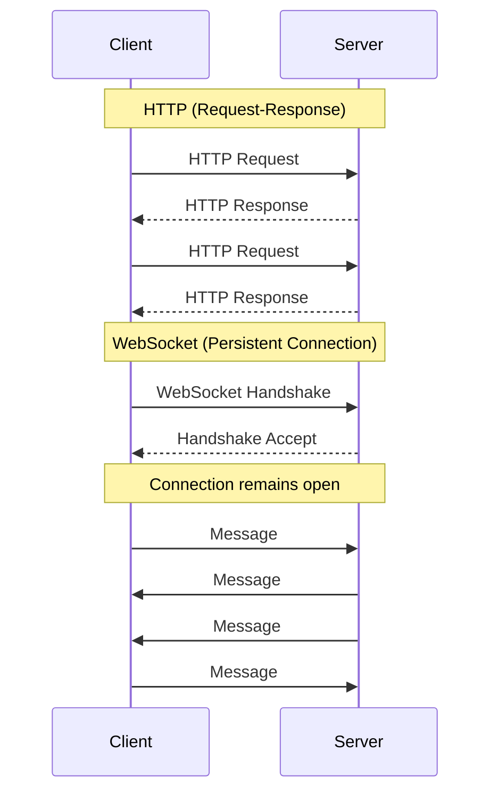
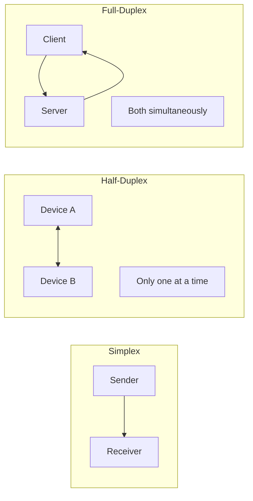

# WebSocket Fundamentals

## Introduction

Modern web applications demand instant updates. Whether you're building a chat application, a live dashboard, or an AI assistant that streams responses word by word, traditional HTTP's request-response model falls short. WebSockets provide a persistent, two-way connection between browser and server that enables true real-time communication.

This lesson introduces WebSockets from the ground up. We'll explore what makes them different from HTTP, understand the concept of full-duplex communication, and learn when WebSockets are the right choice for your application.

### What we'll cover

- What WebSockets are and how they differ from HTTP
- Full-duplex communication and why it matters
- Real-world use cases for WebSocket connections
- WebSocket URL schemes (`ws://` and `wss://`)
- When to choose WebSockets over alternatives

### Prerequisites

- Understanding of HTTP request-response cycle
- Basic JavaScript knowledge
- Familiarity with client-server architecture
- Completion of [HTTP & API Communication](../06-http-api-communication/00-http-api-communication.md) module

---

## What are WebSockets?

WebSockets are a communication protocol that enables persistent, bidirectional connections between a web browser (or other client) and a server. Unlike HTTP, where each request requires establishing a new connection, WebSockets maintain a single connection that both parties can use to send data at any time.

Think of HTTP like sending letters through the mail—you write a letter, send it, wait for a response, then repeat. WebSockets are more like a phone call—once connected, both parties can speak and listen simultaneously without hanging up and redialing.



### The WebSocket interface

The browser's `WebSocket` API provides everything you need to establish and manage WebSocket connections. According to MDN, the `WebSocket` object provides the API for creating and managing a WebSocket connection to a server, as well as for sending and receiving data on the connection.

```javascript
// Create a WebSocket connection
const socket = new WebSocket("ws://localhost:8080");

// Connection opened
socket.addEventListener("open", (event) => {
  console.log("Connected to server");
  socket.send("Hello Server!");
});

// Listen for messages
socket.addEventListener("message", (event) => {
  console.log("Message from server:", event.data);
});
```

**Output (when server responds):**
```
Connected to server
Message from server: Hello Client!
```

> **Note:** WebSockets are available in all modern browsers and Web Workers, making them suitable for both main thread and background operations.

---

## WebSocket vs HTTP

Understanding the fundamental differences between WebSockets and HTTP helps you choose the right tool for each situation.

### HTTP: The request-response model

HTTP follows a strict request-response pattern:

1. Client initiates a request
2. Server processes the request
3. Server sends a response
4. Connection closes (in HTTP/1.1 without keep-alive) or returns to pool

```javascript
// HTTP: Each request is independent
async function checkForUpdates() {
  const response = await fetch("/api/updates");
  const data = await response.json();
  return data;
}

// Must poll repeatedly to check for new data
setInterval(checkForUpdates, 5000); // Every 5 seconds
```

This approach works well for many scenarios, but has significant limitations for real-time applications:

| HTTP Limitation | Impact |
|-----------------|--------|
| Polling overhead | Constant requests even when no new data exists |
| Latency | Updates only arrive on next poll interval |
| Server-initiated data | Server cannot push data without a pending request |
| Connection overhead | Each request carries headers (~500+ bytes) |

### WebSocket: Persistent connections

WebSockets flip this model on its head:

1. Client and server perform a one-time handshake
2. Connection remains open indefinitely
3. Either party can send messages at any time
4. Connection closes only when explicitly terminated

```javascript
// WebSocket: Single connection, instant updates
const socket = new WebSocket("wss://api.example.com/updates");

socket.onmessage = (event) => {
  // Updates arrive instantly when server has new data
  const data = JSON.parse(event.data);
  updateUI(data);
};
```

### Side-by-side comparison

| Feature | HTTP | WebSocket |
|---------|------|-----------|
| Connection type | Short-lived (per request) | Persistent (until closed) |
| Direction | Client initiates, server responds | Bidirectional |
| Headers per message | Full headers every request | Headers only at handshake |
| Server-initiated data | ❌ Not possible | ✅ Yes |
| Latency | Higher (connection + headers) | Lower (established connection) |
| Overhead per message | High (~500+ bytes headers) | Low (2-14 bytes framing) |
| Browser support | Universal | All modern browsers |
| Caching | ✅ Supported | ❌ Not applicable |
| Proxies/firewalls | Always compatible | May require configuration |

---

## Full-duplex communication

The term "full-duplex" comes from telecommunications and describes a communication channel that allows simultaneous two-way data flow. This is one of WebSocket's most powerful features.

### Understanding duplex modes



| Mode | Description | Example |
|------|-------------|---------|
| Simplex | One-way only | Radio broadcast, TV |
| Half-duplex | Two-way, but one at a time | Walkie-talkie, HTTP |
| Full-duplex | Two-way simultaneously | Phone call, WebSocket |

### Why full-duplex matters

HTTP is inherently half-duplex—the client sends a complete request, then waits for a complete response. Even with features like HTTP/2 multiplexing, the request-response pattern remains.

WebSockets enable true full-duplex communication:

```javascript
const socket = new WebSocket("wss://game.example.com");

// We can send messages at any time
function sendPlayerPosition(x, y) {
  socket.send(JSON.stringify({ type: "position", x, y }));
}

// While simultaneously receiving messages
socket.onmessage = (event) => {
  const data = JSON.parse(event.data);
  if (data.type === "game_state") {
    renderGameState(data);
  }
};

// These can happen at the exact same time:
// 1. We send our position every 16ms (60 FPS)
// 2. Server sends game state updates
// 3. Server sends other player positions
// 4. We send player actions
```

### Real-time interaction pattern

Here's a practical example showing full-duplex in action—a collaborative text editor:

```javascript
class CollaborativeEditor {
  constructor(documentId) {
    this.socket = new WebSocket(`wss://collab.example.com/doc/${documentId}`);
    this.pendingChanges = [];
    
    this.socket.onmessage = (event) => {
      const message = JSON.parse(event.data);
      
      switch (message.type) {
        case "cursor":
          // Other user moved their cursor
          this.showRemoteCursor(message.userId, message.position);
          break;
        case "edit":
          // Other user made an edit
          this.applyRemoteEdit(message.changes);
          break;
        case "presence":
          // User joined or left
          this.updatePresenceList(message.users);
          break;
      }
    };
  }
  
  // We send our changes while receiving others' changes
  onLocalEdit(changes) {
    this.socket.send(JSON.stringify({
      type: "edit",
      changes: changes
    }));
  }
  
  onCursorMove(position) {
    this.socket.send(JSON.stringify({
      type: "cursor",
      position: position
    }));
  }
}
```

> **🤖 AI Context:** Full-duplex communication is essential for AI chat interfaces. While the AI streams its response token by token, the user might want to stop generation, provide additional context, or the system might need to send typing indicators—all happening simultaneously.

---

## Use cases for WebSockets

WebSockets excel in scenarios requiring real-time, bidirectional communication. Let's explore the most common use cases.

### Chat applications

Chat is the quintessential WebSocket use case. Messages need to appear instantly for all participants:

```javascript
class ChatClient {
  constructor(roomId) {
    this.socket = new WebSocket(`wss://chat.example.com/rooms/${roomId}`);
    
    this.socket.onmessage = (event) => {
      const message = JSON.parse(event.data);
      this.displayMessage(message);
    };
  }
  
  sendMessage(text) {
    this.socket.send(JSON.stringify({
      type: "message",
      text: text,
      timestamp: Date.now()
    }));
  }
  
  displayMessage(message) {
    const messageElement = document.createElement("div");
    messageElement.className = "chat-message";
    messageElement.textContent = `${message.sender}: ${message.text}`;
    document.getElementById("chat-container").appendChild(messageElement);
  }
}
```

### Live dashboards and monitoring

Stock tickers, system metrics, IoT sensor data—anywhere you need constantly updating data:

```javascript
class MetricsDashboard {
  constructor() {
    this.socket = new WebSocket("wss://metrics.example.com/stream");
    
    this.socket.onmessage = (event) => {
      const metrics = JSON.parse(event.data);
      
      // Update charts in real-time
      this.updateCPUChart(metrics.cpu);
      this.updateMemoryChart(metrics.memory);
      this.updateNetworkChart(metrics.network);
      
      // Flash alert on anomalies
      if (metrics.alerts.length > 0) {
        this.showAlerts(metrics.alerts);
      }
    };
  }
}
```

### Multiplayer games

Games require low-latency updates for player positions, actions, and game state:

```javascript
class GameConnection {
  constructor(gameId, playerId) {
    this.socket = new WebSocket(
      `wss://game.example.com/${gameId}?player=${playerId}`
    );
    
    this.socket.onmessage = (event) => {
      const update = JSON.parse(event.data);
      
      switch (update.type) {
        case "world_state":
          this.renderer.updateWorld(update.entities);
          break;
        case "player_action":
          this.processAction(update.playerId, update.action);
          break;
        case "physics":
          this.physics.sync(update.state);
          break;
      }
    };
    
    // Send player input at 60 FPS
    setInterval(() => {
      if (this.inputBuffer.length > 0) {
        this.socket.send(JSON.stringify({
          type: "input",
          commands: this.inputBuffer
        }));
        this.inputBuffer = [];
      }
    }, 16);
  }
}
```

### Collaborative tools

Real-time collaboration on documents, whiteboards, or design tools:

```javascript
class Whiteboard {
  constructor(boardId) {
    this.socket = new WebSocket(`wss://whiteboard.example.com/${boardId}`);
    this.canvas = document.getElementById("canvas");
    this.ctx = this.canvas.getContext("2d");
    
    this.socket.onmessage = (event) => {
      const data = JSON.parse(event.data);
      
      if (data.type === "draw") {
        // Draw remote user's strokes
        this.drawPath(data.points, data.color, data.width);
      }
    };
    
    this.canvas.addEventListener("mousemove", (e) => {
      if (this.isDrawing) {
        this.socket.send(JSON.stringify({
          type: "draw",
          points: [{ x: e.offsetX, y: e.offsetY }],
          color: this.currentColor,
          width: this.brushWidth
        }));
      }
    });
  }
}
```

### AI and LLM streaming

WebSockets (or SSE, covered in a later lesson) enable streaming AI responses:

```javascript
class AIChat {
  constructor() {
    this.socket = new WebSocket("wss://ai.example.com/chat");
    this.currentResponse = "";
    
    this.socket.onmessage = (event) => {
      const data = JSON.parse(event.data);
      
      if (data.type === "token") {
        // Append each token as it arrives
        this.currentResponse += data.token;
        this.updateResponseDisplay(this.currentResponse);
      } else if (data.type === "done") {
        this.finalizeResponse();
      }
    };
  }
  
  sendPrompt(prompt) {
    this.currentResponse = "";
    this.socket.send(JSON.stringify({
      type: "prompt",
      text: prompt,
      model: "gpt-4"
    }));
  }
}
```

### Use case decision matrix

| Use Case | WebSocket Fit | Key Reason |
|----------|---------------|------------|
| Chat applications | ✅ Excellent | Instant bidirectional messaging |
| Live dashboards | ✅ Excellent | Continuous server-to-client updates |
| Multiplayer games | ✅ Excellent | Low latency, high frequency updates |
| Collaborative editing | ✅ Excellent | Real-time sync between users |
| AI streaming | ✅ Good | Progressive response delivery |
| E-commerce cart | ⚠️ Maybe | Usually HTTP is simpler |
| Static content | ❌ Poor | No need for real-time |
| File downloads | ❌ Poor | HTTP handles this better |
| REST APIs | ❌ Poor | Request-response pattern suits HTTP |

---

## WebSocket URL schemes

WebSockets use their own URL schemes that parallel HTTP's secure and insecure variants.

### `ws://` - Unencrypted WebSocket

The `ws://` scheme creates an unencrypted WebSocket connection, similar to `http://`:

```javascript
// Unencrypted connection - use only for local development
const socket = new WebSocket("ws://localhost:8080/chat");
```

> **Warning:** Never use `ws://` in production. Unencrypted WebSocket connections expose all data to potential interception.

### `wss://` - Secure WebSocket

The `wss://` scheme creates an encrypted WebSocket connection using TLS, similar to `https://`:

```javascript
// Encrypted connection - always use in production
const socket = new WebSocket("wss://api.example.com/chat");
```

### URL structure

WebSocket URLs follow standard URL conventions:

```
wss://host:port/path?query=params
│    │    │    │    └── Query parameters
│    │    │    └── Resource path
│    │    └── Port (default: 443 for wss://, 80 for ws://)
│    └── Hostname
└── Scheme (ws:// or wss://)
```

```javascript
// Complete URL examples
const examples = [
  // Basic connection
  "wss://api.example.com/websocket",
  
  // With port
  "wss://api.example.com:8443/ws",
  
  // With path parameters
  "wss://api.example.com/rooms/123/chat",
  
  // With query parameters
  "wss://api.example.com/ws?token=abc123&room=general",
  
  // Local development
  "ws://localhost:3000/dev"
];

// URL with authentication token
const token = "eyJhbGciOiJIUzI1NiIs...";
const socket = new WebSocket(
  `wss://api.example.com/chat?token=${encodeURIComponent(token)}`
);
```

### Sub-protocols

WebSockets support sub-protocols for application-level protocol negotiation:

```javascript
// Specify one or more sub-protocols
const socket = new WebSocket(
  "wss://api.example.com/ws",
  ["json", "protobuf"]  // Client's preferred protocols
);

socket.onopen = () => {
  // Check which protocol the server selected
  console.log("Selected protocol:", socket.protocol);
  // Output: "Selected protocol: json"
};
```

Common sub-protocols include:
- `json` - JSON-formatted messages
- `graphql-ws` - GraphQL over WebSocket
- `mqtt` - IoT messaging protocol
- Custom application protocols

### Browser support for URL features

Modern browsers (Chrome 125+, Firefox 124+, Safari 17.3+) support relative URLs and HTTP/HTTPS URL schemes that get upgraded:

```javascript
// Modern browsers can upgrade HTTP(S) URLs
const socket = new WebSocket("https://api.example.com/ws");
// Automatically becomes wss://api.example.com/ws

// Relative URLs also work
const socket2 = new WebSocket("/ws/chat");
// Becomes wss://current-domain/ws/chat (or ws:// if page is HTTP)
```

> **Note:** For broad compatibility, prefer explicit `wss://` URLs rather than relying on URL upgrades.

---

## Best practices

| Practice | Why It Matters |
|----------|----------------|
| Always use `wss://` in production | Encrypts data, prevents MITM attacks |
| Include authentication in handshake | Tokens in URL or first message for security |
| Handle all connection events | Graceful error handling and reconnection |
| Implement heartbeat/ping | Detect dead connections before they cause issues |
| Set connection timeouts | Don't wait indefinitely for failed connections |
| Close connections properly | Clean up resources, notify server |

---

## Common pitfalls

| ❌ Mistake | ✅ Solution |
|-----------|-------------|
| Using `ws://` in production | Always use `wss://` for encrypted connections |
| Not handling disconnection | Implement reconnection logic (covered in Lesson 4) |
| Ignoring the `readyState` | Check state before sending messages |
| Opening too many connections | Reuse single connection for multiple purposes |
| No message validation | Validate and sanitize all received data |
| Forgetting cleanup | Close connections on page unload |

---

## Hands-on exercise

### Your task

Create a simple WebSocket echo client that connects to a public WebSocket echo server, sends a message, and displays the response.

### Requirements

1. Create a new WebSocket connection to `wss://echo.websocket.org/`
2. Send a greeting message when the connection opens
3. Display any received messages in the console
4. Handle connection errors gracefully
5. Log connection state changes

### Expected result

```
Connecting to echo server...
Connection opened
Sending: Hello WebSocket!
Received: Hello WebSocket!
```

<details>
<summary>💡 Hints (click to expand)</summary>

- Use `new WebSocket(url)` to create the connection
- The `open` event fires when connected
- Use `socket.send(message)` to send data
- The `message` event's `event.data` contains the received message
- The `error` and `close` events help with error handling

</details>

<details>
<summary>✅ Solution (click to expand)</summary>

```javascript
// WebSocket Echo Client
console.log("Connecting to echo server...");

const socket = new WebSocket("wss://echo.websocket.org/");

// Connection opened
socket.addEventListener("open", (event) => {
  console.log("Connection opened");
  
  const message = "Hello WebSocket!";
  console.log("Sending:", message);
  socket.send(message);
});

// Listen for messages
socket.addEventListener("message", (event) => {
  console.log("Received:", event.data);
  
  // Close connection after receiving echo
  socket.close(1000, "Done");
});

// Handle errors
socket.addEventListener("error", (event) => {
  console.error("WebSocket error:", event);
});

// Connection closed
socket.addEventListener("close", (event) => {
  console.log("Connection closed:", event.code, event.reason);
});

// Alternative: Create a reusable echo function
async function echoMessage(message) {
  return new Promise((resolve, reject) => {
    const ws = new WebSocket("wss://echo.websocket.org/");
    
    ws.onopen = () => ws.send(message);
    ws.onmessage = (e) => {
      resolve(e.data);
      ws.close();
    };
    ws.onerror = (e) => reject(e);
    
    // Timeout after 5 seconds
    setTimeout(() => {
      ws.close();
      reject(new Error("Connection timeout"));
    }, 5000);
  });
}

// Usage:
// const response = await echoMessage("Test message");
```

</details>

### Bonus challenges

- [ ] Create a function that measures round-trip latency by timing message send and echo
- [ ] Add a retry mechanism that attempts to reconnect if the initial connection fails
- [ ] Build a simple UI with an input field to send custom messages and display responses

---

## Summary

✅ WebSockets provide persistent, bidirectional connections between browser and server

✅ Unlike HTTP's request-response model, WebSockets enable full-duplex communication where both parties can send data simultaneously

✅ Key use cases include chat applications, live dashboards, multiplayer games, collaborative tools, and AI streaming

✅ Always use `wss://` (encrypted) in production environments—never `ws://`

✅ WebSocket URLs follow standard conventions with support for paths, query parameters, and sub-protocols

**Next:** [WebSocket Connection Lifecycle](./02-websocket-lifecycle.md)

---

## Further reading

- [MDN: WebSockets API](https://developer.mozilla.org/en-US/docs/Web/API/WebSockets_API) - Complete API reference
- [MDN: WebSocket interface](https://developer.mozilla.org/en-US/docs/Web/API/WebSocket) - Constructor, properties, methods, events
- [RFC 6455](https://datatracker.ietf.org/doc/html/rfc6455) - The WebSocket Protocol specification
- [Writing WebSocket client applications](https://developer.mozilla.org/en-US/docs/Web/API/WebSockets_API/Writing_WebSocket_client_applications) - MDN guide

<!--
Sources Consulted:
- MDN WebSockets API: https://developer.mozilla.org/en-US/docs/Web/API/WebSockets_API
- MDN WebSocket interface: https://developer.mozilla.org/en-US/docs/Web/API/WebSocket
- MDN Writing WebSocket client applications: https://developer.mozilla.org/en-US/docs/Web/API/WebSockets_API/Writing_WebSocket_client_applications
-->
