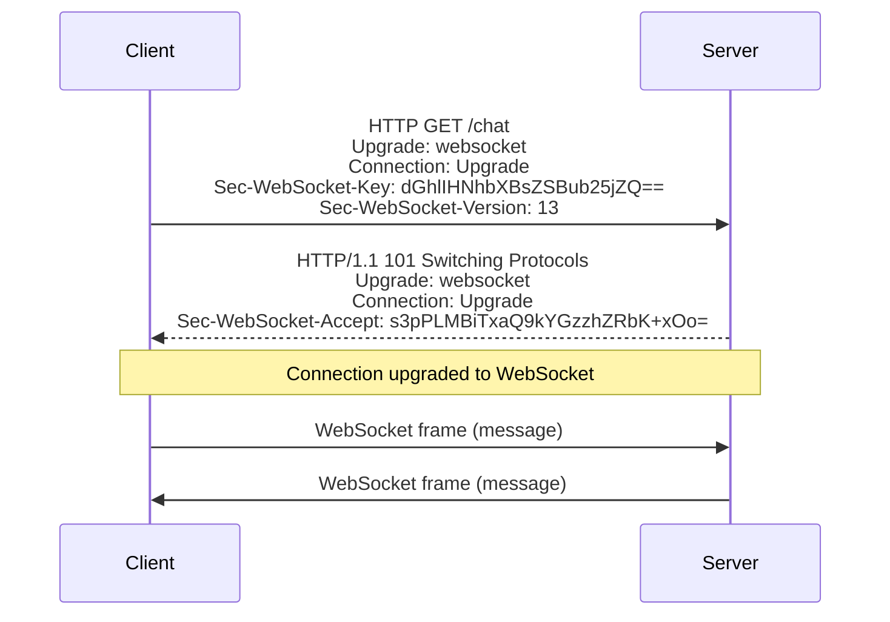
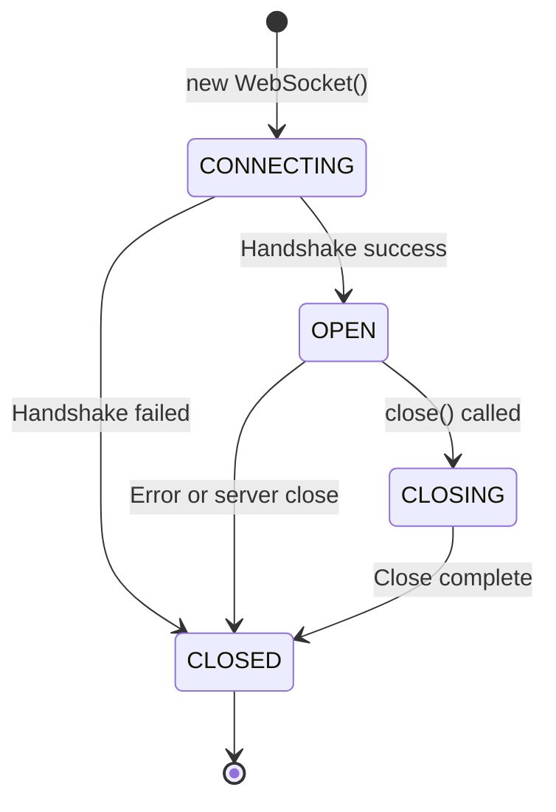

# WebSocket Connection Lifecycle

## Introduction

Every WebSocket connection follows a predictable lifecycle—from initial handshake to eventual closure. Understanding this lifecycle is essential for building robust real-time applications. You need to know when your connection is ready to send data, how to respond when messages arrive, and how to handle disconnections gracefully.

This lesson explores the complete WebSocket lifecycle through its events, states, and the underlying handshake protocol. We'll build practical patterns for managing connections that you'll use throughout your real-time applications.

### What we'll cover

- The WebSocket handshake process
- Connection state via `readyState` property
- Event handling: `open`, `message`, `error`, and `close`
- Event listener patterns and handler properties
- Building a connection state machine

### Prerequisites

- Completion of [WebSocket Fundamentals](./01-websocket-fundamentals.md)
- Understanding of JavaScript events and callbacks
- Familiarity with async programming concepts

---

## The WebSocket handshake

Before any WebSocket communication can occur, the client and server must perform a handshake. This handshake upgrades an HTTP connection to a WebSocket connection.

### How the handshake works



The handshake is initiated as a standard HTTP request with special headers:

```http
GET /chat HTTP/1.1
Host: server.example.com
Upgrade: websocket
Connection: Upgrade
Sec-WebSocket-Key: dGhlIHNhbXBsZSBub25jZQ==
Sec-WebSocket-Version: 13
Sec-WebSocket-Protocol: json, xml
```

| Header | Purpose |
|--------|---------|
| `Upgrade: websocket` | Requests protocol upgrade |
| `Connection: Upgrade` | Indicates connection should be upgraded |
| `Sec-WebSocket-Key` | Random base64 value for handshake verification |
| `Sec-WebSocket-Version` | WebSocket protocol version (13 is current) |
| `Sec-WebSocket-Protocol` | Optional sub-protocols client supports |

The server responds with a 101 status code:

```http
HTTP/1.1 101 Switching Protocols
Upgrade: websocket
Connection: Upgrade
Sec-WebSocket-Accept: s3pPLMBiTxaQ9kYGzzhZRbK+xOo=
Sec-WebSocket-Protocol: json
```

> **Note:** The browser handles the handshake automatically. You don't construct these headers yourself—the `WebSocket` constructor manages everything.

### What happens during connection

When you create a WebSocket, the browser:

1. Parses the URL and validates the scheme (`ws://` or `wss://`)
2. Establishes a TCP connection to the server
3. For `wss://`, performs TLS handshake
4. Sends the HTTP upgrade request
5. Validates the server's response
6. Fires the `open` event if successful

```javascript
// This single line triggers the entire handshake
const socket = new WebSocket("wss://api.example.com/chat");

// The constructor returns immediately - connection happens asynchronously
console.log(socket.readyState); // 0 (CONNECTING)

socket.addEventListener("open", () => {
  console.log(socket.readyState); // 1 (OPEN)
});
```

---

## Understanding readyState

The `readyState` property indicates the current state of the WebSocket connection. It's a read-only integer with four possible values.

### The four states



| Value | Constant | Description |
|-------|----------|-------------|
| `0` | `WebSocket.CONNECTING` | Connection not yet established |
| `1` | `WebSocket.OPEN` | Connection established, ready to communicate |
| `2` | `WebSocket.CLOSING` | Close handshake in progress |
| `3` | `WebSocket.CLOSED` | Connection closed or couldn't open |

### Using readyState in practice

Always check `readyState` before sending messages:

```javascript
function safeSend(socket, data) {
  if (socket.readyState === WebSocket.OPEN) {
    socket.send(data);
    return true;
  }
  
  console.warn("Cannot send - connection not open. State:", socket.readyState);
  return false;
}

// Better: Queue messages until connection opens
class ReliableSocket {
  constructor(url) {
    this.socket = null;
    this.url = url;
    this.messageQueue = [];
    this.connect();
  }
  
  connect() {
    this.socket = new WebSocket(this.url);
    
    this.socket.onopen = () => {
      console.log("Connected, flushing", this.messageQueue.length, "queued messages");
      this.flushQueue();
    };
  }
  
  send(data) {
    if (this.socket.readyState === WebSocket.OPEN) {
      this.socket.send(data);
    } else {
      console.log("Queueing message, current state:", this.socket.readyState);
      this.messageQueue.push(data);
    }
  }
  
  flushQueue() {
    while (this.messageQueue.length > 0 && this.socket.readyState === WebSocket.OPEN) {
      this.socket.send(this.messageQueue.shift());
    }
  }
}
```

### State transition logging

For debugging, log state transitions:

```javascript
function createMonitoredSocket(url) {
  const socket = new WebSocket(url);
  let lastState = socket.readyState;
  
  const stateNames = ["CONNECTING", "OPEN", "CLOSING", "CLOSED"];
  console.log(`Initial state: ${stateNames[lastState]}`);
  
  // Monitor state changes
  const checkState = () => {
    if (socket.readyState !== lastState) {
      console.log(`State change: ${stateNames[lastState]} → ${stateNames[socket.readyState]}`);
      lastState = socket.readyState;
    }
    
    if (socket.readyState !== WebSocket.CLOSED) {
      requestAnimationFrame(checkState);
    }
  };
  
  requestAnimationFrame(checkState);
  return socket;
}

const socket = createMonitoredSocket("wss://api.example.com/ws");
```

**Output:**
```
Initial state: CONNECTING
State change: CONNECTING → OPEN
// ... later ...
State change: OPEN → CLOSING
State change: CLOSING → CLOSED
```

---

## The open event

The `open` event fires when the WebSocket connection is successfully established and ready for communication.

### Handling connection open

```javascript
const socket = new WebSocket("wss://api.example.com/chat");

// Method 1: addEventListener
socket.addEventListener("open", (event) => {
  console.log("Connection opened");
  console.log("Protocol:", socket.protocol);
  console.log("Extensions:", socket.extensions);
});

// Method 2: onopen property
socket.onopen = (event) => {
  console.log("Connection opened");
};
```

> **Note:** Use `addEventListener` when you need multiple handlers or want to remove handlers later. Use `onopen` for simple single-handler scenarios.

### Common open event patterns

**Authentication after connection:**

```javascript
socket.addEventListener("open", () => {
  // Send authentication as first message
  socket.send(JSON.stringify({
    type: "auth",
    token: localStorage.getItem("authToken")
  }));
});
```

**Joining a channel or room:**

```javascript
socket.addEventListener("open", () => {
  socket.send(JSON.stringify({
    type: "join",
    channel: "general",
    username: currentUser.name
  }));
});
```

**Starting heartbeat:**

```javascript
let heartbeatInterval;

socket.addEventListener("open", () => {
  // Send ping every 30 seconds to keep connection alive
  heartbeatInterval = setInterval(() => {
    if (socket.readyState === WebSocket.OPEN) {
      socket.send(JSON.stringify({ type: "ping" }));
    }
  }, 30000);
});

socket.addEventListener("close", () => {
  clearInterval(heartbeatInterval);
});
```

---

## The message event

The `message` event fires whenever the client receives data from the server. This is where you'll handle all incoming WebSocket communication.

### Message event structure

```javascript
socket.addEventListener("message", (event) => {
  // event.data contains the received data
  console.log("Received:", event.data);
  
  // Other event properties
  console.log("Origin:", event.origin);      // Server URL
  console.log("Timestamp:", event.timeStamp); // When received
});
```

### Parsing different message types

Servers can send text or binary data. Handle both appropriately:

```javascript
socket.addEventListener("message", (event) => {
  const data = event.data;
  
  // Check if it's a Blob (binary)
  if (data instanceof Blob) {
    handleBinaryMessage(data);
    return;
  }
  
  // Check if it's an ArrayBuffer
  if (data instanceof ArrayBuffer) {
    handleArrayBufferMessage(data);
    return;
  }
  
  // Otherwise it's text - try to parse as JSON
  try {
    const message = JSON.parse(data);
    handleJsonMessage(message);
  } catch (error) {
    // Plain text message
    handleTextMessage(data);
  }
});

function handleJsonMessage(message) {
  switch (message.type) {
    case "chat":
      displayChatMessage(message);
      break;
    case "notification":
      showNotification(message);
      break;
    case "error":
      handleServerError(message);
      break;
    default:
      console.warn("Unknown message type:", message.type);
  }
}
```

### Message routing pattern

For larger applications, route messages to specific handlers:

```javascript
class MessageRouter {
  constructor(socket) {
    this.handlers = new Map();
    
    socket.addEventListener("message", (event) => {
      try {
        const message = JSON.parse(event.data);
        this.route(message);
      } catch (error) {
        console.error("Invalid message format:", error);
      }
    });
  }
  
  on(type, handler) {
    if (!this.handlers.has(type)) {
      this.handlers.set(type, []);
    }
    this.handlers.get(type).push(handler);
    return this; // Enable chaining
  }
  
  off(type, handler) {
    const handlers = this.handlers.get(type);
    if (handlers) {
      const index = handlers.indexOf(handler);
      if (index > -1) handlers.splice(index, 1);
    }
    return this;
  }
  
  route(message) {
    const handlers = this.handlers.get(message.type);
    if (handlers) {
      handlers.forEach(handler => handler(message));
    } else {
      console.warn("No handler for message type:", message.type);
    }
  }
}

// Usage
const socket = new WebSocket("wss://api.example.com/ws");
const router = new MessageRouter(socket);

router
  .on("chat", (msg) => displayChat(msg.sender, msg.text))
  .on("typing", (msg) => showTypingIndicator(msg.user))
  .on("presence", (msg) => updateUserList(msg.users));
```

---

## The error event

The `error` event fires when something goes wrong with the WebSocket connection. Unfortunately, the event object provides limited information for security reasons.

### Handling errors

```javascript
socket.addEventListener("error", (event) => {
  // The error event doesn't contain much detail
  console.error("WebSocket error occurred");
  
  // Check connection state for clues
  console.log("Ready state:", socket.readyState);
  
  // The error event is always followed by close event
});
```

> **Important:** The WebSocket error event intentionally lacks details to prevent exposing network topology or security information to scripts. You typically learn more from the subsequent `close` event.

### Error scenarios

| Scenario | Error Event | Close Event Details |
|----------|-------------|---------------------|
| Invalid URL | ✅ Fires | Never opens |
| Network unreachable | ✅ Fires | Code 1006 (Abnormal) |
| TLS certificate invalid | ✅ Fires | Code 1006 |
| Server rejects handshake | ✅ Fires | Code 1006 |
| Message send failure | ✅ Fires | May close or recover |

### Practical error handling

```javascript
class RobustSocket {
  constructor(url, options = {}) {
    this.url = url;
    this.options = {
      maxRetries: 5,
      retryDelay: 1000,
      ...options
    };
    
    this.retryCount = 0;
    this.isIntentionallyClosed = false;
    
    this.connect();
  }
  
  connect() {
    this.socket = new WebSocket(this.url);
    
    this.socket.addEventListener("open", () => {
      console.log("Connected");
      this.retryCount = 0; // Reset on successful connection
    });
    
    this.socket.addEventListener("error", (event) => {
      console.error("Connection error");
      // Don't retry here - wait for close event
    });
    
    this.socket.addEventListener("close", (event) => {
      if (this.isIntentionallyClosed) {
        console.log("Connection closed intentionally");
        return;
      }
      
      if (event.wasClean) {
        console.log("Connection closed cleanly:", event.code, event.reason);
      } else {
        console.error("Connection died unexpectedly");
        this.scheduleRetry();
      }
    });
  }
  
  scheduleRetry() {
    if (this.retryCount >= this.options.maxRetries) {
      console.error("Max retries reached, giving up");
      return;
    }
    
    const delay = this.options.retryDelay * Math.pow(2, this.retryCount);
    this.retryCount++;
    
    console.log(`Retrying in ${delay}ms (attempt ${this.retryCount})`);
    setTimeout(() => this.connect(), delay);
  }
  
  close() {
    this.isIntentionallyClosed = true;
    this.socket.close(1000, "User requested close");
  }
}
```

---

## The close event

The `close` event fires when the connection closes, whether intentionally or due to an error. It provides valuable information through its `CloseEvent` properties.

### CloseEvent properties

```javascript
socket.addEventListener("close", (event) => {
  console.log("Close event received");
  console.log("Was clean:", event.wasClean);  // Boolean
  console.log("Code:", event.code);           // Numeric status code
  console.log("Reason:", event.reason);       // String explanation
});
```

### Standard close codes

| Code | Name | Description |
|------|------|-------------|
| `1000` | Normal Closure | Intentional, successful close |
| `1001` | Going Away | Endpoint is going away (page close, server shutdown) |
| `1002` | Protocol Error | Endpoint received malformed frame |
| `1003` | Unsupported Data | Received data type it cannot handle |
| `1005` | No Status Received | Expected close code but didn't get one |
| `1006` | Abnormal Closure | Connection closed without close frame |
| `1007` | Invalid Frame Payload | Received data that wasn't consistent with message type |
| `1008` | Policy Violation | Received message that violates policy |
| `1009` | Message Too Big | Message too large to process |
| `1010` | Mandatory Extension | Client expected extension server didn't negotiate |
| `1011` | Internal Error | Server encountered unexpected condition |
| `1015` | TLS Handshake | TLS handshake failure (not actually seen in close event) |
| `3000-3999` | Library/Framework Use | Reserved for libraries and frameworks |
| `4000-4999` | Private Use | Available for application-specific codes |

### Handling close events by code

```javascript
socket.addEventListener("close", (event) => {
  switch (event.code) {
    case 1000:
      console.log("Normal closure");
      break;
      
    case 1001:
      console.log("Server going away");
      this.scheduleReconnect();
      break;
      
    case 1006:
      console.error("Connection lost unexpectedly");
      this.scheduleReconnect();
      break;
      
    case 1008:
      console.error("Policy violation - check authentication");
      this.refreshAuthAndReconnect();
      break;
      
    case 1009:
      console.error("Message too large");
      break;
      
    case 4000:
      // Custom application code
      console.error("Session expired:", event.reason);
      this.logout();
      break;
      
    case 4001:
      // Custom application code
      console.error("Rate limited:", event.reason);
      this.scheduleReconnect(60000); // Wait 1 minute
      break;
      
    default:
      console.log("Connection closed:", event.code, event.reason);
  }
});
```

### Initiating close

You can close connections with a code and reason:

```javascript
// Normal close
socket.close();

// Close with status
socket.close(1000, "User logged out");

// Close with custom code
socket.close(4000, "Session timeout");
```

> **Warning:** Custom close codes must be in the range 4000-4999. Codes in other ranges are reserved by the protocol.

---

## Event listener patterns

JavaScript provides two ways to handle WebSocket events. Understanding when to use each helps you write cleaner code.

### Property-based handlers

```javascript
const socket = new WebSocket("wss://api.example.com/ws");

socket.onopen = (event) => console.log("Opened");
socket.onmessage = (event) => console.log("Message:", event.data);
socket.onerror = (event) => console.log("Error");
socket.onclose = (event) => console.log("Closed");
```

**Characteristics:**
- Only one handler per event type
- Assigning a new handler replaces the previous one
- Set to `null` to remove

### addEventListener-based handlers

```javascript
const socket = new WebSocket("wss://api.example.com/ws");

function handleMessage(event) {
  console.log("Message:", event.data);
}

socket.addEventListener("message", handleMessage);

// Later, remove the specific handler
socket.removeEventListener("message", handleMessage);
```

**Characteristics:**
- Multiple handlers per event type
- Handlers execute in order added
- Can remove specific handlers

### When to use which

| Scenario | Recommended Pattern |
|----------|---------------------|
| Simple scripts | Property handlers (`onmessage`) |
| React/Vue/Angular components | `addEventListener` with cleanup |
| Multiple modules listening | `addEventListener` |
| Temporary handlers | `addEventListener` with `{ once: true }` |

### One-time event handlers

For events you only want to handle once:

```javascript
// Wait for connection to open (one-time)
socket.addEventListener("open", () => {
  console.log("Connected!");
}, { once: true });

// Or use a promise wrapper
function waitForOpen(socket) {
  return new Promise((resolve, reject) => {
    if (socket.readyState === WebSocket.OPEN) {
      resolve();
      return;
    }
    
    socket.addEventListener("open", resolve, { once: true });
    socket.addEventListener("error", reject, { once: true });
  });
}

// Usage
const socket = new WebSocket("wss://api.example.com/ws");
await waitForOpen(socket);
console.log("Ready to send messages");
```

---

## Building a connection state machine

Combining everything into a robust connection manager:

```javascript
class WebSocketConnection {
  constructor(url, options = {}) {
    this.url = url;
    this.options = {
      reconnect: true,
      maxReconnectAttempts: 10,
      reconnectInterval: 1000,
      maxReconnectInterval: 30000,
      ...options
    };
    
    this.socket = null;
    this.state = "disconnected";
    this.reconnectAttempts = 0;
    this.reconnectTimer = null;
    this.messageQueue = [];
    this.listeners = new Map();
    
    this.connect();
  }
  
  get readyState() {
    return this.socket?.readyState ?? WebSocket.CLOSED;
  }
  
  connect() {
    if (this.socket) {
      this.socket.close();
    }
    
    this.setState("connecting");
    this.socket = new WebSocket(this.url);
    
    this.socket.addEventListener("open", () => this.handleOpen());
    this.socket.addEventListener("message", (e) => this.handleMessage(e));
    this.socket.addEventListener("error", (e) => this.handleError(e));
    this.socket.addEventListener("close", (e) => this.handleClose(e));
  }
  
  handleOpen() {
    this.setState("connected");
    this.reconnectAttempts = 0;
    this.flushMessageQueue();
    this.emit("connect");
  }
  
  handleMessage(event) {
    try {
      const data = JSON.parse(event.data);
      this.emit("message", data);
      
      if (data.type) {
        this.emit(data.type, data);
      }
    } catch {
      this.emit("message", event.data);
    }
  }
  
  handleError(event) {
    console.error("WebSocket error");
    this.emit("error", event);
  }
  
  handleClose(event) {
    this.setState("disconnected");
    this.emit("disconnect", { code: event.code, reason: event.reason });
    
    if (this.options.reconnect && !this.intentionallyClosed) {
      this.scheduleReconnect();
    }
  }
  
  scheduleReconnect() {
    if (this.reconnectAttempts >= this.options.maxReconnectAttempts) {
      this.emit("reconnectFailed");
      return;
    }
    
    const delay = Math.min(
      this.options.reconnectInterval * Math.pow(2, this.reconnectAttempts),
      this.options.maxReconnectInterval
    );
    
    this.setState("reconnecting");
    this.reconnectAttempts++;
    
    this.emit("reconnecting", {
      attempt: this.reconnectAttempts,
      delay
    });
    
    this.reconnectTimer = setTimeout(() => this.connect(), delay);
  }
  
  send(data) {
    const message = typeof data === "string" ? data : JSON.stringify(data);
    
    if (this.socket?.readyState === WebSocket.OPEN) {
      this.socket.send(message);
    } else {
      this.messageQueue.push(message);
    }
  }
  
  flushMessageQueue() {
    while (this.messageQueue.length > 0) {
      const message = this.messageQueue.shift();
      this.socket.send(message);
    }
  }
  
  close(code = 1000, reason = "Client closed") {
    this.intentionallyClosed = true;
    clearTimeout(this.reconnectTimer);
    this.socket?.close(code, reason);
  }
  
  setState(newState) {
    const oldState = this.state;
    this.state = newState;
    this.emit("stateChange", { from: oldState, to: newState });
  }
  
  on(event, callback) {
    if (!this.listeners.has(event)) {
      this.listeners.set(event, []);
    }
    this.listeners.get(event).push(callback);
    return () => this.off(event, callback);
  }
  
  off(event, callback) {
    const callbacks = this.listeners.get(event);
    if (callbacks) {
      const index = callbacks.indexOf(callback);
      if (index > -1) callbacks.splice(index, 1);
    }
  }
  
  emit(event, data) {
    const callbacks = this.listeners.get(event);
    if (callbacks) {
      callbacks.forEach(callback => callback(data));
    }
  }
}

// Usage
const ws = new WebSocketConnection("wss://api.example.com/ws");

ws.on("connect", () => {
  console.log("Connected!");
  ws.send({ type: "subscribe", channel: "updates" });
});

ws.on("message", (data) => {
  console.log("Received:", data);
});

ws.on("stateChange", ({ from, to }) => {
  console.log(`State: ${from} → ${to}`);
});

ws.on("reconnecting", ({ attempt, delay }) => {
  console.log(`Reconnecting in ${delay}ms (attempt ${attempt})`);
});
```

---

## Best practices

| Practice | Why It Matters |
|----------|----------------|
| Check `readyState` before sending | Prevents errors when connection isn't open |
| Queue messages during reconnection | No lost messages during brief disconnects |
| Handle all four events | Complete awareness of connection state |
| Use meaningful close codes | Easier debugging and appropriate handling |
| Clean up on component unmount | Prevents memory leaks and orphaned connections |
| Log state transitions | Essential for debugging connection issues |

---

## Common pitfalls

| ❌ Mistake | ✅ Solution |
|-----------|-------------|
| Sending before open | Check `readyState` or queue messages |
| Ignoring error event | Always handle errors, even if just logging |
| Only checking `wasClean` | Also check `code` for specific handling |
| Not cleaning up listeners | Remove event listeners when done |
| Infinite reconnection | Set a maximum retry count |
| Blocking on close | Close is async—don't assume immediate |

---

## Hands-on exercise

### Your task

Build a connection status indicator that shows the current WebSocket state and updates in real-time as the connection changes.

### Requirements

1. Create a WebSocket connection to an echo server
2. Display the current `readyState` as a human-readable string
3. Show a colored indicator (🟢 green/🟡 yellow/🔴 red) based on state
4. Log all events with timestamps
5. Add a button to manually close and reconnect

### Expected result

```
[12:00:01] 🟡 CONNECTING
[12:00:02] 🟢 OPEN - Ready to communicate
[12:00:30] (user clicks disconnect)
[12:00:30] 🔴 CLOSING
[12:00:30] 🔴 CLOSED - Code: 1000, Reason: User disconnect
[12:00:35] (user clicks reconnect)
[12:00:35] 🟡 CONNECTING
[12:00:36] 🟢 OPEN - Ready to communicate
```

<details>
<summary>💡 Hints (click to expand)</summary>

- Use an object to map `readyState` values to display info
- Store the socket in a variable accessible to button handlers
- Format timestamps with `new Date().toLocaleTimeString()`
- The close event provides `code` and `reason` properties

</details>

<details>
<summary>✅ Solution (click to expand)</summary>

```javascript
// Connection Status Monitor
class ConnectionMonitor {
  constructor(url) {
    this.url = url;
    this.socket = null;
    
    this.stateInfo = {
      [WebSocket.CONNECTING]: { emoji: "🟡", name: "CONNECTING" },
      [WebSocket.OPEN]: { emoji: "🟢", name: "OPEN" },
      [WebSocket.CLOSING]: { emoji: "🔴", name: "CLOSING" },
      [WebSocket.CLOSED]: { emoji: "🔴", name: "CLOSED" }
    };
    
    this.connect();
  }
  
  log(message) {
    const time = new Date().toLocaleTimeString();
    const state = this.stateInfo[this.socket?.readyState ?? 3];
    console.log(`[${time}] ${state.emoji} ${message}`);
  }
  
  connect() {
    if (this.socket && this.socket.readyState !== WebSocket.CLOSED) {
      console.log("Already connected or connecting");
      return;
    }
    
    this.socket = new WebSocket(this.url);
    this.log("CONNECTING");
    
    this.socket.addEventListener("open", () => {
      this.log("OPEN - Ready to communicate");
    });
    
    this.socket.addEventListener("message", (event) => {
      this.log(`MESSAGE: ${event.data}`);
    });
    
    this.socket.addEventListener("error", () => {
      this.log("ERROR occurred");
    });
    
    this.socket.addEventListener("close", (event) => {
      this.log(`CLOSED - Code: ${event.code}, Reason: ${event.reason || "No reason provided"}`);
    });
  }
  
  disconnect() {
    if (this.socket && this.socket.readyState === WebSocket.OPEN) {
      this.socket.close(1000, "User disconnect");
      this.log("CLOSING");
    } else {
      console.log("Not connected");
    }
  }
  
  getStatus() {
    const state = this.stateInfo[this.socket?.readyState ?? 3];
    return `${state.emoji} ${state.name}`;
  }
  
  sendTest() {
    if (this.socket?.readyState === WebSocket.OPEN) {
      this.socket.send("Test message at " + new Date().toISOString());
      this.log("Sent test message");
    } else {
      console.log("Cannot send - not connected");
    }
  }
}

// Usage
const monitor = new ConnectionMonitor("wss://echo.websocket.org/");

// Expose controls globally for testing
window.wsConnect = () => monitor.connect();
window.wsDisconnect = () => monitor.disconnect();
window.wsStatus = () => console.log(monitor.getStatus());
window.wsTest = () => monitor.sendTest();

console.log("Commands: wsConnect(), wsDisconnect(), wsStatus(), wsTest()");
```

</details>

### Bonus challenges

- [ ] Add automatic reconnection after unexpected disconnection
- [ ] Track and display connection uptime
- [ ] Show the number of messages sent and received
- [ ] Implement a visual UI component instead of console logging

---

## Summary

✅ The WebSocket handshake upgrades an HTTP connection using specific headers handled automatically by the browser

✅ `readyState` tracks connection state: CONNECTING (0), OPEN (1), CLOSING (2), CLOSED (3)

✅ Four events manage the lifecycle: `open`, `message`, `error`, and `close`

✅ The `close` event provides `wasClean`, `code`, and `reason` for understanding why connection ended

✅ Choose between property handlers (`onmessage`) and `addEventListener` based on your needs

✅ Build state machines to manage complex connection behavior reliably

**Next:** [Sending and Receiving Messages](./03-websocket-messages.md)

---

## Further reading

- [MDN: WebSocket.readyState](https://developer.mozilla.org/en-US/docs/Web/API/WebSocket/readyState) - State constants and values
- [MDN: CloseEvent](https://developer.mozilla.org/en-US/docs/Web/API/CloseEvent) - Close event details
- [MDN: WebSocket events](https://developer.mozilla.org/en-US/docs/Web/API/WebSocket#events) - Event reference
- [RFC 6455 Section 7](https://datatracker.ietf.org/doc/html/rfc6455#section-7) - Close codes specification

<!--
Sources Consulted:
- MDN WebSocket: https://developer.mozilla.org/en-US/docs/Web/API/WebSocket
- MDN WebSockets API: https://developer.mozilla.org/en-US/docs/Web/API/WebSockets_API
- MDN CloseEvent: https://developer.mozilla.org/en-US/docs/Web/API/CloseEvent
-->
