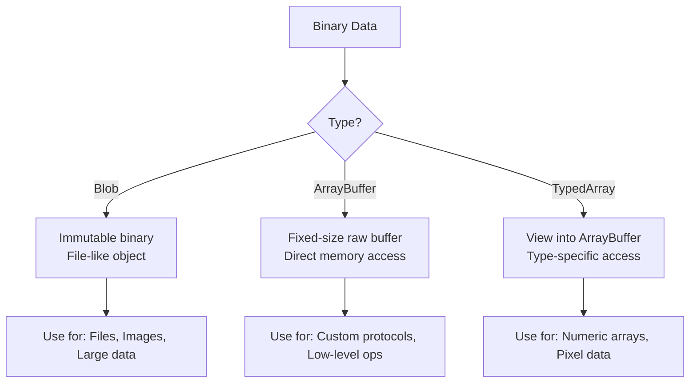

# Sending and Receiving Messages

## Introduction

Once a WebSocket connection is established, the real work begins—exchanging data between client and server. WebSockets support both text and binary messages, making them versatile for everything from JSON-based APIs to real-time audio streaming.

This lesson covers the mechanics of sending data with `send()`, receiving messages through the `message` event, and handling different data formats. We'll explore patterns for structuring messages, working with binary data, and building message queuing systems.

### What we'll cover

- The `send()` method and its data types
- Text messages and JSON serialization
- Binary messages with Blob and ArrayBuffer
- The `binaryType` property
- Message parsing strategies
- Buffered amount and backpressure

### Prerequisites

- Completion of [WebSocket Lifecycle](./02-websocket-lifecycle.md)
- Understanding of JSON serialization
- Familiarity with JavaScript typed arrays (helpful but not required)

---

## The send() method

The `send()` method transmits data to the server through the WebSocket connection. It accepts several data types and returns immediately—the data is queued for transmission.

### Basic usage

```javascript
const socket = new WebSocket("wss://api.example.com/ws");

socket.addEventListener("open", () => {
  // Send a simple text message
  socket.send("Hello, server!");
});
```

### Supported data types

The `send()` method accepts four types of data:

```javascript
// 1. String (text)
socket.send("Plain text message");

// 2. ArrayBuffer (binary)
const buffer = new ArrayBuffer(8);
const view = new Uint8Array(buffer);
view.set([0x48, 0x65, 0x6c, 0x6c, 0x6f, 0x21, 0x00, 0x00]); // "Hello!"
socket.send(buffer);

// 3. ArrayBufferView (typed array)
const data = new Uint8Array([1, 2, 3, 4, 5]);
socket.send(data);

// 4. Blob (binary large object)
const blob = new Blob(["Hello"], { type: "text/plain" });
socket.send(blob);
```

| Data Type | Use Case | Notes |
|-----------|----------|-------|
| `String` | Text, JSON | Most common for web APIs |
| `ArrayBuffer` | Raw binary data | Fixed-length binary |
| `ArrayBufferView` | Typed arrays (Uint8Array, etc.) | Views into ArrayBuffer |
| `Blob` | Files, large binary data | Immutable binary objects |

### Check before sending

Always verify the connection is open before sending:

```javascript
function safeSend(socket, data) {
  if (socket.readyState === WebSocket.OPEN) {
    socket.send(data);
    return true;
  }
  
  const states = ["CONNECTING", "OPEN", "CLOSING", "CLOSED"];
  console.warn(`Cannot send: connection is ${states[socket.readyState]}`);
  return false;
}
```

> **Warning:** Calling `send()` on a closed or closing connection throws an `InvalidStateError`. Always check `readyState` first.

---

## Text messages and JSON

Text is the most common WebSocket message format, especially for structured data using JSON.

### Sending text messages

```javascript
// Simple text
socket.send("Hello, World!");

// JSON object - must stringify
const message = {
  type: "chat",
  user: "Alice",
  text: "Hello everyone!",
  timestamp: Date.now()
};
socket.send(JSON.stringify(message));
```

### Creating a message protocol

Define consistent message structures for your application:

```javascript
// Message factory functions
function createMessage(type, payload) {
  return JSON.stringify({
    type,
    payload,
    timestamp: Date.now(),
    id: crypto.randomUUID()
  });
}

// Specific message types
function sendChatMessage(socket, text) {
  socket.send(createMessage("chat", { text }));
}

function sendTypingIndicator(socket, isTyping) {
  socket.send(createMessage("typing", { isTyping }));
}

function sendSubscribe(socket, channel) {
  socket.send(createMessage("subscribe", { channel }));
}

// Usage
sendChatMessage(socket, "Hello!");
sendTypingIndicator(socket, true);
sendSubscribe(socket, "news");
```

### Receiving and parsing text messages

```javascript
socket.addEventListener("message", (event) => {
  // event.data is always a string for text messages
  console.log("Raw message:", event.data);
  
  // Parse JSON if expected
  try {
    const message = JSON.parse(event.data);
    handleMessage(message);
  } catch (error) {
    // Not JSON - handle as plain text
    console.log("Plain text:", event.data);
  }
});

function handleMessage(message) {
  switch (message.type) {
    case "chat":
      displayChatMessage(message.payload);
      break;
    case "notification":
      showNotification(message.payload);
      break;
    case "error":
      handleError(message.payload);
      break;
    default:
      console.warn("Unknown message type:", message.type);
  }
}
```

### Message validation

Validate received messages before processing:

```javascript
function validateMessage(data) {
  // Check required fields
  if (!data.type || typeof data.type !== "string") {
    throw new Error("Missing or invalid 'type' field");
  }
  
  if (!data.timestamp || typeof data.timestamp !== "number") {
    throw new Error("Missing or invalid 'timestamp' field");
  }
  
  // Type-specific validation
  switch (data.type) {
    case "chat":
      if (!data.payload?.text) {
        throw new Error("Chat message missing 'text'");
      }
      break;
    case "position":
      if (typeof data.payload?.x !== "number" || 
          typeof data.payload?.y !== "number") {
        throw new Error("Position missing x or y coordinates");
      }
      break;
  }
  
  return true;
}

socket.addEventListener("message", (event) => {
  try {
    const message = JSON.parse(event.data);
    validateMessage(message);
    handleMessage(message);
  } catch (error) {
    console.error("Invalid message:", error.message);
  }
});
```

---

## Binary messages

WebSockets support binary data for scenarios where text isn't efficient—like images, audio, or custom binary protocols.

### Understanding binary types



### The binaryType property

The `binaryType` property determines how the browser delivers binary messages:

```javascript
const socket = new WebSocket("wss://api.example.com/ws");

// Default: receive binary as Blob
console.log(socket.binaryType); // "blob"

// Change to receive as ArrayBuffer
socket.binaryType = "arraybuffer";
```

| Value | `event.data` Type | Best For |
|-------|-------------------|----------|
| `"blob"` (default) | `Blob` | Large files, streaming data |
| `"arraybuffer"` | `ArrayBuffer` | Direct byte manipulation |

> **Tip:** Set `binaryType` to `"arraybuffer"` if you need to process binary data immediately. Blobs require additional async steps to read.

### Sending binary data

```javascript
// Send ArrayBuffer
const buffer = new ArrayBuffer(4);
const view = new DataView(buffer);
view.setUint32(0, 12345, false); // Big-endian
socket.send(buffer);

// Send typed array
const bytes = new Uint8Array([0x01, 0x02, 0x03, 0x04]);
socket.send(bytes);

// Send Blob
const blob = new Blob([bytes], { type: "application/octet-stream" });
socket.send(blob);
```

### Receiving binary data

```javascript
// Set up for ArrayBuffer
socket.binaryType = "arraybuffer";

socket.addEventListener("message", (event) => {
  if (event.data instanceof ArrayBuffer) {
    handleBinaryMessage(event.data);
  } else {
    // Text message
    handleTextMessage(event.data);
  }
});

function handleBinaryMessage(buffer) {
  const view = new DataView(buffer);
  
  // Read header (first byte is message type)
  const messageType = view.getUint8(0);
  
  switch (messageType) {
    case 0x01: // Position update
      const x = view.getFloat32(1);
      const y = view.getFloat32(5);
      updatePosition(x, y);
      break;
      
    case 0x02: // Image data
      const imageData = new Uint8Array(buffer, 1);
      displayImage(imageData);
      break;
  }
}
```

### Working with Blob

When `binaryType` is `"blob"`:

```javascript
socket.binaryType = "blob"; // default

socket.addEventListener("message", async (event) => {
  if (event.data instanceof Blob) {
    // Option 1: Convert to ArrayBuffer
    const buffer = await event.data.arrayBuffer();
    processBinaryData(buffer);
    
    // Option 2: Convert to text
    const text = await event.data.text();
    console.log(text);
    
    // Option 3: Create object URL for images
    const url = URL.createObjectURL(event.data);
    img.src = url;
  }
});
```

### Binary message protocol example

A custom binary protocol for game state updates:

```javascript
class BinaryProtocol {
  static MESSAGE_TYPES = {
    POSITION: 0x01,
    HEALTH: 0x02,
    ATTACK: 0x03,
    GAME_STATE: 0x04
  };
  
  // Encode position: [type:1][playerId:2][x:4][y:4][rotation:4] = 15 bytes
  static encodePosition(playerId, x, y, rotation) {
    const buffer = new ArrayBuffer(15);
    const view = new DataView(buffer);
    
    view.setUint8(0, this.MESSAGE_TYPES.POSITION);
    view.setUint16(1, playerId);
    view.setFloat32(3, x);
    view.setFloat32(7, y);
    view.setFloat32(11, rotation);
    
    return buffer;
  }
  
  static decode(buffer) {
    const view = new DataView(buffer);
    const type = view.getUint8(0);
    
    switch (type) {
      case this.MESSAGE_TYPES.POSITION:
        return {
          type: "position",
          playerId: view.getUint16(1),
          x: view.getFloat32(3),
          y: view.getFloat32(7),
          rotation: view.getFloat32(11)
        };
        
      case this.MESSAGE_TYPES.HEALTH:
        return {
          type: "health",
          playerId: view.getUint16(1),
          health: view.getUint8(3),
          maxHealth: view.getUint8(4)
        };
        
      default:
        throw new Error(`Unknown message type: ${type}`);
    }
  }
}

// Usage
socket.binaryType = "arraybuffer";

// Send position
const positionData = BinaryProtocol.encodePosition(42, 100.5, 200.3, 1.57);
socket.send(positionData);

// Receive
socket.addEventListener("message", (event) => {
  if (event.data instanceof ArrayBuffer) {
    const message = BinaryProtocol.decode(event.data);
    console.log("Decoded:", message);
    // { type: "position", playerId: 42, x: 100.5, y: 200.3, rotation: 1.57 }
  }
});
```

---

## Message parsing strategies

Different applications need different approaches to parsing incoming messages.

### Type-based dispatch

```javascript
class MessageHandler {
  constructor() {
    this.handlers = new Map();
  }
  
  register(type, handler) {
    this.handlers.set(type, handler);
    return this;
  }
  
  handle(event) {
    const message = JSON.parse(event.data);
    const handler = this.handlers.get(message.type);
    
    if (handler) {
      handler(message.payload, message);
    } else {
      console.warn("No handler for:", message.type);
    }
  }
}

const handler = new MessageHandler();

handler
  .register("user:joined", (payload) => {
    console.log(`${payload.username} joined`);
  })
  .register("user:left", (payload) => {
    console.log(`${payload.username} left`);
  })
  .register("chat:message", (payload) => {
    displayMessage(payload);
  })
  .register("system:notification", (payload) => {
    showNotification(payload.message);
  });

socket.addEventListener("message", (event) => handler.handle(event));
```

### Namespace-based routing

For larger applications, organize handlers by namespace:

```javascript
class MessageRouter {
  constructor() {
    this.namespaces = new Map();
  }
  
  namespace(name) {
    if (!this.namespaces.has(name)) {
      this.namespaces.set(name, new Map());
    }
    
    const handlers = this.namespaces.get(name);
    
    return {
      on: (action, handler) => {
        handlers.set(action, handler);
        return this;
      }
    };
  }
  
  route(event) {
    const message = JSON.parse(event.data);
    const [namespace, action] = message.type.split(":");
    
    const handlers = this.namespaces.get(namespace);
    if (handlers?.has(action)) {
      handlers.get(action)(message.payload, message);
    }
  }
}

const router = new MessageRouter();

// Define handlers by namespace
router.namespace("chat")
  .on("message", (payload) => displayChat(payload))
  .on("typing", (payload) => showTypingIndicator(payload));

router.namespace("game")
  .on("start", (payload) => startGame(payload))
  .on("move", (payload) => processMove(payload))
  .on("end", (payload) => endGame(payload));

router.namespace("system")
  .on("error", (payload) => handleError(payload))
  .on("ping", () => socket.send(JSON.stringify({ type: "system:pong" })));

socket.addEventListener("message", (event) => router.route(event));
```

### Request-response pattern

Implement request-response over WebSocket:

```javascript
class WebSocketRPC {
  constructor(socket) {
    this.socket = socket;
    this.pendingRequests = new Map();
    this.requestId = 0;
    
    socket.addEventListener("message", (event) => {
      const message = JSON.parse(event.data);
      
      if (message.type === "response") {
        this.handleResponse(message);
      }
    });
  }
  
  request(method, params, timeout = 5000) {
    return new Promise((resolve, reject) => {
      const id = ++this.requestId;
      
      // Set up timeout
      const timer = setTimeout(() => {
        this.pendingRequests.delete(id);
        reject(new Error(`Request ${method} timed out`));
      }, timeout);
      
      // Store pending request
      this.pendingRequests.set(id, {
        resolve: (result) => {
          clearTimeout(timer);
          resolve(result);
        },
        reject: (error) => {
          clearTimeout(timer);
          reject(error);
        }
      });
      
      // Send request
      this.socket.send(JSON.stringify({
        type: "request",
        id,
        method,
        params
      }));
    });
  }
  
  handleResponse(message) {
    const pending = this.pendingRequests.get(message.id);
    
    if (pending) {
      this.pendingRequests.delete(message.id);
      
      if (message.error) {
        pending.reject(new Error(message.error));
      } else {
        pending.resolve(message.result);
      }
    }
  }
}

// Usage
const rpc = new WebSocketRPC(socket);

async function fetchUserData(userId) {
  try {
    const user = await rpc.request("getUser", { id: userId });
    console.log("User:", user);
  } catch (error) {
    console.error("Failed:", error.message);
  }
}
```

---

## Buffered amount and backpressure

The `bufferedAmount` property shows how much data is queued for transmission. This is crucial for preventing memory issues with high-throughput applications.

### Understanding bufferedAmount

```javascript
socket.addEventListener("open", () => {
  // Check bytes waiting to be sent
  console.log("Buffered:", socket.bufferedAmount, "bytes");
  
  socket.send("Hello");
  console.log("After send:", socket.bufferedAmount, "bytes");
});
```

### Implementing backpressure

Prevent overwhelming the connection:

```javascript
class ThrottledSocket {
  constructor(socket, maxBufferSize = 64 * 1024) { // 64KB
    this.socket = socket;
    this.maxBufferSize = maxBufferSize;
    this.queue = [];
    this.draining = false;
  }
  
  send(data) {
    // If buffer is too full, queue the message
    if (this.socket.bufferedAmount > this.maxBufferSize) {
      this.queue.push(data);
      this.startDrain();
      return false;
    }
    
    this.socket.send(data);
    return true;
  }
  
  startDrain() {
    if (this.draining) return;
    this.draining = true;
    this.drain();
  }
  
  drain() {
    // Check if we can send more
    if (this.socket.bufferedAmount < this.maxBufferSize && this.queue.length > 0) {
      this.socket.send(this.queue.shift());
    }
    
    // Continue draining if needed
    if (this.queue.length > 0) {
      requestAnimationFrame(() => this.drain());
    } else {
      this.draining = false;
    }
  }
  
  get queuedCount() {
    return this.queue.length;
  }
}

// Usage for high-frequency updates
const throttled = new ThrottledSocket(socket);

// Game loop sending position updates
function gameLoop() {
  throttled.send(JSON.stringify({
    type: "position",
    x: player.x,
    y: player.y
  }));
  
  if (throttled.queuedCount > 10) {
    console.warn("Falling behind:", throttled.queuedCount, "messages queued");
  }
  
  requestAnimationFrame(gameLoop);
}
```

### Monitoring buffer status

```javascript
function monitorBuffer(socket) {
  const WARN_THRESHOLD = 32 * 1024;  // 32KB
  const CRITICAL_THRESHOLD = 128 * 1024; // 128KB
  
  setInterval(() => {
    const buffered = socket.bufferedAmount;
    
    if (buffered > CRITICAL_THRESHOLD) {
      console.error(`Critical: ${buffered} bytes buffered`);
    } else if (buffered > WARN_THRESHOLD) {
      console.warn(`Warning: ${buffered} bytes buffered`);
    }
  }, 1000);
}
```

---

## Message queuing

Handle messages sent before connection is ready:

```javascript
class QueuedSocket {
  constructor(url) {
    this.url = url;
    this.socket = null;
    this.queue = [];
    this.isConnected = false;
    
    this.connect();
  }
  
  connect() {
    this.socket = new WebSocket(this.url);
    
    this.socket.onopen = () => {
      this.isConnected = true;
      this.flushQueue();
    };
    
    this.socket.onclose = () => {
      this.isConnected = false;
    };
  }
  
  send(data) {
    if (this.isConnected) {
      this.socket.send(
        typeof data === "string" ? data : JSON.stringify(data)
      );
    } else {
      this.queue.push(data);
    }
  }
  
  flushQueue() {
    while (this.queue.length > 0 && this.isConnected) {
      const data = this.queue.shift();
      this.socket.send(
        typeof data === "string" ? data : JSON.stringify(data)
      );
    }
  }
}

// Messages are queued until connection opens
const socket = new QueuedSocket("wss://api.example.com/ws");

// These will be queued and sent when connected
socket.send({ type: "auth", token: "abc123" });
socket.send({ type: "subscribe", channel: "updates" });
```

### Priority queues

Some messages are more important than others:

```javascript
class PrioritySocket {
  constructor(socket) {
    this.socket = socket;
    this.highPriority = [];
    this.normalPriority = [];
    this.lowPriority = [];
  }
  
  send(data, priority = "normal") {
    if (this.socket.readyState !== WebSocket.OPEN) {
      const queue = this.getQueue(priority);
      queue.push(data);
      return;
    }
    
    this.socket.send(JSON.stringify(data));
  }
  
  getQueue(priority) {
    switch (priority) {
      case "high": return this.highPriority;
      case "low": return this.lowPriority;
      default: return this.normalPriority;
    }
  }
  
  flush() {
    // Send high priority first
    while (this.highPriority.length > 0) {
      this.socket.send(JSON.stringify(this.highPriority.shift()));
    }
    
    // Then normal
    while (this.normalPriority.length > 0) {
      this.socket.send(JSON.stringify(this.normalPriority.shift()));
    }
    
    // Then low
    while (this.lowPriority.length > 0) {
      this.socket.send(JSON.stringify(this.lowPriority.shift()));
    }
  }
}

// Usage
const prioritySocket = new PrioritySocket(socket);

// Game actions are high priority
prioritySocket.send({ type: "attack", target: 123 }, "high");

// Chat messages are normal
prioritySocket.send({ type: "chat", text: "Hello" }, "normal");

// Analytics are low priority
prioritySocket.send({ type: "analytics", event: "view" }, "low");
```

---

## Best practices

| Practice | Why It Matters |
|----------|----------------|
| Always check `readyState` before sending | Prevents InvalidStateError exceptions |
| Use JSON for structured data | Human-readable, self-describing, easy debugging |
| Set `binaryType` before receiving binary | Ensures consistent data format |
| Validate all received messages | Protects against malformed data |
| Monitor `bufferedAmount` | Prevents memory issues with high throughput |
| Implement message queuing | No lost messages during connection issues |

---

## Common pitfalls

| ❌ Mistake | ✅ Solution |
|-----------|-------------|
| Sending objects directly | Always `JSON.stringify()` objects before sending |
| Ignoring parse errors | Wrap `JSON.parse()` in try-catch |
| Not setting `binaryType` | Set it explicitly based on your needs |
| Unbounded message queues | Limit queue size or drop old messages |
| No message validation | Validate structure and types of received data |
| Synchronous Blob processing | Use async methods like `blob.arrayBuffer()` |

---

## Hands-on exercise

### Your task

Build a message protocol for a simple multiplayer drawing application that supports both text commands and binary drawing data.

### Requirements

1. Create a protocol with two message types:
   - Text commands: `clear`, `changeColor`, `changeBrush`
   - Binary: Drawing strokes (array of x,y coordinates)
2. Implement send functions for each message type
3. Implement a receiver that handles both types
4. Add validation for incoming messages

### Expected result

```javascript
// Sending
sendCommand(socket, "changeColor", { color: "#ff0000" });
sendStroke(socket, [{ x: 10, y: 20 }, { x: 30, y: 40 }]);

// Receiving (console output)
Command received: changeColor { color: "#ff0000" }
Stroke received: 2 points
```

<details>
<summary>💡 Hints (click to expand)</summary>

- Use JSON for text commands with a `type` field
- For binary strokes, encode x,y as Float32 (4 bytes each)
- Check `instanceof ArrayBuffer` to detect binary messages
- Use DataView for reading/writing binary data

</details>

<details>
<summary>✅ Solution (click to expand)</summary>

```javascript
// Drawing Protocol Implementation

// Message types
const MESSAGE_TYPES = {
  COMMAND: "command",
  STROKE: 0x01  // Binary type identifier
};

// Send text command
function sendCommand(socket, action, params = {}) {
  if (socket.readyState !== WebSocket.OPEN) {
    console.error("Socket not open");
    return false;
  }
  
  const message = {
    type: MESSAGE_TYPES.COMMAND,
    action,
    params,
    timestamp: Date.now()
  };
  
  socket.send(JSON.stringify(message));
  console.log("Sent command:", action, params);
  return true;
}

// Send binary stroke data
function sendStroke(socket, points) {
  if (socket.readyState !== WebSocket.OPEN) {
    console.error("Socket not open");
    return false;
  }
  
  // Format: [type:1][pointCount:2][x:4,y:4,x:4,y:4,...]
  const headerSize = 3;
  const pointSize = 8; // 4 bytes x + 4 bytes y
  const buffer = new ArrayBuffer(headerSize + points.length * pointSize);
  const view = new DataView(buffer);
  
  // Write header
  view.setUint8(0, MESSAGE_TYPES.STROKE);
  view.setUint16(1, points.length);
  
  // Write points
  points.forEach((point, i) => {
    const offset = headerSize + i * pointSize;
    view.setFloat32(offset, point.x);
    view.setFloat32(offset + 4, point.y);
  });
  
  socket.send(buffer);
  console.log("Sent stroke:", points.length, "points");
  return true;
}

// Receive and parse messages
function setupReceiver(socket, handlers) {
  socket.binaryType = "arraybuffer";
  
  socket.addEventListener("message", (event) => {
    try {
      if (event.data instanceof ArrayBuffer) {
        handleBinaryMessage(event.data, handlers);
      } else {
        handleTextMessage(event.data, handlers);
      }
    } catch (error) {
      console.error("Error processing message:", error);
    }
  });
}

function handleTextMessage(data, handlers) {
  const message = JSON.parse(data);
  
  // Validate
  if (!message.type || !message.action) {
    throw new Error("Invalid command format");
  }
  
  console.log("Command received:", message.action, message.params);
  
  if (handlers.onCommand) {
    handlers.onCommand(message.action, message.params);
  }
}

function handleBinaryMessage(buffer, handlers) {
  const view = new DataView(buffer);
  const type = view.getUint8(0);
  
  if (type !== MESSAGE_TYPES.STROKE) {
    throw new Error(`Unknown binary type: ${type}`);
  }
  
  const pointCount = view.getUint16(1);
  const points = [];
  
  for (let i = 0; i < pointCount; i++) {
    const offset = 3 + i * 8;
    points.push({
      x: view.getFloat32(offset),
      y: view.getFloat32(offset + 4)
    });
  }
  
  console.log("Stroke received:", points.length, "points");
  
  if (handlers.onStroke) {
    handlers.onStroke(points);
  }
}

// Usage example
const socket = new WebSocket("wss://echo.websocket.org/");

socket.addEventListener("open", () => {
  setupReceiver(socket, {
    onCommand: (action, params) => {
      console.log("Handling command:", action, params);
    },
    onStroke: (points) => {
      console.log("Drawing stroke with points:", points);
    }
  });
  
  // Test sending
  sendCommand(socket, "changeColor", { color: "#ff0000" });
  sendStroke(socket, [{ x: 10, y: 20 }, { x: 30, y: 40 }, { x: 50, y: 60 }]);
});
```

</details>

### Bonus challenges

- [ ] Add a `sendImage()` function that sends a canvas as a PNG blob
- [ ] Implement message compression for large stroke data
- [ ] Add message acknowledgment (server confirms receipt)
- [ ] Create a message rate limiter (max N messages per second)

---

## Summary

✅ The `send()` method accepts strings, ArrayBuffer, ArrayBufferView, and Blob

✅ Text messages are ideal for JSON-based protocols; binary for efficient data transfer

✅ Set `binaryType` to `"arraybuffer"` for direct byte manipulation, `"blob"` for file-like data

✅ Use typed arrays (DataView, Uint8Array) for encoding/decoding binary protocols

✅ Monitor `bufferedAmount` to implement backpressure and prevent memory issues

✅ Queue messages sent before connection opens to prevent data loss

**Next:** [Reconnection Strategies](./04-reconnection-strategies.md)

---

## Further reading

- [MDN: WebSocket.send()](https://developer.mozilla.org/en-US/docs/Web/API/WebSocket/send) - Send method reference
- [MDN: WebSocket.binaryType](https://developer.mozilla.org/en-US/docs/Web/API/WebSocket/binaryType) - Binary type property
- [MDN: ArrayBuffer](https://developer.mozilla.org/en-US/docs/Web/JavaScript/Reference/Global_Objects/ArrayBuffer) - Binary data fundamentals
- [MDN: DataView](https://developer.mozilla.org/en-US/docs/Web/JavaScript/Reference/Global_Objects/DataView) - Reading/writing binary data

<!--
Sources Consulted:
- MDN WebSocket.send(): https://developer.mozilla.org/en-US/docs/Web/API/WebSocket/send
- MDN WebSocket.binaryType: https://developer.mozilla.org/en-US/docs/Web/API/WebSocket/binaryType
- MDN WebSocket.bufferedAmount: https://developer.mozilla.org/en-US/docs/Web/API/WebSocket/bufferedAmount
-->
