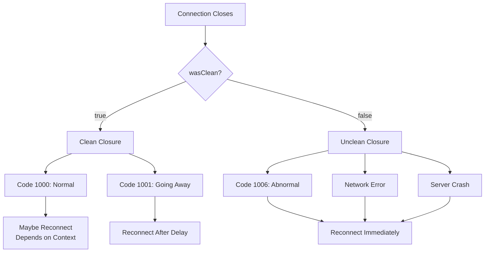
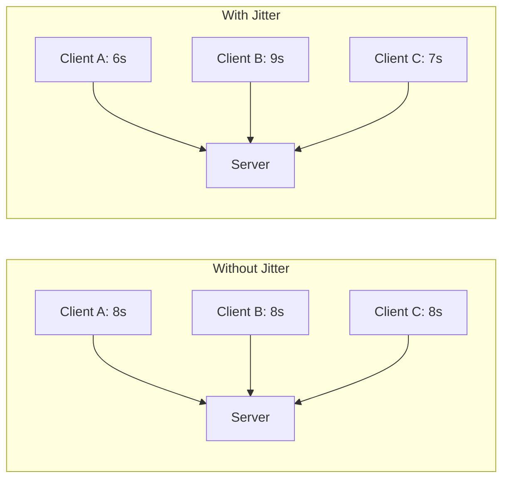
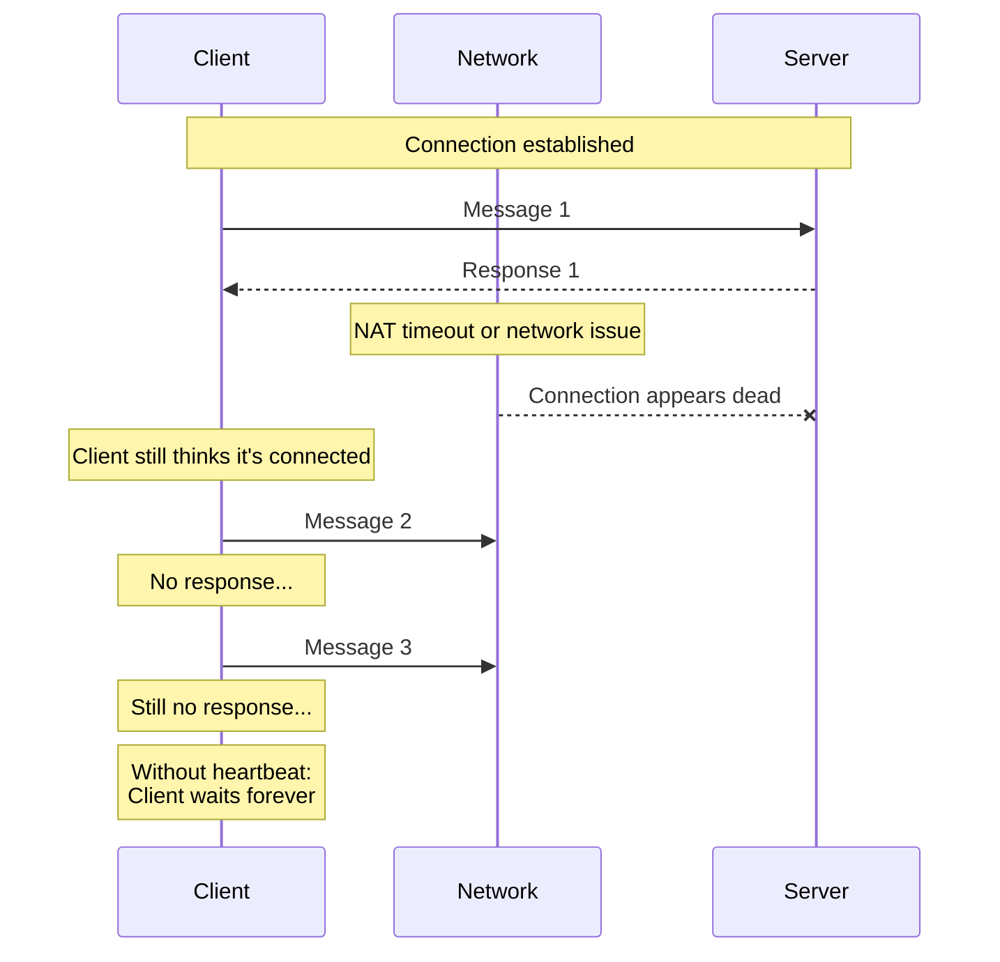
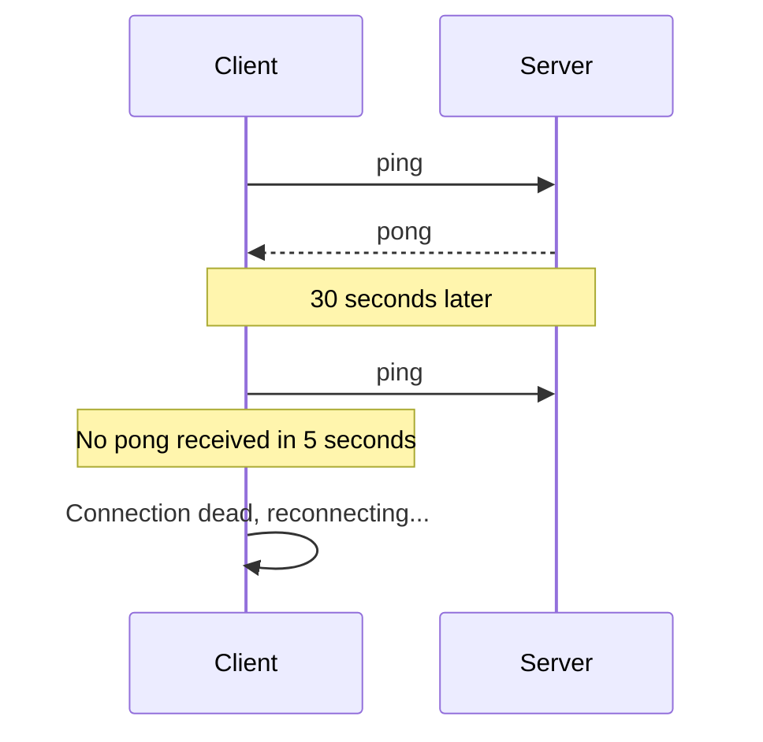

# Reconnection Strategies

## Introduction

Network connections fail. Wi-Fi drops, cellular networks switch towers, servers restart, and laptops wake from sleep. A robust WebSocket application doesn't just handle these interruptions—it recovers from them seamlessly, keeping users informed while quietly restoring connectivity.

This lesson covers the essential techniques for building resilient WebSocket connections: detecting disconnections, implementing exponential backoff, maintaining heartbeats, and managing state during reconnection. By the end, you'll have a complete reconnection system ready for production use.

### What we'll cover

- Detecting disconnections (expected and unexpected)
- Exponential backoff with jitter
- Maximum retry limits and giving up gracefully
- Heartbeat/ping-pong patterns
- Connection state management
- Graceful reconnection with state recovery

### Prerequisites

- Completion of [WebSocket Messages](./03-websocket-messages.md)
- Understanding of JavaScript timers (`setTimeout`, `setInterval`)
- Familiarity with asynchronous programming patterns

---

## Detecting disconnection

The first step in reconnection is knowing when you've disconnected. WebSockets provide multiple signals, each with different implications.

### The close event

The `close` event fires whenever a connection ends:

```javascript
socket.addEventListener("close", (event) => {
  console.log("Connection closed");
  console.log("Code:", event.code);
  console.log("Reason:", event.reason);
  console.log("Clean:", event.wasClean);
});
```

### Clean vs unclean closures



| `wasClean` | Meaning | Action |
|------------|---------|--------|
| `true` | Proper close handshake completed | May or may not reconnect |
| `false` | Connection lost unexpectedly | Usually should reconnect |

### Distinguishing closure types

```javascript
function handleClose(event) {
  if (event.wasClean) {
    switch (event.code) {
      case 1000: // Normal closure
        console.log("Server closed connection normally");
        // Don't reconnect - intentional close
        break;
        
      case 1001: // Going away
        console.log("Server is restarting");
        // Wait a bit, then reconnect
        setTimeout(() => reconnect(), 5000);
        break;
        
      case 4000: // Custom: session expired
        console.log("Session expired");
        // Redirect to login
        window.location.href = "/login";
        break;
        
      default:
        console.log("Unexpected clean close:", event.code);
        reconnect();
    }
  } else {
    // Unclean closure - connection was lost
    console.log("Connection lost unexpectedly");
    reconnect();
  }
}
```

### Detecting stale connections

Sometimes connections appear open but are actually dead. The socket reports `readyState === OPEN`, but messages aren't getting through. This happens with:

- NAT timeout (router drops idle connection)
- Mobile network switches
- Laptop sleep/wake cycles
- Intermediate proxy failures

**Solution: Heartbeat monitoring** (covered later in this lesson)

---

## Exponential backoff

When reconnecting, don't hammer the server with rapid retry attempts. Use exponential backoff—wait longer between each attempt.

### The concept

```
Attempt 1: Wait 1 second
Attempt 2: Wait 2 seconds
Attempt 3: Wait 4 seconds
Attempt 4: Wait 8 seconds
Attempt 5: Wait 16 seconds
...
```

Each wait time doubles, reducing server load during outages and giving the network time to recover.

### Basic implementation

```javascript
class ReconnectingSocket {
  constructor(url, options = {}) {
    this.url = url;
    this.options = {
      initialDelay: 1000,    // Start with 1 second
      maxDelay: 30000,       // Cap at 30 seconds
      multiplier: 2,         // Double each time
      ...options
    };
    
    this.retryCount = 0;
    this.connect();
  }
  
  connect() {
    this.socket = new WebSocket(this.url);
    
    this.socket.onopen = () => {
      console.log("Connected");
      this.retryCount = 0; // Reset on success
    };
    
    this.socket.onclose = (event) => {
      if (!event.wasClean) {
        this.scheduleReconnect();
      }
    };
  }
  
  scheduleReconnect() {
    const delay = Math.min(
      this.options.initialDelay * Math.pow(this.options.multiplier, this.retryCount),
      this.options.maxDelay
    );
    
    this.retryCount++;
    
    console.log(`Reconnecting in ${delay}ms (attempt ${this.retryCount})`);
    
    setTimeout(() => this.connect(), delay);
  }
}
```

### Adding jitter

In distributed systems, many clients might disconnect simultaneously (e.g., server restart). If they all reconnect at the same time, it creates a "thundering herd" that can overwhelm the server.

**Solution: Add random jitter**

```javascript
function calculateBackoff(attempt, options) {
  const { initialDelay, maxDelay, multiplier, jitterFactor = 0.5 } = options;
  
  // Calculate base delay with exponential backoff
  const exponentialDelay = initialDelay * Math.pow(multiplier, attempt);
  
  // Apply maximum cap
  const cappedDelay = Math.min(exponentialDelay, maxDelay);
  
  // Add jitter: random value between -jitter% and +jitter%
  const jitter = cappedDelay * jitterFactor * (Math.random() * 2 - 1);
  
  // Ensure non-negative
  return Math.max(0, cappedDelay + jitter);
}

// Example outputs for attempt 3 with jitterFactor 0.5:
// Base: 8000ms
// Possible range: 4000ms to 12000ms
```

### Visualizing backoff with jitter



---

## Maximum retry limits

Infinite retries aren't always appropriate. After many failures, something might be fundamentally wrong—the server might be down for maintenance, the URL might have changed, or the user might have lost all connectivity.

### Setting limits

```javascript
class LimitedReconnectSocket {
  constructor(url, options = {}) {
    this.url = url;
    this.options = {
      maxRetries: 10,
      initialDelay: 1000,
      maxDelay: 30000,
      ...options
    };
    
    this.retryCount = 0;
    this.isGivingUp = false;
    this.connect();
  }
  
  scheduleReconnect() {
    if (this.retryCount >= this.options.maxRetries) {
      this.giveUp();
      return;
    }
    
    const delay = this.calculateDelay();
    this.retryCount++;
    
    console.log(
      `Reconnecting in ${delay}ms ` +
      `(attempt ${this.retryCount}/${this.options.maxRetries})`
    );
    
    this.reconnectTimer = setTimeout(() => this.connect(), delay);
  }
  
  calculateDelay() {
    const base = this.options.initialDelay * Math.pow(2, this.retryCount);
    const capped = Math.min(base, this.options.maxDelay);
    const jitter = capped * 0.5 * (Math.random() * 2 - 1);
    return Math.max(0, capped + jitter);
  }
  
  giveUp() {
    this.isGivingUp = true;
    console.error("Max retries reached. Giving up.");
    
    // Notify the application
    this.onGiveUp?.();
    
    // Optional: Show user a "reconnect" button
    this.showReconnectUI();
  }
  
  showReconnectUI() {
    // Application-specific UI
    console.log("User can manually trigger reconnection");
  }
  
  manualReconnect() {
    this.retryCount = 0;
    this.isGivingUp = false;
    this.connect();
  }
}
```

### Retry strategies by scenario

| Scenario | Recommended Limit | Rationale |
|----------|-------------------|-----------|
| Real-time chat | 10-15 retries | Keep trying, connection is critical |
| Live dashboard | 5-10 retries | Can show stale data while reconnecting |
| Background sync | 3-5 retries | Retry next sync cycle instead |
| One-time operation | 2-3 retries | Fail fast and report error |

---

## Heartbeat/ping-pong patterns

A heartbeat is a periodic message sent to verify the connection is still alive. If no response comes back, the connection is considered dead and should be closed and reopened.

### Why heartbeats matter



With heartbeat:



### Implementing heartbeat

```javascript
class HeartbeatSocket {
  constructor(url, options = {}) {
    this.url = url;
    this.options = {
      heartbeatInterval: 30000,  // Send ping every 30s
      heartbeatTimeout: 5000,    // Wait 5s for pong
      ...options
    };
    
    this.heartbeatTimer = null;
    this.pongTimer = null;
    this.connect();
  }
  
  connect() {
    this.socket = new WebSocket(this.url);
    
    this.socket.onopen = () => {
      console.log("Connected, starting heartbeat");
      this.startHeartbeat();
    };
    
    this.socket.onmessage = (event) => {
      const data = JSON.parse(event.data);
      
      if (data.type === "pong") {
        this.handlePong();
      } else {
        this.onMessage?.(data);
      }
    };
    
    this.socket.onclose = () => {
      this.stopHeartbeat();
      this.scheduleReconnect();
    };
  }
  
  startHeartbeat() {
    this.heartbeatTimer = setInterval(() => {
      this.sendPing();
    }, this.options.heartbeatInterval);
  }
  
  stopHeartbeat() {
    clearInterval(this.heartbeatTimer);
    clearTimeout(this.pongTimer);
  }
  
  sendPing() {
    if (this.socket.readyState !== WebSocket.OPEN) return;
    
    console.log("Sending ping");
    this.socket.send(JSON.stringify({ type: "ping", timestamp: Date.now() }));
    
    // Start timeout for pong
    this.pongTimer = setTimeout(() => {
      console.error("Pong not received, connection dead");
      this.socket.close(4000, "Heartbeat timeout");
    }, this.options.heartbeatTimeout);
  }
  
  handlePong() {
    console.log("Pong received");
    clearTimeout(this.pongTimer);
  }
  
  scheduleReconnect() {
    // Reconnection logic here
  }
}
```

### Server-side ping/pong

WebSocket protocol includes native ping/pong frames. Many servers send these automatically. However, you can't access protocol-level pings from JavaScript—they're handled by the browser.

For full control, implement application-level pings:

```javascript
// Server (Node.js with ws library)
const WebSocket = require("ws");
const wss = new WebSocket.Server({ port: 8080 });

wss.on("connection", (ws) => {
  ws.isAlive = true;
  
  ws.on("message", (message) => {
    const data = JSON.parse(message);
    
    if (data.type === "ping") {
      ws.send(JSON.stringify({ type: "pong", timestamp: data.timestamp }));
    }
  });
  
  ws.on("pong", () => {
    ws.isAlive = true; // Native pong response
  });
});

// Server-side heartbeat check
const interval = setInterval(() => {
  wss.clients.forEach((ws) => {
    if (ws.isAlive === false) {
      return ws.terminate();
    }
    
    ws.isAlive = false;
    ws.ping(); // Native ping
  });
}, 30000);
```

### Heartbeat best practices

| Setting | Recommended Value | Reason |
|---------|-------------------|--------|
| Ping interval | 20-30 seconds | Balance between detection speed and overhead |
| Pong timeout | 5-10 seconds | Allow for network latency |
| Start heartbeat | After `open` event | Don't ping before connected |
| Stop heartbeat | On `close` event | Prevent errors on closed socket |

---

## Connection state management

During reconnection, your application needs to track what state to restore. This includes:

- Subscriptions (channels, topics)
- Authentication
- Last received message ID
- Pending outgoing messages

### State tracking

```javascript
class StatefulSocket {
  constructor(url) {
    this.url = url;
    this.subscriptions = new Set();
    this.lastMessageId = null;
    this.pendingMessages = [];
    this.isAuthenticated = false;
    
    this.connect();
  }
  
  connect() {
    this.socket = new WebSocket(this.url);
    
    this.socket.onopen = () => {
      this.restoreState();
    };
    
    this.socket.onmessage = (event) => {
      const data = JSON.parse(event.data);
      
      // Track message IDs for resumption
      if (data.id) {
        this.lastMessageId = data.id;
      }
      
      this.handleMessage(data);
    };
    
    this.socket.onclose = () => {
      this.scheduleReconnect();
    };
  }
  
  async restoreState() {
    console.log("Restoring connection state...");
    
    // 1. Re-authenticate
    if (this.authToken) {
      await this.authenticate(this.authToken);
    }
    
    // 2. Resubscribe to channels
    for (const channel of this.subscriptions) {
      this.sendSubscribe(channel);
    }
    
    // 3. Request missed messages
    if (this.lastMessageId) {
      this.requestMissedMessages(this.lastMessageId);
    }
    
    // 4. Flush pending messages
    this.flushPendingMessages();
    
    console.log("State restored");
  }
  
  subscribe(channel) {
    this.subscriptions.add(channel);
    
    if (this.socket.readyState === WebSocket.OPEN) {
      this.sendSubscribe(channel);
    }
  }
  
  sendSubscribe(channel) {
    this.socket.send(JSON.stringify({
      type: "subscribe",
      channel
    }));
  }
  
  requestMissedMessages(lastId) {
    this.socket.send(JSON.stringify({
      type: "replay",
      afterId: lastId
    }));
  }
  
  flushPendingMessages() {
    while (this.pendingMessages.length > 0) {
      const message = this.pendingMessages.shift();
      this.socket.send(JSON.stringify(message));
    }
  }
  
  send(message) {
    if (this.socket.readyState === WebSocket.OPEN) {
      this.socket.send(JSON.stringify(message));
    } else {
      this.pendingMessages.push(message);
    }
  }
}
```

### Idempotency and deduplication

When reconnecting, you might receive duplicate messages or resend messages that already arrived at the server. Use IDs to handle this:

```javascript
class IdempotentSocket {
  constructor(url) {
    this.processedMessageIds = new Set();
    this.maxProcessedIds = 1000; // Prevent memory bloat
    // ... rest of constructor
  }
  
  handleMessage(data) {
    // Skip if we've seen this message
    if (data.id && this.processedMessageIds.has(data.id)) {
      console.log("Skipping duplicate message:", data.id);
      return;
    }
    
    // Track processed messages
    if (data.id) {
      this.processedMessageIds.add(data.id);
      
      // Clean up old IDs
      if (this.processedMessageIds.size > this.maxProcessedIds) {
        const oldest = this.processedMessageIds.values().next().value;
        this.processedMessageIds.delete(oldest);
      }
    }
    
    // Process the message
    this.onMessage?.(data);
  }
  
  send(message) {
    // Add unique ID to outgoing messages
    const messageWithId = {
      ...message,
      clientId: crypto.randomUUID()
    };
    
    // Server should deduplicate based on clientId
    this.socket.send(JSON.stringify(messageWithId));
  }
}
```

---

## Graceful reconnection

Put it all together into a production-ready reconnection system:

```javascript
class RobustWebSocket {
  constructor(url, options = {}) {
    this.url = url;
    this.options = {
      // Reconnection
      initialDelay: 1000,
      maxDelay: 30000,
      maxRetries: 10,
      jitter: 0.5,
      
      // Heartbeat
      heartbeatInterval: 30000,
      heartbeatTimeout: 5000,
      
      // Callbacks
      onConnect: null,
      onDisconnect: null,
      onMessage: null,
      onError: null,
      onReconnecting: null,
      onGiveUp: null,
      
      ...options
    };
    
    // State
    this.socket = null;
    this.retryCount = 0;
    this.reconnectTimer = null;
    this.heartbeatTimer = null;
    this.pongTimer = null;
    this.isIntentionallyClosed = false;
    this.subscriptions = new Set();
    this.messageQueue = [];
    this.lastMessageId = null;
    
    this.connect();
  }
  
  // Connection management
  connect() {
    this.socket = new WebSocket(this.url);
    
    this.socket.onopen = () => this.handleOpen();
    this.socket.onmessage = (event) => this.handleMessage(event);
    this.socket.onerror = (event) => this.handleError(event);
    this.socket.onclose = (event) => this.handleClose(event);
  }
  
  handleOpen() {
    console.log("Connected");
    this.retryCount = 0;
    this.startHeartbeat();
    this.restoreState();
    this.options.onConnect?.();
  }
  
  handleMessage(event) {
    const data = JSON.parse(event.data);
    
    if (data.type === "pong") {
      clearTimeout(this.pongTimer);
      return;
    }
    
    if (data.id) {
      this.lastMessageId = data.id;
    }
    
    this.options.onMessage?.(data);
  }
  
  handleError(event) {
    console.error("WebSocket error");
    this.options.onError?.(event);
  }
  
  handleClose(event) {
    this.stopHeartbeat();
    this.options.onDisconnect?.({ code: event.code, reason: event.reason });
    
    if (!this.isIntentionallyClosed) {
      this.scheduleReconnect();
    }
  }
  
  // Reconnection
  scheduleReconnect() {
    if (this.retryCount >= this.options.maxRetries) {
      console.error("Max retries reached");
      this.options.onGiveUp?.();
      return;
    }
    
    const delay = this.calculateDelay();
    this.retryCount++;
    
    console.log(`Reconnecting in ${Math.round(delay)}ms (${this.retryCount}/${this.options.maxRetries})`);
    
    this.options.onReconnecting?.({
      attempt: this.retryCount,
      maxRetries: this.options.maxRetries,
      delay
    });
    
    this.reconnectTimer = setTimeout(() => this.connect(), delay);
  }
  
  calculateDelay() {
    const { initialDelay, maxDelay, jitter } = this.options;
    const exponential = initialDelay * Math.pow(2, this.retryCount);
    const capped = Math.min(exponential, maxDelay);
    const jitterAmount = capped * jitter * (Math.random() * 2 - 1);
    return Math.max(0, capped + jitterAmount);
  }
  
  // Heartbeat
  startHeartbeat() {
    this.heartbeatTimer = setInterval(() => {
      this.sendPing();
    }, this.options.heartbeatInterval);
  }
  
  stopHeartbeat() {
    clearInterval(this.heartbeatTimer);
    clearTimeout(this.pongTimer);
  }
  
  sendPing() {
    if (this.socket.readyState !== WebSocket.OPEN) return;
    
    this.socket.send(JSON.stringify({ type: "ping" }));
    
    this.pongTimer = setTimeout(() => {
      console.error("Heartbeat timeout");
      this.socket.close(4001, "Heartbeat timeout");
    }, this.options.heartbeatTimeout);
  }
  
  // State management
  restoreState() {
    // Resubscribe
    for (const channel of this.subscriptions) {
      this.sendRaw({ type: "subscribe", channel });
    }
    
    // Request missed messages
    if (this.lastMessageId) {
      this.sendRaw({ type: "replay", afterId: this.lastMessageId });
    }
    
    // Flush queue
    while (this.messageQueue.length > 0) {
      this.sendRaw(this.messageQueue.shift());
    }
  }
  
  // Public API
  send(data) {
    const message = typeof data === "string" ? data : JSON.stringify(data);
    
    if (this.socket.readyState === WebSocket.OPEN) {
      this.socket.send(message);
    } else {
      this.messageQueue.push(data);
    }
  }
  
  sendRaw(data) {
    if (this.socket.readyState === WebSocket.OPEN) {
      this.socket.send(JSON.stringify(data));
    }
  }
  
  subscribe(channel) {
    this.subscriptions.add(channel);
    this.send({ type: "subscribe", channel });
  }
  
  unsubscribe(channel) {
    this.subscriptions.delete(channel);
    this.send({ type: "unsubscribe", channel });
  }
  
  close() {
    this.isIntentionallyClosed = true;
    clearTimeout(this.reconnectTimer);
    this.stopHeartbeat();
    this.socket.close(1000, "Client closing");
  }
  
  // Manual reconnect (after give up)
  reconnect() {
    this.retryCount = 0;
    this.isIntentionallyClosed = false;
    this.connect();
  }
}

// Usage
const ws = new RobustWebSocket("wss://api.example.com/ws", {
  onConnect: () => {
    console.log("✅ Connected");
    ws.subscribe("updates");
  },
  onDisconnect: ({ code, reason }) => {
    console.log(`❌ Disconnected: ${code} ${reason}`);
  },
  onMessage: (data) => {
    console.log("📨 Message:", data);
  },
  onReconnecting: ({ attempt, maxRetries, delay }) => {
    console.log(`🔄 Reconnecting ${attempt}/${maxRetries} in ${delay}ms`);
  },
  onGiveUp: () => {
    console.log("💀 Giving up, show reconnect button to user");
  }
});
```

---

## Best practices

| Practice | Why It Matters |
|----------|----------------|
| Use exponential backoff | Prevents overwhelming server during outages |
| Add jitter to backoff | Prevents thundering herd on mass reconnects |
| Set maximum retries | Don't retry forever if something is fundamentally wrong |
| Implement heartbeats | Detect dead connections that appear alive |
| Queue messages during reconnect | No lost data during brief disconnections |
| Track subscriptions | Automatic resubscription on reconnect |
| Use message IDs | Enable replay and deduplication |
| Allow manual reconnect | Let users trigger retry after giving up |

---

## Common pitfalls

| ❌ Mistake | ✅ Solution |
|-----------|-------------|
| Immediate rapid retries | Use exponential backoff |
| Same retry delay for all clients | Add random jitter |
| Infinite retry loops | Set maximum retry count |
| No heartbeat | Implement ping/pong to detect dead connections |
| Lost subscriptions on reconnect | Track and restore state |
| Duplicate messages after reconnect | Use message IDs and deduplication |
| Not cleaning up timers | Clear all timers on close |

---

## Hands-on exercise

### Your task

Build a resilient WebSocket connection that handles disconnection, reconnects with exponential backoff, and shows connection status to the user.

### Requirements

1. Connect to an echo server (or mock connection)
2. Implement exponential backoff with 3-second initial delay
3. Maximum of 5 retry attempts
4. Display current status: "Connected", "Disconnected", "Reconnecting (1/5)"
5. Show a "Retry" button after giving up
6. Add a "Disconnect" button to test manual disconnection

### Expected result

```
Status: Connecting...
Status: Connected ✅
[User clicks Disconnect]
Status: Disconnected
Status: Reconnecting (1/5) in 3s...
Status: Reconnecting (2/5) in 6s...
Status: Reconnecting (3/5) in 12s...
Status: Reconnecting (4/5) in 24s...
Status: Reconnecting (5/5) in 30s...
Status: Failed to connect. [Retry Button]
```

<details>
<summary>💡 Hints (click to expand)</summary>

- Use a status element that updates on each event
- Store the retry count and update status accordingly
- The "Retry" button should reset retry count and call `connect()`
- Use `setTimeout` for backoff delays
- Remember to clear timeout on intentional close

</details>

<details>
<summary>✅ Solution (click to expand)</summary>

```javascript
class StatusSocket {
  constructor(url, statusElement) {
    this.url = url;
    this.statusEl = statusElement;
    
    this.options = {
      initialDelay: 3000,
      maxDelay: 30000,
      maxRetries: 5
    };
    
    this.retryCount = 0;
    this.reconnectTimer = null;
    this.isIntentionallyClosed = false;
    
    this.connect();
  }
  
  updateStatus(message, showButton = false) {
    this.statusEl.textContent = message;
    
    if (showButton) {
      const button = document.createElement("button");
      button.textContent = "Retry";
      button.onclick = () => this.retry();
      this.statusEl.appendChild(document.createTextNode(" "));
      this.statusEl.appendChild(button);
    }
  }
  
  connect() {
    this.updateStatus("Connecting...");
    this.socket = new WebSocket(this.url);
    
    this.socket.onopen = () => {
      this.retryCount = 0;
      this.updateStatus("Connected ✅");
    };
    
    this.socket.onclose = (event) => {
      if (this.isIntentionallyClosed) {
        this.updateStatus("Disconnected (by user)");
        return;
      }
      
      this.updateStatus("Disconnected");
      this.scheduleReconnect();
    };
    
    this.socket.onerror = () => {
      console.error("Connection error");
    };
  }
  
  scheduleReconnect() {
    if (this.retryCount >= this.options.maxRetries) {
      this.updateStatus("Failed to connect.", true);
      return;
    }
    
    const delay = Math.min(
      this.options.initialDelay * Math.pow(2, this.retryCount),
      this.options.maxDelay
    );
    
    this.retryCount++;
    
    this.updateStatus(
      `Reconnecting (${this.retryCount}/${this.options.maxRetries}) in ${delay / 1000}s...`
    );
    
    this.reconnectTimer = setTimeout(() => this.connect(), delay);
  }
  
  disconnect() {
    this.isIntentionallyClosed = true;
    clearTimeout(this.reconnectTimer);
    this.socket.close(1000, "User disconnect");
  }
  
  retry() {
    this.retryCount = 0;
    this.isIntentionallyClosed = false;
    this.connect();
  }
}

// HTML
// <div id="status"></div>
// <button id="disconnect">Disconnect</button>

// Usage
const statusEl = document.getElementById("status");
const ws = new StatusSocket("wss://echo.websocket.org/", statusEl);

document.getElementById("disconnect").onclick = () => {
  ws.disconnect();
};
```

</details>

### Bonus challenges

- [ ] Add a heartbeat that pings every 10 seconds
- [ ] Show the countdown timer updating every second
- [ ] Implement a "Pause reconnection" feature
- [ ] Add connection uptime tracking

---

## Summary

✅ Detect disconnections through the `close` event and distinguish clean from unclean closures

✅ Use exponential backoff to space out reconnection attempts, preventing server overload

✅ Add random jitter to prevent thundering herd when many clients reconnect simultaneously

✅ Set maximum retry limits and provide manual reconnection after giving up

✅ Implement heartbeat/ping-pong to detect dead connections that appear alive

✅ Track and restore state (subscriptions, pending messages) after reconnection

**Next:** [Server-Sent Events](./05-server-sent-events.md)

---

## Further reading

- [MDN: WebSocket.close()](https://developer.mozilla.org/en-US/docs/Web/API/WebSocket/close) - Close method reference
- [MDN: CloseEvent](https://developer.mozilla.org/en-US/docs/Web/API/CloseEvent) - Close event details
- [Exponential Backoff and Jitter](https://aws.amazon.com/blogs/architecture/exponential-backoff-and-jitter/) - AWS best practices
- [RFC 6455 Section 7.4](https://datatracker.ietf.org/doc/html/rfc6455#section-7.4) - Close codes specification

<!--
Sources Consulted:
- MDN WebSocket close event: https://developer.mozilla.org/en-US/docs/Web/API/WebSocket/close_event
- MDN CloseEvent: https://developer.mozilla.org/en-US/docs/Web/API/CloseEvent
- AWS Exponential Backoff: https://aws.amazon.com/blogs/architecture/exponential-backoff-and-jitter/
-->
