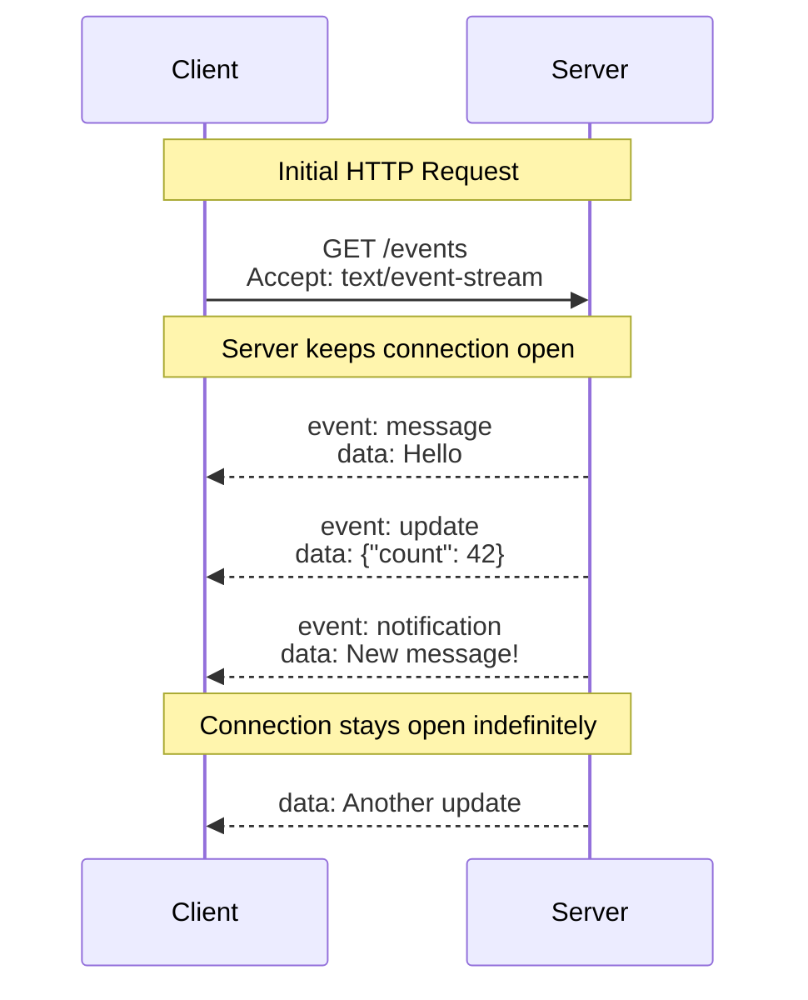
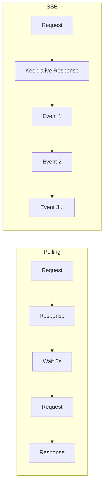
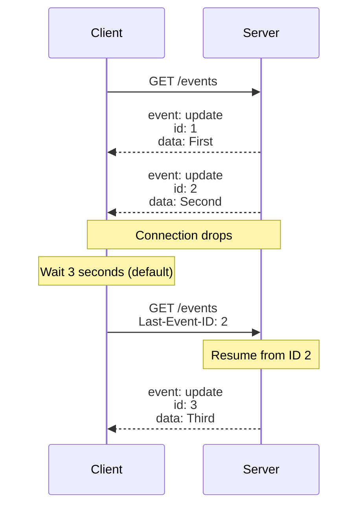
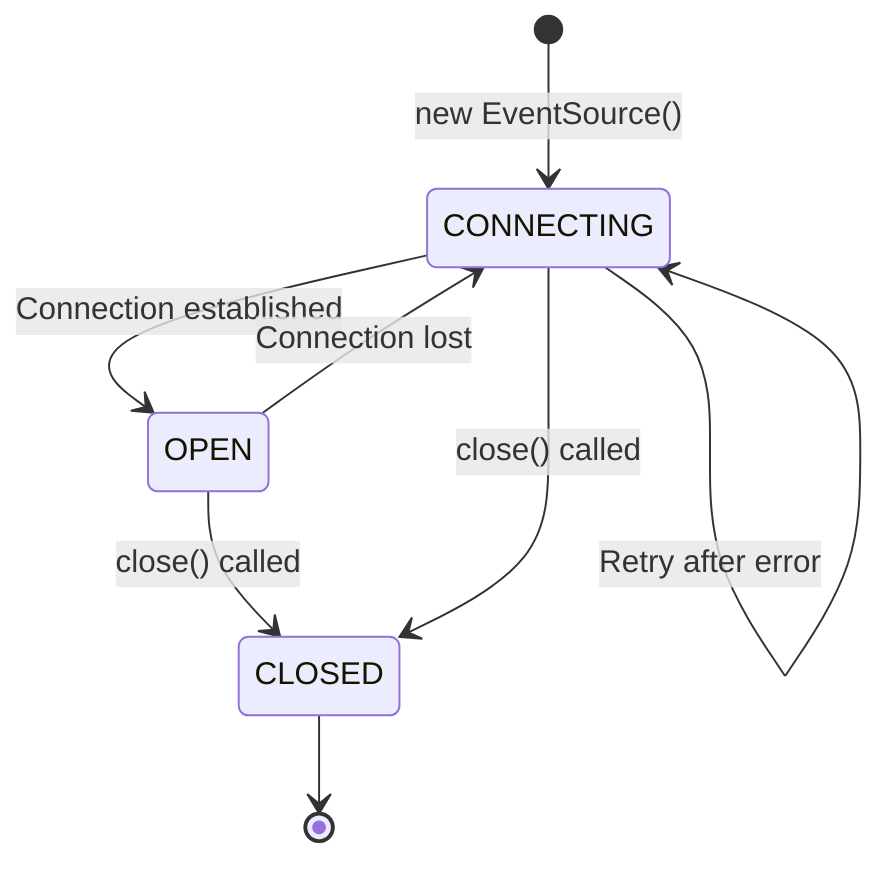

# Server-Sent Events

## Introduction

While WebSockets provide bidirectional communication, many real-time scenarios only need data flowing in one direction—from server to client. Stock tickers, news feeds, notification systems, and AI response streaming all share this pattern: the server pushes updates while the client simply receives.

Server-Sent Events (SSE) is a simpler alternative to WebSockets designed specifically for this use case. Built on standard HTTP, SSE offers automatic reconnection, event IDs for resumption, and wide browser support with minimal complexity.

This lesson introduces SSE concepts, explains when to choose it over WebSockets, and explores the underlying protocol that makes it work.

### What we'll cover

- What Server-Sent Events are and how they work
- SSE vs WebSockets: when to use each
- The `text/event-stream` data format
- Event types and custom event names
- Automatic reconnection and the `Last-Event-ID` header
- Connection resumption for reliable delivery

### Prerequisites

- Understanding of HTTP request-response model
- Completion of [WebSocket Fundamentals](./01-websocket-fundamentals.md)
- Familiarity with streaming concepts

---

## What are Server-Sent Events?

Server-Sent Events is a standard for pushing real-time updates from a server to a web browser over a persistent HTTP connection. Unlike WebSockets, SSE is unidirectional—data only flows from server to client.



### Key characteristics

| Feature | Description |
|---------|-------------|
| Direction | Server → Client only (unidirectional) |
| Protocol | Standard HTTP/HTTPS |
| Format | Text-based, `text/event-stream` MIME type |
| Reconnection | Automatic (built into browser) |
| Resume | Supports `Last-Event-ID` for continuation |
| Binary data | ❌ Not supported (text only) |

### How SSE differs from polling



With polling, the client repeatedly asks "Any updates?" and the server responds (often with "no"). With SSE, the server maintains an open connection and pushes updates whenever they occur.

---

## SSE vs WebSockets

Both technologies enable real-time communication, but they're designed for different use cases.

### Comparison table

| Aspect | SSE | WebSocket |
|--------|-----|-----------|
| Direction | Server → Client | Bidirectional |
| Protocol | HTTP | WebSocket (ws://) |
| Binary data | ❌ No | ✅ Yes |
| Reconnection | ✅ Automatic | ❌ Manual |
| Resume capability | ✅ Built-in | ❌ Manual |
| Proxy/firewall | ✅ Usually works | ⚠️ May need config |
| Connection overhead | Lower | Higher (handshake) |
| Message overhead | Higher (headers per event) | Lower (framing) |
| Browser support | ✅ Excellent | ✅ Excellent |
| HTTP/2 multiplexing | ✅ Yes | ❌ No |
| Max connections | Limited per domain | Limited per domain |

### When to use SSE

Choose SSE when:

- **Data flows one way** (server to client)
- **You need automatic reconnection** without custom code
- **Resume after disconnect is important** (using event IDs)
- **You want to use standard HTTP infrastructure** (proxies, load balancers)
- **You're streaming text data** (JSON, plain text)
- **Simplicity matters** more than flexibility

**Common SSE use cases:**

```javascript
// News/social feeds - new content pushed to users
const feed = new EventSource("/api/feed");

// Live dashboards - metrics updated in real-time
const metrics = new EventSource("/api/metrics");

// Notification systems - alerts pushed to browser
const notifications = new EventSource("/api/notifications");

// AI/LLM streaming - token-by-token response delivery
const aiResponse = new EventSource("/api/chat/stream?prompt=Hello");
```

### When to use WebSockets

Choose WebSockets when:

- **Both parties send data frequently** (chat, games)
- **Binary data is required** (images, audio, game state)
- **You need custom protocols** (sub-protocols)
- **Latency is critical** (real-time games)
- **Message rate is very high** (many messages per second)

> **🤖 AI Context:** Most AI streaming APIs use SSE because responses are unidirectional (AI → user) and text-based (tokens). OpenAI, Anthropic, and others chose SSE for their streaming endpoints.

---

## The text/event-stream format

SSE uses a simple text-based format. The server sends lines of text with specific field names, separated by newlines.

### Basic format

```
field: value\n
field: value\n
\n
```

Each event ends with a blank line (`\n\n`). The browser parses this format automatically.

### Event fields

| Field | Purpose | Example |
|-------|---------|---------|
| `data` | The message content | `data: Hello World` |
| `event` | Custom event type | `event: notification` |
| `id` | Event ID for resumption | `id: 12345` |
| `retry` | Reconnection delay (ms) | `retry: 3000` |

### Examples

**Simple message:**
```
data: Hello, World!

```

**JSON data:**
```
data: {"user": "Alice", "message": "Hello"}

```

**Multi-line data:**
```
data: Line 1
data: Line 2
data: Line 3

```

The browser concatenates multiple `data` lines with newlines.

**Named event with ID:**
```
event: userJoined
id: 1001
data: {"username": "Bob", "timestamp": 1699999999}

```

**Server setting reconnection delay:**
```
retry: 5000
data: Server is busy, slow down reconnection

```

### Server implementation

Here's how a server sends SSE (Node.js example):

```javascript
// Express.js SSE endpoint
app.get("/events", (req, res) => {
  // Set headers for SSE
  res.setHeader("Content-Type", "text/event-stream");
  res.setHeader("Cache-Control", "no-cache");
  res.setHeader("Connection", "keep-alive");
  
  // Disable response buffering
  res.flushHeaders();
  
  // Send events
  let eventId = 0;
  
  const sendEvent = (eventName, data) => {
    eventId++;
    res.write(`event: ${eventName}\n`);
    res.write(`id: ${eventId}\n`);
    res.write(`data: ${JSON.stringify(data)}\n\n`);
  };
  
  // Send periodic updates
  const interval = setInterval(() => {
    sendEvent("heartbeat", { time: Date.now() });
  }, 5000);
  
  // Clean up on disconnect
  req.on("close", () => {
    clearInterval(interval);
  });
});
```

---

## Event types and custom events

SSE supports two types of events: the default `message` event and custom named events.

### Default message event

When no `event` field is specified, the browser fires a `message` event:

**Server sends:**
```
data: Hello!

```

**Client receives:**
```javascript
const source = new EventSource("/events");

source.onmessage = (event) => {
  console.log("Message:", event.data);
};

// Or with addEventListener:
source.addEventListener("message", (event) => {
  console.log("Message:", event.data);
});
```

### Named events

Include an `event` field to create custom event types:

**Server sends:**
```
event: notification
data: {"title": "New message", "body": "You have 3 unread messages"}

event: userStatus
data: {"user": "Alice", "status": "online"}

```

**Client receives:**
```javascript
const source = new EventSource("/events");

// Listen for specific event types
source.addEventListener("notification", (event) => {
  const data = JSON.parse(event.data);
  showNotification(data.title, data.body);
});

source.addEventListener("userStatus", (event) => {
  const data = JSON.parse(event.data);
  updateUserStatus(data.user, data.status);
});

// Note: onmessage doesn't catch named events!
source.onmessage = (event) => {
  // This won't fire for "notification" or "userStatus" events
  console.log("Default message:", event.data);
};
```

> **Important:** Named events don't trigger the `onmessage` handler. You must use `addEventListener` for custom event types.

### Event structure pattern

A clean pattern for typed events:

```javascript
// Server-side event factory
function createSSEEvent(type, payload, id = null) {
  let event = "";
  if (id !== null) {
    event += `id: ${id}\n`;
  }
  event += `event: ${type}\n`;
  event += `data: ${JSON.stringify(payload)}\n\n`;
  return event;
}

// Usage
res.write(createSSEEvent("chat", {
  user: "Alice",
  text: "Hello!",
  timestamp: Date.now()
}, 1001));

res.write(createSSEEvent("typing", {
  user: "Bob",
  isTyping: true
}));
```

---

## Automatic reconnection

One of SSE's most valuable features is automatic reconnection. When the connection drops, the browser automatically attempts to reconnect.

### How it works



### Default behavior

- **Default retry delay:** 3 seconds (browser-dependent)
- **Automatic:** No code needed for basic reconnection
- **Persistent:** Keeps trying until `close()` is called

### Customizing retry delay

The server can suggest a different retry delay:

```
retry: 10000
data: Server load is high, wait 10 seconds before reconnecting

```

```javascript
// Server-side
res.write("retry: 10000\n");
res.write("data: Server is busy\n\n");
```

The client stores this value and uses it for future reconnections.

### Detecting reconnection

```javascript
const source = new EventSource("/events");

source.addEventListener("open", () => {
  console.log("Connected (or reconnected)");
});

source.addEventListener("error", (event) => {
  if (source.readyState === EventSource.CONNECTING) {
    console.log("Reconnecting...");
  } else if (source.readyState === EventSource.CLOSED) {
    console.log("Connection closed, won't reconnect");
  }
});
```

---

## Connection resumption with Last-Event-ID

Event IDs enable reliable message delivery by allowing the server to resume where it left off after a reconnection.

### How Last-Event-ID works

1. Server includes `id` field with each event
2. Client remembers the last received ID
3. On reconnection, browser sends `Last-Event-ID` header
4. Server uses this to send only missed events

### Server implementation

```javascript
app.get("/events", (req, res) => {
  res.setHeader("Content-Type", "text/event-stream");
  res.setHeader("Cache-Control", "no-cache");
  
  // Check for resumption
  const lastEventId = req.headers["last-event-id"];
  let startId = 0;
  
  if (lastEventId) {
    console.log("Client resuming from ID:", lastEventId);
    startId = parseInt(lastEventId, 10);
    
    // Send missed events
    sendMissedEvents(res, startId);
  }
  
  // Continue with live events
  subscribeToLiveEvents(res, (event, id) => {
    res.write(`id: ${id}\n`);
    res.write(`event: update\n`);
    res.write(`data: ${JSON.stringify(event)}\n\n`);
  });
});

function sendMissedEvents(res, afterId) {
  // Retrieve events from database/queue that occurred after afterId
  const missedEvents = eventStore.getAfter(afterId);
  
  for (const event of missedEvents) {
    res.write(`id: ${event.id}\n`);
    res.write(`event: update\n`);
    res.write(`data: ${JSON.stringify(event.data)}\n\n`);
  }
}
```

### Client-side access

The `lastEventId` property tells you the most recent event ID:

```javascript
const source = new EventSource("/events");

source.addEventListener("message", (event) => {
  console.log("Event ID:", event.lastEventId);
  console.log("Data:", event.data);
});
```

### Event ID best practices

| Practice | Rationale |
|----------|-----------|
| Use monotonically increasing IDs | Easy to determine "after" relationship |
| Store events with IDs | Required for replay on reconnection |
| Set appropriate retention | Old events expire after reasonable time |
| Consider sequence gaps | IDs don't need to be consecutive |

```javascript
// Good ID strategies
"id: 1001\n"              // Simple incrementing integer
"id: 1699999999000\n"     // Timestamp-based
"id: 1001-abc123\n"       // Sequence + unique suffix
```

---

## SSE connection states

The `EventSource` has three connection states, similar to WebSocket:

```javascript
const source = new EventSource("/events");

console.log(source.readyState);
// 0 = EventSource.CONNECTING
// 1 = EventSource.OPEN
// 2 = EventSource.CLOSED
```

### State transitions



| Value | Constant | Description |
|-------|----------|-------------|
| `0` | `EventSource.CONNECTING` | Connecting or reconnecting |
| `1` | `EventSource.OPEN` | Connected and receiving events |
| `2` | `EventSource.CLOSED` | Closed and won't reconnect |

> **Note:** Unlike WebSocket, there's no `CLOSING` state. SSE connections close immediately when `close()` is called.

---

## SSE limitations

Understanding SSE's constraints helps you decide when to use it:

### Connection limits

**HTTP/1.1 limitation:** Browsers limit SSE connections to 6 per domain. This is a significant constraint for applications with many tabs.

```javascript
// Problem: User has 7 tabs open to your site
// Only 6 can have active SSE connections!

// Solution: Use HTTP/2 (negotiates much higher limits)
// Or: Share connection across tabs with BroadcastChannel
```

**HTTP/2 solution:** With HTTP/2, the limit is negotiated between server and client (typically 100+ streams per connection).

### Text only

SSE only supports UTF-8 text. For binary data:

```javascript
// Option 1: Base64 encode
data: {"image": "iVBORw0KGgo...base64..."}

// Option 2: Send URL reference
data: {"imageUrl": "/images/abc123.png"}

// Option 3: Use WebSocket for binary instead
```

### Unidirectional

SSE doesn't support client-to-server messages. For client messages:

```javascript
// Use regular HTTP requests alongside SSE
const source = new EventSource("/events");

source.addEventListener("message", (event) => {
  // Handle server messages
});

// Send messages via fetch
async function sendMessage(text) {
  await fetch("/api/messages", {
    method: "POST",
    body: JSON.stringify({ text })
  });
}
```

### No custom headers

`EventSource` doesn't support setting custom headers:

```javascript
// This doesn't work!
const source = new EventSource("/events", {
  headers: { "Authorization": "Bearer token" } // Not supported
});

// Solutions:
// 1. Pass token in URL (less secure)
const source = new EventSource("/events?token=abc123");

// 2. Use cookies (set withCredentials)
const source = new EventSource("/events", { withCredentials: true });

// 3. Use fetch-based SSE polyfill for custom headers
```

---

## Best practices

| Practice | Why It Matters |
|----------|----------------|
| Always include event IDs | Enables reliable resumption after disconnect |
| Use HTTP/2 | Avoids 6-connection limit, better performance |
| Set appropriate retry delay | Balance between responsiveness and server load |
| Handle the error event | Know when reconnection is happening |
| Clean up with `close()` | Prevent orphaned connections |
| Use named events | Better organization than parsing message types |
| Send periodic heartbeats | Keep connection alive through proxies |

---

## Common pitfalls

| ❌ Mistake | ✅ Solution |
|-----------|-------------|
| Using HTTP/1.1 with many tabs | Upgrade to HTTP/2 or share connections |
| Not including event IDs | Always add IDs for resumption capability |
| Expecting `onmessage` for named events | Use `addEventListener` for custom event types |
| Trying to send custom headers | Use cookies/query params or fetch-based alternative |
| No heartbeat in production | Send periodic comments to keep connection alive |
| Ignoring connection limits | Test with multiple tabs, consider HTTP/2 |

---

## Hands-on exercise

### Your task

Create a simple server that sends SSE and a client that receives them with proper event handling and connection state display.

### Requirements

1. Server sends three event types: `heartbeat`, `notification`, and `update`
2. Each event includes an ID for resumption
3. Client displays current connection state
4. Client shows all received events with their types
5. Handle reconnection by logging the Last-Event-ID

### Expected result

**Server console:**
```
Client connected
Sending heartbeat (id: 1)
Sending notification (id: 2)
Client disconnected
Client resumed from ID: 2
Sending update (id: 3)
```

**Client display:**
```
Status: OPEN
[Heartbeat] id:1 - {"time": 1699999999}
[Notification] id:2 - {"title": "Hello"}
Status: CONNECTING (reconnecting...)
Status: OPEN
[Update] id:3 - {"data": "New content"}
```

<details>
<summary>💡 Hints (click to expand)</summary>

- Server: Set `Content-Type: text/event-stream`
- Server: Check `req.headers['last-event-id']` for resumption
- Client: Use `addEventListener` for each event type
- Client: Update status on `open` and `error` events
- Use `event.lastEventId` to access the event ID

</details>

<details>
<summary>✅ Solution (click to expand)</summary>

**Server (server.js):**
```javascript
const express = require("express");
const app = express();

app.get("/events", (req, res) => {
  console.log("Client connected");
  
  res.setHeader("Content-Type", "text/event-stream");
  res.setHeader("Cache-Control", "no-cache");
  res.setHeader("Connection", "keep-alive");
  res.flushHeaders();
  
  // Check for resumption
  const lastEventId = req.headers["last-event-id"];
  let eventId = lastEventId ? parseInt(lastEventId, 10) : 0;
  
  if (lastEventId) {
    console.log("Client resumed from ID:", lastEventId);
  }
  
  // Event sender
  const sendEvent = (type, data) => {
    eventId++;
    console.log(`Sending ${type} (id: ${eventId})`);
    res.write(`id: ${eventId}\n`);
    res.write(`event: ${type}\n`);
    res.write(`data: ${JSON.stringify(data)}\n\n`);
  };
  
  // Send events periodically
  const heartbeatInterval = setInterval(() => {
    sendEvent("heartbeat", { time: Date.now() });
  }, 5000);
  
  // Initial events
  setTimeout(() => sendEvent("notification", { title: "Welcome!" }), 1000);
  setTimeout(() => sendEvent("update", { data: "Initial content" }), 2000);
  
  // Cleanup
  req.on("close", () => {
    console.log("Client disconnected");
    clearInterval(heartbeatInterval);
  });
});

app.listen(3000, () => console.log("Server on http://localhost:3000"));
```

**Client (client.html):**
```html
<!DOCTYPE html>
<html>
<head>
  <title>SSE Client</title>
</head>
<body>
  <h1>SSE Events</h1>
  <div id="status">Status: CONNECTING</div>
  <ul id="events"></ul>
  
  <script>
    const statusEl = document.getElementById("status");
    const eventsEl = document.getElementById("events");
    
    const stateNames = ["CONNECTING", "OPEN", "CLOSED"];
    
    function addEvent(type, id, data) {
      const li = document.createElement("li");
      li.textContent = `[${type}] id:${id} - ${data}`;
      eventsEl.appendChild(li);
    }
    
    const source = new EventSource("http://localhost:3000/events");
    
    source.addEventListener("open", () => {
      statusEl.textContent = "Status: OPEN";
    });
    
    source.addEventListener("error", () => {
      if (source.readyState === EventSource.CONNECTING) {
        statusEl.textContent = "Status: CONNECTING (reconnecting...)";
      } else {
        statusEl.textContent = "Status: CLOSED";
      }
    });
    
    source.addEventListener("heartbeat", (event) => {
      addEvent("Heartbeat", event.lastEventId, event.data);
    });
    
    source.addEventListener("notification", (event) => {
      addEvent("Notification", event.lastEventId, event.data);
    });
    
    source.addEventListener("update", (event) => {
      addEvent("Update", event.lastEventId, event.data);
    });
  </script>
</body>
</html>
```

</details>

### Bonus challenges

- [ ] Add a button to manually close and reopen the connection
- [ ] Implement server-side event storage for replay on reconnection
- [ ] Add a `retry` field to slow down reconnection during errors
- [ ] Create a connection uptime display

---

## Summary

✅ Server-Sent Events provide unidirectional server-to-client streaming over HTTP

✅ SSE uses the `text/event-stream` format with fields for data, event type, ID, and retry delay

✅ Automatic reconnection is built into the browser—no custom code needed

✅ Event IDs enable connection resumption via the `Last-Event-ID` header

✅ Named events allow organizing different message types with separate listeners

✅ SSE limitations include text-only data, no custom headers, and HTTP/1.1 connection limits

**Next:** [EventSource API](./06-eventsource-api.md)

---

## Further reading

- [MDN: Server-sent events](https://developer.mozilla.org/en-US/docs/Web/API/Server-sent_events) - Complete guide
- [MDN: EventSource](https://developer.mozilla.org/en-US/docs/Web/API/EventSource) - API reference
- [HTML Living Standard: Server-sent events](https://html.spec.whatwg.org/multipage/server-sent-events.html) - Official specification
- [Using server-sent events](https://developer.mozilla.org/en-US/docs/Web/API/Server-sent_events/Using_server-sent_events) - Tutorial

<!--
Sources Consulted:
- MDN Server-sent events: https://developer.mozilla.org/en-US/docs/Web/API/Server-sent_events
- MDN EventSource: https://developer.mozilla.org/en-US/docs/Web/API/EventSource
- MDN Using server-sent events: https://developer.mozilla.org/en-US/docs/Web/API/Server-sent_events/Using_server-sent_events
-->
