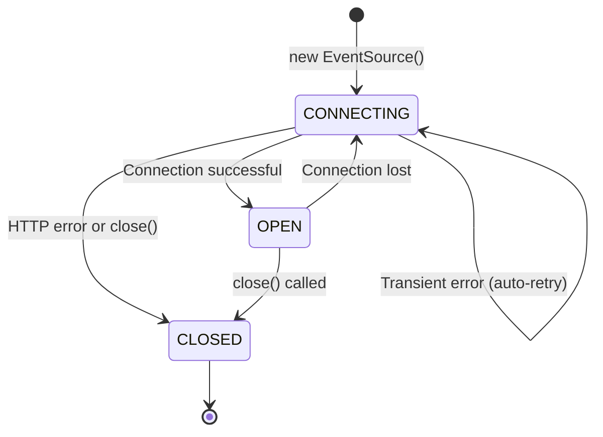

# EventSource API

## Introduction

The `EventSource` interface is your gateway to Server-Sent Events in the browser. It handles connection management, automatic reconnection, and event parsing—all through a simple, clean API.

This lesson provides a deep dive into the `EventSource` API. We'll explore the constructor options, event handlers, properties, and methods. You'll learn how to build robust SSE clients that handle authentication, error recovery, and graceful shutdown.

### What we'll cover

- Creating EventSource connections
- The `onmessage` handler and default events
- Named events with `addEventListener`
- Error handling and the `onerror` event
- The `readyState` property and connection states
- Closing connections properly
- Cross-origin requests with `withCredentials`

### Prerequisites

- Completion of [Server-Sent Events](./05-server-sent-events.md)
- Understanding of JavaScript event handling
- Familiarity with HTTP cookies and CORS

---

## Creating EventSource

The `EventSource` constructor creates a new connection to a server endpoint.

### Basic usage

```javascript
// Simple connection
const source = new EventSource("/api/events");

// Handle incoming messages
source.onmessage = (event) => {
  console.log("Received:", event.data);
};
```

### Constructor syntax

```javascript
new EventSource(url)
new EventSource(url, options)
```

| Parameter | Type | Description |
|-----------|------|-------------|
| `url` | String | The URL to connect to |
| `options` | Object | Configuration options |
| `options.withCredentials` | Boolean | Include cookies in cross-origin requests |

### URL handling

The URL can be absolute or relative:

```javascript
// Relative URL (same origin)
const source1 = new EventSource("/events");

// Absolute URL (same origin)
const source2 = new EventSource("https://example.com/events");

// Cross-origin URL
const source3 = new EventSource("https://api.other-domain.com/events", {
  withCredentials: true  // Include cookies
});
```

### Connection with query parameters

Pass data through URL query parameters:

```javascript
// Include user ID and preferences
const userId = 12345;
const channels = ["news", "alerts"];

const url = new URL("/events", window.location.origin);
url.searchParams.set("userId", userId);
url.searchParams.set("channels", channels.join(","));

const source = new EventSource(url);
// Connects to: /events?userId=12345&channels=news,alerts
```

### Authentication via query parameter

Since `EventSource` doesn't support custom headers, tokens often go in the URL:

```javascript
const token = localStorage.getItem("authToken");

// Include auth token in URL
const source = new EventSource(`/events?token=${encodeURIComponent(token)}`);
```

> **Warning:** Tokens in URLs may appear in server logs and browser history. For sensitive applications, prefer cookie-based authentication with `withCredentials: true`.

---

## The onmessage handler

The `onmessage` handler receives events that don't have an `event` field, or have `event: message`.

### Basic message handling

```javascript
const source = new EventSource("/events");

// Property-based handler
source.onmessage = (event) => {
  console.log("Data:", event.data);
  console.log("Origin:", event.origin);
  console.log("Last Event ID:", event.lastEventId);
};
```

### MessageEvent properties

| Property | Type | Description |
|----------|------|-------------|
| `data` | String | The message content |
| `origin` | String | The origin URL of the event source |
| `lastEventId` | String | The `id` field from the event (if present) |
| `source` | Object | Reference to the EventSource (null for SSE) |
| `ports` | Array | MessagePort array (empty for SSE) |

### Parsing JSON data

Most applications send JSON in the `data` field:

```javascript
source.onmessage = (event) => {
  try {
    const data = JSON.parse(event.data);
    
    switch (data.type) {
      case "update":
        handleUpdate(data.payload);
        break;
      case "notification":
        showNotification(data.payload);
        break;
      default:
        console.log("Unknown type:", data.type);
    }
  } catch (error) {
    console.error("Invalid JSON:", event.data);
  }
};
```

### What triggers onmessage

**Server sends events without `event` field:**
```
data: Hello!

```
→ Triggers `onmessage`

**Server sends events with `event: message`:**
```
event: message
data: Hello!

```
→ Triggers `onmessage`

**Server sends named events:**
```
event: notification
data: Hello!

```
→ Does NOT trigger `onmessage` (use `addEventListener`)

---

## Named events with addEventListener

For custom event types, use `addEventListener`:

```javascript
const source = new EventSource("/events");

// Listen for specific event types
source.addEventListener("notification", (event) => {
  const data = JSON.parse(event.data);
  showNotification(data.title, data.body);
});

source.addEventListener("userStatus", (event) => {
  const data = JSON.parse(event.data);
  updateStatusIndicator(data.userId, data.status);
});

source.addEventListener("chatMessage", (event) => {
  const data = JSON.parse(event.data);
  appendMessage(data.sender, data.text);
});

// Also handle default messages
source.addEventListener("message", (event) => {
  console.log("Default message:", event.data);
});
```

### Creating a type-safe event handler

```javascript
class SSEClient {
  constructor(url) {
    this.source = new EventSource(url);
    this.handlers = new Map();
    
    // Central message routing
    this.source.addEventListener("message", (e) => this.route("message", e));
  }
  
  on(eventType, handler) {
    if (!this.handlers.has(eventType)) {
      this.handlers.set(eventType, []);
      
      // Register with EventSource
      this.source.addEventListener(eventType, (event) => {
        this.route(eventType, event);
      });
    }
    
    this.handlers.get(eventType).push(handler);
    return this; // Enable chaining
  }
  
  off(eventType, handler) {
    const handlers = this.handlers.get(eventType);
    if (handlers) {
      const index = handlers.indexOf(handler);
      if (index > -1) handlers.splice(index, 1);
    }
    return this;
  }
  
  route(eventType, event) {
    const handlers = this.handlers.get(eventType);
    if (handlers) {
      const data = this.parseData(event.data);
      handlers.forEach(handler => handler(data, event));
    }
  }
  
  parseData(data) {
    try {
      return JSON.parse(data);
    } catch {
      return data;
    }
  }
  
  close() {
    this.source.close();
  }
}

// Usage
const client = new SSEClient("/events");

client
  .on("notification", (data) => {
    console.log("Notification:", data.title);
  })
  .on("userStatus", (data) => {
    console.log(`${data.user} is ${data.status}`);
  })
  .on("message", (data) => {
    console.log("Default:", data);
  });
```

---

## Error handling with onerror

The `error` event fires when:
- Connection fails to establish
- Connection is lost
- Server closes the connection

### Basic error handling

```javascript
const source = new EventSource("/events");

source.onerror = (event) => {
  console.error("SSE error occurred");
  
  // Check current state
  switch (source.readyState) {
    case EventSource.CONNECTING:
      console.log("Reconnecting...");
      break;
    case EventSource.CLOSED:
      console.log("Connection closed");
      break;
  }
};
```

### Distinguishing error types

```javascript
const source = new EventSource("/events");

source.addEventListener("open", () => {
  console.log("Connected");
});

source.addEventListener("error", (event) => {
  if (source.readyState === EventSource.CONNECTING) {
    // Connection lost, browser is reconnecting
    console.log("Connection lost, automatically reconnecting...");
  } else if (source.readyState === EventSource.CLOSED) {
    // Connection closed, won't reconnect
    // This happens when server sends HTTP error (4xx, 5xx)
    console.error("Connection closed by server");
    handleFatalError();
  }
});
```

### Error scenarios

| Scenario | readyState after error | Behavior |
|----------|------------------------|----------|
| Network timeout | CONNECTING | Auto-reconnect |
| Server restart | CONNECTING | Auto-reconnect |
| HTTP 401/403 | CLOSED | No reconnect |
| HTTP 404 | CLOSED | No reconnect |
| HTTP 500 | CLOSED | No reconnect |
| Invalid content-type | CLOSED | No reconnect |

> **Important:** HTTP errors cause the connection to close permanently. The browser won't retry after receiving a 4xx or 5xx response.

### Implementing custom retry for HTTP errors

```javascript
class RetryableSSE {
  constructor(url, options = {}) {
    this.url = url;
    this.options = {
      maxRetries: 5,
      retryDelay: 3000,
      ...options
    };
    
    this.retryCount = 0;
    this.source = null;
    this.handlers = { open: [], error: [], message: [] };
    
    this.connect();
  }
  
  connect() {
    this.source = new EventSource(this.url);
    
    this.source.addEventListener("open", () => {
      this.retryCount = 0;
      this.emit("open");
    });
    
    this.source.addEventListener("error", (event) => {
      if (this.source.readyState === EventSource.CLOSED) {
        // HTTP error - need manual retry
        this.scheduleRetry();
      } else {
        // Transient error - browser handles reconnection
        this.emit("error", { reconnecting: true });
      }
    });
    
    this.source.addEventListener("message", (event) => {
      this.emit("message", event);
    });
  }
  
  scheduleRetry() {
    if (this.retryCount >= this.options.maxRetries) {
      this.emit("error", { fatal: true, message: "Max retries exceeded" });
      return;
    }
    
    this.retryCount++;
    const delay = this.options.retryDelay * Math.pow(2, this.retryCount - 1);
    
    console.log(`Retry ${this.retryCount}/${this.options.maxRetries} in ${delay}ms`);
    
    setTimeout(() => this.connect(), delay);
  }
  
  on(event, handler) {
    if (this.handlers[event]) {
      this.handlers[event].push(handler);
    }
  }
  
  emit(event, data) {
    if (this.handlers[event]) {
      this.handlers[event].forEach(h => h(data));
    }
  }
  
  close() {
    this.source?.close();
  }
}
```

---

## The readyState property

The `readyState` property indicates the current connection state:

```javascript
const source = new EventSource("/events");

console.log(source.readyState);
// 0 = CONNECTING
// 1 = OPEN
// 2 = CLOSED
```

### State constants

| Value | Constant | Description |
|-------|----------|-------------|
| `0` | `EventSource.CONNECTING` | Connection in progress or reconnecting |
| `1` | `EventSource.OPEN` | Connected and receiving events |
| `2` | `EventSource.CLOSED` | Closed, won't reconnect |

### State transitions



### Monitoring state changes

```javascript
function createMonitoredSource(url) {
  const source = new EventSource(url);
  
  const stateNames = {
    [EventSource.CONNECTING]: "CONNECTING",
    [EventSource.OPEN]: "OPEN",
    [EventSource.CLOSED]: "CLOSED"
  };
  
  let lastState = source.readyState;
  console.log(`Initial: ${stateNames[lastState]}`);
  
  source.addEventListener("open", () => {
    if (source.readyState !== lastState) {
      console.log(`State: ${stateNames[lastState]} → ${stateNames[source.readyState]}`);
      lastState = source.readyState;
    }
  });
  
  source.addEventListener("error", () => {
    if (source.readyState !== lastState) {
      console.log(`State: ${stateNames[lastState]} → ${stateNames[source.readyState]}`);
      lastState = source.readyState;
    }
  });
  
  return source;
}
```

---

## Closing connections

The `close()` method terminates the connection immediately:

```javascript
const source = new EventSource("/events");

// Later...
source.close();

console.log(source.readyState); // 2 (CLOSED)
```

### When to close

- **Page navigation:** Close before leaving the page
- **Component unmount:** Clean up in React/Vue/Angular
- **User logout:** Stop receiving user-specific events
- **Connection no longer needed:** Free up resources

### React cleanup example

```jsx
import { useEffect, useState } from "react";

function LiveUpdates() {
  const [updates, setUpdates] = useState([]);
  
  useEffect(() => {
    const source = new EventSource("/api/updates");
    
    source.onmessage = (event) => {
      const data = JSON.parse(event.data);
      setUpdates(prev => [...prev, data]);
    };
    
    // Cleanup on unmount
    return () => {
      source.close();
    };
  }, []);
  
  return (
    <ul>
      {updates.map((u, i) => <li key={i}>{u.message}</li>)}
    </ul>
  );
}
```

### Vue cleanup example

```vue
<script setup>
import { ref, onMounted, onUnmounted } from "vue";

const updates = ref([]);
let source = null;

onMounted(() => {
  source = new EventSource("/api/updates");
  
  source.onmessage = (event) => {
    const data = JSON.parse(event.data);
    updates.value.push(data);
  };
});

onUnmounted(() => {
  source?.close();
});
</script>
```

### Page unload cleanup

```javascript
const source = new EventSource("/events");

window.addEventListener("beforeunload", () => {
  source.close();
});

// Or for single-page apps:
window.addEventListener("pagehide", () => {
  source.close();
});
```

---

## Cross-origin requests with withCredentials

By default, `EventSource` doesn't send cookies to cross-origin servers. Use `withCredentials` to include them:

```javascript
// Same-origin: cookies sent automatically
const source1 = new EventSource("/events");

// Cross-origin without credentials
const source2 = new EventSource("https://api.other-domain.com/events");
// No cookies sent

// Cross-origin with credentials
const source3 = new EventSource("https://api.other-domain.com/events", {
  withCredentials: true
});
// Cookies sent if server allows
```

### Server CORS requirements

The server must include these headers for cross-origin SSE with credentials:

```http
Access-Control-Allow-Origin: https://your-frontend.com
Access-Control-Allow-Credentials: true
Content-Type: text/event-stream
```

> **Important:** With credentials, `Access-Control-Allow-Origin` cannot be `*`. You must specify the exact origin.

### Server implementation

```javascript
// Express.js with CORS for SSE
const cors = require("cors");

app.get("/events", cors({
  origin: "https://your-frontend.com",
  credentials: true
}), (req, res) => {
  res.setHeader("Content-Type", "text/event-stream");
  res.setHeader("Cache-Control", "no-cache");
  
  // Access session/cookies (now available with credentials: true)
  const userId = req.session?.userId;
  
  if (!userId) {
    res.status(401).end();
    return;
  }
  
  // Send user-specific events
  const interval = setInterval(() => {
    res.write(`data: ${JSON.stringify({ userId, time: Date.now() })}\n\n`);
  }, 5000);
  
  req.on("close", () => clearInterval(interval));
});
```

### Checking withCredentials

The property is read-only after construction:

```javascript
const source = new EventSource("/events", { withCredentials: true });

console.log(source.withCredentials); // true
```

---

## Complete EventSource reference

### Properties

| Property | Type | Description |
|----------|------|-------------|
| `readyState` | Number | Current connection state (0, 1, or 2) |
| `url` | String | The URL the EventSource is connected to |
| `withCredentials` | Boolean | Whether credentials are sent |

### Methods

| Method | Description |
|--------|-------------|
| `close()` | Closes the connection |

### Events

| Event | When it fires | Handler property |
|-------|---------------|------------------|
| `open` | Connection established | `onopen` |
| `message` | Default message received | `onmessage` |
| `error` | Error or connection lost | `onerror` |
| Custom | Named event received | Use `addEventListener` |

### Complete example

```javascript
class SSEConnection {
  constructor(url, options = {}) {
    this.url = url;
    this.options = options;
    this.source = null;
    this.eventHandlers = new Map();
  }
  
  connect() {
    this.source = new EventSource(this.url, {
      withCredentials: this.options.withCredentials || false
    });
    
    // Connection opened
    this.source.onopen = () => {
      console.log("Connected to", this.url);
      console.log("withCredentials:", this.source.withCredentials);
      this.options.onConnect?.();
    };
    
    // Default messages
    this.source.onmessage = (event) => {
      this.handleEvent("message", event);
    };
    
    // Errors
    this.source.onerror = (event) => {
      const state = this.source.readyState;
      
      if (state === EventSource.CONNECTING) {
        console.log("Reconnecting...");
        this.options.onReconnecting?.();
      } else if (state === EventSource.CLOSED) {
        console.error("Connection closed");
        this.options.onClose?.();
      }
    };
    
    // Register custom events
    this.eventHandlers.forEach((handlers, eventType) => {
      if (eventType !== "message") {
        this.source.addEventListener(eventType, (event) => {
          this.handleEvent(eventType, event);
        });
      }
    });
  }
  
  on(eventType, handler) {
    if (!this.eventHandlers.has(eventType)) {
      this.eventHandlers.set(eventType, []);
      
      // If already connected, register immediately
      if (this.source && eventType !== "message") {
        this.source.addEventListener(eventType, (event) => {
          this.handleEvent(eventType, event);
        });
      }
    }
    
    this.eventHandlers.get(eventType).push(handler);
    return this;
  }
  
  handleEvent(eventType, event) {
    const handlers = this.eventHandlers.get(eventType);
    if (handlers) {
      const data = this.parseData(event.data);
      handlers.forEach(handler => {
        handler(data, {
          lastEventId: event.lastEventId,
          origin: event.origin
        });
      });
    }
  }
  
  parseData(data) {
    try {
      return JSON.parse(data);
    } catch {
      return data;
    }
  }
  
  get state() {
    if (!this.source) return "disconnected";
    const states = ["connecting", "open", "closed"];
    return states[this.source.readyState];
  }
  
  close() {
    this.source?.close();
    this.options.onClose?.();
  }
}

// Usage
const sse = new SSEConnection("/api/events", {
  withCredentials: true,
  onConnect: () => console.log("✅ Connected"),
  onReconnecting: () => console.log("🔄 Reconnecting"),
  onClose: () => console.log("❌ Closed")
});

sse
  .on("notification", (data) => {
    console.log("Notification:", data.title);
  })
  .on("update", (data) => {
    console.log("Update:", data);
  });

sse.connect();
```

---

## Best practices

| Practice | Why It Matters |
|----------|----------------|
| Always clean up with `close()` | Prevents memory leaks and orphaned connections |
| Use `addEventListener` for named events | `onmessage` doesn't catch named events |
| Check `readyState` in error handler | Distinguish reconnecting vs closed |
| Parse JSON safely | Always wrap in try-catch |
| Use `withCredentials` for auth | Enables cookie-based authentication |
| Provide UI feedback on state | Keep users informed of connection status |

---

## Common pitfalls

| ❌ Mistake | ✅ Solution |
|-----------|-------------|
| Expecting `onmessage` for named events | Use `addEventListener("eventName", ...)` |
| Not closing on component unmount | Add cleanup in `useEffect` return or `onUnmounted` |
| Ignoring `readyState` in error handler | Check state to distinguish reconnecting vs closed |
| Assuming auto-reconnect for all errors | HTTP errors (4xx, 5xx) close permanently |
| Setting headers on EventSource | Use cookies/query params instead |
| Forgetting CORS for cross-origin | Server must return proper headers |

---

## Hands-on exercise

### Your task

Build a notification center that receives real-time notifications via SSE and displays connection status.

### Requirements

1. Create an `EventSource` connection with proper error handling
2. Listen for three event types: `info`, `warning`, `error`
3. Display each notification with appropriate styling
4. Show connection status (Connected/Reconnecting/Disconnected)
5. Add a "Clear" button to remove all notifications
6. Add a "Disconnect" button to close the connection

### Expected result

```
Connection: 🟢 Connected

Notifications:
[INFO] System started successfully
[WARNING] High memory usage detected
[ERROR] Database connection failed

[Clear] [Disconnect]
```

<details>
<summary>💡 Hints (click to expand)</summary>

- Use `addEventListener` for each notification type
- Check `readyState` in the error handler
- Store notifications in an array
- Use CSS classes for different notification types
- Clean up with `close()` on disconnect button

</details>

<details>
<summary>✅ Solution (click to expand)</summary>

```html
<!DOCTYPE html>
<html>
<head>
  <title>Notification Center</title>
  <style>
    .status { padding: 10px; margin-bottom: 10px; }
    .connected { background: #d4edda; }
    .reconnecting { background: #fff3cd; }
    .disconnected { background: #f8d7da; }
    
    .notification { padding: 8px; margin: 5px 0; border-radius: 4px; }
    .info { background: #cce5ff; }
    .warning { background: #fff3cd; }
    .error { background: #f8d7da; }
    
    button { margin: 5px; padding: 8px 16px; }
  </style>
</head>
<body>
  <h1>Notification Center</h1>
  <div id="status" class="status disconnected">🔴 Disconnected</div>
  <div id="notifications"></div>
  <button id="clear">Clear</button>
  <button id="disconnect">Disconnect</button>
  <button id="connect" style="display: none;">Connect</button>
  
  <script>
    const statusEl = document.getElementById("status");
    const notificationsEl = document.getElementById("notifications");
    const clearBtn = document.getElementById("clear");
    const disconnectBtn = document.getElementById("disconnect");
    const connectBtn = document.getElementById("connect");
    
    let source = null;
    
    function updateStatus(state) {
      statusEl.className = "status " + state;
      const icons = { connected: "🟢", reconnecting: "🟡", disconnected: "🔴" };
      const labels = { connected: "Connected", reconnecting: "Reconnecting...", disconnected: "Disconnected" };
      statusEl.textContent = `${icons[state]} ${labels[state]}`;
    }
    
    function addNotification(type, message) {
      const div = document.createElement("div");
      div.className = "notification " + type;
      div.textContent = `[${type.toUpperCase()}] ${message}`;
      notificationsEl.appendChild(div);
    }
    
    function connect() {
      source = new EventSource("/api/notifications");
      
      source.addEventListener("open", () => {
        updateStatus("connected");
        disconnectBtn.style.display = "inline";
        connectBtn.style.display = "none";
      });
      
      source.addEventListener("error", () => {
        if (source.readyState === EventSource.CONNECTING) {
          updateStatus("reconnecting");
        } else {
          updateStatus("disconnected");
          disconnectBtn.style.display = "none";
          connectBtn.style.display = "inline";
        }
      });
      
      // Named event handlers
      source.addEventListener("info", (event) => {
        const data = JSON.parse(event.data);
        addNotification("info", data.message);
      });
      
      source.addEventListener("warning", (event) => {
        const data = JSON.parse(event.data);
        addNotification("warning", data.message);
      });
      
      source.addEventListener("error", (event) => {
        // Note: This is the custom "error" event, not the connection error
        if (event.data) {
          const data = JSON.parse(event.data);
          addNotification("error", data.message);
        }
      });
    }
    
    function disconnect() {
      source?.close();
      updateStatus("disconnected");
      disconnectBtn.style.display = "none";
      connectBtn.style.display = "inline";
    }
    
    clearBtn.onclick = () => {
      notificationsEl.innerHTML = "";
    };
    
    disconnectBtn.onclick = disconnect;
    connectBtn.onclick = connect;
    
    // Auto-connect on load
    connect();
  </script>
</body>
</html>
```

**Test server (notifications-server.js):**
```javascript
const express = require("express");
const app = express();

app.get("/api/notifications", (req, res) => {
  res.setHeader("Content-Type", "text/event-stream");
  res.setHeader("Cache-Control", "no-cache");
  res.setHeader("Connection", "keep-alive");
  
  let id = 0;
  
  const sendNotification = (type, message) => {
    id++;
    res.write(`id: ${id}\n`);
    res.write(`event: ${type}\n`);
    res.write(`data: ${JSON.stringify({ message })}\n\n`);
  };
  
  // Send test notifications
  setTimeout(() => sendNotification("info", "System started successfully"), 1000);
  setTimeout(() => sendNotification("warning", "High memory usage detected"), 3000);
  setTimeout(() => sendNotification("error", "Database connection failed"), 5000);
  
  // Periodic heartbeat
  const interval = setInterval(() => {
    sendNotification("info", `Heartbeat at ${new Date().toLocaleTimeString()}`);
  }, 10000);
  
  req.on("close", () => clearInterval(interval));
});

app.listen(3000);
```

</details>

### Bonus challenges

- [ ] Add notification sound for error events
- [ ] Persist notifications to localStorage
- [ ] Add notification count badge
- [ ] Implement notification filtering by type

---

## Summary

✅ `EventSource` constructor accepts a URL and optional `withCredentials` for cookies

✅ `onmessage` handles default/unnamed events; `addEventListener` handles named events

✅ The `error` event fires for connection issues—check `readyState` to distinguish reconnecting from closed

✅ HTTP errors (4xx, 5xx) close the connection permanently; implement manual retry if needed

✅ Always `close()` the connection on component unmount or page unload

✅ Use `withCredentials: true` for cross-origin cookie authentication

**Next:** [SSE vs WebSockets](./07-sse-vs-websockets.md)

---

## Further reading

- [MDN: EventSource](https://developer.mozilla.org/en-US/docs/Web/API/EventSource) - Complete API reference
- [MDN: EventSource()](https://developer.mozilla.org/en-US/docs/Web/API/EventSource/EventSource) - Constructor details
- [MDN: Using server-sent events](https://developer.mozilla.org/en-US/docs/Web/API/Server-sent_events/Using_server-sent_events) - Practical guide
- [MDN: CORS](https://developer.mozilla.org/en-US/docs/Web/HTTP/CORS) - Cross-origin resource sharing

<!--
Sources Consulted:
- MDN EventSource: https://developer.mozilla.org/en-US/docs/Web/API/EventSource
- MDN EventSource constructor: https://developer.mozilla.org/en-US/docs/Web/API/EventSource/EventSource
- MDN Server-sent events: https://developer.mozilla.org/en-US/docs/Web/API/Server-sent_events
-->
