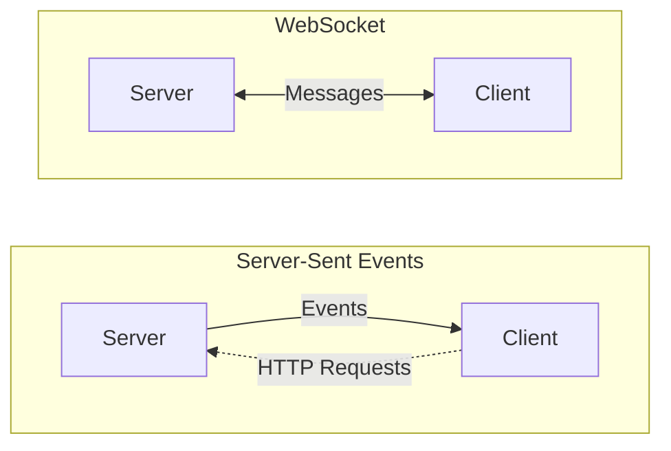
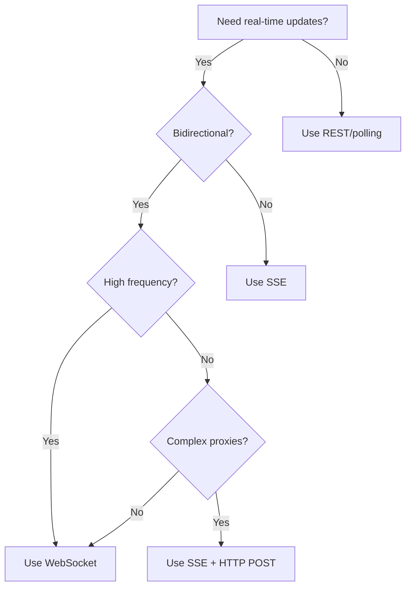

# SSE vs WebSockets

## Introduction

Both Server-Sent Events and WebSockets provide real-time communication, but they serve different purposes. Choosing the right technology depends on your data flow patterns, infrastructure constraints, and use case requirements.

This lesson provides a comprehensive comparison between SSE and WebSockets. We'll examine their architectures, analyze performance characteristics, and explore scenarios where each technology excels. By the end, you'll have a clear framework for choosing the right tool.

### What we'll cover

- Architectural differences
- Feature comparison
- Performance characteristics
- Browser and infrastructure support
- Connection limits and scalability
- Choosing the right technology
- Hybrid approaches

### Prerequisites

- Completion of [WebSocket Fundamentals](./01-websocket-fundamentals.md)
- Completion of [Server-Sent Events](./05-server-sent-events.md)
- Understanding of HTTP protocols

---

## Architectural differences

### Data flow direction

The fundamental difference lies in communication direction:



**SSE:** Server pushes data to client. Client sends data via separate HTTP requests.

**WebSocket:** Bidirectional—both sides can send messages at any time.

### Protocol foundation

| Aspect | SSE | WebSocket |
|--------|-----|-----------|
| Protocol | HTTP/1.1 or HTTP/2 | WebSocket protocol (ws://, wss://) |
| Starting point | Standard HTTP GET | HTTP upgrade handshake |
| Content type | `text/event-stream` | Binary frames |
| Connection | Long-lived HTTP | Persistent TCP socket |

### Connection establishment

**SSE connection:**
```
Client → Server: GET /events HTTP/1.1
                 Accept: text/event-stream

Server → Client: HTTP/1.1 200 OK
                 Content-Type: text/event-stream
                 
                 data: Hello
                 
                 data: World
```

**WebSocket connection:**
```
Client → Server: GET /socket HTTP/1.1
                 Upgrade: websocket
                 Connection: Upgrade

Server → Client: HTTP/1.1 101 Switching Protocols
                 Upgrade: websocket
                 Connection: Upgrade

[Now using WebSocket protocol, not HTTP]
```

---

## Feature comparison

### Side-by-side comparison

| Feature | SSE | WebSocket |
|---------|-----|-----------|
| **Direction** | Server → Client only | Bidirectional |
| **Data format** | Text only | Text and binary |
| **Auto-reconnect** | ✅ Built-in | ❌ Manual implementation |
| **Event types** | ✅ Named events | ❌ Single message channel |
| **Last-Event-ID** | ✅ Resume from ID | ❌ Manual state tracking |
| **HTTP headers** | ✅ Standard HTTP | ❌ Only in handshake |
| **Cookies** | ✅ Automatic | ⚠️ Depends on browser |
| **Custom headers** | ❌ No (EventSource) | ❌ No (browser WebSocket) |
| **Compression** | ✅ HTTP compression | ⚠️ permessage-deflate |
| **HTTP/2 multiplexing** | ✅ Yes | ❌ No (separate TCP) |
| **Connection overhead** | Low | Lower |

### Message structure

**SSE messages are structured:**
```
event: notification
id: 123
retry: 5000
data: {"title": "New message", "body": "Hello!"}

```

**WebSocket messages are raw:**
```
{"type": "notification", "id": 123, "title": "New message"}
```

With WebSockets, you define the structure; with SSE, the protocol provides it.

### Reconnection comparison

**SSE:**
```javascript
// Automatic reconnection built-in
const source = new EventSource("/events");

source.onerror = (e) => {
  // Browser handles reconnection automatically
  console.log("Will reconnect...");
};
```

**WebSocket:**
```javascript
// Manual reconnection required
const socket = new WebSocket("wss://example.com");

socket.onclose = (e) => {
  // Must implement reconnection logic
  setTimeout(() => reconnect(), 3000);
};

socket.onerror = (e) => {
  // Must handle errors and reconnect
};
```

---

## Performance characteristics

### Connection overhead

| Metric | SSE | WebSocket |
|--------|-----|-----------|
| Handshake overhead | Higher (HTTP headers) | Lower (one upgrade) |
| Per-message overhead | ~50+ bytes (HTTP chunk) | 2-14 bytes (frame header) |
| Best for | Fewer, larger messages | Many small messages |

### Latency comparison

**WebSocket** has lower latency for bidirectional communication:
- No HTTP overhead per message
- Persistent TCP connection
- Frame-based protocol

**SSE** has similar latency for server-to-client:
- Once connected, messages flow immediately
- HTTP/2 reduces overhead further

### Bandwidth efficiency

```javascript
// Same data, different overhead

// WebSocket frame (client → server)
// Frame header: 6-14 bytes + payload
// Total: ~20 bytes for small message

// SSE message (server → client)
// "data: {payload}\n\n"
// Total: ~10 bytes + payload for small message

// HTTP request (alternative to WebSocket for client → server)
// Full HTTP headers: ~200-500 bytes
// Total: ~300+ bytes for small message
```

### Throughput benchmarks

Typical performance ranges (varies by implementation):

| Scenario | SSE | WebSocket |
|----------|-----|-----------|
| Messages/second (server push) | 10,000+ | 10,000+ |
| Messages/second (bidirectional) | N/A (use HTTP) | 50,000+ |
| Concurrent connections | 6 per domain* | Thousands |
| Memory per connection | ~50KB | ~20KB |

*SSE shares browser's HTTP connection limit; HTTP/2 multiplexing mitigates this.

---

## Browser and infrastructure support

### Browser support

Both technologies have excellent modern browser support:

| Browser | SSE | WebSocket |
|---------|-----|-----------|
| Chrome | ✅ 6+ | ✅ 16+ |
| Firefox | ✅ 6+ | ✅ 11+ |
| Safari | ✅ 5+ | ✅ 6+ |
| Edge | ✅ 79+ | ✅ 12+ |
| IE 11 | ❌ No | ✅ 10+ |

> **Note:** If IE 11 support is required, SSE needs a polyfill while WebSockets work natively.

### Infrastructure compatibility

SSE has advantages in restricted environments:

| Infrastructure | SSE | WebSocket |
|----------------|-----|-----------|
| Corporate proxies | ✅ Usually works | ⚠️ Often blocked |
| Load balancers | ✅ Standard HTTP | ⚠️ Needs configuration |
| CDN/reverse proxy | ✅ Works with tweaks | ⚠️ Limited support |
| Firewalls | ✅ Port 80/443 HTTP | ⚠️ May block upgrade |
| HTTP/2 | ✅ Multiplexed | ❌ Separate connection |

### Proxy and firewall issues

**Why WebSockets get blocked:**
```
Client → Proxy → Server

1. Client sends HTTP Upgrade request
2. Proxy may not understand WebSocket
3. Proxy may terminate the connection
4. Or proxy may not forward frames correctly
```

**Why SSE works better:**
```
Client → Proxy → Server

1. Client sends standard HTTP GET
2. Proxy recognizes HTTP (even chunked)
3. Proxy forwards response normally
4. Data flows as HTTP chunks
```

### Mobile network considerations

| Factor | SSE | WebSocket |
|--------|-----|-----------|
| Radio efficiency | ⚠️ HTTP keep-alive | ⚠️ TCP keep-alive |
| Network switches | ✅ Auto-reconnect | ❌ Manual reconnect |
| Battery impact | Similar | Similar |
| Data compression | ✅ gzip/brotli | ⚠️ Extension required |

---

## Connection limits and scalability

### Browser connection limits

Browsers limit concurrent connections per domain:

| HTTP Version | Connections per Domain | SSE Impact |
|--------------|------------------------|------------|
| HTTP/1.1 | 6 | 6 SSE streams max |
| HTTP/2 | 1 (multiplexed) | 100+ streams |

**HTTP/1.1 problem:**
```javascript
// If you open 6 SSE connections, all HTTP is blocked!
const stream1 = new EventSource("/stream1");
const stream2 = new EventSource("/stream2");
// ... up to 6
// Tab becomes unresponsive for other HTTP requests
```

**HTTP/2 solution:**
```javascript
// HTTP/2 multiplexes streams over one connection
// Many SSE streams, HTTP still works
const stream1 = new EventSource("/stream1");
const stream2 = new EventSource("/stream2");
// ... many more possible
```

### WebSocket connection scaling

WebSockets don't share HTTP connection limits but have their own considerations:

```javascript
// Each WebSocket is a separate TCP connection
const socket1 = new WebSocket("wss://example.com/socket1");
const socket2 = new WebSocket("wss://example.com/socket2");
// Each uses a separate TCP socket
```

### Server-side scalability

| Concern | SSE | WebSocket |
|---------|-----|-----------|
| Memory per connection | Higher (HTTP context) | Lower (minimal state) |
| Connection handling | HTTP server | WebSocket server |
| Horizontal scaling | Standard HTTP LB | Sticky sessions needed |
| State management | HTTP cookies/headers | In-memory or Redis |

---

## Choosing the right technology

### Decision framework



### When to use SSE

| Scenario | Why SSE Works |
|----------|---------------|
| Live feeds (news, stocks) | Server pushes updates, client just displays |
| Notifications | One-way server → client |
| Progress updates | Long-running task status |
| Live logs | Stream server logs to dashboard |
| AI/LLM streaming | Token-by-token response delivery |
| Corporate environments | Works through proxies |

**SSE is ideal when:**
- Data flows primarily server → client
- Client rarely sends data (occasional HTTP POST is fine)
- You need automatic reconnection
- Infrastructure has strict proxies
- You want simple HTTP semantics

### When to use WebSockets

| Scenario | Why WebSocket Works |
|----------|---------------------|
| Chat applications | Real-time bidirectional messages |
| Multiplayer games | Low-latency player actions |
| Collaborative editing | Sync cursors and changes |
| Live trading platforms | Order submission and price feeds |
| IoT dashboards | Control devices and receive telemetry |

**WebSocket is ideal when:**
- Both client and server send frequent messages
- Low latency is critical
- You need binary data support
- Message frequency is high (>10/second both ways)
- You control the infrastructure

### Use case matrix

| Use Case | Recommended | Alternative |
|----------|-------------|-------------|
| LLM token streaming | **SSE** | Fetch streaming |
| Chat room | **WebSocket** | SSE + HTTP |
| Live scores | **SSE** | WebSocket |
| Multiplayer game | **WebSocket** | — |
| Notifications | **SSE** | WebSocket |
| File transfer | **WebSocket** | HTTP chunked |
| Collaborative docs | **WebSocket** | SSE + HTTP |
| Stock tickers | **SSE** | WebSocket |
| Video conferencing | **WebRTC** | — |
| IoT control | **WebSocket** | MQTT |

---

## Hybrid approaches

### SSE + HTTP POST

Combine SSE for server → client with HTTP POST for client → server:

```javascript
// SSE for receiving
const events = new EventSource("/events");

events.addEventListener("message", (e) => {
  const data = JSON.parse(e.data);
  displayMessage(data);
});

// HTTP POST for sending
async function sendMessage(text) {
  const response = await fetch("/messages", {
    method: "POST",
    headers: { "Content-Type": "application/json" },
    body: JSON.stringify({ text })
  });
  
  // Server broadcasts via SSE to all clients
  // No need to manually update UI
}
```

**Advantages of hybrid approach:**
- ✅ Works through corporate proxies
- ✅ SSE auto-reconnection for reliability
- ✅ Standard HTTP for writes (REST semantics)
- ✅ Stateless server for writes
- ✅ Easy horizontal scaling

### Server architecture for hybrid

```javascript
// Express server with hybrid approach
const express = require("express");
const app = express();

// Connected SSE clients
const clients = new Set();

// SSE endpoint - server → client
app.get("/events", (req, res) => {
  res.setHeader("Content-Type", "text/event-stream");
  res.setHeader("Cache-Control", "no-cache");
  
  const client = { res, userId: req.user?.id };
  clients.add(client);
  
  req.on("close", () => clients.delete(client));
});

// HTTP POST - client → server → all clients
app.post("/messages", express.json(), (req, res) => {
  const message = {
    id: Date.now(),
    text: req.body.text,
    sender: req.user?.id
  };
  
  // Broadcast to all SSE clients
  broadcast("message", message);
  
  res.json({ success: true, id: message.id });
});

function broadcast(event, data) {
  const payload = `event: ${event}\ndata: ${JSON.stringify(data)}\n\n`;
  
  for (const client of clients) {
    client.res.write(payload);
  }
}
```

### WebSocket with HTTP fallback

For maximum compatibility, start with WebSocket and fall back:

```javascript
class RealTimeConnection {
  constructor(wsUrl, sseUrl) {
    this.wsUrl = wsUrl;
    this.sseUrl = sseUrl;
    this.handlers = new Map();
    
    this.connect();
  }
  
  connect() {
    // Try WebSocket first
    try {
      this.ws = new WebSocket(this.wsUrl);
      this.ws.onopen = () => {
        this.type = "websocket";
        console.log("Connected via WebSocket");
      };
      this.ws.onmessage = (e) => this.handleMessage(JSON.parse(e.data));
      this.ws.onerror = () => this.fallbackToSSE();
      this.ws.onclose = (e) => {
        if (e.code !== 1000) this.fallbackToSSE();
      };
    } catch {
      this.fallbackToSSE();
    }
  }
  
  fallbackToSSE() {
    if (this.type === "sse") return;
    
    console.log("Falling back to SSE");
    this.ws?.close();
    
    this.sse = new EventSource(this.sseUrl);
    this.type = "sse";
    
    this.sse.onmessage = (e) => this.handleMessage(JSON.parse(e.data));
    this.sse.onerror = () => console.log("SSE reconnecting...");
  }
  
  handleMessage(data) {
    const handlers = this.handlers.get(data.type);
    if (handlers) {
      handlers.forEach(h => h(data.payload));
    }
  }
  
  on(type, handler) {
    if (!this.handlers.has(type)) {
      this.handlers.set(type, []);
    }
    this.handlers.get(type).push(handler);
  }
  
  send(data) {
    if (this.type === "websocket") {
      this.ws.send(JSON.stringify(data));
    } else {
      // Fall back to HTTP POST for SSE
      fetch("/api/send", {
        method: "POST",
        headers: { "Content-Type": "application/json" },
        body: JSON.stringify(data)
      });
    }
  }
  
  close() {
    this.ws?.close();
    this.sse?.close();
  }
}

// Usage
const conn = new RealTimeConnection(
  "wss://example.com/socket",
  "/events"
);

conn.on("message", (payload) => {
  console.log("Received:", payload);
});

conn.send({ type: "chat", text: "Hello!" });
```

---

## Best practices

| Practice | Why It Matters |
|----------|----------------|
| Start with SSE for simple use cases | Simpler to implement and more compatible |
| Use WebSocket only when needed | Adds complexity; ensure it's justified |
| Implement reconnection for WebSocket | Don't rely on connection staying open |
| Consider HTTP/2 for SSE | Avoids connection limit issues |
| Test through corporate proxies | Many environments block WebSocket |
| Use the hybrid approach for chat | Best of both worlds |
| Monitor connection health | Both technologies can silently disconnect |

---

## Common pitfalls

| ❌ Mistake | ✅ Solution |
|-----------|-------------|
| Using WebSocket for simple notifications | Use SSE—simpler and more reliable |
| Ignoring proxy compatibility | Test in restrictive networks early |
| Opening many SSE connections (HTTP/1.1) | Use HTTP/2 or consolidate streams |
| Not implementing WebSocket reconnection | Build robust reconnection logic |
| Choosing based on "WebSocket is faster" | Benchmark your actual use case |
| Mixing concerns in one WebSocket | Use separate connections or message routing |

---

## Hands-on exercise

### Your task

Build a live auction system where bidders receive real-time bid updates. Implement both SSE and WebSocket versions, then compare their behavior.

### Requirements

1. **Server:** Create an endpoint that simulates bids every 2 seconds
2. **SSE version:** Display bids using EventSource
3. **WebSocket version:** Display bids using WebSocket
4. **Comparison:** Note differences in reconnection behavior

### Expected result

```
🎯 Live Auction - Item #1234

Current Bid: $350
Bidder: user_789

Bid History:
- $350 by user_789 (just now)
- $325 by user_456 (2s ago)
- $300 by user_123 (4s ago)

Connection: SSE 🟢 Connected
```

<details>
<summary>💡 Hints (click to expand)</summary>

- Use `setInterval` to simulate bids on the server
- Track the highest bid and bidder
- For SSE, use named events: `event: bid`
- For WebSocket, use JSON with a `type` field
- Test reconnection by stopping/starting the server

</details>

<details>
<summary>✅ Solution (click to expand)</summary>

**Server (auction-server.js):**
```javascript
const express = require("express");
const { WebSocketServer } = require("ws");
const http = require("http");

const app = express();
const server = http.createServer(app);
const wss = new WebSocketServer({ server, path: "/ws" });

let currentBid = 100;
let bidHistory = [];

// Simulate random bids
setInterval(() => {
  currentBid += Math.floor(Math.random() * 50) + 10;
  const bid = {
    amount: currentBid,
    bidder: `user_${Math.floor(Math.random() * 1000)}`,
    timestamp: Date.now()
  };
  
  bidHistory.unshift(bid);
  bidHistory = bidHistory.slice(0, 10);
  
  // Broadcast to SSE clients
  sseClients.forEach(client => {
    client.write(`event: bid\ndata: ${JSON.stringify(bid)}\n\n`);
  });
  
  // Broadcast to WebSocket clients
  wss.clients.forEach(client => {
    client.send(JSON.stringify({ type: "bid", payload: bid }));
  });
}, 2000);

// SSE endpoint
const sseClients = new Set();

app.get("/events", (req, res) => {
  res.setHeader("Content-Type", "text/event-stream");
  res.setHeader("Cache-Control", "no-cache");
  
  // Send current state
  res.write(`event: init\ndata: ${JSON.stringify({ 
    currentBid, 
    history: bidHistory 
  })}\n\n`);
  
  sseClients.add(res);
  req.on("close", () => sseClients.delete(res));
});

// WebSocket handling
wss.on("connection", (ws) => {
  // Send current state
  ws.send(JSON.stringify({ 
    type: "init", 
    payload: { currentBid, history: bidHistory }
  }));
});

app.use(express.static("public"));
server.listen(3000);
```

**SSE Client (public/sse.html):**
```html
<!DOCTYPE html>
<html>
<head>
  <title>Auction (SSE)</title>
  <style>
    .bid { padding: 5px; margin: 5px 0; background: #f0f0f0; }
    .status { padding: 10px; margin-bottom: 10px; }
    .connected { background: #d4edda; }
    .reconnecting { background: #fff3cd; }
  </style>
</head>
<body>
  <h1>🎯 Live Auction (SSE Version)</h1>
  <div id="status" class="status">Connecting...</div>
  <div id="currentBid">Current Bid: Loading...</div>
  <h3>Bid History:</h3>
  <div id="history"></div>
  
  <script>
    const source = new EventSource("/events");
    
    source.addEventListener("open", () => {
      document.getElementById("status").textContent = "🟢 Connected (SSE)";
      document.getElementById("status").className = "status connected";
    });
    
    source.addEventListener("error", () => {
      document.getElementById("status").textContent = "🟡 Reconnecting...";
      document.getElementById("status").className = "status reconnecting";
    });
    
    source.addEventListener("init", (e) => {
      const data = JSON.parse(e.data);
      document.getElementById("currentBid").textContent = 
        `Current Bid: $${data.currentBid}`;
      renderHistory(data.history);
    });
    
    source.addEventListener("bid", (e) => {
      const bid = JSON.parse(e.data);
      document.getElementById("currentBid").textContent = 
        `Current Bid: $${bid.amount} by ${bid.bidder}`;
      
      const div = document.createElement("div");
      div.className = "bid";
      div.textContent = `$${bid.amount} by ${bid.bidder}`;
      document.getElementById("history").prepend(div);
    });
    
    function renderHistory(history) {
      const container = document.getElementById("history");
      container.innerHTML = history.map(b => 
        `<div class="bid">$${b.amount} by ${b.bidder}</div>`
      ).join("");
    }
  </script>
</body>
</html>
```

**WebSocket Client (public/ws.html):**
```html
<!DOCTYPE html>
<html>
<head>
  <title>Auction (WebSocket)</title>
  <style>
    .bid { padding: 5px; margin: 5px 0; background: #f0f0f0; }
    .status { padding: 10px; margin-bottom: 10px; }
    .connected { background: #d4edda; }
    .disconnected { background: #f8d7da; }
  </style>
</head>
<body>
  <h1>🎯 Live Auction (WebSocket Version)</h1>
  <div id="status" class="status">Connecting...</div>
  <div id="currentBid">Current Bid: Loading...</div>
  <h3>Bid History:</h3>
  <div id="history"></div>
  
  <script>
    let ws;
    
    function connect() {
      ws = new WebSocket(`ws://${location.host}/ws`);
      
      ws.onopen = () => {
        document.getElementById("status").textContent = "🟢 Connected (WebSocket)";
        document.getElementById("status").className = "status connected";
      };
      
      ws.onclose = () => {
        document.getElementById("status").textContent = "🔴 Disconnected - Retrying...";
        document.getElementById("status").className = "status disconnected";
        setTimeout(connect, 3000);
      };
      
      ws.onmessage = (e) => {
        const { type, payload } = JSON.parse(e.data);
        
        if (type === "init") {
          document.getElementById("currentBid").textContent = 
            `Current Bid: $${payload.currentBid}`;
          renderHistory(payload.history);
        } else if (type === "bid") {
          document.getElementById("currentBid").textContent = 
            `Current Bid: $${payload.amount} by ${payload.bidder}`;
          
          const div = document.createElement("div");
          div.className = "bid";
          div.textContent = `$${payload.amount} by ${payload.bidder}`;
          document.getElementById("history").prepend(div);
        }
      };
    }
    
    function renderHistory(history) {
      const container = document.getElementById("history");
      container.innerHTML = history.map(b => 
        `<div class="bid">$${b.amount} by ${b.bidder}</div>`
      ).join("");
    }
    
    connect();
  </script>
</body>
</html>
```

**Testing reconnection:**
1. Open both `/sse.html` and `/ws.html` in separate tabs
2. Stop the server (Ctrl+C)
3. Watch the SSE version—status changes but auto-reconnects
4. Watch the WebSocket version—needs manual reconnection logic
5. Restart the server—both reconnect

</details>

### Bonus challenges

- [ ] Add ability to place bids (client → server)
- [ ] Implement user identification
- [ ] Add bid validation (must be higher than current)
- [ ] Show countdown timer for auction end

---

## Summary

✅ SSE is server → client only; WebSocket is bidirectional

✅ SSE has built-in auto-reconnection; WebSocket requires manual implementation

✅ SSE works better through proxies and corporate firewalls

✅ WebSocket has lower per-message overhead for high-frequency communication

✅ Use SSE for notifications, feeds, AI streaming; WebSocket for chat, games, collaboration

✅ Hybrid approach (SSE + HTTP POST) provides compatibility with bidirectional needs

**Next:** [AI Streaming Protocols](./08-ai-streaming-protocols.md)

---

## Further reading

- [MDN: Server-sent events](https://developer.mozilla.org/en-US/docs/Web/API/Server-sent_events) - SSE overview
- [MDN: WebSockets API](https://developer.mozilla.org/en-US/docs/Web/API/WebSockets_API) - WebSocket overview
- [web.dev: Introduction to HTTP/2](https://web.dev/articles/performance-http2) - HTTP/2 multiplexing benefits
- [Can I Use: EventSource](https://caniuse.com/eventsource) - Browser support for SSE
- [Can I Use: WebSockets](https://caniuse.com/websockets) - Browser support for WebSocket

<!--
Sources Consulted:
- MDN Server-sent events: https://developer.mozilla.org/en-US/docs/Web/API/Server-sent_events
- MDN WebSockets API: https://developer.mozilla.org/en-US/docs/Web/API/WebSockets_API
- Can I Use EventSource: https://caniuse.com/eventsource
- Can I Use WebSockets: https://caniuse.com/websockets
-->
