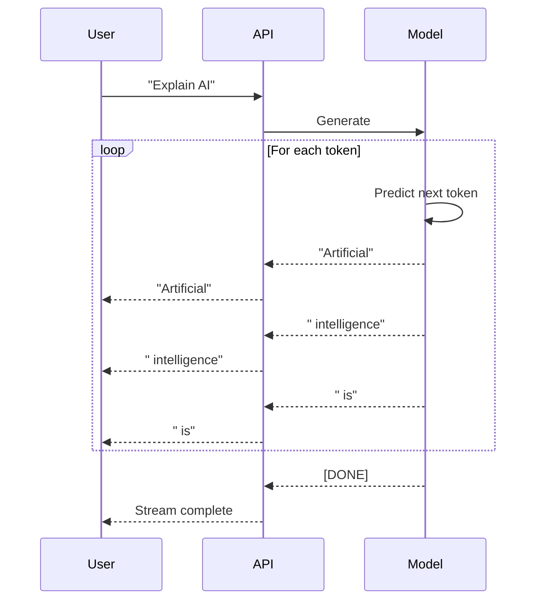
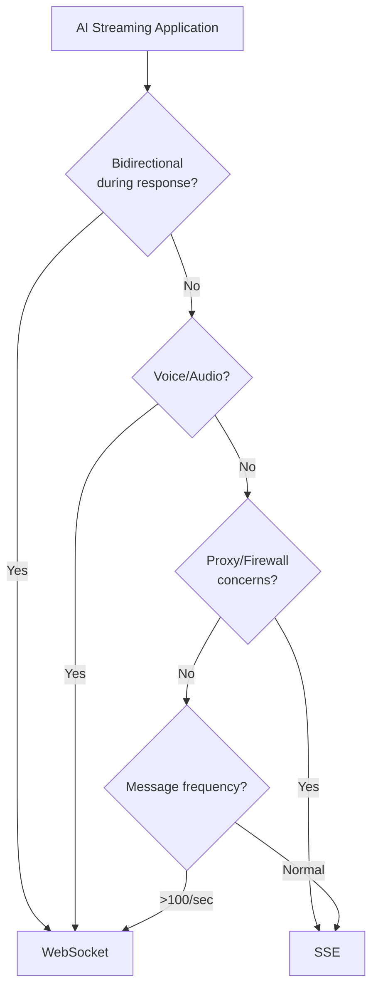

# AI Streaming Protocols

## Introduction

When an AI model generates a response, it produces tokens one at a time. Streaming these tokens to users as they're generated creates a dramatically better experience—responses feel instant rather than making users wait seconds for complete answers.

This lesson explores how real-time protocols power AI applications. We'll examine how major AI providers implement streaming, build our own streaming interfaces, and learn to handle the unique challenges of token-by-token delivery.

### What we'll cover

- Why streaming matters for AI/LLM applications
- Token-by-token delivery patterns
- How OpenAI and Anthropic implement streaming
- Building streaming UI components
- Error handling in AI streams
- Choosing protocols for different AI use cases

### Prerequisites

- Completion of [Server-Sent Events](./05-server-sent-events.md)
- Completion of [SSE vs WebSockets](./07-sse-vs-websockets.md)
- Basic understanding of AI/LLM APIs

---

## Why streaming matters for AI

### The user experience problem

Without streaming, users wait for the entire response:

```
User: "Explain quantum computing"

[Waiting... 5 seconds]
[Waiting... 10 seconds]
[Waiting... 15 seconds]

AI: [Full 500-word response appears at once]
```

With streaming, users see progress immediately:

```
User: "Explain quantum computing"

AI: Quantum
AI: Quantum computing
AI: Quantum computing uses
AI: Quantum computing uses quantum
AI: Quantum computing uses quantum mechanics...
[Continues word by word]
```

### Perceived performance

| Approach | Time to First Token | Total Time | User Perception |
|----------|---------------------|------------|-----------------|
| Non-streaming | 15 seconds | 15 seconds | "Slow, broken?" |
| Streaming | 200-500ms | 15 seconds | "Fast, responsive!" |

The total time is identical, but streaming feels **10-30x faster**.

### How LLMs generate text

Large Language Models generate tokens sequentially:



Each token takes ~20-100ms to generate. Streaming delivers them as they're ready instead of buffering.

---

## Token delivery patterns

### Event format

Most AI APIs use SSE with JSON payloads:

```
data: {"id":"chatcmpl-123","object":"chat.completion.chunk","choices":[{"delta":{"content":"Hello"}}]}

data: {"id":"chatcmpl-123","object":"chat.completion.chunk","choices":[{"delta":{"content":" there"}}]}

data: {"id":"chatcmpl-123","object":"chat.completion.chunk","choices":[{"delta":{"content":"!"}}]}

data: [DONE]
```

### Delta vs full content

AI streams typically send **deltas** (incremental additions), not complete content:

```javascript
// Delta approach (common)
// Each event contains only new tokens
{ "delta": { "content": "Hello" } }
{ "delta": { "content": " world" } }
{ "delta": { "content": "!" } }

// Full content approach (less common)
// Each event contains accumulated text
{ "content": "Hello" }
{ "content": "Hello world" }
{ "content": "Hello world!" }
```

**Deltas are more efficient**—they minimize bandwidth and let clients accumulate text.

### Accumulating tokens

```javascript
let fullResponse = "";

source.onmessage = (event) => {
  if (event.data === "[DONE]") {
    console.log("Complete:", fullResponse);
    return;
  }
  
  const data = JSON.parse(event.data);
  const token = data.choices?.[0]?.delta?.content || "";
  
  fullResponse += token;
  displayToken(token); // Show immediately
};
```

---

## OpenAI streaming implementation

### API request

OpenAI uses SSE triggered by the `stream: true` parameter:

```javascript
const response = await fetch("https://api.openai.com/v1/chat/completions", {
  method: "POST",
  headers: {
    "Content-Type": "application/json",
    "Authorization": `Bearer ${OPENAI_API_KEY}`
  },
  body: JSON.stringify({
    model: "gpt-4",
    messages: [{ role: "user", content: "Hello!" }],
    stream: true  // Enable streaming
  })
});
```

### Response format

OpenAI streams as SSE with `data:` lines:

```
data: {"id":"chatcmpl-abc123","object":"chat.completion.chunk","created":1234567890,"model":"gpt-4","choices":[{"index":0,"delta":{"role":"assistant"},"finish_reason":null}]}

data: {"id":"chatcmpl-abc123","object":"chat.completion.chunk","created":1234567890,"model":"gpt-4","choices":[{"index":0,"delta":{"content":"Hello"},"finish_reason":null}]}

data: {"id":"chatcmpl-abc123","object":"chat.completion.chunk","created":1234567890,"model":"gpt-4","choices":[{"index":0,"delta":{"content":"!"},"finish_reason":null}]}

data: {"id":"chatcmpl-abc123","object":"chat.completion.chunk","created":1234567890,"model":"gpt-4","choices":[{"index":0,"delta":{},"finish_reason":"stop"}]}

data: [DONE]
```

### Processing OpenAI streams

```javascript
async function streamOpenAI(prompt, onToken, onComplete) {
  const response = await fetch("https://api.openai.com/v1/chat/completions", {
    method: "POST",
    headers: {
      "Content-Type": "application/json",
      "Authorization": `Bearer ${OPENAI_API_KEY}`
    },
    body: JSON.stringify({
      model: "gpt-4",
      messages: [{ role: "user", content: prompt }],
      stream: true
    })
  });
  
  const reader = response.body.getReader();
  const decoder = new TextDecoder();
  let buffer = "";
  let fullContent = "";
  
  while (true) {
    const { done, value } = await reader.read();
    if (done) break;
    
    buffer += decoder.decode(value, { stream: true });
    
    // Process complete lines
    const lines = buffer.split("\n");
    buffer = lines.pop(); // Keep incomplete line in buffer
    
    for (const line of lines) {
      if (!line.startsWith("data: ")) continue;
      
      const data = line.slice(6); // Remove "data: "
      
      if (data === "[DONE]") {
        onComplete(fullContent);
        return;
      }
      
      try {
        const parsed = JSON.parse(data);
        const token = parsed.choices?.[0]?.delta?.content || "";
        
        if (token) {
          fullContent += token;
          onToken(token);
        }
      } catch (e) {
        console.error("Parse error:", e);
      }
    }
  }
}

// Usage
await streamOpenAI(
  "Explain recursion in 3 sentences",
  (token) => process.stdout.write(token),
  (full) => console.log("\n\nDone:", full.length, "chars")
);
```

---

## Anthropic streaming implementation

### API request

Anthropic (Claude) uses a similar SSE approach:

```javascript
const response = await fetch("https://api.anthropic.com/v1/messages", {
  method: "POST",
  headers: {
    "Content-Type": "application/json",
    "x-api-key": ANTHROPIC_API_KEY,
    "anthropic-version": "2023-06-01"
  },
  body: JSON.stringify({
    model: "claude-3-sonnet-20240229",
    max_tokens: 1024,
    messages: [{ role: "user", content: "Hello!" }],
    stream: true  // Enable streaming
  })
});
```

### Response format

Anthropic uses typed events:

```
event: message_start
data: {"type":"message_start","message":{"id":"msg_123","type":"message","role":"assistant","content":[]}}

event: content_block_start
data: {"type":"content_block_start","index":0,"content_block":{"type":"text","text":""}}

event: content_block_delta
data: {"type":"content_block_delta","index":0,"delta":{"type":"text_delta","text":"Hello"}}

event: content_block_delta
data: {"type":"content_block_delta","index":0,"delta":{"type":"text_delta","text":"!"}}

event: content_block_stop
data: {"type":"content_block_stop","index":0}

event: message_stop
data: {"type":"message_stop"}
```

### Processing Anthropic streams

```javascript
async function streamAnthropic(prompt, onToken, onComplete) {
  const response = await fetch("https://api.anthropic.com/v1/messages", {
    method: "POST",
    headers: {
      "Content-Type": "application/json",
      "x-api-key": ANTHROPIC_API_KEY,
      "anthropic-version": "2023-06-01"
    },
    body: JSON.stringify({
      model: "claude-3-sonnet-20240229",
      max_tokens: 1024,
      messages: [{ role: "user", content: prompt }],
      stream: true
    })
  });
  
  const reader = response.body.getReader();
  const decoder = new TextDecoder();
  let buffer = "";
  let fullContent = "";
  
  while (true) {
    const { done, value } = await reader.read();
    if (done) break;
    
    buffer += decoder.decode(value, { stream: true });
    
    // Parse SSE format
    const events = buffer.split("\n\n");
    buffer = events.pop();
    
    for (const event of events) {
      const lines = event.split("\n");
      let eventType = "";
      let eventData = "";
      
      for (const line of lines) {
        if (line.startsWith("event: ")) {
          eventType = line.slice(7);
        } else if (line.startsWith("data: ")) {
          eventData = line.slice(6);
        }
      }
      
      if (eventType === "content_block_delta") {
        try {
          const parsed = JSON.parse(eventData);
          const token = parsed.delta?.text || "";
          
          if (token) {
            fullContent += token;
            onToken(token);
          }
        } catch (e) {
          console.error("Parse error:", e);
        }
      } else if (eventType === "message_stop") {
        onComplete(fullContent);
        return;
      }
    }
  }
}
```

---

## Unified streaming client

### Abstracting provider differences

```javascript
class AIStreamClient {
  constructor(provider, apiKey) {
    this.provider = provider;
    this.apiKey = apiKey;
    this.parsers = {
      openai: this.parseOpenAI.bind(this),
      anthropic: this.parseAnthropic.bind(this)
    };
  }
  
  async stream(prompt, { onToken, onComplete, onError }) {
    try {
      const response = await this.makeRequest(prompt);
      
      if (!response.ok) {
        throw new Error(`API error: ${response.status}`);
      }
      
      const reader = response.body.getReader();
      const decoder = new TextDecoder();
      const parser = this.parsers[this.provider];
      
      let buffer = "";
      let fullContent = "";
      
      while (true) {
        const { done, value } = await reader.read();
        if (done) break;
        
        buffer += decoder.decode(value, { stream: true });
        
        const result = parser(buffer);
        buffer = result.remaining;
        
        for (const token of result.tokens) {
          fullContent += token;
          onToken?.(token, fullContent);
        }
        
        if (result.done) {
          onComplete?.(fullContent);
          return fullContent;
        }
      }
      
      onComplete?.(fullContent);
      return fullContent;
      
    } catch (error) {
      onError?.(error);
      throw error;
    }
  }
  
  makeRequest(prompt) {
    const configs = {
      openai: {
        url: "https://api.openai.com/v1/chat/completions",
        headers: {
          "Content-Type": "application/json",
          "Authorization": `Bearer ${this.apiKey}`
        },
        body: {
          model: "gpt-4",
          messages: [{ role: "user", content: prompt }],
          stream: true
        }
      },
      anthropic: {
        url: "https://api.anthropic.com/v1/messages",
        headers: {
          "Content-Type": "application/json",
          "x-api-key": this.apiKey,
          "anthropic-version": "2023-06-01"
        },
        body: {
          model: "claude-3-sonnet-20240229",
          max_tokens: 1024,
          messages: [{ role: "user", content: prompt }],
          stream: true
        }
      }
    };
    
    const config = configs[this.provider];
    
    return fetch(config.url, {
      method: "POST",
      headers: config.headers,
      body: JSON.stringify(config.body)
    });
  }
  
  parseOpenAI(buffer) {
    const tokens = [];
    const lines = buffer.split("\n");
    let remaining = "";
    let done = false;
    
    for (let i = 0; i < lines.length; i++) {
      const line = lines[i];
      
      // Incomplete line - save for next iteration
      if (i === lines.length - 1 && !line.endsWith("}") && line !== "") {
        remaining = line;
        continue;
      }
      
      if (!line.startsWith("data: ")) continue;
      
      const data = line.slice(6);
      
      if (data === "[DONE]") {
        done = true;
        continue;
      }
      
      try {
        const parsed = JSON.parse(data);
        const token = parsed.choices?.[0]?.delta?.content || "";
        if (token) tokens.push(token);
      } catch (e) {
        // Incomplete JSON, save for next iteration
        remaining = line;
      }
    }
    
    return { tokens, remaining, done };
  }
  
  parseAnthropic(buffer) {
    const tokens = [];
    const events = buffer.split("\n\n");
    const remaining = events.pop() || "";
    let done = false;
    
    for (const event of events) {
      const lines = event.split("\n");
      let eventType = "";
      let eventData = "";
      
      for (const line of lines) {
        if (line.startsWith("event: ")) eventType = line.slice(7);
        else if (line.startsWith("data: ")) eventData = line.slice(6);
      }
      
      if (eventType === "content_block_delta") {
        try {
          const parsed = JSON.parse(eventData);
          const token = parsed.delta?.text || "";
          if (token) tokens.push(token);
        } catch (e) {
          // Ignore parse errors
        }
      } else if (eventType === "message_stop") {
        done = true;
      }
    }
    
    return { tokens, remaining, done };
  }
}

// Usage
const client = new AIStreamClient("openai", process.env.OPENAI_API_KEY);

await client.stream("Explain quantum computing", {
  onToken: (token) => process.stdout.write(token),
  onComplete: (full) => console.log("\n\n✅ Complete"),
  onError: (err) => console.error("❌ Error:", err.message)
});
```

---

## Building streaming UI components

### React streaming component

```jsx
import { useState, useCallback } from "react";

function StreamingChat() {
  const [messages, setMessages] = useState([]);
  const [input, setInput] = useState("");
  const [isStreaming, setIsStreaming] = useState(false);
  
  const sendMessage = useCallback(async () => {
    if (!input.trim() || isStreaming) return;
    
    const userMessage = { role: "user", content: input };
    setMessages(prev => [...prev, userMessage]);
    setInput("");
    setIsStreaming(true);
    
    // Add placeholder for AI response
    setMessages(prev => [...prev, { role: "assistant", content: "" }]);
    
    try {
      const response = await fetch("/api/chat", {
        method: "POST",
        headers: { "Content-Type": "application/json" },
        body: JSON.stringify({ message: input })
      });
      
      const reader = response.body.getReader();
      const decoder = new TextDecoder();
      
      while (true) {
        const { done, value } = await reader.read();
        if (done) break;
        
        const chunk = decoder.decode(value, { stream: true });
        
        // Update last message with new tokens
        setMessages(prev => {
          const updated = [...prev];
          const lastIndex = updated.length - 1;
          updated[lastIndex] = {
            ...updated[lastIndex],
            content: updated[lastIndex].content + chunk
          };
          return updated;
        });
      }
    } catch (error) {
      console.error("Stream error:", error);
    } finally {
      setIsStreaming(false);
    }
  }, [input, isStreaming]);
  
  return (
    <div className="chat-container">
      <div className="messages">
        {messages.map((msg, i) => (
          <div key={i} className={`message ${msg.role}`}>
            <span className="content">{msg.content}</span>
            {isStreaming && i === messages.length - 1 && (
              <span className="cursor">▊</span>
            )}
          </div>
        ))}
      </div>
      
      <div className="input-area">
        <input
          value={input}
          onChange={(e) => setInput(e.target.value)}
          onKeyPress={(e) => e.key === "Enter" && sendMessage()}
          disabled={isStreaming}
          placeholder="Type a message..."
        />
        <button onClick={sendMessage} disabled={isStreaming}>
          {isStreaming ? "Streaming..." : "Send"}
        </button>
      </div>
    </div>
  );
}
```

### Typing indicator effect

```javascript
class TypingIndicator {
  constructor(element, options = {}) {
    this.element = element;
    this.speed = options.speed || 30; // ms per character
    this.cursor = options.cursor || "▊";
    this.buffer = "";
    this.displayed = "";
    this.isTyping = false;
  }
  
  append(text) {
    this.buffer += text;
    if (!this.isTyping) this.type();
  }
  
  async type() {
    this.isTyping = true;
    
    while (this.buffer.length > 0) {
      const char = this.buffer[0];
      this.buffer = this.buffer.slice(1);
      this.displayed += char;
      
      this.element.textContent = this.displayed + this.cursor;
      
      await this.wait(this.speed);
    }
    
    this.isTyping = false;
  }
  
  finish() {
    // Display all remaining buffer immediately
    this.displayed += this.buffer;
    this.buffer = "";
    this.element.textContent = this.displayed;
  }
  
  wait(ms) {
    return new Promise(resolve => setTimeout(resolve, ms));
  }
}

// Usage
const output = document.getElementById("response");
const typer = new TypingIndicator(output);

source.onmessage = (event) => {
  const data = JSON.parse(event.data);
  if (data.done) {
    typer.finish();
  } else {
    typer.append(data.token);
  }
};
```

### Markdown rendering during streaming

```javascript
import { marked } from "marked";

class StreamingMarkdown {
  constructor(element) {
    this.element = element;
    this.content = "";
    this.renderDebounced = this.debounce(() => this.render(), 50);
  }
  
  append(text) {
    this.content += text;
    this.renderDebounced();
  }
  
  render() {
    // Render markdown to HTML
    const html = marked.parse(this.content);
    this.element.innerHTML = html;
    
    // Scroll to bottom
    this.element.scrollTop = this.element.scrollHeight;
  }
  
  debounce(fn, delay) {
    let timeout;
    return () => {
      clearTimeout(timeout);
      timeout = setTimeout(fn, delay);
    };
  }
  
  clear() {
    this.content = "";
    this.element.innerHTML = "";
  }
}

// Usage
const renderer = new StreamingMarkdown(document.getElementById("output"));

await client.stream(prompt, {
  onToken: (token) => renderer.append(token),
  onComplete: () => console.log("Done")
});
```

---

## Error handling in AI streams

### Common error scenarios

| Error Type | Cause | Handling |
|------------|-------|----------|
| Rate limit | Too many requests | Retry with backoff |
| Context length | Prompt too long | Truncate conversation |
| Network failure | Connection lost | Reconnect and resume |
| Invalid API key | Authentication failure | Show auth error |
| Model overloaded | Capacity issues | Retry or use fallback model |

### Robust stream handling

```javascript
async function robustStream(prompt, options = {}) {
  const {
    onToken,
    onComplete,
    onError,
    maxRetries = 3,
    retryDelay = 1000
  } = options;
  
  let attempt = 0;
  let fullContent = "";
  
  while (attempt < maxRetries) {
    try {
      const response = await fetch("/api/chat", {
        method: "POST",
        headers: { "Content-Type": "application/json" },
        body: JSON.stringify({ prompt })
      });
      
      // Handle HTTP errors
      if (!response.ok) {
        const error = await response.json().catch(() => ({}));
        
        if (response.status === 429) {
          // Rate limit - retry after delay
          const retryAfter = parseInt(response.headers.get("Retry-After")) || 60;
          console.log(`Rate limited. Retrying in ${retryAfter}s...`);
          await wait(retryAfter * 1000);
          attempt++;
          continue;
        }
        
        if (response.status === 401 || response.status === 403) {
          throw new Error("Authentication failed");
        }
        
        throw new Error(error.message || `HTTP ${response.status}`);
      }
      
      // Process stream
      const reader = response.body.getReader();
      const decoder = new TextDecoder();
      
      while (true) {
        const { done, value } = await reader.read();
        
        if (done) {
          onComplete?.(fullContent);
          return fullContent;
        }
        
        const chunk = decoder.decode(value, { stream: true });
        fullContent += chunk;
        onToken?.(chunk, fullContent);
      }
      
    } catch (error) {
      attempt++;
      
      if (error.name === "AbortError") {
        // User cancelled - don't retry
        throw error;
      }
      
      if (attempt >= maxRetries) {
        onError?.(error);
        throw error;
      }
      
      console.log(`Attempt ${attempt} failed. Retrying...`);
      await wait(retryDelay * Math.pow(2, attempt - 1));
    }
  }
}

function wait(ms) {
  return new Promise(resolve => setTimeout(resolve, ms));
}
```

### Cancellation support

```javascript
class CancellableStream {
  constructor() {
    this.controller = null;
  }
  
  async stream(prompt, onToken) {
    // Cancel any existing stream
    this.cancel();
    
    this.controller = new AbortController();
    
    try {
      const response = await fetch("/api/chat", {
        method: "POST",
        headers: { "Content-Type": "application/json" },
        body: JSON.stringify({ prompt }),
        signal: this.controller.signal
      });
      
      const reader = response.body.getReader();
      const decoder = new TextDecoder();
      
      while (true) {
        const { done, value } = await reader.read();
        if (done) break;
        
        if (this.controller.signal.aborted) {
          await reader.cancel();
          break;
        }
        
        const chunk = decoder.decode(value, { stream: true });
        onToken(chunk);
      }
      
    } catch (error) {
      if (error.name !== "AbortError") {
        throw error;
      }
    } finally {
      this.controller = null;
    }
  }
  
  cancel() {
    this.controller?.abort();
    this.controller = null;
  }
}

// Usage
const stream = new CancellableStream();

// Start streaming
stream.stream("Explain machine learning", (token) => {
  console.log(token);
});

// Cancel after 2 seconds
setTimeout(() => {
  stream.cancel();
  console.log("Cancelled!");
}, 2000);
```

---

## Choosing protocols for AI applications

### SSE for AI (recommended for most cases)

| Advantage | Explanation |
|-----------|-------------|
| Native AI API support | OpenAI, Anthropic, Google use SSE |
| Auto-reconnection | Built-in browser handling |
| HTTP compatibility | Works through proxies |
| Simple implementation | Standard browser EventSource |

### WebSocket for AI

| Use Case | Why WebSocket |
|----------|---------------|
| Interactive AI | Multi-turn with instant feedback |
| Voice AI | Real-time audio streaming |
| AI gaming | Low-latency actions and responses |
| Collaborative AI | Multiple users, shared context |

### Decision matrix



### Hybrid AI architecture

For complex AI applications, combine both:

```javascript
class HybridAIClient {
  constructor(config) {
    this.sseEndpoint = config.sseEndpoint;
    this.wsEndpoint = config.wsEndpoint;
    this.ws = null;
  }
  
  // SSE for long-form responses
  async streamResponse(prompt, onToken) {
    const source = new EventSource(
      `${this.sseEndpoint}?prompt=${encodeURIComponent(prompt)}`
    );
    
    return new Promise((resolve, reject) => {
      let content = "";
      
      source.onmessage = (event) => {
        if (event.data === "[DONE]") {
          source.close();
          resolve(content);
        } else {
          const data = JSON.parse(event.data);
          content += data.token;
          onToken(data.token);
        }
      };
      
      source.onerror = () => {
        source.close();
        reject(new Error("SSE stream failed"));
      };
    });
  }
  
  // WebSocket for interactive features
  connectInteractive(onMessage) {
    this.ws = new WebSocket(this.wsEndpoint);
    
    this.ws.onmessage = (event) => {
      const data = JSON.parse(event.data);
      onMessage(data);
    };
    
    return new Promise((resolve, reject) => {
      this.ws.onopen = resolve;
      this.ws.onerror = reject;
    });
  }
  
  // Send user actions via WebSocket
  sendAction(action) {
    if (this.ws?.readyState === WebSocket.OPEN) {
      this.ws.send(JSON.stringify(action));
    }
  }
  
  disconnect() {
    this.ws?.close();
  }
}

// Usage
const ai = new HybridAIClient({
  sseEndpoint: "/api/chat/stream",
  wsEndpoint: "wss://example.com/ai/interactive"
});

// Stream a long response
await ai.streamResponse("Write an essay about AI", (token) => {
  display.append(token);
});

// Connect for interactive features
await ai.connectInteractive((data) => {
  if (data.type === "suggestion") {
    showSuggestion(data.content);
  }
});

// Send user feedback
ai.sendAction({ type: "feedback", value: "helpful" });
```

---

## Best practices

| Practice | Why It Matters |
|----------|----------------|
| Always implement cancellation | Users expect to stop generation |
| Debounce markdown rendering | Avoid expensive re-renders every token |
| Handle rate limits gracefully | Major APIs enforce quotas |
| Show streaming status | Users should know what's happening |
| Buffer incomplete SSE lines | Avoid partial JSON parsing errors |
| Prefer SSE for LLM streaming | Native support, auto-reconnect |

---

## Common pitfalls

| ❌ Mistake | ✅ Solution |
|-----------|-------------|
| Rendering HTML on every token | Debounce renders (50-100ms) |
| Ignoring `[DONE]` signal | Explicitly handle stream completion |
| No cancellation support | Add AbortController to all requests |
| Blocking UI during stream | Use async/await with state updates |
| Assuming stable JSON chunks | Buffer and parse complete lines only |
| Not handling rate limits | Implement exponential backoff |

---

## Hands-on exercise

### Your task

Build a streaming AI chat interface that displays tokens as they arrive, shows a typing indicator, and supports message cancellation.

### Requirements

1. Send messages to a streaming endpoint
2. Display tokens as they arrive with a blinking cursor
3. Add a "Stop" button to cancel generation
4. Show a loading indicator while waiting for first token
5. Render markdown in the final response

### Expected result

```
You: Explain how neural networks learn

AI: Neural networks learn through a process called 
    backpropagation. First, data flows forward...▊
    
    [Stop Generation]

---

History:
- You: Hello
- AI: Hello! How can I help you today?
```

<details>
<summary>💡 Hints (click to expand)</summary>

- Use `AbortController` for cancellation
- Track "waiting", "streaming", and "idle" states
- Update the cursor position with each token
- Use a library like `marked` for markdown
- Keep message history in an array

</details>

<details>
<summary>✅ Solution (click to expand)</summary>

```html
<!DOCTYPE html>
<html>
<head>
  <title>AI Chat</title>
  <script src="https://cdn.jsdelivr.net/npm/marked/marked.min.js"></script>
  <style>
    .chat { max-width: 600px; margin: 0 auto; font-family: sans-serif; }
    .message { padding: 10px; margin: 10px 0; border-radius: 8px; }
    .user { background: #e3f2fd; text-align: right; }
    .assistant { background: #f5f5f5; }
    .cursor { animation: blink 1s infinite; }
    @keyframes blink { 50% { opacity: 0; } }
    .loading { color: #666; font-style: italic; }
    input { width: 70%; padding: 10px; }
    button { padding: 10px 20px; cursor: pointer; }
    button:disabled { opacity: 0.5; }
    #stop { background: #ff5252; color: white; border: none; }
  </style>
</head>
<body>
  <div class="chat">
    <h1>AI Chat</h1>
    <div id="messages"></div>
    <div>
      <input id="input" placeholder="Type a message..." />
      <button id="send">Send</button>
      <button id="stop" style="display: none;">Stop</button>
    </div>
  </div>
  
  <script>
    const messagesEl = document.getElementById("messages");
    const inputEl = document.getElementById("input");
    const sendBtn = document.getElementById("send");
    const stopBtn = document.getElementById("stop");
    
    let controller = null;
    let state = "idle"; // idle, waiting, streaming
    
    function addMessage(role, content) {
      const div = document.createElement("div");
      div.className = `message ${role}`;
      div.innerHTML = role === "assistant" ? marked.parse(content) : content;
      messagesEl.appendChild(div);
      return div;
    }
    
    function updateLastMessage(content, showCursor = false) {
      const messages = messagesEl.querySelectorAll(".message");
      const last = messages[messages.length - 1];
      if (last) {
        last.innerHTML = marked.parse(content) + 
          (showCursor ? '<span class="cursor">▊</span>' : '');
      }
    }
    
    async function sendMessage() {
      const text = inputEl.value.trim();
      if (!text || state !== "idle") return;
      
      inputEl.value = "";
      addMessage("user", text);
      
      // Show loading
      state = "waiting";
      sendBtn.disabled = true;
      stopBtn.style.display = "inline";
      const loadingDiv = addMessage("assistant", "");
      loadingDiv.innerHTML = '<span class="loading">Thinking...</span>';
      
      // Start stream
      controller = new AbortController();
      let fullContent = "";
      
      try {
        const response = await fetch("/api/chat", {
          method: "POST",
          headers: { "Content-Type": "application/json" },
          body: JSON.stringify({ message: text }),
          signal: controller.signal
        });
        
        if (!response.ok) throw new Error("API error");
        
        state = "streaming";
        const reader = response.body.getReader();
        const decoder = new TextDecoder();
        
        while (true) {
          const { done, value } = await reader.read();
          if (done) break;
          
          const chunk = decoder.decode(value, { stream: true });
          
          // Parse SSE format
          for (const line of chunk.split("\n")) {
            if (!line.startsWith("data: ")) continue;
            const data = line.slice(6);
            if (data === "[DONE]") continue;
            
            try {
              const parsed = JSON.parse(data);
              fullContent += parsed.token || "";
              updateLastMessage(fullContent, true);
            } catch (e) {
              // Ignore parse errors
            }
          }
        }
        
      } catch (error) {
        if (error.name === "AbortError") {
          fullContent += "\n\n*[Generation stopped]*";
        } else {
          fullContent = "❌ Error: " + error.message;
        }
      }
      
      // Final render without cursor
      updateLastMessage(fullContent, false);
      
      state = "idle";
      controller = null;
      sendBtn.disabled = false;
      stopBtn.style.display = "none";
    }
    
    function stopGeneration() {
      controller?.abort();
    }
    
    sendBtn.onclick = sendMessage;
    stopBtn.onclick = stopGeneration;
    inputEl.onkeypress = (e) => e.key === "Enter" && sendMessage();
  </script>
</body>
</html>
```

**Server (chat-server.js):**
```javascript
const express = require("express");
const app = express();

app.use(express.json());
app.use(express.static("public"));

app.post("/api/chat", (req, res) => {
  res.setHeader("Content-Type", "text/event-stream");
  res.setHeader("Cache-Control", "no-cache");
  
  const message = req.body.message;
  
  // Simulate AI response
  const response = `Thanks for your message: "${message}"

Here's a **simulated** streaming response with some markdown:

1. First point
2. Second point
3. Third point

This demonstrates token-by-token delivery.`;
  
  const tokens = response.split(/(?=\s)|(?<=\s)/);
  let i = 0;
  
  const interval = setInterval(() => {
    if (i >= tokens.length) {
      res.write("data: [DONE]\n\n");
      res.end();
      clearInterval(interval);
      return;
    }
    
    res.write(`data: ${JSON.stringify({ token: tokens[i] })}\n\n`);
    i++;
  }, 50);
  
  req.on("close", () => clearInterval(interval));
});

app.listen(3000);
```

</details>

### Bonus challenges

- [ ] Add support for multiple AI models
- [ ] Implement conversation history (multi-turn)
- [ ] Add copy-to-clipboard for responses
- [ ] Show token count and generation speed

---

## Summary

✅ Streaming delivers tokens as they're generated, making AI feel 10-30x faster

✅ OpenAI and Anthropic use SSE with `data:` lines containing JSON deltas

✅ Build unified clients to abstract provider differences

✅ Always implement cancellation with `AbortController`

✅ Debounce markdown rendering to avoid performance issues

✅ Use SSE for most AI applications; WebSocket only when bidirectional is essential

**Next:** [Back to Overview](./00-real-time-communication.md)

---

## Further reading

- [OpenAI Streaming Guide](https://platform.openai.com/docs/api-reference/streaming) - Official streaming documentation
- [Anthropic Streaming](https://docs.anthropic.com/en/api/streaming) - Claude streaming format
- [MDN: ReadableStream](https://developer.mozilla.org/en-US/docs/Web/API/ReadableStream) - Stream processing API
- [Vercel AI SDK](https://sdk.vercel.ai/docs) - React/Next.js AI streaming utilities

<!--
Sources Consulted:
- OpenAI API Streaming: https://platform.openai.com/docs/api-reference/streaming
- Anthropic API Streaming: https://docs.anthropic.com/en/api/streaming
- MDN ReadableStream: https://developer.mozilla.org/en-US/docs/Web/API/ReadableStream
- MDN Server-sent events: https://developer.mozilla.org/en-US/docs/Web/API/Server-sent_events
-->
