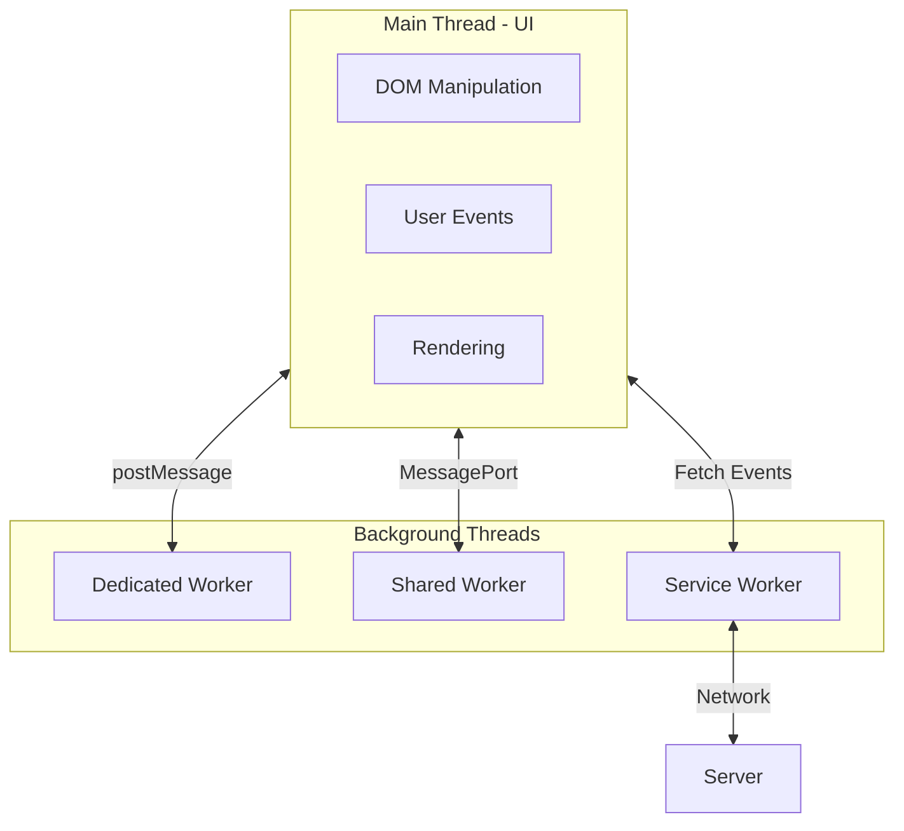

# Web Workers & Background Processing

## Introduction

JavaScript is single-threaded by design, meaning all code runs on a single main thread that also handles UI updates, user interactions, and rendering. When you run computationally heavy tasks—like processing large datasets, performing complex calculations, or handling AI model inference—the main thread gets blocked, causing your application to freeze.

**Web Workers** solve this problem by enabling true parallel processing in the browser. They run JavaScript in background threads, completely separate from the main thread, allowing heavy computations to happen without affecting UI responsiveness.

### Why This Matters for AI Applications

AI-powered web applications often need to:
- Process large amounts of data before sending to APIs
- Handle streaming responses from LLMs
- Perform client-side inference with models like TensorFlow.js
- Cache and sync data offline for AI assistants
- Run background tasks while users interact with the UI

Understanding Web Workers and Service Workers is essential for building responsive AI applications.

### What We'll Cover

1. **Web Workers Fundamentals** - Background threads and communication
2. **Creating and Communicating with Workers** - The messaging API
3. **Transferable Objects** - High-performance data transfer
4. **Shared Workers** - Multi-tab communication
5. **Service Workers Introduction** - The network proxy pattern
6. **Offline Capabilities** - Building offline-first apps
7. **Caching Strategies** - Cache API patterns
8. **Background Sync** - Reliable background operations

### Prerequisites

- Solid understanding of JavaScript fundamentals
- Familiarity with Promises and async/await
- Understanding of the browser event loop
- Basic knowledge of the Fetch API

---

## Types of Workers

Before diving deep, let's understand the three main types of workers:

| Worker Type | Scope | Use Case | Lifecycle |
|-------------|-------|----------|-----------|
| **Dedicated Worker** | Single page | Heavy computation, data processing | Tied to page |
| **Shared Worker** | Multiple pages | Shared state across tabs | Lives while tabs are open |
| **Service Worker** | Origin-wide | Offline support, caching, push notifications | Independent of pages |



---

## Quick Example

Here's a taste of what we'll build—a dedicated worker performing heavy computation:

**main.js:**
```javascript
// Create a worker
const worker = new Worker('heavy-task.js');

// Send data to worker
worker.postMessage({ numbers: [1, 2, 3, 4, 5], operation: 'sum' });

// Receive result from worker
worker.onmessage = (event) => {
  console.log('Result:', event.data.result);
};
```

**heavy-task.js (Worker):**
```javascript
self.onmessage = (event) => {
  const { numbers, operation } = event.data;
  
  let result;
  if (operation === 'sum') {
    result = numbers.reduce((a, b) => a + b, 0);
  }
  
  // Send result back to main thread
  self.postMessage({ result });
};
```

The main thread stays responsive while the worker handles the computation.

---

## Lesson Structure

| Lesson | Topic | Description |
|--------|-------|-------------|
| [01](./01-web-workers-fundamentals.md) | Web Workers Fundamentals | Core concepts, limitations, use cases |
| [02](./02-creating-communicating-workers.md) | Creating & Communicating | postMessage, event handling, errors |
| [03](./03-transferable-objects.md) | Transferable Objects | ArrayBuffer, OffscreenCanvas, performance |
| [04](./04-shared-workers.md) | Shared Workers | Multi-tab state, port communication |
| [05](./05-service-workers-introduction.md) | Service Workers Introduction | Lifecycle, registration, scope |
| [06](./06-offline-capabilities.md) | Offline Capabilities | Fetch interception, offline-first |
| [07](./07-caching-strategies.md) | Caching Strategies | Cache API, cache patterns |
| [08](./08-background-sync.md) | Background Sync | Deferred actions, periodic sync |

---

## Summary

Web Workers enable background processing in the browser:

✅ **Dedicated Workers** - Heavy computation without blocking UI
✅ **Shared Workers** - State sharing across browser tabs
✅ **Service Workers** - Network proxy for offline and caching
✅ **Background Sync** - Reliable background operations

**Next:** [Web Workers Fundamentals](./01-web-workers-fundamentals.md)

---

## Further Reading

- [MDN Web Workers API](https://developer.mozilla.org/en-US/docs/Web/API/Web_Workers_API) - Comprehensive reference
- [MDN Service Worker API](https://developer.mozilla.org/en-US/docs/Web/API/Service_Worker_API) - Service worker guide
- [web.dev Service Workers](https://web.dev/learn/pwa/service-workers) - PWA patterns
- [Using Web Workers](https://developer.mozilla.org/en-US/docs/Web/API/Web_Workers_API/Using_web_workers) - Practical guide

<!-- 
Sources Consulted:
- MDN Web Workers API: https://developer.mozilla.org/en-US/docs/Web/API/Web_Workers_API
- MDN Service Worker API: https://developer.mozilla.org/en-US/docs/Web/API/Service_Worker_API
-->
