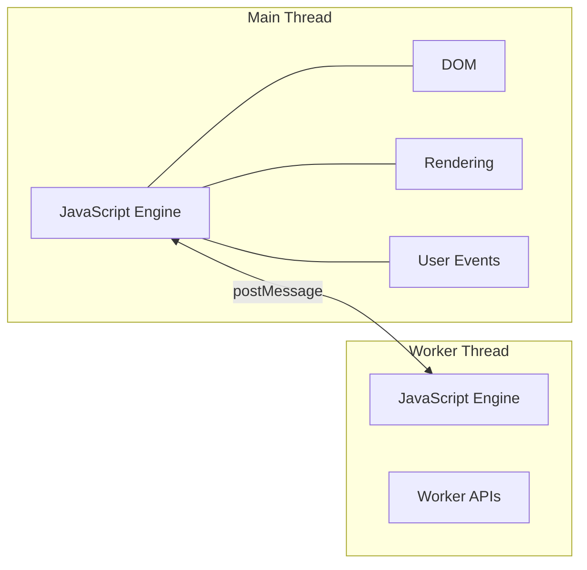

# Web Workers Fundamentals

## Introduction

JavaScript runs on a single thread in the browser. This thread—called the **main thread**—handles everything: parsing HTML, executing JavaScript, responding to user clicks, painting pixels, and running your application logic. When any task takes too long, the entire UI freezes.

Web Workers provide a way to run JavaScript in **background threads**, completely separate from the main thread. This enables true parallel processing in the browser, something that wasn't possible before workers were introduced.

### What We'll Cover

- What Web Workers are and how they work
- Main thread vs worker threads
- Worker limitations (no DOM access)
- The worker global scope
- Real-world use cases for workers

### Prerequisites

- Understanding of JavaScript execution model
- Familiarity with the event loop concept
- Basic async JavaScript knowledge

---

## What Are Web Workers?

A Web Worker is a JavaScript script that runs in a **background thread**, separate from the main execution thread. Workers run in their own global context, isolated from the `window` object and the DOM.



### Key Characteristics

| Feature | Main Thread | Web Worker |
|---------|-------------|------------|
| DOM Access | ✅ Yes | ❌ No |
| Window object | ✅ Yes | ❌ No (uses `self`) |
| Network requests | ✅ fetch, XMLHttpRequest | ✅ fetch, XMLHttpRequest |
| Timers | ✅ setTimeout, setInterval | ✅ setTimeout, setInterval |
| WebSockets | ✅ Yes | ✅ Yes |
| IndexedDB | ✅ Yes | ✅ Yes |
| UI Rendering | ✅ Yes | ❌ No |
| Blocking allowed | ❌ Freezes UI | ✅ No impact on UI |

---

## Main Thread vs Worker Threads

### The Problem with Single-Threaded JavaScript

Consider a task that processes a large dataset:

```javascript
// ❌ This blocks the main thread
function processLargeDataset(data) {
  let result = 0;
  for (let i = 0; i < data.length; i++) {
    // Expensive computation
    result += Math.sqrt(data[i]) * Math.sin(data[i]);
  }
  return result;
}

// If data has 10 million items, UI freezes during processing
const data = new Array(10_000_000).fill(0).map(() => Math.random() * 1000);
const result = processLargeDataset(data); // UI frozen for seconds
```

While this runs, users can't:
- Click buttons
- Scroll the page
- Type in inputs
- See animations

The browser may even show a "Page Unresponsive" warning.

### The Solution: Web Workers

```javascript
// ✅ Offload to a worker
const worker = new Worker('processor.js');

worker.postMessage({ data: largeDataset });

worker.onmessage = (event) => {
  console.log('Result:', event.data.result);
  // UI stayed responsive the entire time!
};
```

The computation happens in a separate thread. The main thread remains free to handle user interactions.

---

## Worker Limitations

Workers are intentionally limited to prevent thread-safety issues:

### What Workers CAN'T Access

```javascript
// Inside a worker - these will throw errors or be undefined

// ❌ No DOM
document.getElementById('app');  // ReferenceError: document is not defined

// ❌ No window
window.location;  // ReferenceError: window is not defined

// ❌ No parent
parent.postMessage();  // Not available

// ❌ No localStorage (in most browsers)
localStorage.setItem('key', 'value');  // May throw

// ❌ No alert/confirm/prompt
alert('Hello');  // ReferenceError
```

### What Workers CAN Access

```javascript
// Inside a worker - these work fine

// ✅ Network requests
fetch('/api/data').then(r => r.json());

// ✅ Timers
setTimeout(() => console.log('Delayed'), 1000);
setInterval(() => console.log('Repeating'), 1000);

// ✅ IndexedDB
const request = indexedDB.open('myDB', 1);

// ✅ WebSockets
const ws = new WebSocket('wss://example.com/socket');

// ✅ Crypto API
crypto.subtle.digest('SHA-256', data);

// ✅ Console
console.log('Worker running');

// ✅ importScripts (for loading libraries)
importScripts('https://cdn.example.com/library.js');
```

> **🤖 AI Context:** This limitation is actually beneficial for AI applications. Workers can handle data processing, API calls to LLM endpoints, and result formatting—all without needing DOM access.

---

## Worker Global Scope

Workers have their own global scope called `WorkerGlobalScope`. Instead of `window`, workers use `self` (or just reference globals directly):

```javascript
// worker.js

// 'self' refers to the worker's global scope
self.onmessage = (event) => {
  console.log('Received:', event.data);
};

// You can also reference globals directly
onmessage = (event) => {
  console.log('This also works:', event.data);
};

// Access worker-specific properties
console.log(self.name);      // Worker name (if provided)
console.log(self.location);  // WorkerLocation object
console.log(self.navigator); // WorkerNavigator object
```

### Available Global Functions

| Function | Description |
|----------|-------------|
| `postMessage()` | Send data to main thread |
| `close()` | Terminate the worker from inside |
| `importScripts()` | Synchronously load external scripts |
| `fetch()` | Make network requests |
| `setTimeout()` / `setInterval()` | Timers |
| `atob()` / `btoa()` | Base64 encoding/decoding |
| `crypto` | Cryptographic operations |

---

## Use Cases for Web Workers

### 1. Heavy Computation

```javascript
// Prime number calculation - expensive!
self.onmessage = (event) => {
  const { max } = event.data;
  const primes = [];
  
  for (let n = 2; n <= max; n++) {
    let isPrime = true;
    for (let i = 2; i <= Math.sqrt(n); i++) {
      if (n % i === 0) {
        isPrime = false;
        break;
      }
    }
    if (isPrime) primes.push(n);
  }
  
  self.postMessage({ primes });
};
```

### 2. Data Processing & Transformation

```javascript
// CSV parsing in a worker
self.onmessage = async (event) => {
  const { csvText } = event.data;
  
  const rows = csvText.split('\n');
  const headers = rows[0].split(',');
  
  const data = rows.slice(1).map(row => {
    const values = row.split(',');
    return headers.reduce((obj, header, i) => {
      obj[header.trim()] = values[i]?.trim();
      return obj;
    }, {});
  });
  
  self.postMessage({ data });
};
```

### 3. Image Processing

```javascript
// Image manipulation with OffscreenCanvas
self.onmessage = async (event) => {
  const { imageData, filter } = event.data;
  
  // Apply grayscale filter
  if (filter === 'grayscale') {
    for (let i = 0; i < imageData.data.length; i += 4) {
      const avg = (imageData.data[i] + imageData.data[i+1] + imageData.data[i+2]) / 3;
      imageData.data[i] = avg;     // R
      imageData.data[i+1] = avg;   // G
      imageData.data[i+2] = avg;   // B
    }
  }
  
  self.postMessage({ imageData }, [imageData.data.buffer]);
};
```

### 4. AI/ML Inference

```javascript
// Running TensorFlow.js model in a worker
importScripts('https://cdn.jsdelivr.net/npm/@tensorflow/tfjs');

let model;

self.onmessage = async (event) => {
  const { action, data } = event.data;
  
  if (action === 'loadModel') {
    model = await tf.loadLayersModel(data.modelUrl);
    self.postMessage({ status: 'Model loaded' });
  }
  
  if (action === 'predict') {
    const tensor = tf.tensor(data.input);
    const prediction = model.predict(tensor);
    const result = await prediction.data();
    self.postMessage({ prediction: Array.from(result) });
  }
};
```

### 5. Real-time Data Processing

```javascript
// Processing streaming data
let buffer = [];

self.onmessage = (event) => {
  const { type, data } = event.data;
  
  if (type === 'data') {
    buffer.push(data);
    
    // Process in batches
    if (buffer.length >= 100) {
      const average = buffer.reduce((a, b) => a + b, 0) / buffer.length;
      self.postMessage({ average, count: buffer.length });
      buffer = [];
    }
  }
};
```

---

## Browser Support

Web Workers have excellent browser support:

| Browser | Dedicated Workers | Shared Workers | Service Workers |
|---------|-------------------|----------------|-----------------|
| Chrome | ✅ 4+ | ✅ 4+ | ✅ 40+ |
| Firefox | ✅ 3.5+ | ✅ 29+ | ✅ 44+ |
| Safari | ✅ 4+ | ❌ No | ✅ 11.1+ |
| Edge | ✅ 12+ | ✅ 79+ | ✅ 17+ |

> **Warning:** Safari does not support Shared Workers. Design your application with this limitation in mind.

---

## Best Practices

### ✅ Do

| Practice | Reason |
|----------|--------|
| Use workers for tasks >50ms | Prevents UI jank |
| Keep messages small | Serialization has overhead |
| Use transferable objects for large data | Zero-copy transfer |
| Handle errors in workers | Workers fail silently otherwise |
| Terminate unused workers | Free memory and CPU |

### ❌ Don't

| Anti-Pattern | Why It's Bad |
|--------------|--------------|
| Create workers per small task | Startup overhead ~40ms |
| Send DOM references | They can't be serialized |
| Forget to terminate workers | Memory leaks |
| Use workers for trivial tasks | Overhead outweighs benefit |

---

## Hands-on Exercise

### Your Task

Create a worker that calculates the factorial of large numbers without blocking the UI.

### Requirements

1. Create a main page with an input field and "Calculate" button
2. Create a worker that computes factorial
3. Show a loading spinner while computing
4. Display the result when done
5. Keep the UI responsive during calculation

### Expected Result

- User enters a number (e.g., 10000)
- Clicks calculate
- Spinner shows (UI still responds to clicks)
- Result appears when done

<details>
<summary>💡 Hints</summary>

- Use `BigInt` for large factorials
- Post progress updates from worker
- Handle the `n = 0` edge case

</details>

<details>
<summary>✅ Solution</summary>

**index.html:**
```html
<!DOCTYPE html>
<html>
<head>
  <title>Factorial Calculator</title>
  <style>
    .spinner { display: none; }
    .spinner.active { display: inline-block; }
  </style>
</head>
<body>
  <h1>Factorial Calculator</h1>
  <input type="number" id="input" value="1000">
  <button id="calculate">Calculate</button>
  <span class="spinner" id="spinner">⏳ Computing...</span>
  <p>Result: <span id="result">-</span></p>
  <p>Digits: <span id="digits">-</span></p>
  
  <script>
    const worker = new Worker('factorial-worker.js');
    const input = document.getElementById('input');
    const button = document.getElementById('calculate');
    const spinner = document.getElementById('spinner');
    const resultEl = document.getElementById('result');
    const digitsEl = document.getElementById('digits');
    
    button.addEventListener('click', () => {
      const n = parseInt(input.value);
      spinner.classList.add('active');
      resultEl.textContent = 'Computing...';
      worker.postMessage({ n });
    });
    
    worker.onmessage = (event) => {
      const { result, digits } = event.data;
      spinner.classList.remove('active');
      resultEl.textContent = digits > 100 
        ? `${result.slice(0, 50)}...${result.slice(-50)}` 
        : result;
      digitsEl.textContent = digits;
    };
  </script>
</body>
</html>
```

**factorial-worker.js:**
```javascript
self.onmessage = (event) => {
  const { n } = event.data;
  
  let result = 1n;
  for (let i = 2n; i <= BigInt(n); i++) {
    result *= i;
  }
  
  const resultString = result.toString();
  self.postMessage({ 
    result: resultString,
    digits: resultString.length
  });
};
```

</details>

---

## Summary

✅ Web Workers run JavaScript in background threads
✅ Workers can't access DOM, window, or localStorage
✅ Workers communicate via `postMessage()` / `onmessage`
✅ Use workers for tasks >50ms to keep UI responsive
✅ Workers have their own global scope (`self`)

**Next:** [Creating & Communicating with Workers](./02-creating-communicating-workers.md)

---

## Further Reading

- [MDN Web Workers API](https://developer.mozilla.org/en-US/docs/Web/API/Web_Workers_API) - Complete reference
- [Using Web Workers](https://developer.mozilla.org/en-US/docs/Web/API/Web_Workers_API/Using_web_workers) - Detailed guide
- [The Basics of Web Workers](https://web.dev/articles/workers-basics) - web.dev tutorial

<!-- 
Sources Consulted:
- MDN Web Workers API: https://developer.mozilla.org/en-US/docs/Web/API/Web_Workers_API
- MDN Using Web Workers: https://developer.mozilla.org/en-US/docs/Web/API/Web_Workers_API/Using_web_workers
-->
