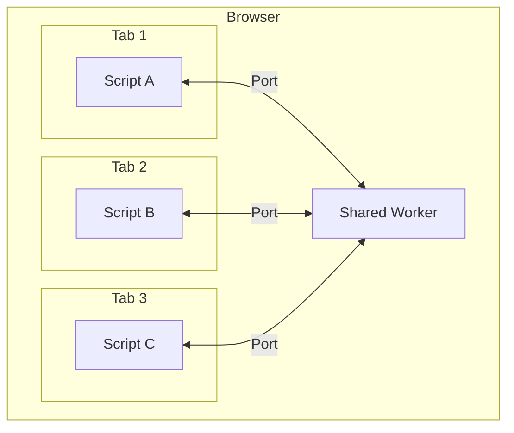

# Shared Workers

## Introduction

Dedicated Workers are tied to a single page—when the page closes, the worker terminates. But what if you need to share state or resources across multiple browser tabs or windows of the same application?

**Shared Workers** solve this problem. They can be accessed by multiple scripts running in different windows, iframes, or even other workers, as long as they're in the same origin. This makes them perfect for scenarios like synchronized state across tabs, shared WebSocket connections, or centralized data caching.

### What We'll Cover

- What Shared Workers are and how they differ from Dedicated Workers
- Port-based communication model
- Connecting multiple pages to one worker
- Use cases for shared state

### Prerequisites

- Understanding of Dedicated Workers
- Familiarity with postMessage communication
- Basic knowledge of event handling

---

## What Are Shared Workers?

A Shared Worker is a type of Web Worker that can be shared between multiple browsing contexts (tabs, windows, iframes) from the same origin.



### Shared vs Dedicated Workers

| Feature | Dedicated Worker | Shared Worker |
|---------|------------------|---------------|
| Scope | Single page | Multiple pages/tabs |
| Communication | Direct postMessage | Port-based |
| Lifecycle | Dies with page | Lives while any connection exists |
| Use case | Heavy computation | Shared state, resources |
| Browser support | All browsers | No Safari ⚠️ |

> **Warning:** Safari does not support Shared Workers. If you need cross-browser support, consider alternatives like BroadcastChannel or localStorage events.

---

## Creating a Shared Worker

### Basic Setup

```javascript
// main.js (in any tab/page)
const worker = new SharedWorker('shared-worker.js');

// Access the port for communication
const port = worker.port;

// Start the port (required!)
port.start();

// Send messages through the port
port.postMessage('Hello from this tab!');

// Receive messages through the port
port.onmessage = (event) => {
  console.log('Received:', event.data);
};
```

```javascript
// shared-worker.js
const connections = [];

// Called when a new page connects
self.onconnect = (event) => {
  const port = event.ports[0];
  connections.push(port);
  
  console.log('New connection. Total:', connections.length);
  
  port.onmessage = (event) => {
    console.log('Received:', event.data);
    
    // Echo back to sender
    port.postMessage('Worker received: ' + event.data);
  };
  
  // Start the port
  port.start();
};
```

### Key Differences from Dedicated Workers

```javascript
// Dedicated Worker
self.onmessage = (event) => { ... };  // Direct message handler

// Shared Worker
self.onconnect = (event) => {          // Connection handler
  const port = event.ports[0];         // Get the port
  port.onmessage = (event) => { ... }; // Port message handler
};
```

---

## Port-Based Communication

Shared Workers use `MessagePort` for communication. Each connecting page gets its own port to the worker.

### The MessagePort API

```javascript
// Creating a port connection
const worker = new SharedWorker('worker.js');
const port = worker.port;

// Must call start() unless using onmessage assignment
port.start();

// Sending messages
port.postMessage('Hello');
port.postMessage({ type: 'data', payload: [1, 2, 3] });

// Receiving messages
port.onmessage = (event) => {
  console.log(event.data);
};

// Alternative: addEventListener (doesn't auto-start)
port.addEventListener('message', (event) => {
  console.log(event.data);
});
port.start(); // Must call manually with addEventListener

// Closing the port
port.close();
```

### Two-Way Communication

```javascript
// page.js
const worker = new SharedWorker('worker.js');
const port = worker.port;
port.start();

// Request-response pattern
function sendRequest(type, data) {
  return new Promise((resolve) => {
    const id = Date.now();
    
    const handler = (event) => {
      if (event.data.id === id) {
        port.removeEventListener('message', handler);
        resolve(event.data.result);
      }
    };
    
    port.addEventListener('message', handler);
    port.postMessage({ id, type, data });
  });
}

// Usage
const result = await sendRequest('getData', { key: 'user' });
```

```javascript
// shared-worker.js
const store = new Map();

self.onconnect = (event) => {
  const port = event.ports[0];
  
  port.onmessage = (event) => {
    const { id, type, data } = event.data;
    
    let result;
    
    switch (type) {
      case 'getData':
        result = store.get(data.key);
        break;
      case 'setData':
        store.set(data.key, data.value);
        result = true;
        break;
    }
    
    port.postMessage({ id, result });
  };
  
  port.start();
};
```

---

## Multiple Page Connections

The power of Shared Workers is handling multiple connections simultaneously.

### Broadcasting to All Connections

```javascript
// shared-worker.js
const connections = new Set();

self.onconnect = (event) => {
  const port = event.ports[0];
  connections.add(port);
  
  port.onmessage = (event) => {
    // Broadcast to ALL connected pages
    broadcast(event.data);
  };
  
  // Handle disconnection
  port.onclose = () => {
    connections.delete(port);
  };
  
  port.start();
};

function broadcast(message) {
  connections.forEach(port => {
    port.postMessage(message);
  });
}
```

### Chat Application Example

```javascript
// shared-worker.js (Chat server)
const clients = new Map();

self.onconnect = (event) => {
  const port = event.ports[0];
  let username = null;
  
  port.onmessage = (event) => {
    const { type, data } = event.data;
    
    switch (type) {
      case 'join':
        username = data.username;
        clients.set(username, port);
        broadcast({
          type: 'system',
          message: `${username} joined the chat`
        });
        break;
        
      case 'message':
        broadcast({
          type: 'message',
          from: username,
          message: data.message
        });
        break;
        
      case 'leave':
        clients.delete(username);
        broadcast({
          type: 'system',
          message: `${username} left the chat`
        });
        break;
    }
  };
  
  port.start();
};

function broadcast(message) {
  clients.forEach(port => {
    port.postMessage(message);
  });
}
```

```javascript
// chat.js (Each tab)
const worker = new SharedWorker('chat-worker.js');
const port = worker.port;
port.start();

// Join chat
port.postMessage({ 
  type: 'join', 
  data: { username: 'User' + Date.now() } 
});

// Send message
document.getElementById('send').onclick = () => {
  const input = document.getElementById('message');
  port.postMessage({ 
    type: 'message', 
    data: { message: input.value } 
  });
  input.value = '';
};

// Receive messages
port.onmessage = (event) => {
  const { type, from, message } = event.data;
  const chat = document.getElementById('chat');
  
  if (type === 'system') {
    chat.innerHTML += `<p class="system">${message}</p>`;
  } else {
    chat.innerHTML += `<p><strong>${from}:</strong> ${message}</p>`;
  }
};

// Leave on page unload
window.onbeforeunload = () => {
  port.postMessage({ type: 'leave' });
};
```

---

## Use Cases for Shared State

### 1. Shared WebSocket Connection

Instead of each tab opening its own WebSocket:

```javascript
// shared-worker.js
let socket = null;
const ports = new Set();

function connectWebSocket() {
  socket = new WebSocket('wss://api.example.com/stream');
  
  socket.onmessage = (event) => {
    // Forward to all connected tabs
    const data = JSON.parse(event.data);
    ports.forEach(port => port.postMessage(data));
  };
  
  socket.onclose = () => {
    // Reconnect after delay
    setTimeout(connectWebSocket, 1000);
  };
}

self.onconnect = (event) => {
  const port = event.ports[0];
  ports.add(port);
  
  // Connect WebSocket on first connection
  if (!socket) {
    connectWebSocket();
  }
  
  port.onmessage = (event) => {
    // Forward messages to WebSocket
    if (socket && socket.readyState === WebSocket.OPEN) {
      socket.send(JSON.stringify(event.data));
    }
  };
  
  port.start();
};
```

### 2. Synchronized Shopping Cart

```javascript
// shared-worker.js
let cart = [];

self.onconnect = (event) => {
  const port = event.ports[0];
  
  // Send current cart to new connection
  port.postMessage({ type: 'sync', cart });
  
  port.onmessage = (event) => {
    const { action, item } = event.data;
    
    switch (action) {
      case 'add':
        cart.push(item);
        break;
      case 'remove':
        cart = cart.filter(i => i.id !== item.id);
        break;
      case 'clear':
        cart = [];
        break;
    }
    
    // Broadcast updated cart to all tabs
    broadcast({ type: 'sync', cart });
  };
  
  port.start();
};
```

### 3. Login State Synchronization

```javascript
// shared-worker.js
let authState = { loggedIn: false, user: null };
const ports = new Set();

self.onconnect = (event) => {
  const port = event.ports[0];
  ports.add(port);
  
  // Sync auth state immediately
  port.postMessage({ type: 'auth', state: authState });
  
  port.onmessage = (event) => {
    if (event.data.type === 'login') {
      authState = { loggedIn: true, user: event.data.user };
      broadcast({ type: 'auth', state: authState });
    }
    
    if (event.data.type === 'logout') {
      authState = { loggedIn: false, user: null };
      broadcast({ type: 'auth', state: authState });
    }
  };
  
  port.start();
};

function broadcast(message) {
  ports.forEach(p => p.postMessage(message));
}
```

---

## Debugging Shared Workers

Shared Workers don't appear in the regular DevTools. To debug:

### Chrome
1. Navigate to `chrome://inspect/#workers`
2. Find your Shared Worker
3. Click "inspect" to open dedicated DevTools

### Firefox
1. Navigate to `about:debugging#/runtime/this-firefox`
2. Find under "Shared Workers"
3. Click "Inspect"

---

## Fallback for Safari

Since Safari doesn't support Shared Workers, use BroadcastChannel as a fallback:

```javascript
// cross-tab-communication.js
class CrossTabChannel {
  constructor(name) {
    this.name = name;
    this.listeners = [];
    
    if ('SharedWorker' in window) {
      this.worker = new SharedWorker('shared-worker.js');
      this.port = this.worker.port;
      this.port.start();
      this.port.onmessage = (e) => this.notify(e.data);
    } else if ('BroadcastChannel' in window) {
      this.channel = new BroadcastChannel(name);
      this.channel.onmessage = (e) => this.notify(e.data);
    } else {
      // Fallback to localStorage events
      window.addEventListener('storage', (e) => {
        if (e.key === name) {
          this.notify(JSON.parse(e.newValue));
        }
      });
    }
  }
  
  send(data) {
    if (this.port) {
      this.port.postMessage(data);
    } else if (this.channel) {
      this.channel.postMessage(data);
    } else {
      localStorage.setItem(this.name, JSON.stringify(data));
    }
  }
  
  onMessage(callback) {
    this.listeners.push(callback);
  }
  
  notify(data) {
    this.listeners.forEach(cb => cb(data));
  }
}

// Usage (works in all browsers)
const channel = new CrossTabChannel('my-app');
channel.onMessage(data => console.log('Received:', data));
channel.send({ type: 'update', value: 42 });
```

---

## Hands-on Exercise

### Your Task

Create a shared counter that stays synchronized across multiple browser tabs.

### Requirements

1. Display a counter value
2. Buttons to increment and decrement
3. Counter stays in sync across all open tabs
4. Show the number of connected tabs

### Expected Result

Open 3 tabs → All show count: 0, tabs: 3
Click + in Tab 1 → All tabs show count: 1
Click + in Tab 2 → All tabs show count: 2

<details>
<summary>💡 Hints</summary>

- Store both `count` and `connections.size` in the worker
- Broadcast on every change
- Send initial state when a new tab connects

</details>

<details>
<summary>✅ Solution</summary>

**counter-worker.js:**
```javascript
let count = 0;
const ports = new Set();

self.onconnect = (event) => {
  const port = event.ports[0];
  ports.add(port);
  
  // Send current state to new connection
  broadcastState();
  
  port.onmessage = (event) => {
    switch (event.data) {
      case 'increment':
        count++;
        break;
      case 'decrement':
        count--;
        break;
      case 'reset':
        count = 0;
        break;
    }
    broadcastState();
  };
  
  port.start();
};

function broadcastState() {
  const state = { count, tabs: ports.size };
  ports.forEach(port => port.postMessage(state));
}
```

**counter.html:**
```html
<!DOCTYPE html>
<html>
<head>
  <title>Shared Counter</title>
  <style>
    body { font-family: sans-serif; text-align: center; padding: 50px; }
    #count { font-size: 72px; margin: 20px; }
    button { font-size: 24px; padding: 10px 20px; margin: 5px; }
    #tabs { color: #666; }
  </style>
</head>
<body>
  <h1>Shared Counter</h1>
  <div id="count">0</div>
  <div>
    <button id="dec">−</button>
    <button id="inc">+</button>
    <button id="reset">Reset</button>
  </div>
  <p id="tabs">Tabs connected: 1</p>
  
  <script>
    const worker = new SharedWorker('counter-worker.js');
    const port = worker.port;
    port.start();
    
    document.getElementById('inc').onclick = () => port.postMessage('increment');
    document.getElementById('dec').onclick = () => port.postMessage('decrement');
    document.getElementById('reset').onclick = () => port.postMessage('reset');
    
    port.onmessage = (event) => {
      document.getElementById('count').textContent = event.data.count;
      document.getElementById('tabs').textContent = `Tabs connected: ${event.data.tabs}`;
    };
  </script>
</body>
</html>
```

</details>

---

## Summary

✅ Shared Workers can be accessed by multiple pages/tabs from the same origin
✅ Communication uses **MessagePort** (not direct postMessage)
✅ Use `self.onconnect` to handle new connections
✅ Perfect for shared state, WebSocket pooling, synchronized data
✅ **Not supported in Safari** - use BroadcastChannel as fallback

**Next:** [Service Workers Introduction](./05-service-workers-introduction.md)

---

## Further Reading

- [MDN SharedWorker](https://developer.mozilla.org/en-US/docs/Web/API/SharedWorker) - API reference
- [MDN MessagePort](https://developer.mozilla.org/en-US/docs/Web/API/MessagePort) - Port communication
- [BroadcastChannel API](https://developer.mozilla.org/en-US/docs/Web/API/Broadcast_Channel_API) - Alternative for cross-tab messaging

<!-- 
Sources Consulted:
- MDN SharedWorker: https://developer.mozilla.org/en-US/docs/Web/API/SharedWorker
- MDN Web Workers API: https://developer.mozilla.org/en-US/docs/Web/API/Web_Workers_API
-->
