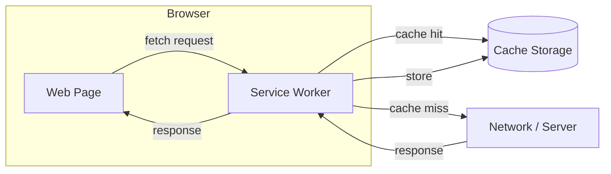
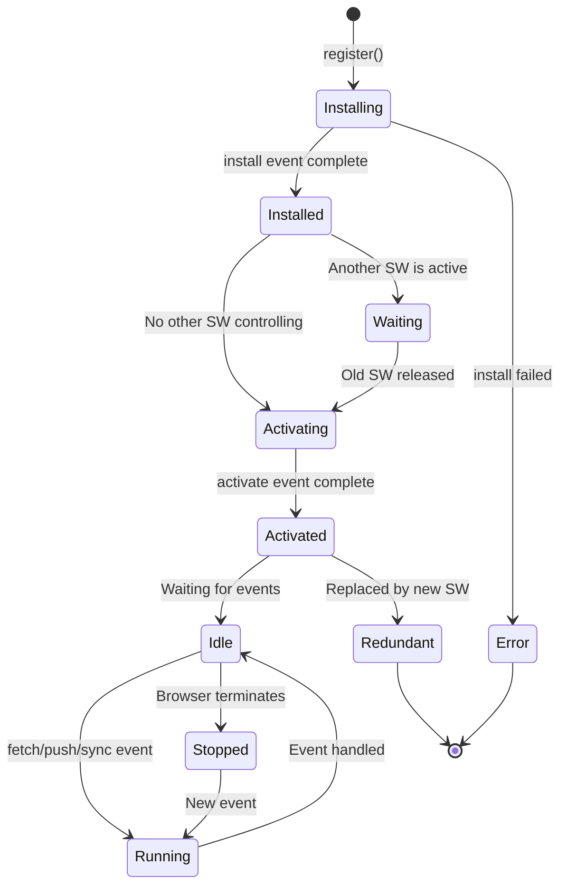

# Service Workers Introduction

## Introduction

Service Workers are a special type of Web Worker that act as a **programmable network proxy** between your web application and the network. They can intercept network requests, cache resources, and enable powerful features like offline functionality, push notifications, and background sync.

Unlike Dedicated and Shared Workers that focus on computation, Service Workers focus on **network control and resource management**.

### What We'll Cover

- What Service Workers are and how they differ from other workers
- The Service Worker lifecycle (install, activate, fetch)
- Registration process
- Scope and control
- Update process

### Prerequisites

- Understanding of Web Workers fundamentals
- Familiarity with Promises and async/await
- Basic knowledge of HTTP and caching concepts

---

## What Are Service Workers?

A Service Worker is a script that runs in the background, separate from your web page, acting as a proxy between your application and the network.



### Service Workers vs Other Workers

| Feature | Dedicated Worker | Shared Worker | Service Worker |
|---------|------------------|---------------|----------------|
| Purpose | Computation | Shared state | Network proxy |
| Lifecycle | Tied to page | While tabs open | Independent |
| Network access | fetch() | fetch() | **Intercept all fetches** |
| DOM access | ❌ | ❌ | ❌ |
| HTTPS required | No | No | **Yes** (except localhost) |
| Push notifications | ❌ | ❌ | ✅ |
| Background sync | ❌ | ❌ | ✅ |
| Caching control | ❌ | ❌ | ✅ |

### Key Characteristics

1. **Event-driven**: Service Workers respond to events (fetch, push, sync)
2. **No DOM access**: Like other workers, they can't touch the DOM
3. **HTTPS only**: Required for security (localhost is an exception)
4. **Independent lifecycle**: Can start/stop independently of pages
5. **Stateless between events**: Use IndexedDB or Cache API for persistence

---

## The Service Worker Lifecycle

Service Workers have a distinct lifecycle that differs from regular scripts:



### Lifecycle Phases

| Phase | Description | When It Happens |
|-------|-------------|-----------------|
| **Installing** | SW is being downloaded and installed | First registration or new version detected |
| **Installed/Waiting** | SW is installed but not active | Another version is still controlling pages |
| **Activating** | SW is taking control | Old SW is gone, new one activating |
| **Activated** | SW is active and controlling pages | After activation completes |
| **Redundant** | SW has been replaced or failed | New version activated |

### Install Event

The install event is your opportunity to cache essential assets:

```javascript
// service-worker.js
const CACHE_NAME = 'my-app-v1';
const ASSETS = [
  '/',
  '/index.html',
  '/styles.css',
  '/app.js',
  '/offline.html'
];

self.addEventListener('install', (event) => {
  console.log('Service Worker: Installing...');
  
  event.waitUntil(
    caches.open(CACHE_NAME)
      .then(cache => {
        console.log('Caching assets...');
        return cache.addAll(ASSETS);
      })
      .then(() => {
        console.log('Assets cached successfully');
      })
  );
});
```

> **Note:** `event.waitUntil()` keeps the install phase alive until the promise resolves. If the promise rejects, installation fails.

### Activate Event

The activate event is typically used to clean up old caches:

```javascript
self.addEventListener('activate', (event) => {
  console.log('Service Worker: Activating...');
  
  event.waitUntil(
    caches.keys().then(cacheNames => {
      return Promise.all(
        cacheNames
          .filter(name => name !== CACHE_NAME)
          .map(name => {
            console.log('Deleting old cache:', name);
            return caches.delete(name);
          })
      );
    })
  );
});
```

### Fetch Event

The fetch event intercepts all network requests from controlled pages:

```javascript
self.addEventListener('fetch', (event) => {
  console.log('Fetching:', event.request.url);
  
  event.respondWith(
    caches.match(event.request)
      .then(cachedResponse => {
        // Return cached response if found
        if (cachedResponse) {
          return cachedResponse;
        }
        
        // Otherwise fetch from network
        return fetch(event.request);
      })
  );
});
```

---

## Registration Process

### Basic Registration

```javascript
// main.js (runs in the page)
if ('serviceWorker' in navigator) {
  navigator.serviceWorker.register('/sw.js')
    .then(registration => {
      console.log('SW registered:', registration.scope);
    })
    .catch(error => {
      console.error('SW registration failed:', error);
    });
}
```

### Registration with Options

```javascript
navigator.serviceWorker.register('/sw.js', {
  scope: '/app/',        // Control only /app/* paths
  type: 'module',        // ES modules support
  updateViaCache: 'none' // Always check for updates
})
.then(registration => {
  console.log('Scope:', registration.scope);
});
```

### Checking Registration State

```javascript
navigator.serviceWorker.register('/sw.js')
  .then(registration => {
    if (registration.installing) {
      console.log('Service worker installing');
    } else if (registration.waiting) {
      console.log('Service worker installed, waiting to activate');
    } else if (registration.active) {
      console.log('Service worker active');
    }
  });
```

### Listening for State Changes

```javascript
navigator.serviceWorker.register('/sw.js')
  .then(registration => {
    registration.addEventListener('updatefound', () => {
      const newWorker = registration.installing;
      
      newWorker.addEventListener('statechange', () => {
        console.log('State changed to:', newWorker.state);
        // States: installing, installed, activating, activated, redundant
      });
    });
  });
```

---

## Scope and Control

The **scope** determines which pages the Service Worker can control.

### Default Scope

By default, the scope is the directory where the SW script is located:

```
/sw.js           → controls /*
/app/sw.js       → controls /app/*
/scripts/sw.js   → controls /scripts/*
```

### Custom Scope

You can restrict the scope (but not expand it):

```javascript
// SW at /sw.js can control anything, but we limit it
navigator.serviceWorker.register('/sw.js', {
  scope: '/products/'  // Only controls /products/*
});
```

> **Warning:** You cannot set a scope broader than the SW script location. A SW at `/app/sw.js` cannot control `/`.

### Checking if a Page is Controlled

```javascript
if (navigator.serviceWorker.controller) {
  console.log('This page is controlled by:', 
    navigator.serviceWorker.controller.scriptURL);
} else {
  console.log('This page is not controlled by a Service Worker');
}
```

### Claiming Clients Immediately

Normally, a new SW doesn't control existing pages until they reload. Use `clients.claim()` to take control immediately:

```javascript
// In service-worker.js
self.addEventListener('activate', (event) => {
  event.waitUntil(
    clients.claim()
      .then(() => console.log('Now controlling all clients'))
  );
});
```

### Skipping the Waiting Phase

To activate a new SW immediately (without waiting for old tabs to close):

```javascript
// In service-worker.js
self.addEventListener('install', (event) => {
  self.skipWaiting(); // Skip waiting, activate immediately
});

self.addEventListener('activate', (event) => {
  event.waitUntil(clients.claim()); // Take control of clients
});
```

> **Warning:** Using `skipWaiting()` can cause issues if your cached assets are incompatible with the old page code. Use carefully!

---

## Update Process

Service Workers are updated when:
1. Navigation to a page in scope occurs
2. Events like `push` or `sync` fire (if >24 hours since last check)
3. `registration.update()` is called manually

### How Updates Work

1. Browser fetches the SW script
2. Byte-by-byte comparison with current SW
3. If different, new SW is installed (enters "waiting" state)
4. New SW activates when all tabs using old SW are closed
5. Or immediately if using `skipWaiting()`

### Manual Update Check

```javascript
navigator.serviceWorker.register('/sw.js')
  .then(registration => {
    // Check for updates every hour
    setInterval(() => {
      registration.update();
    }, 60 * 60 * 1000);
    
    // Or update on user action
    document.getElementById('update-btn').onclick = () => {
      registration.update();
    };
  });
```

### Notifying Users of Updates

```javascript
// main.js
navigator.serviceWorker.register('/sw.js')
  .then(registration => {
    registration.addEventListener('updatefound', () => {
      const newWorker = registration.installing;
      
      newWorker.addEventListener('statechange', () => {
        if (newWorker.state === 'installed' && navigator.serviceWorker.controller) {
          // New SW waiting, show update prompt
          showUpdateNotification();
        }
      });
    });
  });

function showUpdateNotification() {
  const banner = document.createElement('div');
  banner.innerHTML = `
    <p>A new version is available!</p>
    <button id="refresh">Refresh</button>
  `;
  document.body.appendChild(banner);
  
  document.getElementById('refresh').onclick = () => {
    // Tell waiting SW to skip waiting
    navigator.serviceWorker.controller.postMessage({ type: 'SKIP_WAITING' });
  };
}

// Reload when new SW takes control
navigator.serviceWorker.addEventListener('controllerchange', () => {
  window.location.reload();
});
```

```javascript
// service-worker.js
self.addEventListener('message', (event) => {
  if (event.data.type === 'SKIP_WAITING') {
    self.skipWaiting();
  }
});
```

---

## Debugging Service Workers

### Chrome DevTools

1. Open DevTools → Application tab
2. Service Workers section shows:
   - Current SW status
   - Update and Unregister buttons
   - Push and Sync testing
3. Check "Update on reload" for development

### Common Issues

| Problem | Solution |
|---------|----------|
| SW not updating | Clear storage or check "Update on reload" |
| SW not controlling page | Reload the page after first registration |
| Fetch not intercepted | Check if page is in scope |
| Caching issues | Version your cache names |
| HTTPS errors | Use localhost or deploy to HTTPS |

### Unregistering for Development

```javascript
// Unregister all service workers
navigator.serviceWorker.getRegistrations()
  .then(registrations => {
    registrations.forEach(registration => {
      registration.unregister();
    });
  });
```

---

## Hands-on Exercise

### Your Task

Create a basic Service Worker that logs all fetch requests and serves a custom offline page.

### Requirements

1. Register a Service Worker
2. Cache an offline.html page during install
3. Log all fetch requests to console
4. Serve offline.html when network fails

### Expected Result

- Console shows all network requests
- Disconnect network → see offline.html instead of browser error

<details>
<summary>💡 Hints</summary>

- Use `event.waitUntil()` in install handler
- Use `event.respondWith()` in fetch handler  
- Catch network errors with `.catch()`

</details>

<details>
<summary>✅ Solution</summary>

**index.html:**
```html
<!DOCTYPE html>
<html>
<head>
  <title>Service Worker Demo</title>
</head>
<body>
  <h1>Service Worker Demo</h1>
  <p>Check the console for fetch logs.</p>
  <p>Go offline to see the offline page.</p>
  
  <script>
    if ('serviceWorker' in navigator) {
      navigator.serviceWorker.register('/sw.js')
        .then(reg => console.log('SW registered:', reg.scope))
        .catch(err => console.error('SW failed:', err));
    }
  </script>
</body>
</html>
```

**offline.html:**
```html
<!DOCTYPE html>
<html>
<head>
  <title>Offline</title>
  <style>
    body { 
      font-family: sans-serif; 
      text-align: center; 
      padding: 50px;
      background: #f0f0f0;
    }
    .icon { font-size: 64px; }
  </style>
</head>
<body>
  <div class="icon">📡</div>
  <h1>You're Offline</h1>
  <p>Please check your internet connection and try again.</p>
</body>
</html>
```

**sw.js:**
```javascript
const CACHE_NAME = 'offline-v1';

self.addEventListener('install', (event) => {
  console.log('SW: Installing...');
  
  event.waitUntil(
    caches.open(CACHE_NAME)
      .then(cache => cache.add('/offline.html'))
      .then(() => console.log('SW: Offline page cached'))
  );
});

self.addEventListener('activate', (event) => {
  console.log('SW: Activated');
  event.waitUntil(clients.claim());
});

self.addEventListener('fetch', (event) => {
  console.log('SW: Fetching', event.request.url);
  
  event.respondWith(
    fetch(event.request)
      .catch(() => {
        // Network failed, serve offline page for navigation requests
        if (event.request.mode === 'navigate') {
          return caches.match('/offline.html');
        }
      })
  );
});
```

</details>

---

## Summary

✅ Service Workers act as a **programmable network proxy**
✅ Lifecycle: **Installing → Waiting → Activating → Activated**
✅ Use `install` event to cache assets
✅ Use `activate` event to clean up old caches
✅ Use `fetch` event to intercept network requests
✅ Scope determines which pages are controlled
✅ HTTPS required (except localhost)

**Next:** [Offline Capabilities](./06-offline-capabilities.md)

---

## Further Reading

- [MDN Service Worker API](https://developer.mozilla.org/en-US/docs/Web/API/Service_Worker_API) - Complete reference
- [Service Worker Lifecycle](https://web.dev/articles/service-worker-lifecycle) - In-depth lifecycle guide
- [Using Service Workers](https://developer.mozilla.org/en-US/docs/Web/API/Service_Worker_API/Using_Service_Workers) - Practical tutorial

<!-- 
Sources Consulted:
- MDN Service Worker API: https://developer.mozilla.org/en-US/docs/Web/API/Service_Worker_API
- web.dev Service Worker Lifecycle: https://web.dev/articles/service-worker-lifecycle
-->
