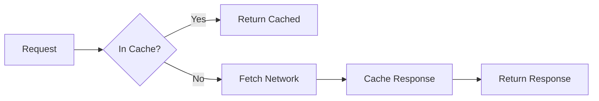
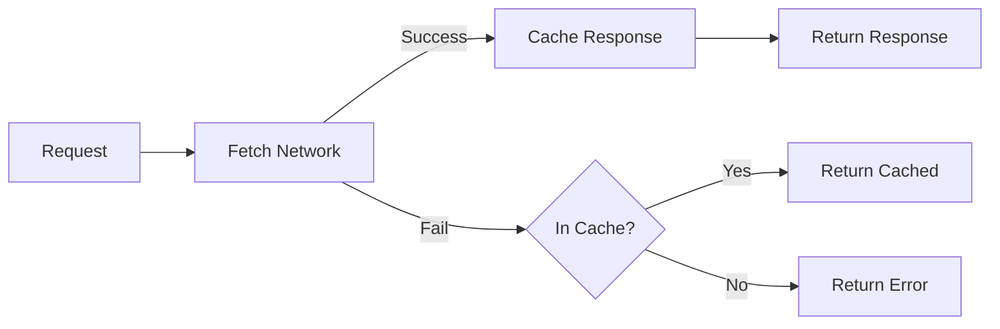
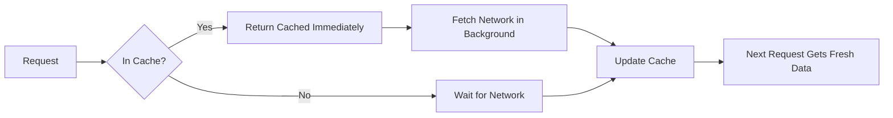

# Caching Strategies

## Introduction

The Cache API gives you complete control over what gets cached and when. But with great power comes great responsibility—choosing the wrong caching strategy can lead to stale content, broken apps, or wasted bandwidth.

This lesson covers the major caching patterns, when to use each, and how to implement them effectively.

### What We'll Cover

- Cache-first strategy
- Network-first strategy
- Stale-while-revalidate
- Cache-only and network-only
- Cache invalidation
- Versioned caches

### Prerequisites

- Understanding of Service Workers
- Familiarity with the Fetch API
- Knowledge of async/await

---

## The Cache API

Before diving into strategies, let's understand the Cache API:

```javascript
// Open a cache (creates if doesn't exist)
const cache = await caches.open('my-cache-v1');

// Add a single request/response
await cache.add('/styles.css');

// Add multiple
await cache.addAll(['/app.js', '/index.html']);

// Manually put a request/response pair
const response = await fetch('/api/data');
await cache.put('/api/data', response);

// Match a request
const cached = await cache.match('/styles.css');

// Match with options
const matched = await cache.match(request, {
  ignoreSearch: true,      // Ignore query string
  ignoreMethod: true,      // Match any HTTP method
  ignoreVary: true         // Ignore Vary header
});

// Delete an entry
await cache.delete('/old-file.js');

// Get all cached requests
const requests = await cache.keys();

// List all caches
const cacheNames = await caches.keys();

// Delete a cache
await caches.delete('old-cache-v1');
```

---

## Cache-First Strategy

**Serve from cache immediately. Only fetch from network if not cached.**

Best for: Static assets that rarely change (images, fonts, CSS, JS).



### Implementation

```javascript
async function cacheFirst(request, cacheName = 'static-cache') {
  const cache = await caches.open(cacheName);
  
  // Check cache first
  const cached = await cache.match(request);
  if (cached) {
    return cached;
  }
  
  // Not in cache, fetch from network
  const response = await fetch(request);
  
  // Cache the new response
  cache.put(request, response.clone());
  
  return response;
}

// In fetch handler
self.addEventListener('fetch', (event) => {
  if (event.request.destination === 'image') {
    event.respondWith(cacheFirst(event.request, 'images'));
  }
});
```

### Pros and Cons

| ✅ Pros | ❌ Cons |
|---------|---------|
| Fastest response time | Content may be stale |
| Works offline | Need cache invalidation strategy |
| Reduces server load | First visit always slow |

---

## Network-First Strategy

**Try network first. Fall back to cache if network fails.**

Best for: Frequently updated content where freshness matters (API responses, news).



### Implementation

```javascript
async function networkFirst(request, cacheName = 'dynamic-cache') {
  const cache = await caches.open(cacheName);
  
  try {
    // Try network first
    const response = await fetch(request);
    
    // Cache successful responses
    if (response.ok) {
      cache.put(request, response.clone());
    }
    
    return response;
  } catch (error) {
    // Network failed, try cache
    const cached = await cache.match(request);
    
    if (cached) {
      return cached;
    }
    
    // Nothing in cache either
    throw error;
  }
}

// In fetch handler
self.addEventListener('fetch', (event) => {
  if (event.request.url.includes('/api/')) {
    event.respondWith(networkFirst(event.request, 'api-cache'));
  }
});
```

### With Timeout

Don't wait forever for a slow network:

```javascript
async function networkFirstWithTimeout(request, timeout = 3000) {
  const cache = await caches.open('dynamic-cache');
  
  try {
    const response = await Promise.race([
      fetch(request),
      new Promise((_, reject) => 
        setTimeout(() => reject(new Error('Timeout')), timeout)
      )
    ]);
    
    cache.put(request, response.clone());
    return response;
  } catch {
    return cache.match(request);
  }
}
```

### Pros and Cons

| ✅ Pros | ❌ Cons |
|---------|---------|
| Always fresh when online | Slower than cache-first |
| Offline fallback | Network request on every load |
| Good for dynamic content | May show stale data on slow networks |

---

## Stale-While-Revalidate

**Serve from cache immediately, then update cache in background.**

Best for: Content that should be fast but also reasonably fresh (blog posts, product pages).



### Implementation

```javascript
async function staleWhileRevalidate(request, cacheName = 'swr-cache') {
  const cache = await caches.open(cacheName);
  const cached = await cache.match(request);
  
  // Fetch in background regardless
  const fetchPromise = fetch(request).then(response => {
    cache.put(request, response.clone());
    return response;
  });
  
  // Return cached immediately, or wait for network
  return cached || fetchPromise;
}
```

### With Update Notification

Notify the page when fresh content is available:

```javascript
async function swrWithNotification(request, cacheName = 'swr-cache') {
  const cache = await caches.open(cacheName);
  const cached = await cache.match(request);
  
  const fetchPromise = fetch(request).then(async response => {
    const clone = response.clone();
    await cache.put(request, clone);
    
    // Notify clients of update
    const clients = await self.clients.matchAll();
    clients.forEach(client => {
      client.postMessage({
        type: 'CONTENT_UPDATED',
        url: request.url
      });
    });
    
    return response;
  });
  
  return cached || fetchPromise;
}
```

```javascript
// In page
navigator.serviceWorker.addEventListener('message', (event) => {
  if (event.data.type === 'CONTENT_UPDATED') {
    showUpdateBanner('New content available. Refresh?');
  }
});
```

### Pros and Cons

| ✅ Pros | ❌ Cons |
|---------|---------|
| Instant response | May show stale content briefly |
| Eventually consistent | Extra network requests |
| Best perceived performance | More complex implementation |

---

## Cache-Only and Network-Only

### Cache-Only

Only serve from cache. Never touch the network.

```javascript
async function cacheOnly(request, cacheName = 'static-cache') {
  const cache = await caches.open(cacheName);
  const cached = await cache.match(request);
  
  if (cached) {
    return cached;
  }
  
  return new Response('Not found in cache', { status: 404 });
}
```

**Use for:** Pre-cached static assets during install, offline-only features.

### Network-Only

Never use cache. Always fetch from network.

```javascript
function networkOnly(request) {
  return fetch(request);
}
```

**Use for:** Analytics, non-GET requests, real-time data.

---

## Strategy Comparison

| Strategy | Speed | Freshness | Offline | Best For |
|----------|-------|-----------|---------|----------|
| Cache-first | ⚡ Fastest | 🕐 May be stale | ✅ Yes | Static assets |
| Network-first | 🐢 Slower | ✅ Fresh | ✅ Fallback | APIs, dynamic content |
| Stale-while-revalidate | ⚡ Fast | 🔄 Eventually fresh | ✅ Yes | Content pages |
| Cache-only | ⚡ Fastest | 🕐 Fixed | ✅ Yes | App shell |
| Network-only | 🐢 Depends | ✅ Fresh | ❌ No | Analytics, auth |

---

## Cache Invalidation

> "There are only two hard things in Computer Science: cache invalidation and naming things." — Phil Karlton

### Time-Based Invalidation

```javascript
async function cacheWithTTL(request, cacheName, ttlSeconds) {
  const cache = await caches.open(cacheName);
  const cached = await cache.match(request);
  
  if (cached) {
    const cachedTime = cached.headers.get('sw-cache-time');
    const age = (Date.now() - parseInt(cachedTime)) / 1000;
    
    if (age < ttlSeconds) {
      return cached;
    }
  }
  
  // Cache expired or doesn't exist
  const response = await fetch(request);
  const headers = new Headers(response.headers);
  headers.set('sw-cache-time', Date.now().toString());
  
  const timedResponse = new Response(response.body, {
    status: response.status,
    statusText: response.statusText,
    headers
  });
  
  cache.put(request, timedResponse.clone());
  return timedResponse;
}
```

### Message-Based Invalidation

```javascript
// In page
function invalidateCache(pattern) {
  navigator.serviceWorker.controller.postMessage({
    type: 'INVALIDATE_CACHE',
    pattern
  });
}

// In service worker
self.addEventListener('message', async (event) => {
  if (event.data.type === 'INVALIDATE_CACHE') {
    const cache = await caches.open('dynamic-cache');
    const requests = await cache.keys();
    
    for (const request of requests) {
      if (request.url.includes(event.data.pattern)) {
        await cache.delete(request);
      }
    }
  }
});
```

### API-Triggered Invalidation

```javascript
// After successful mutation, clear related cache
async function updateProduct(id, data) {
  const response = await fetch(`/api/products/${id}`, {
    method: 'PUT',
    body: JSON.stringify(data)
  });
  
  if (response.ok) {
    // Invalidate product cache
    const cache = await caches.open('api-cache');
    await cache.delete(`/api/products/${id}`);
    await cache.delete('/api/products'); // List view too
  }
  
  return response;
}
```

---

## Versioned Caches

Use cache versioning to deploy updates cleanly.

### Naming Convention

```javascript
const CACHE_VERSION = 'v2';
const STATIC_CACHE = `static-${CACHE_VERSION}`;
const DYNAMIC_CACHE = `dynamic-${CACHE_VERSION}`;
```

### Clean Old Versions on Activate

```javascript
const CURRENT_CACHES = [STATIC_CACHE, DYNAMIC_CACHE];

self.addEventListener('activate', (event) => {
  event.waitUntil(
    caches.keys().then(cacheNames => {
      return Promise.all(
        cacheNames
          .filter(name => !CURRENT_CACHES.includes(name))
          .map(name => {
            console.log('Deleting old cache:', name);
            return caches.delete(name);
          })
      );
    })
  );
});
```

### Content-Based Versioning

Hash assets for automatic cache busting:

```javascript
// Build tool generates: app.a3b4c5d6.js
// Service worker caches by content hash

const ASSETS = {
  '/app.js': '/app.a3b4c5d6.js',
  '/styles.css': '/styles.f7e8d9c0.css'
};

self.addEventListener('fetch', (event) => {
  const url = new URL(event.request.url);
  const hashedUrl = ASSETS[url.pathname];
  
  if (hashedUrl) {
    event.respondWith(
      caches.match(hashedUrl)
        .then(r => r || fetch(hashedUrl))
    );
  }
});
```

---

## Complete Caching Configuration

```javascript
// service-worker.js
const VERSION = 'v1';
const STATIC_CACHE = `static-${VERSION}`;
const DYNAMIC_CACHE = `dynamic-${VERSION}`;
const IMAGE_CACHE = `images-${VERSION}`;

const STATIC_ASSETS = [
  '/',
  '/index.html',
  '/app.js',
  '/styles.css',
  '/offline.html'
];

// Strategies
const strategies = {
  cacheFirst: async (request, cacheName) => {
    const cache = await caches.open(cacheName);
    return cache.match(request) || fetch(request).then(r => {
      cache.put(request, r.clone());
      return r;
    });
  },
  
  networkFirst: async (request, cacheName) => {
    const cache = await caches.open(cacheName);
    try {
      const response = await fetch(request);
      cache.put(request, response.clone());
      return response;
    } catch {
      return cache.match(request);
    }
  },
  
  staleWhileRevalidate: async (request, cacheName) => {
    const cache = await caches.open(cacheName);
    const cached = await cache.match(request);
    const fetched = fetch(request).then(r => {
      cache.put(request, r.clone());
      return r;
    });
    return cached || fetched;
  }
};

// Route configuration
const routes = [
  {
    match: (req) => STATIC_ASSETS.includes(new URL(req.url).pathname),
    strategy: 'cacheFirst',
    cache: STATIC_CACHE
  },
  {
    match: (req) => req.destination === 'image',
    strategy: 'cacheFirst',
    cache: IMAGE_CACHE
  },
  {
    match: (req) => req.url.includes('/api/'),
    strategy: 'networkFirst',
    cache: DYNAMIC_CACHE
  },
  {
    match: (req) => req.mode === 'navigate',
    strategy: 'staleWhileRevalidate',
    cache: DYNAMIC_CACHE
  }
];

// Fetch handler
self.addEventListener('fetch', (event) => {
  const route = routes.find(r => r.match(event.request));
  
  if (route) {
    event.respondWith(
      strategies[route.strategy](event.request, route.cache)
    );
  }
});

// Install
self.addEventListener('install', (event) => {
  event.waitUntil(
    caches.open(STATIC_CACHE)
      .then(cache => cache.addAll(STATIC_ASSETS))
      .then(() => self.skipWaiting())
  );
});

// Activate
self.addEventListener('activate', (event) => {
  const currentCaches = [STATIC_CACHE, DYNAMIC_CACHE, IMAGE_CACHE];
  
  event.waitUntil(
    caches.keys().then(names => 
      Promise.all(
        names
          .filter(n => !currentCaches.includes(n))
          .map(n => caches.delete(n))
      )
    ).then(() => clients.claim())
  );
});
```

---

## Hands-on Exercise

### Your Task

Implement a caching strategy for a blog site with:
- App shell (cache-first)
- Blog posts (stale-while-revalidate)
- Comments API (network-first)
- Images (cache-first with limit)

### Bonus Challenge

Limit image cache to 50 items, removing oldest when exceeded.

<details>
<summary>✅ Solution (Cache Limit)</summary>

```javascript
async function cacheFirstWithLimit(request, cacheName, limit = 50) {
  const cache = await caches.open(cacheName);
  const cached = await cache.match(request);
  
  if (cached) return cached;
  
  const response = await fetch(request);
  
  // Check cache size before adding
  const keys = await cache.keys();
  if (keys.length >= limit) {
    // Delete oldest (first) entry
    await cache.delete(keys[0]);
  }
  
  cache.put(request, response.clone());
  return response;
}
```

</details>

---

## Summary

✅ **Cache-first** - Static assets, fastest response
✅ **Network-first** - APIs, fresh content with fallback
✅ **Stale-while-revalidate** - Best of both worlds
✅ Use **versioned cache names** for clean updates
✅ Clean old caches in the **activate** event
✅ Match strategy to content type

**Next:** [Background Sync](./08-background-sync.md)

---

## Further Reading

- [The Offline Cookbook](https://web.dev/articles/offline-cookbook) - Comprehensive patterns
- [MDN Cache API](https://developer.mozilla.org/en-US/docs/Web/API/Cache) - API reference
- [Workbox Strategies](https://developers.google.com/web/tools/workbox/modules/workbox-strategies) - Library implementation

<!-- 
Sources Consulted:
- web.dev Offline Cookbook: https://web.dev/articles/offline-cookbook
- MDN Cache API: https://developer.mozilla.org/en-US/docs/Web/API/Cache
-->
