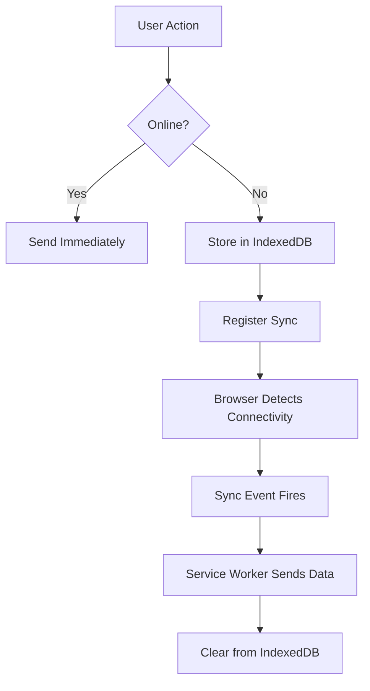

# Background Sync

## Introduction

Users don't always have reliable internet connections. They might submit a form on the subway, send a message in an elevator, or upload a photo in a spotty café. Traditional web apps fail silently or show errors in these situations.

**Background Sync** solves this by deferring actions until the user has stable connectivity. The browser handles retry logic, even if the user closes the tab or navigates away.

### What We'll Cover

- Background Sync API fundamentals
- Deferred actions pattern
- Reliable message sending
- Periodic Background Sync

### Prerequisites

- Understanding of Service Workers
- Familiarity with IndexedDB or other storage
- Knowledge of Promises and async/await

---

## Background Sync API

The Background Sync API lets you register a "sync" event that fires when the browser believes the user has connectivity.



### Basic Usage

**In the page:**
```javascript
async function sendData(data) {
  // Store data for the service worker
  await saveToOutbox(data);
  
  // Register sync event
  const registration = await navigator.serviceWorker.ready;
  await registration.sync.register('sync-data');
  
  console.log('Sync registered!');
}
```

**In the service worker:**
```javascript
self.addEventListener('sync', (event) => {
  if (event.tag === 'sync-data') {
    event.waitUntil(syncOutbox());
  }
});

async function syncOutbox() {
  const items = await getFromOutbox();
  
  for (const item of items) {
    await fetch('/api/data', {
      method: 'POST',
      body: JSON.stringify(item.data)
    });
    await removeFromOutbox(item.id);
  }
}
```

### Browser Support

| Browser | Support |
|---------|---------|
| Chrome | ✅ 49+ |
| Edge | ✅ 79+ |
| Firefox | ❌ No |
| Safari | ❌ No |

> **Warning:** Background Sync is Chromium-only. Always provide a fallback!

### Feature Detection

```javascript
if ('serviceWorker' in navigator && 'sync' in window.SyncManager) {
  // Background Sync supported
  useBgSync();
} else {
  // Fallback to online/offline events
  useOnlineEventFallback();
}
```

---

## Deferred Actions Pattern

Store actions when offline, process when online.

### IndexedDB Setup

```javascript
// db.js - Shared between page and service worker
const DB_NAME = 'sync-db';
const STORE_NAME = 'outbox';

function openDB() {
  return new Promise((resolve, reject) => {
    const request = indexedDB.open(DB_NAME, 1);
    
    request.onupgradeneeded = (event) => {
      const db = event.target.result;
      if (!db.objectStoreNames.contains(STORE_NAME)) {
        db.createObjectStore(STORE_NAME, { 
          keyPath: 'id', 
          autoIncrement: true 
        });
      }
    };
    
    request.onsuccess = () => resolve(request.result);
    request.onerror = () => reject(request.error);
  });
}

async function addToOutbox(data) {
  const db = await openDB();
  return new Promise((resolve, reject) => {
    const tx = db.transaction(STORE_NAME, 'readwrite');
    const store = tx.objectStore(STORE_NAME);
    const request = store.add({
      data,
      timestamp: Date.now()
    });
    request.onsuccess = () => resolve(request.result);
    request.onerror = () => reject(request.error);
  });
}

async function getOutboxItems() {
  const db = await openDB();
  return new Promise((resolve, reject) => {
    const tx = db.transaction(STORE_NAME, 'readonly');
    const store = tx.objectStore(STORE_NAME);
    const request = store.getAll();
    request.onsuccess = () => resolve(request.result);
    request.onerror = () => reject(request.error);
  });
}

async function removeFromOutbox(id) {
  const db = await openDB();
  return new Promise((resolve, reject) => {
    const tx = db.transaction(STORE_NAME, 'readwrite');
    const store = tx.objectStore(STORE_NAME);
    const request = store.delete(id);
    request.onsuccess = () => resolve();
    request.onerror = () => reject(request.error);
  });
}
```

### Page Implementation

```javascript
// app.js
async function submitForm(formData) {
  const data = {
    type: 'form-submission',
    payload: Object.fromEntries(formData),
    createdAt: new Date().toISOString()
  };
  
  // Try to send immediately if online
  if (navigator.onLine) {
    try {
      await fetch('/api/submit', {
        method: 'POST',
        headers: { 'Content-Type': 'application/json' },
        body: JSON.stringify(data)
      });
      showNotification('Submitted successfully!');
      return;
    } catch (error) {
      // Network error, fall through to queue
    }
  }
  
  // Offline or network error - queue for sync
  await addToOutbox(data);
  
  // Register sync if supported
  if ('sync' in (await navigator.serviceWorker.ready)) {
    const reg = await navigator.serviceWorker.ready;
    await reg.sync.register('sync-forms');
    showNotification('Saved! Will send when online.');
  } else {
    showNotification('Saved offline. Open app when online to sync.');
  }
}
```

### Service Worker Implementation

```javascript
// service-worker.js
importScripts('db.js');

self.addEventListener('sync', (event) => {
  console.log('Sync event:', event.tag);
  
  if (event.tag === 'sync-forms') {
    event.waitUntil(syncForms());
  }
});

async function syncForms() {
  const items = await getOutboxItems();
  
  const results = await Promise.allSettled(
    items.map(async (item) => {
      const response = await fetch('/api/submit', {
        method: 'POST',
        headers: { 'Content-Type': 'application/json' },
        body: JSON.stringify(item.data)
      });
      
      if (response.ok) {
        await removeFromOutbox(item.id);
        return { success: true, id: item.id };
      } else {
        throw new Error(`Server error: ${response.status}`);
      }
    })
  );
  
  // Notify clients of results
  const clients = await self.clients.matchAll();
  clients.forEach(client => {
    client.postMessage({
      type: 'SYNC_COMPLETE',
      results
    });
  });
  
  // If any failed, throw to retry
  const failed = results.filter(r => r.status === 'rejected');
  if (failed.length > 0) {
    throw new Error(`${failed.length} items failed to sync`);
  }
}
```

---

## Reliable Message Sending

A common use case: sending chat messages reliably.

### Chat Message Queue

```javascript
// chat.js
class ReliableChat {
  constructor() {
    this.pending = new Map();
  }
  
  async sendMessage(text, conversationId) {
    const message = {
      id: crypto.randomUUID(),
      text,
      conversationId,
      timestamp: Date.now(),
      status: 'pending'
    };
    
    // Show in UI immediately
    this.displayMessage(message);
    
    // Try to send
    try {
      await this.trySend(message);
      this.updateMessageStatus(message.id, 'sent');
    } catch {
      // Queue for background sync
      await addToOutbox(message);
      
      const reg = await navigator.serviceWorker.ready;
      await reg.sync.register('sync-messages');
      
      this.updateMessageStatus(message.id, 'queued');
    }
  }
  
  async trySend(message) {
    const response = await fetch('/api/messages', {
      method: 'POST',
      headers: { 'Content-Type': 'application/json' },
      body: JSON.stringify(message)
    });
    
    if (!response.ok) {
      throw new Error('Send failed');
    }
  }
  
  displayMessage(message) {
    const el = document.createElement('div');
    el.id = `msg-${message.id}`;
    el.className = `message ${message.status}`;
    el.innerHTML = `
      <span class="text">${message.text}</span>
      <span class="status">${this.statusIcon(message.status)}</span>
    `;
    document.getElementById('messages').appendChild(el);
  }
  
  updateMessageStatus(id, status) {
    const el = document.getElementById(`msg-${id}`);
    if (el) {
      el.className = `message ${status}`;
      el.querySelector('.status').textContent = this.statusIcon(status);
    }
  }
  
  statusIcon(status) {
    return {
      pending: '⏳',
      queued: '📤',
      sent: '✓',
      delivered: '✓✓',
      failed: '❌'
    }[status] || '?';
  }
}

// Listen for sync completion
navigator.serviceWorker.addEventListener('message', (event) => {
  if (event.data.type === 'MESSAGE_SENT') {
    chat.updateMessageStatus(event.data.messageId, 'sent');
  }
});
```

### Service Worker for Messages

```javascript
// sw.js
self.addEventListener('sync', (event) => {
  if (event.tag === 'sync-messages') {
    event.waitUntil(syncMessages());
  }
});

async function syncMessages() {
  const messages = await getOutboxItems();
  
  for (const item of messages) {
    try {
      const response = await fetch('/api/messages', {
        method: 'POST',
        headers: { 'Content-Type': 'application/json' },
        body: JSON.stringify(item.data)
      });
      
      if (response.ok) {
        await removeFromOutbox(item.id);
        
        // Notify the page
        const clients = await self.clients.matchAll();
        clients.forEach(client => {
          client.postMessage({
            type: 'MESSAGE_SENT',
            messageId: item.data.id
          });
        });
      }
    } catch (error) {
      console.error('Sync failed for message:', item.data.id);
      // Will retry on next sync
    }
  }
}
```

---

## Periodic Background Sync

Regular background updates, even when the app isn't open.

### API Overview

```javascript
// Request permission and register
const registration = await navigator.serviceWorker.ready;

// Check if supported
if ('periodicSync' in registration) {
  // Request permission (may show prompt)
  const status = await navigator.permissions.query({
    name: 'periodic-background-sync'
  });
  
  if (status.state === 'granted') {
    await registration.periodicSync.register('fetch-news', {
      minInterval: 24 * 60 * 60 * 1000 // Once per day minimum
    });
  }
}
```

### Service Worker Handler

```javascript
self.addEventListener('periodicsync', (event) => {
  if (event.tag === 'fetch-news') {
    event.waitUntil(fetchLatestNews());
  }
});

async function fetchLatestNews() {
  try {
    const response = await fetch('/api/news/latest');
    const news = await response.json();
    
    // Cache the fresh content
    const cache = await caches.open('news-cache');
    await cache.put('/api/news/latest', new Response(JSON.stringify(news)));
    
    // Show notification if significant news
    if (news.some(item => item.breaking)) {
      self.registration.showNotification('Breaking News', {
        body: news.find(i => i.breaking).title,
        icon: '/icon.png'
      });
    }
  } catch (error) {
    console.error('Periodic sync failed:', error);
  }
}
```

### Managing Registrations

```javascript
// List all periodic sync registrations
const tags = await registration.periodicSync.getTags();
console.log('Registered syncs:', tags);

// Unregister
await registration.periodicSync.unregister('fetch-news');
```

### Browser Restrictions

Periodic sync has strict requirements:

| Requirement | Description |
|-------------|-------------|
| HTTPS | Must be served over HTTPS |
| Installed PWA | Usually requires app to be installed |
| Site Engagement | Browser considers user engagement level |
| Battery | May be delayed on low battery |
| Network | Requires connectivity |

> **Note:** Browsers control when periodic sync fires. The `minInterval` is a minimum, not a guarantee.

---

## Fallback for Unsupported Browsers

```javascript
// sync-manager.js
class SyncManager {
  async registerSync(tag, data) {
    // Store data regardless
    await addToOutbox({ tag, data });
    
    // Try Background Sync first
    if ('serviceWorker' in navigator) {
      const reg = await navigator.serviceWorker.ready;
      
      if ('sync' in reg) {
        await reg.sync.register(tag);
        return 'background-sync';
      }
    }
    
    // Fallback: sync on online event
    this.setupOnlineFallback(tag);
    return 'online-event';
  }
  
  setupOnlineFallback(tag) {
    const handler = async () => {
      await this.processOutbox(tag);
      window.removeEventListener('online', handler);
    };
    
    if (navigator.onLine) {
      handler();
    } else {
      window.addEventListener('online', handler);
    }
  }
  
  async processOutbox(tag) {
    const items = await getOutboxItems();
    const matching = items.filter(i => i.tag === tag);
    
    for (const item of matching) {
      try {
        await this.send(item.data);
        await removeFromOutbox(item.id);
      } catch {
        // Will retry next time
        break;
      }
    }
  }
  
  async send(data) {
    // Override in subclass
    throw new Error('Not implemented');
  }
}

// Usage
class FormSyncManager extends SyncManager {
  async send(data) {
    return fetch('/api/submit', {
      method: 'POST',
      body: JSON.stringify(data)
    });
  }
}

const formSync = new FormSyncManager();
await formSync.registerSync('form-data', { name: 'John', email: 'john@example.com' });
```

---

## Complete Example: Offline Notes App

```javascript
// service-worker.js
importScripts('db.js');

const CACHE_NAME = 'notes-app-v1';
const STATIC_ASSETS = ['/', '/index.html', '/app.js', '/styles.css'];

// Install
self.addEventListener('install', (event) => {
  event.waitUntil(
    caches.open(CACHE_NAME)
      .then(cache => cache.addAll(STATIC_ASSETS))
      .then(() => self.skipWaiting())
  );
});

// Activate
self.addEventListener('activate', (event) => {
  event.waitUntil(clients.claim());
});

// Fetch
self.addEventListener('fetch', (event) => {
  if (event.request.mode === 'navigate') {
    event.respondWith(
      caches.match('/index.html')
    );
  }
});

// Background Sync
self.addEventListener('sync', (event) => {
  if (event.tag === 'sync-notes') {
    event.waitUntil(syncNotes());
  }
});

async function syncNotes() {
  const items = await getOutboxItems();
  
  for (const item of items) {
    const { action, note } = item.data;
    
    let url, method;
    if (action === 'create') {
      url = '/api/notes';
      method = 'POST';
    } else if (action === 'update') {
      url = `/api/notes/${note.id}`;
      method = 'PUT';
    } else if (action === 'delete') {
      url = `/api/notes/${note.id}`;
      method = 'DELETE';
    }
    
    try {
      const response = await fetch(url, {
        method,
        headers: { 'Content-Type': 'application/json' },
        body: method !== 'DELETE' ? JSON.stringify(note) : undefined
      });
      
      if (response.ok) {
        await removeFromOutbox(item.id);
        notifyClients('NOTE_SYNCED', { id: note.id, action });
      }
    } catch (error) {
      console.error('Sync failed:', error);
      throw error; // Retry
    }
  }
}

async function notifyClients(type, data) {
  const clients = await self.clients.matchAll();
  clients.forEach(client => client.postMessage({ type, ...data }));
}
```

---

## Hands-on Exercise

### Your Task

Build a "like" button that works offline using Background Sync.

### Requirements

1. Button shows current like count
2. Clicking increments count locally
3. Queues like for sync if offline
4. Syncs when connectivity returns
5. Falls back to online event if Background Sync unsupported

<details>
<summary>💡 Hints</summary>

- Store likes in IndexedDB with post ID
- Use optimistic UI updates
- Handle the case where sync fails

</details>

---

## Summary

✅ **Background Sync** defers network requests until connectivity
✅ Store data in **IndexedDB** for the service worker to access
✅ Register sync with `registration.sync.register(tag)`
✅ Handle sync in service worker with `sync` event
✅ **Periodic Sync** enables regular background updates
✅ Always provide a **fallback** for unsupported browsers

**Back to:** [Web Workers & Background Processing Overview](./00-web-workers-background-processing.md)

---

## Further Reading

- [MDN Background Sync API](https://developer.mozilla.org/en-US/docs/Web/API/Background_Synchronization_API) - API reference
- [web.dev Background Sync](https://web.dev/articles/background-sync) - Introduction guide
- [Periodic Background Sync](https://web.dev/articles/periodic-background-sync) - Periodic sync guide

<!-- 
Sources Consulted:
- MDN Background Synchronization API: https://developer.mozilla.org/en-US/docs/Web/API/Background_Synchronization_API
- web.dev Background Sync: https://web.dev/articles/background-sync
-->
