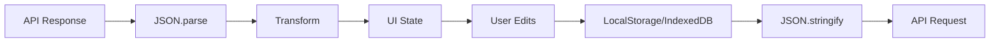

# Data Handling

## Introduction

Every web application deals with data—fetching it from APIs, transforming it for display, storing it locally, and syncing it with servers. Mastering data handling is essential for building robust, responsive applications.

This lesson covers the core techniques for working with data in JavaScript: parsing and serialization, transforming complex structures, and persisting data using browser storage APIs.

### What We'll Cover

| Lesson | Topic |
|--------|-------|
| [01](./01-json-parsing-stringification.md) | JSON parsing and stringification |
| [02](./02-complex-data-structures.md) | Working with complex data structures |
| [03](./03-data-transformation.md) | Data transformation and normalization |
| [04](./04-localstorage-sessionstorage.md) | LocalStorage and SessionStorage |
| [05](./05-indexeddb-basics.md) | IndexedDB basics |

### Prerequisites

- JavaScript fundamentals (objects, arrays, functions)
- Basic understanding of asynchronous JavaScript
- Familiarity with browser developer tools

---

## Why Data Handling Matters

Modern web applications are **data-driven**. Consider a typical user session:

1. **Fetch** - App requests data from an API (JSON)
2. **Parse** - Convert JSON string to JavaScript objects
3. **Transform** - Reshape data for UI components
4. **Display** - Render in the DOM
5. **Interact** - User modifies data
6. **Store** - Save locally for offline access
7. **Sync** - Send updates back to server

Each step requires careful data handling:



### Common Challenges

| Challenge | Solution |
|-----------|----------|
| Parse errors from malformed JSON | Error handling with try/catch |
| Deeply nested API responses | Normalization patterns |
| Data too large for localStorage | IndexedDB for large datasets |
| Circular references in objects | Custom serialization |
| Type coercion issues | Validation and type checking |

---

## Data Handling in AI Applications

When building AI-powered applications, data handling becomes even more critical:

> **🤖 AI Context:** LLM APIs return streaming JSON, embeddings as arrays, and structured tool calls. You'll need robust parsing for:
> - Chat message histories
> - Vector embeddings (float arrays)
> - Function/tool call arguments
> - Streaming response chunks

```javascript
// Example: Parsing OpenAI chat completion
const response = await fetch('/api/chat', { method: 'POST', body: JSON.stringify(messages) });
const data = await response.json();

// Extract the assistant's message
const assistantMessage = data.choices[0].message.content;

// Store conversation in IndexedDB for history
await db.conversations.add({
  id: crypto.randomUUID(),
  messages: [...messages, { role: 'assistant', content: assistantMessage }],
  createdAt: new Date()
});
```

---

## Quick Reference

### JSON Methods

```javascript
// Parse JSON string to object
const obj = JSON.parse('{"name": "Alice"}');

// Convert object to JSON string
const json = JSON.stringify({ name: 'Alice' });

// Pretty print with indentation
const pretty = JSON.stringify(obj, null, 2);
```

### Storage APIs

```javascript
// LocalStorage (persists across sessions)
localStorage.setItem('user', JSON.stringify(user));
const user = JSON.parse(localStorage.getItem('user'));

// SessionStorage (cleared when tab closes)
sessionStorage.setItem('temp', 'value');
```

### IndexedDB (via idb library)

```javascript
import { openDB } from 'idb';

const db = await openDB('myApp', 1, {
  upgrade(db) {
    db.createObjectStore('items', { keyPath: 'id' });
  }
});

await db.add('items', { id: 1, name: 'Item 1' });
const item = await db.get('items', 1);
```

---

## Lesson Structure

Each lesson in this section follows a practical, hands-on approach:

1. **Core concepts** with clear explanations
2. **Code examples** you can run immediately
3. **Common patterns** used in production apps
4. **Exercises** to reinforce learning

**Start with:** [JSON Parsing and Stringification](./01-json-parsing-stringification.md)

---

## Further Reading

- [MDN JSON](https://developer.mozilla.org/en-US/docs/Web/JavaScript/Reference/Global_Objects/JSON) - Official reference
- [MDN Web Storage API](https://developer.mozilla.org/en-US/docs/Web/API/Web_Storage_API) - localStorage/sessionStorage
- [MDN IndexedDB API](https://developer.mozilla.org/en-US/docs/Web/API/IndexedDB_API) - Full reference
