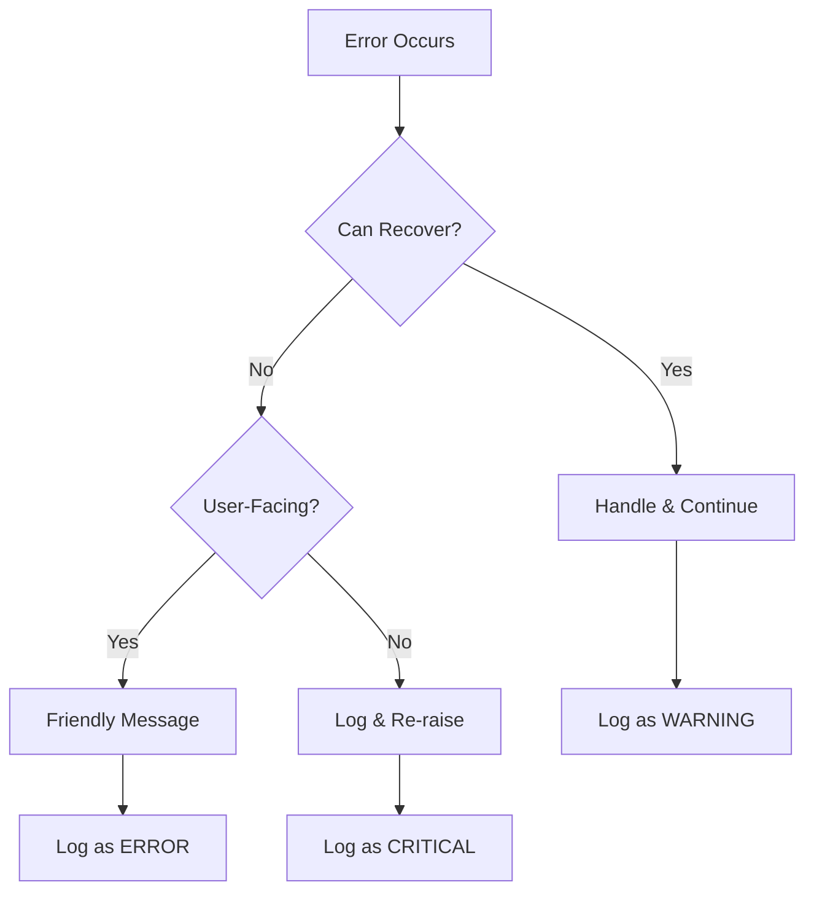

# Error Handling & Debugging

## Overview

Robust error handling prevents crashes and provides meaningful feedback. Effective debugging techniques help you find and fix issues quickly. Together, these skills are essential for production Python code.

---

## What We'll Learn

| Lesson | Topic | Key Concepts |
|--------|-------|--------------|
| [01](./01-exception-handling.md) | Exception Handling | try/except, finally, chaining |
| [02](./02-built-in-exceptions.md) | Built-in Exceptions | Exception types, custom exceptions |
| [03](./03-logging.md) | Logging | Log levels, handlers, formatting |
| [04](./04-debugging-techniques.md) | Debugging Techniques | pdb, breakpoint(), IDE debuggers |
| [05](./05-debugging-tools.md) | Debugging Tools | traceback, Rich, icecream |
| [06](./06-assertions.md) | Assertions | assert, when to use, vs exceptions |

---

## Quick Start

```python
import logging

# Configure logging
logging.basicConfig(level=logging.INFO)
logger = logging.getLogger(__name__)

def process_data(data: dict) -> str:
    """Process data with proper error handling."""
    try:
        result = data["key"]
        logger.info(f"Processing: {result}")
        return result.upper()
    except KeyError:
        logger.error("Missing 'key' in data")
        raise ValueError("Data must contain 'key'") from None
    except AttributeError as e:
        logger.exception("Processing failed")
        raise
```

---

## Error Handling Strategy



---

## Common Patterns

### Defensive Programming

```python
# Check inputs early
def divide(a: float, b: float) -> float:
    if b == 0:
        raise ValueError("Cannot divide by zero")
    return a / b
```

### Specific Exception Handling

```python
# ❌ Too broad
try:
    result = risky_operation()
except Exception:
    pass  # Hides all errors!

# ✅ Specific
try:
    result = risky_operation()
except ConnectionError:
    result = get_cached_value()
except ValueError as e:
    logger.warning(f"Invalid value: {e}")
    result = default_value
```

---

## Prerequisites

Before starting this lesson:
- Python basics (functions, classes)
- File I/O basics

---

## Start Learning

Begin with [Exception Handling](./01-exception-handling.md) to learn try/except fundamentals.

---

## Further Reading

- [Python Exceptions](https://docs.python.org/3/tutorial/errors.html)
- [logging Module](https://docs.python.org/3/library/logging.html)
- [pdb Debugger](https://docs.python.org/3/library/pdb.html)
