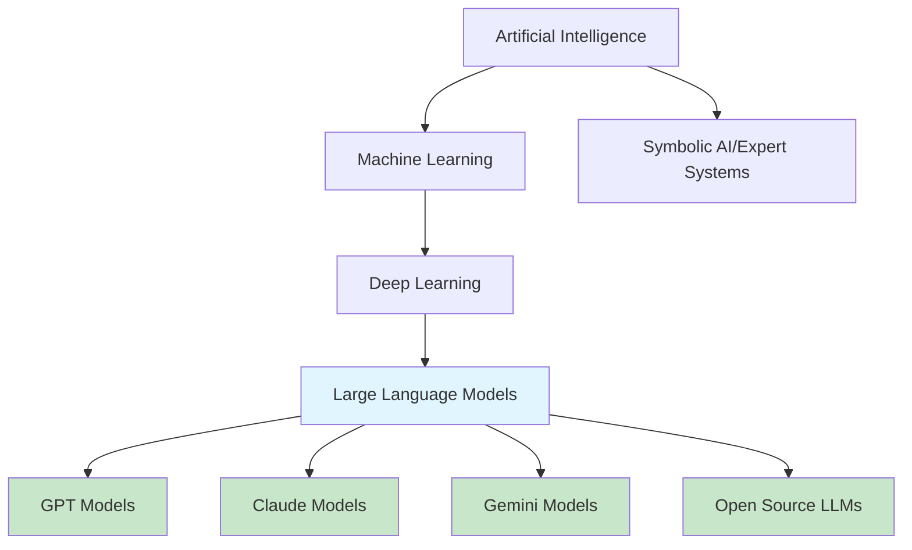

# Introduction to Artificial Intelligence

## Overview

Artificial intelligence has transformed from science fiction into a practical technology that powers applications across every industry. Before diving into APIs and integration patterns, we need to understand what AI actually is, how it evolved, and what it can—and cannot—do.

This lesson establishes the conceptual foundation you'll build upon throughout this course. Whether you're adding chatbot capabilities to an application or building sophisticated AI agents, understanding these fundamentals helps you make informed architectural decisions, set realistic expectations, and communicate effectively with stakeholders.

## What You'll Learn

This lesson covers six essential topics:

1. **[What is AI?](./01-what-is-ai.md)** — Formal definitions, common misconceptions, and how to think about AI systems as a developer
2. **[History of AI Development](./02-history-of-ai.md)** — Key milestones from the 1950s to 2025, understanding how we got here
3. **[AI Regulation Landscape](./03-ai-regulation.md)** — EU AI Act, US Executive Orders, and compliance considerations for developers
4. **[Types of AI](./04-types-of-ai.md)** — Narrow AI vs. General AI, understanding current capabilities vs. future possibilities
5. **[ML vs. Deep Learning vs. LLMs](./05-ml-deep-learning-llms.md)** — How these technologies relate and differ
6. **[Capabilities and Limitations](./06-capabilities-limitations.md)** — What AI does well, what it struggles with, and the hallucination problem

## Prerequisites

Before starting this lesson, you should have:

- Basic programming experience in any language
- Familiarity with APIs (conceptually)
- No machine learning or AI background required

## Why This Matters

Understanding AI fundamentals enables you to:

| Skill | Why It's Important |
|-------|-------------------|
| Set realistic expectations | AI isn't magic—knowing limitations prevents over-promising |
| Choose appropriate solutions | Different AI types solve different problems |
| Communicate with stakeholders | Explain AI capabilities to non-technical team members |
| Navigate regulations | Build compliant applications as AI laws take effect |
| Make architectural decisions | Design systems that work with AI constraints |

## The AI Landscape Today

The AI ecosystem in 2025 consists of several interconnected technologies:



> **🤖 AI Context:** As a web developer integrating AI, you'll primarily work with Large Language Models (LLMs) accessed through APIs. However, understanding the broader AI landscape helps you choose the right tools and explain your choices to others.

## Key Terminology

Before diving into the topics, familiarize yourself with these essential terms:

| Term | Definition |
|------|------------|
| **AI (Artificial Intelligence)** | Systems that perform tasks typically requiring human intelligence |
| **Machine Learning** | AI that improves through experience rather than explicit programming |
| **Deep Learning** | ML using neural networks with many layers |
| **LLM (Large Language Model)** | AI trained on massive text data to understand and generate language |
| **Neural Network** | Computing system inspired by biological brains |
| **Training** | Process of teaching AI from data |
| **Inference** | Using trained AI to make predictions or generate outputs |
| **Model** | The learned patterns and parameters from training |

## Learning Path

Work through the topics in order:

```
01-what-is-ai.md
    ↓
02-history-of-ai.md
    ↓
03-ai-regulation.md
    ↓
04-types-of-ai.md
    ↓
05-ml-deep-learning-llms.md
    ↓
06-capabilities-limitations.md
```

Each topic builds on previous concepts, so completing them in sequence provides the best learning experience.

---

## Summary

This lesson introduces the foundations of artificial intelligence, providing the conceptual framework you need to effectively work with AI technologies. Understanding what AI is, where it came from, and what it can do prepares you for the practical integration work ahead.

**Next:** [What is AI?](./01-what-is-ai.md)

---

## Navigation

| Previous | Up | Next |
|----------|-------|------|
| [Unit Overview](../00-overview.md) | [AI/LLM Fundamentals](../00-overview.md) | [What is AI?](./01-what-is-ai.md) |

