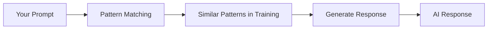

# What is AI?

## Introduction

"Artificial Intelligence" is one of the most misunderstood terms in technology. Movies show us conscious robots, while marketing departments label everything from email filters to toasters as "AI-powered." As a developer, you need a clear, practical understanding of what AI actually means.

In this section, we'll cut through the hype and establish a working definition of AI that will guide your technical decisions throughout this course.

### What We'll Cover

- Formal definitions of artificial intelligence
- Symbolic AI vs. statistical AI approaches
- AI as pattern recognition and prediction
- Common misconceptions that lead to poor decisions

---

## Formal Definitions of AI

There's no single universally accepted definition of AI. Here are the most influential perspectives:

### The Turing Test Definition

Alan Turing proposed in 1950 that a machine is "intelligent" if a human cannot distinguish its responses from a human's responses. This behavioral definition focuses on outputs rather than internal mechanisms.

```
Human Evaluator <---> Unknown Entity (Human or Machine?)
                            |
                     Can you tell the difference?
```

### The Academic Definition

AI researcher John McCarthy, who coined the term in 1956, defined AI as:

> "The science and engineering of making intelligent machines, especially intelligent computer programs."

This definition emphasizes AI as a field of study and engineering discipline.

### The Practical Developer Definition

For our purposes as developers building applications:

> **AI is software that performs tasks which, when done by humans, would require intelligence—such as understanding language, recognizing patterns, making decisions, or generating content.**

This practical definition helps us identify when AI tools are appropriate for a problem.

---

## Symbolic AI vs. Statistical AI

AI approaches fall into two major paradigms:

### Symbolic AI (1950s–1980s)

Symbolic AI, also called "Good Old-Fashioned AI" (GOFAI), uses explicit rules and logic:

```python
# Symbolic AI example: Rule-based system
def diagnose_symptom(symptoms):
    """Expert system approach to diagnosis"""
    if "fever" in symptoms and "cough" in symptoms:
        return "Possible flu or cold"
    if "chest_pain" in symptoms and "shortness_of_breath" in symptoms:
        return "Seek immediate medical attention"
    return "Consult a healthcare provider"

# Knowledge is explicitly programmed
result = diagnose_symptom(["fever", "cough"])
print(result)
```

**Output:**
```
Possible flu or cold
```

**Characteristics of Symbolic AI:**
- Human experts encode knowledge as rules
- Explainable—you can trace exactly why a decision was made
- Brittle—breaks when encountering situations not covered by rules
- Limited scaling—requires manual rule creation for each new scenario

### Statistical AI (1990s–Present)

Statistical AI learns patterns from data rather than following programmed rules:

```python
# Statistical AI concept (pseudocode)
# The model learns patterns from millions of examples

# Training phase (happens once, takes weeks)
model = train_on_data(millions_of_examples)

# Inference phase (happens every request)
prediction = model.predict("Patient has fever and cough")
# Output: {"diagnosis": "influenza", "confidence": 0.82}
```

**Characteristics of Statistical AI:**
- Learns from data patterns automatically
- Generalizes to unseen situations
- Harder to explain exactly why decisions are made
- Scales with more data and compute

### Modern AI: A Blend

Today's AI systems often combine both approaches:

| Approach | Strengths | Used For |
|----------|-----------|----------|
| Symbolic | Explainable, precise | Business rules, validation |
| Statistical | Flexible, scalable | Language understanding, classification |
| Hybrid | Best of both worlds | Production AI systems |

---

## AI as Pattern Recognition

At its core, modern AI is sophisticated pattern recognition. When you use ChatGPT, Claude, or Gemini, the model is recognizing patterns in your input and generating statistically likely responses.

### What This Means Practically



When you ask an LLM: "Write a function to sort a list in Python"

The model recognizes:
1. This looks like a programming request
2. Similar requests in training data were followed by Python code
3. Sorting functions typically use specific patterns
4. The most statistically likely next tokens form the response

### Implications for Developers

Understanding AI as pattern recognition helps explain:

| Behavior | Why It Happens |
|----------|----------------|
| Consistent formatting | Training data had consistent patterns |
| Occasional errors | Less common patterns in training data |
| "Hallucinations" | Plausible-sounding but incorrect patterns |
| Language proficiency | Massive amounts of text data to learn from |

---

## AI as Prediction Systems

Another useful mental model: AI systems are prediction machines. They predict what should come next given an input.

### LLMs: Next-Token Prediction

Large language models fundamentally predict "what word (token) should come next?"

```
Input:  "The capital of France is"
                                    ↓
Model predicts next token:        "Paris"
                                    ↓
New input: "The capital of France is Paris"
                                          ↓
Model predicts next token:              "."
```

This simple mechanism, scaled to billions of parameters and trillions of training tokens, produces remarkably sophisticated outputs.

### Why This Matters

Understanding prediction helps explain AI limitations:

```python
# The model doesn't "know" facts—it predicts likely continuations

# High confidence prediction (common pattern)
prompt = "2 + 2 = "
# Model predicts: "4" (very common pattern)

# Lower confidence (less common pattern)
prompt = "The 47th digit of pi is "
# Model might predict incorrectly (rare pattern)
```

> **Warning:** AI models don't look up facts in a database. They predict what text should come next based on training patterns. This is why they can be confidently wrong.

---

## Common Misconceptions About AI

Let's address the myths that lead to poor technical decisions:

### ❌ Misconception: AI Understands Like Humans Do

**Reality:** AI models process patterns statistically. They don't "understand" concepts the way humans do—they recognize and reproduce patterns.

```python
# AI appears to understand context
prompt = "I'm feeling blue today"

# AI recognizes this pattern correlates with sadness
# Not because it understands emotions, but because training data
# showed "feeling blue" associated with sadness-related responses
```

### ❌ Misconception: AI Is Conscious or Sentient

**Reality:** Current AI has no consciousness, feelings, or self-awareness. When an AI says "I think" or "I feel," it's pattern-matching, not experiencing.

### ❌ Misconception: AI Will Replace All Programmers

**Reality:** AI is a tool that changes how we work, not a replacement for human developers. AI excels at:
- Generating boilerplate code
- Explaining concepts
- Suggesting solutions

AI struggles with:
- Understanding business context
- Making architectural decisions
- Ensuring code meets real-world requirements

### ❌ Misconception: More AI = Better Product

**Reality:** AI should solve specific problems. Adding AI features without clear use cases creates complexity without value.

### ❌ Misconception: AI Outputs Are Always Correct

**Reality:** AI can be confidently wrong. Always validate AI outputs, especially for critical operations.

```python
# NEVER do this in production
user_request = get_user_input()
ai_response = call_ai_api(user_request)
execute_directly(ai_response)  # Dangerous!

# Instead, validate AI outputs
user_request = get_user_input()
ai_response = call_ai_api(user_request)
validated = validate_and_sanitize(ai_response)
if validated.is_safe:
    execute_safely(validated.content)
```

---

## The Right Mental Model for AI

As you integrate AI into applications, think of it as:

1. **A very sophisticated autocomplete** — Predicting likely continuations
2. **A pattern recognition engine** — Finding similarities to training data
3. **A capability amplifier** — Enhancing human productivity, not replacing humans
4. **A probabilistic tool** — Providing likely answers, not guaranteed truths

This mental model helps you:
- Set appropriate expectations
- Design robust systems
- Communicate clearly with stakeholders
- Make good architectural decisions

---

## Hands-on Exercise

### Your Task

Test your understanding of AI as pattern recognition by experimenting with an LLM.

1. Go to [Claude](https://claude.ai) or [ChatGPT](https://chatgpt.com)
2. Try these prompts and observe the patterns:

```
Prompt 1: "Complete this sentence: The quick brown fox"
Prompt 2: "What is 12345 × 67890?" (test calculation reliability)
Prompt 3: "Who won the World Series in 2030?" (test knowledge limitations)
```

### Questions to Consider

- Why did the model complete "The quick brown fox" so reliably?
- Was the calculation accurate? Why or why not?
- How did the model handle a question about the future?

<details>
<summary>💡 Expected Observations</summary>

1. "The quick brown fox jumps over the lazy dog" — Very common pattern, high confidence
2. Math accuracy varies — LLMs process text, not numbers natively
3. Future question — Model should acknowledge its knowledge cutoff

</details>

---

## Summary

✅ AI is software that performs tasks requiring intelligence when done by humans

✅ Modern AI is primarily statistical pattern recognition, not rule-based

✅ LLMs predict the next likely token based on training patterns

✅ AI doesn't truly "understand" — it recognizes and reproduces patterns

✅ Common misconceptions lead to poor technical decisions

✅ Treat AI as a powerful tool with specific strengths and limitations

**Next:** [History of AI Development](./02-history-of-ai.md)

---

## Further Reading

- [What is Artificial Intelligence?](https://www.ibm.com/topics/artificial-intelligence) — IBM's comprehensive overview
- [AI Basics](https://ai.google/education/) — Google's educational resources
- [Hugging Face NLP Course](https://huggingface.co/learn/nlp-course) — Practical AI introduction

---

## Navigation

| Previous | Up | Next |
|----------|-------|------|
| [Lesson Overview](./00-introduction-to-artificial-intelligence.md) | [Introduction to AI](./00-introduction-to-artificial-intelligence.md) | [History of AI](./02-history-of-ai.md) |

