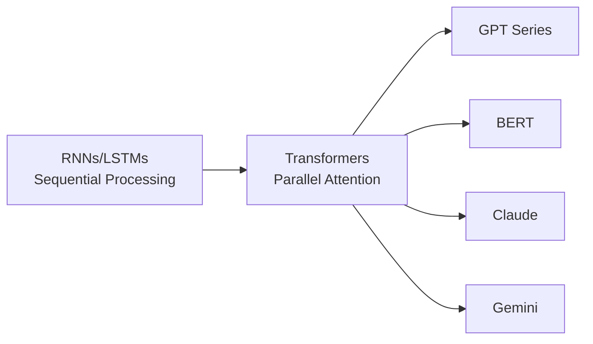
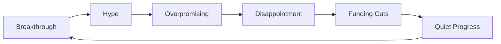

# History of AI Development

## Introduction

Understanding AI's history isn't just academic trivia—it helps you understand why current systems work the way they do, what approaches have failed before, and what might come next. The patterns of AI development inform how we build applications today.

In this section, we'll trace AI's evolution from theoretical beginnings to the current era of powerful large language models and agentic AI.

### What We'll Cover

- Key milestones from 1950 to 2025
- Why AI went through "winters" of reduced progress
- The breakthrough moments that shaped today's technology
- Recent advances driving current AI capabilities

---

## Timeline of AI Development

### The 1950s: Birth of AI

**1950 — The Turing Test**
Alan Turing published "Computing Machinery and Intelligence," proposing the imitation game as a test for machine intelligence.

**1956 — AI is Born**
The Dartmouth Conference, organized by John McCarthy, Marvin Minsky, Claude Shannon, and Nathaniel Rochester, coined the term "Artificial Intelligence" and launched AI as a field.

```
"We propose that a 2 month, 10 man study of artificial intelligence be 
carried out during the summer of 1956 at Dartmouth College."
— 1955 Dartmouth Proposal
```

**1958 — The Perceptron**
Frank Rosenblatt created the perceptron, an early neural network that could learn simple patterns—the ancestor of today's deep learning.

### The 1960s-1980s: Expert Systems Era

This period saw the rise of **symbolic AI** and expert systems:

```
Expert System Architecture (1970s-80s):

┌─────────────────────┐
│   Knowledge Base    │  ← Human experts encode rules
│  (IF-THEN Rules)    │
└─────────┬───────────┘
          │
┌─────────▼───────────┐
│   Inference Engine  │  ← Applies rules to input
└─────────┬───────────┘
          │
┌─────────▼───────────┐
│      Output         │  ← Recommendations/Decisions
└─────────────────────┘
```

**Key Systems:**
- **MYCIN (1970s)** — Medical diagnosis expert system
- **XCON (1980s)** — Computer configuration system (saved DEC $40M/year)

**The First AI Winter (1974-1980)**
Overpromising and underdelivering led to funding cuts. Early AI couldn't deliver on ambitious claims, leading to skepticism and reduced investment.

### The 1990s-2000s: Machine Learning Rise

The focus shifted from hand-coded rules to learning from data:

**1997 — Deep Blue Beats Kasparov**
IBM's chess computer defeated world champion Garry Kasparov, demonstrating AI could master complex strategic tasks.

**Statistical Methods Emerge:**
- Support Vector Machines
- Random Forests
- Bayesian Networks

```python
# The paradigm shift: from rules to learning
# Before (Expert Systems)
if symptom == "fever" and symptom == "cough":
    diagnosis = "flu"

# After (Machine Learning)
model = train(thousands_of_patient_records)
diagnosis = model.predict(new_patient_symptoms)
```

**The Second AI Winter (Late 1980s-1990s)**
Expert systems proved difficult to maintain and scale. AI again failed to meet expectations.

### 2012: The Deep Learning Breakthrough

**AlexNet Wins ImageNet**
Geoffrey Hinton's team used deep neural networks to dramatically outperform traditional methods in image recognition.

```
ImageNet Error Rates:
- 2011 (Traditional): ~25%
- 2012 (AlexNet):     ~16%  ← Revolutionary improvement
- 2015 (ResNet):      ~3.5% (Better than humans!)
```

This success triggered the current AI boom. Key factors:
- **More data** — Internet produced massive training datasets
- **More compute** — GPUs enabled training large networks
- **Better algorithms** — New architectures and training techniques

### 2017: The Transformer Revolution

**"Attention Is All You Need"**
Google researchers published the Transformer architecture, the foundation of all modern LLMs.



**Why Transformers Matter:**
- Process entire sequences simultaneously (not word-by-word)
- Scale efficiently with more compute
- Handle long-range dependencies in text

### 2018-2021: Language Models Emerge

| Year | Model | Parameters | Significance |
|------|-------|------------|--------------|
| 2018 | GPT-1 | 117M | Demonstrated generative pre-training |
| 2019 | GPT-2 | 1.5B | OpenAI initially withheld due to misuse concerns |
| 2020 | GPT-3 | 175B | First model showing emergent capabilities |
| 2021 | Codex | 12B | Specialized for code generation |

### 2022-2023: ChatGPT and the LLM Era

**November 2022 — ChatGPT Launch**
ChatGPT brought LLMs to the mainstream, reaching 100 million users in two months.

```
User Growth Comparison (Time to 100M Users):
- TikTok:    9 months
- Instagram: 2.5 years
- ChatGPT:   2 months  ← Fastest adoption ever
```

**2023 Developments:**
- **GPT-4** — Multimodal capabilities (text + images)
- **Claude 2** — 100K token context window
- **LLaMA** — Meta's open-source models democratize access
- **Gemini** — Google's multimodal model family

### 2024: Reasoning Models

**OpenAI o1 (September 2024)**
First widely available reasoning model that "thinks" before answering, using internal chain-of-thought.

```
Traditional LLM:
Input → Generate tokens → Output

Reasoning Model (o1):
Input → Think (hidden) → Think more → Output (with reasoning)
```

**Other 2024 Advances:**
- **Claude 3** — Extended context (200K tokens)
- **Claude 3.5 Sonnet** — Balanced performance/cost
- **Gemini 1.5** — 1M token context window
- **Computer Use** — Claude can control computers

### 2025: Agentic AI and Regulations

**Current State (2025):**

```
Major Model Families:
├── OpenAI
│   ├── GPT-5 (flagship)
│   ├── GPT-5-mini
│   ├── o3/o4-mini (reasoning)
│   └── GPT-5.2 (latest coding/agentic)
├── Anthropic
│   ├── Claude 4 (flagship)
│   ├── Claude Opus 4.5
│   └── Claude Sonnet/Haiku 4.5
├── Google
│   ├── Gemini 2.5 Pro
│   └── Gemini 2.5 Flash
└── Open Source
    ├── LLaMA 4
    ├── Mistral Large
    └── DeepSeek V3
```

**Key 2025 Trends:**
- **Agentic AI** — Models that can plan, use tools, and complete multi-step tasks
- **Computer Use** — AI that can control desktop applications
- **EU AI Act Enforcement** — First major AI regulations take effect
- **Reasoning at Scale** — o3-level reasoning becoming standard

---

## The AI Winter Pattern

AI has experienced cycles of hype and disappointment:



**Why Winters Happened:**
1. Promising more than technology could deliver
2. Underestimating difficulty of real-world applications
3. Compute limitations of the era

**Why We May Avoid Another Winter:**
- Current AI produces genuine economic value
- Millions of developers actively using AI APIs
- Sustainable business models exist
- Real products, not just research demos

---

## Key Lessons from History

| Lesson | Application Today |
|--------|------------------|
| Hype precedes reality | Set realistic expectations for AI projects |
| Compute enables breakthroughs | Consider compute costs in architecture |
| Simple ideas + scale = power | Don't over-engineer when scaling works |
| Open research accelerates progress | Leverage open-source models and tools |
| Practical applications drive adoption | Build features users actually need |

---

## Why This History Matters for Developers

Understanding AI history helps you:

1. **Recognize patterns** — When a new technique is hyped, you can evaluate it critically
2. **Appreciate current capabilities** — Today's "simple" API calls represent decades of research
3. **Anticipate changes** — History suggests continued rapid improvement
4. **Communicate effectively** — Explain AI evolution to stakeholders

---

## Hands-on Exercise

### Your Task

Research a specific AI milestone and understand its impact.

Choose one:
- The Transformer paper ("Attention Is All You Need")
- GPT-3's emergent abilities
- ChatGPT's rapid adoption

### Questions to Answer

1. What problem did it solve?
2. Why was it significant compared to previous approaches?
3. How does it affect AI applications you might build?

<details>
<summary>💡 Example: Transformer Impact</summary>

**Problem Solved:** Processing long sequences efficiently with attention to all positions.

**Significance:** Previous RNN/LSTM models processed sequentially, limiting parallelization and long-range understanding.

**Impact on Your Work:** Every LLM you use (GPT, Claude, Gemini) is built on Transformers. Context windows, token limits, and attention-based behaviors all derive from this architecture.

</details>

---

## Summary

✅ AI has evolved from rule-based expert systems to data-driven neural networks

✅ Key milestones: Turing Test (1950), Perceptron (1958), Deep Learning (2012), Transformers (2017)

✅ AI "winters" occurred when technology couldn't match expectations

✅ ChatGPT (2022) brought LLMs mainstream; 2024+ added reasoning and agentic capabilities

✅ 2025 features agentic AI, computer use, and regulatory enforcement

✅ Understanding history helps you evaluate new developments critically

**Next:** [AI Regulation Landscape](./03-ai-regulation.md)

---

## Further Reading

- [The Illustrated Transformer](https://jalammar.github.io/illustrated-transformer/) — Visual guide to the architecture
- [Attention Is All You Need](https://arxiv.org/abs/1706.03762) — Original Transformer paper
- [A Brief History of AI](https://www.ibm.com/think/topics/artificial-intelligence-history) — IBM's comprehensive timeline

---

## Navigation

| Previous | Up | Next |
|----------|-------|------|
| [What is AI?](./01-what-is-ai.md) | [Introduction to AI](./00-introduction-to-artificial-intelligence.md) | [AI Regulation](./03-ai-regulation.md) |

