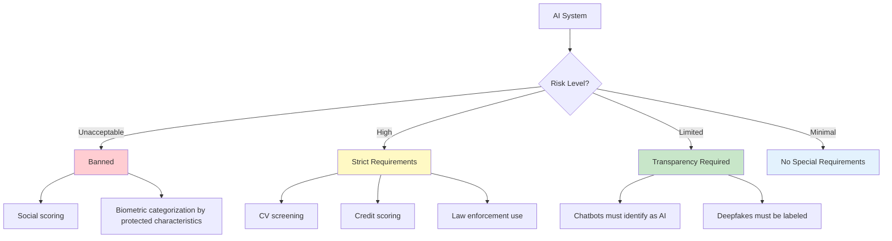

# AI Regulation Landscape

## Introduction

AI regulation is rapidly evolving from theoretical discussion to enforceable law. The EU AI Act began enforcement in 2025, and other regions are following with their own frameworks. As a developer building AI-powered applications, you need to understand these regulations—they directly affect what you can build and how you must build it.

This section covers the major regulatory frameworks and practical compliance considerations for developers.

### What We'll Cover

- EU AI Act structure and requirements
- US Executive Orders and approach
- China's AI regulations
- Industry self-regulation efforts
- Practical compliance considerations

---

## EU AI Act (Enforcement Began 2025)

The EU AI Act is the world's first comprehensive AI law. It categorizes AI systems by risk level and imposes requirements accordingly.

### Risk-Based Classification



### Risk Categories Explained

| Risk Level | Examples | Requirements |
|------------|----------|--------------|
| **Unacceptable** | Social scoring, manipulative AI | Banned |
| **High-Risk** | Recruitment tools, credit scoring, medical devices | Conformity assessment, human oversight, documentation |
| **Limited Risk** | Chatbots, emotion recognition | Transparency obligations (users must know they're interacting with AI) |
| **Minimal Risk** | Spam filters, recommendation systems | No specific requirements |

### Key Requirements for High-Risk AI

If your AI system is classified as high-risk, you must:

```python
# Conceptual requirements (not actual code)
class HighRiskAISystem:
    def __init__(self):
        self.risk_management = RiskManagementSystem()
        self.training_data = DocumentedDataset()  # Must be documented
        self.technical_docs = TechnicalDocumentation()
        self.logging = EventLogging()  # Traceability required
        self.human_oversight = HumanOversightMechanism()
    
    def deploy(self):
        # Must complete conformity assessment before deployment
        self.conformity_assessment.complete()
        self.register_in_eu_database()
```

**Specific obligations include:**
- Maintain risk management throughout lifecycle
- Use high-quality, relevant training data
- Create comprehensive technical documentation
- Enable human oversight and intervention
- Ensure accuracy, robustness, and cybersecurity

### Timeline

| Date | Milestone |
|------|-----------|
| February 2025 | Prohibitions on unacceptable AI take effect |
| August 2025 | Rules for GPAI (General Purpose AI) providers |
| August 2026 | Full enforcement for high-risk AI |

### What This Means for Developers

```javascript
// If building a chatbot:
const chatResponse = await generateResponse(userInput);

// EU AI Act requires transparency
const formattedResponse = {
  content: chatResponse,
  disclosure: "This response was generated by AI", // Required
  metadata: {
    modelUsed: "Claude 4",
    generatedAt: new Date().toISOString()
  }
};
```

> **Important:** If you build AI-powered tools for EU users—even from outside the EU—the AI Act may apply to you.

---

## US Executive Orders on AI

The US approach emphasizes voluntary guidelines and sector-specific regulation rather than comprehensive legislation.

### Executive Order on Safe AI (October 2023, Updated 2025)

Key provisions:

| Area | Requirement |
|------|-------------|
| Safety Testing | Developers of powerful AI must share safety test results with government |
| Red-Teaming | Standards for AI red-teaming and testing |
| Federal Use | Guidelines for government AI procurement and use |
| Workforce | Addressing AI impact on jobs |

### Sector-Specific Approach

Unlike the EU's comprehensive law, the US relies on existing regulators:

```
US AI Regulation Approach:
├── FDA → AI in medical devices
├── FTC → AI in consumer products, deceptive practices
├── SEC → AI in financial services
├── EEOC → AI in employment decisions
└── State Laws → California, Colorado, others
```

### State-Level Action

Some US states have enacted their own AI laws:

- **California** — AI transparency requirements
- **Colorado** — AI in insurance regulation
- **Illinois** — Biometric data and AI hiring laws

---

## China AI Regulations

China has implemented specific regulations targeting AI content:

### Key Regulations

| Regulation | Focus | Requirement |
|------------|-------|-------------|
| **Deep Synthesis (2023)** | Deepfakes, synthetic media | Watermarking, disclosure |
| **Generative AI (2023)** | ChatGPT-like services | Content review, training data requirements |
| **Algorithm Recommendation (2022)** | Recommendation systems | User opt-out, transparency |

### Practical Implications

If serving Chinese users:
- AI-generated content must be clearly labeled
- Training data must not contain prohibited content
- Models must align with "core socialist values"
- Real-name verification for AI services

---

## Industry Self-Regulation

Before formal laws, and alongside them, industry groups have developed guidelines:

### Voluntary Commitments

Major AI companies (OpenAI, Anthropic, Google, Meta, Microsoft) have made voluntary commitments:

- **Safety testing** before releasing powerful models
- **Red-teaming** to identify vulnerabilities
- **Watermarking** AI-generated content
- **Information sharing** on safety research

### Standards Bodies

| Organization | Focus |
|--------------|-------|
| **NIST** | AI Risk Management Framework |
| **ISO** | AI standards development |
| **IEEE** | Ethical AI guidelines |
| **Partnership on AI** | Industry best practices |

---

## Compliance Considerations for Developers

### Assess Your AI Risk Level

```python
def assess_ai_risk_level(ai_system):
    """Determine regulatory risk level of your AI system"""
    
    high_risk_domains = [
        "employment_decisions",
        "credit_scoring",
        "educational_assessment",
        "law_enforcement",
        "migration_control",
        "critical_infrastructure"
    ]
    
    if ai_system.domain in high_risk_domains:
        return "high_risk"
    
    if ai_system.interacts_with_users:
        return "limited_risk"  # Transparency required
    
    return "minimal_risk"

# Example usage
my_chatbot = AISystem(
    domain="customer_support",
    interacts_with_users=True
)
risk_level = assess_ai_risk_level(my_chatbot)
print(f"Risk level: {risk_level}")  # "limited_risk"
```

**Output:**
```
Risk level: limited_risk
```

### Documentation Checklist

For any AI system, maintain:

| Document | Contents |
|----------|----------|
| System description | What the AI does, intended use |
| Training data info | Sources, preprocessing, potential biases |
| Testing results | Accuracy metrics, failure modes |
| Risk assessment | Identified risks and mitigations |
| Human oversight plan | How humans monitor and intervene |

### Practical Implementation Steps

```javascript
// 1. Disclosure - Always identify AI-generated content
function formatAIResponse(response) {
  return {
    content: response,
    isAIGenerated: true,
    model: "claude-4",
    timestamp: new Date().toISOString(),
    // Include confidence if relevant
    confidence: response.confidence || null
  };
}

// 2. Logging - Maintain audit trail
async function logAIInteraction(input, output) {
  await auditLog.create({
    timestamp: new Date(),
    userInput: sanitize(input),
    aiOutput: output,
    modelVersion: config.modelVersion,
    // Don't log PII unless necessary
  });
}

// 3. Human Override - Enable human intervention
class AIDecisionSystem {
  async makeDecision(input) {
    const aiSuggestion = await this.model.predict(input);
    
    // High-stakes decisions need human approval
    if (this.isHighStakes(input)) {
      return {
        suggestion: aiSuggestion,
        requiresHumanApproval: true,
        humanApproved: false
      };
    }
    
    return aiSuggestion;
  }
}
```

### Geographic Considerations

| User Location | Primary Regulation | Key Requirement |
|---------------|-------------------|-----------------|
| EU | AI Act | Risk classification, transparency |
| US | Sector-specific | Depends on industry |
| China | GenAI regulations | Content compliance, disclosure |
| Other | Varies | Often follows EU or US approaches |

---

## Best Practices for Regulatory Compliance

1. **Design for transparency from the start**
   - Always be prepared to explain what your AI does
   - Log decisions and reasoning

2. **Implement human oversight**
   - High-stakes decisions should involve humans
   - Provide clear escalation paths

3. **Document everything**
   - Training data sources
   - Model versions and changes
   - Testing and validation results

4. **Stay updated**
   - Regulations are evolving rapidly
   - Join industry groups for updates

5. **Consider compliance by design**
   - Build compliance features into architecture
   - Easier than retrofitting later

---

## Hands-on Exercise

### Your Task

Assess the regulatory requirements for a hypothetical AI application.

**Scenario:** You're building an AI-powered resume screening tool for a recruiting company. The tool will:
- Analyze uploaded resumes
- Score candidates based on job requirements
- Recommend top candidates to human recruiters

### Questions to Answer

1. What risk level would this system be under the EU AI Act?
2. What specific requirements would apply?
3. What features would you need to build for compliance?

<details>
<summary>✅ Solution</summary>

**Risk Level:** High-Risk (employment decisions)

**Requirements:**
- Conformity assessment before deployment
- Risk management system
- Training data documentation (especially for bias)
- Human oversight mechanism
- Detailed logging and traceability
- Technical documentation

**Features to Build:**
```python
class ResumeScreeningSystem:
    # Compliance features
    human_oversight = True  # Require human review
    decision_logging = True  # Full audit trail
    bias_monitoring = True  # Track demographic outcomes
    explanation_generation = True  # Explain each score
    
    def screen_resume(self, resume, job_requirements):
        score = self.model.evaluate(resume, job_requirements)
        
        return {
            "score": score,
            "explanation": self.generate_explanation(score),
            "factors_considered": self.list_factors(),
            "requires_human_review": True,
            "ai_recommendation_only": True  # Not final decision
        }
```

</details>

---

## Summary

✅ EU AI Act is the first comprehensive AI law, using risk-based classification

✅ High-risk AI (employment, credit, law enforcement) faces strict requirements

✅ Limited-risk AI (chatbots) must disclose AI involvement to users

✅ US uses sector-specific regulation; China focuses on content control

✅ Document everything: data, testing, decisions, and oversight

✅ Build compliance features into your architecture from the start

**Next:** [Types of AI](./04-types-of-ai.md)

---

## Further Reading

- [EU AI Act Full Text](https://artificialintelligenceact.eu/) — Complete regulation
- [NIST AI Risk Management Framework](https://www.nist.gov/itl/ai-risk-management-framework) — US guidelines
- [OWASP Top 10 for LLMs](https://owasp.org/www-project-top-10-for-large-language-model-applications/) — Security considerations

---

## Navigation

| Previous | Up | Next |
|----------|-------|------|
| [History of AI](./02-history-of-ai.md) | [Introduction to AI](./00-introduction-to-artificial-intelligence.md) | [Types of AI](./04-types-of-ai.md) |

