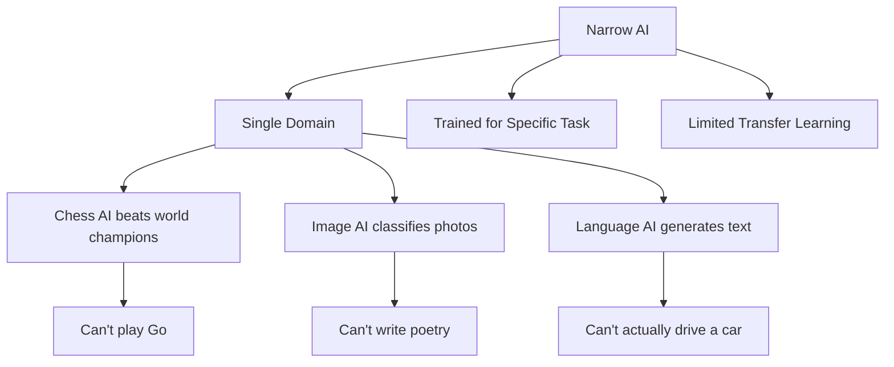

# Types of AI: Narrow AI vs. General AI

## Introduction

When discussing AI, it's crucial to distinguish between what exists today and what remains theoretical. This distinction prevents unrealistic expectations and helps you focus on what you can actually build with current technology.

This section clarifies the different categories of AI intelligence and explains why current AI systems, despite being impressive, are fundamentally limited in scope.

### What We'll Cover

- Narrow AI (ANI): What we have today
- General AI (AGI): The theoretical goal
- Superintelligence: Beyond human capability
- Why this distinction matters for developers

---

## Narrow AI (ANI): Task-Specific Intelligence

**Narrow AI** (also called Weak AI or Artificial Narrow Intelligence) is AI designed for specific tasks. This is the only type of AI that exists today.

### Characteristics of Narrow AI



**Key Properties:**
- Excels at one task (or narrow range of tasks)
- Cannot generalize beyond training domain
- Requires specific training for new capabilities
- No true understanding—pattern matching only

### Examples of Narrow AI

| System | Task | Limitation |
|--------|------|------------|
| **Chess engines** | Play chess at superhuman level | Can't play checkers without retraining |
| **AlphaGo** | Master Go strategy | Doesn't understand game theory generally |
| **GPT-5** | Generate text, answer questions | Can't control a robot arm |
| **DALL-E** | Generate images | Can't compose music |
| **Siri/Alexa** | Voice commands | Limited beyond programmed intents |
| **Self-driving cars** | Navigate roads | Can't write code |

### LLMs Are Narrow AI (Despite Appearances)

You might think ChatGPT or Claude are "general" because they can do many things. They're actually highly capable narrow AI:

```python
# What LLMs can do (all text-based tasks)
llm_capabilities = [
    "answer_questions",
    "write_code",
    "translate_languages",
    "summarize_documents",
    "creative_writing",
    "explain_concepts"
]

# What LLMs cannot do (outside training scope)
llm_limitations = [
    "perform_physical_actions",      # No body
    "access_real_time_information",  # Without tools
    "truly_understand_concepts",     # Pattern matching
    "guarantee_factual_accuracy",    # Probabilistic
    "have_experiences_or_emotions"   # Not conscious
]
```

> **Note:** LLMs appear general because language touches many domains. But they're still narrow—they're language models, not general intelligence.

---

## General AI (AGI): Human-Level Reasoning

**Artificial General Intelligence (AGI)** refers to AI with human-like cognitive abilities—AI that could learn any task a human can learn.

### What AGI Would Look Like

```
Human Capability                    AGI Requirement
─────────────────────────────────────────────────────
Learn new skills from few examples  → Few-shot learning at human level
Transfer knowledge between domains  → True generalization
Understand cause and effect         → Causal reasoning
Apply common sense                  → World models
Form goals and plans               → Agency and planning
Adapt to novel situations          → Robust generalization
```

### AGI Does Not Exist

Despite media hype, no current system qualifies as AGI:

```python
# Testing for AGI (conceptual)
def is_agi(system):
    tests = [
        system.can_learn_any_human_task(),
        system.has_common_sense_reasoning(),
        system.transfers_knowledge_freely(),
        system.understands_causation(),
        system.adapts_to_novel_situations(),
    ]
    return all(tests)

# Current systems
is_agi(gpt5)        # False - fails common sense, causation
is_agi(claude4)     # False - fails novel physical tasks
is_agi(gemini25)    # False - fails true understanding
is_agi(any_current) # False - none exist
```

### Timeline Predictions

| Prediction | Source | Context |
|------------|--------|---------|
| "5-20 years away" | Various researchers | Common estimate (always 5-20 years away) |
| "No clear timeline" | Conservative view | May require fundamental breakthroughs |
| "Impossible" | Some philosophers | Questions if computation can equal consciousness |

> **Warning:** Predictions about AGI have historically been wildly optimistic. Treat timeline claims with skepticism.

---

## Superintelligence: Beyond Human Capability

**Superintelligence (ASI)** would exceed human cognitive abilities in essentially every domain.

### The Concept

```
Capability Scale:
──────────────────────────────────────────────────────►
Mouse     Human     Einstein     AGI     Superintelligence

                    ▲            ▲              ▲
                    │            │              │
                 Current      Fictional      Theoretical
                 ceiling      goal           concern
```

### Why It's Discussed

Superintelligence features in AI safety discussions because:
- If AGI is achieved, rapid improvement could follow
- Such systems might be difficult to control
- Long-term implications require early consideration

### Reality Check

Superintelligence is:
- Purely theoretical
- Not close to existing
- Not something you need to design for today
- Important for long-term safety research, not current development

---

## The Current State: We Have Narrow AI Only

Let's be clear about 2025:

```
What We Have:                     What We Don't Have:
────────────────────────────────────────────────────────
Powerful language models          True understanding
Impressive image generation       Consciousness
Useful code assistants           Common sense reasoning
Good at pattern matching         Causal understanding
Getting better quickly           Human-like learning
Economically valuable            General intelligence
```

### Why Current AI Isn't AGI

Even the most impressive current systems fail basic tests:

```python
# Things current AI struggles with:

# 1. Novel physical reasoning
prompt = "If I put a ball in a box, close the box, and flip it upside down, where is the ball?"
# AI might answer correctly, but doesn't truly understand physics

# 2. Genuine common sense
prompt = "Why might someone put their keys in the refrigerator?"
# AI struggles with truly novel reasoning about human behavior

# 3. True causation vs correlation
prompt = "Does carrying an umbrella cause rain?"
# AI might produce correct answer from training, but doesn't understand why

# 4. Tasks outside training distribution
prompt = "Design a new sport that combines elements of chess, swimming, and cooking"
# AI produces plausible-sounding but often incoherent results
```

---

## Why This Distinction Matters for Developers

Understanding AI types helps you:

### 1. Set Realistic Expectations

```python
# Wrong mental model
ai = MagicGeneralIntelligence()
ai.do_anything()  # Won't work

# Correct mental model  
language_ai = LanguageModel()
language_ai.generate_text(prompt)  # Works
language_ai.drive_car()  # Not possible

image_ai = ImageGenerator()
image_ai.create_image(description)  # Works
image_ai.write_essay()  # Not its purpose
```

### 2. Choose the Right Tool

| Task | Appropriate AI Type | Example |
|------|---------------------|---------|
| Text generation | Language model | GPT-5, Claude 4 |
| Image creation | Image model | DALL-E, Stable Diffusion |
| Code completion | Code model | Codex, CodeLlama |
| Voice transcription | Speech model | Whisper |
| Search | Embedding + retrieval | text-embedding-3 |

### 3. Design Robust Systems

Since current AI is narrow:
- Don't expect AI to handle edge cases gracefully
- Build fallbacks for when AI fails
- Include human oversight for critical decisions
- Test thoroughly within expected use cases

### 4. Communicate Accurately

To stakeholders and users:

```
❌ "Our AI understands your needs"
✅ "Our AI is trained to recognize common request patterns"

❌ "The AI made this decision"  
✅ "The AI provided a recommendation based on pattern matching"

❌ "AI can do anything"
✅ "AI excels at specific tasks it was trained for"
```

---

## Practical Implications

### What You Can Build Today

```javascript
// Realistic AI-powered features
const features = {
  // Text-based tasks (strong)
  chatbot: "Answer customer questions using trained knowledge",
  summarization: "Condense long documents into key points",
  translation: "Convert text between languages",
  
  // Code-related (strong)
  codeGeneration: "Write code based on descriptions",
  codeExplanation: "Explain what code does",
  
  // Analysis (moderate)
  sentimentAnalysis: "Classify text as positive/negative",
  classification: "Categorize content into predefined types",
  
  // With appropriate caveats
  advice: "Suggest options (with human review)",
  decisions: "Recommend choices (humans make final call)"
};
```

### What Requires Human Backup

```javascript
// Features that need human oversight
const sensitiveFeatures = {
  medicalAdvice: "AI assists, doctor decides",
  legalAnalysis: "AI drafts, lawyer reviews",
  financialDecisions: "AI suggests, human approves",
  safetycricalSystems: "AI monitors, human controls"
};
```

---

## Hands-on Exercise

### Your Task

Classify AI capabilities as Narrow AI examples and identify their limitations.

For each AI system, identify:
1. What narrow task(s) it performs well
2. A task it cannot do (highlighting its narrow nature)

| AI System | Good At | Cannot Do |
|-----------|---------|-----------|
| GPT-5 | ? | ? |
| DALL-E | ? | ? |
| Whisper | ? | ? |
| AlphaFold | ? | ? |

<details>
<summary>✅ Solution</summary>

| AI System | Good At | Cannot Do |
|-----------|---------|-----------|
| GPT-5 | Text generation, Q&A, coding | Physical tasks, guaranteed accuracy |
| DALL-E | Image generation from text | Generate videos, edit precisely |
| Whisper | Speech-to-text transcription | Text-to-speech, translation in real-time |
| AlphaFold | Protein structure prediction | Design new drugs, understand biology |

Each is highly specialized—none approach general intelligence.

</details>

---

## Summary

✅ **Narrow AI (ANI)** is the only type that exists—AI for specific tasks

✅ **General AI (AGI)** would match human-level reasoning—it doesn't exist yet

✅ **Superintelligence (ASI)** would exceed humans—purely theoretical

✅ Current LLMs are impressive narrow AI, not general intelligence

✅ Understanding this distinction helps set realistic expectations

✅ Build systems knowing AI has specific capabilities and limitations

**Next:** [Machine Learning vs. Deep Learning vs. LLMs](./05-ml-deep-learning-llms.md)

---

## Further Reading

- [The Myth of AGI](https://www.technologyreview.com/2020/10/21/1009795/gpt-3-is-not-agi/) — MIT Tech Review analysis
- [What is AGI?](https://www.ibm.com/topics/artificial-general-intelligence) — IBM's explanation
- [AI Capabilities and Limitations](https://ai.google/responsibility/) — Google's perspective

---

## Navigation

| Previous | Up | Next |
|----------|-------|------|
| [AI Regulation](./03-ai-regulation.md) | [Introduction to AI](./00-introduction-to-artificial-intelligence.md) | [ML vs. DL vs. LLMs](./05-ml-deep-learning-llms.md) |

