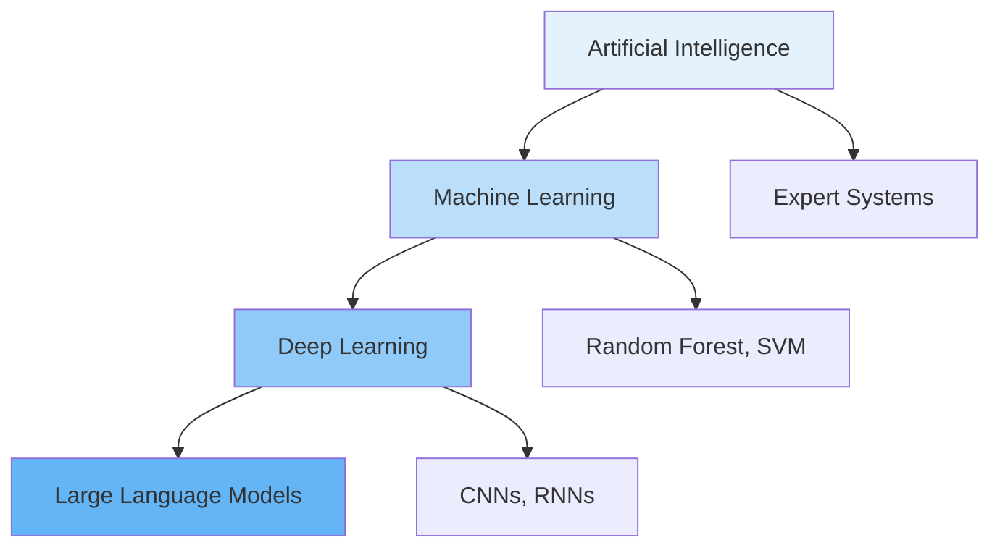
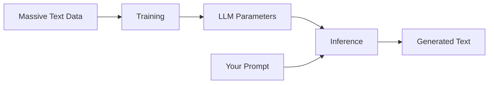
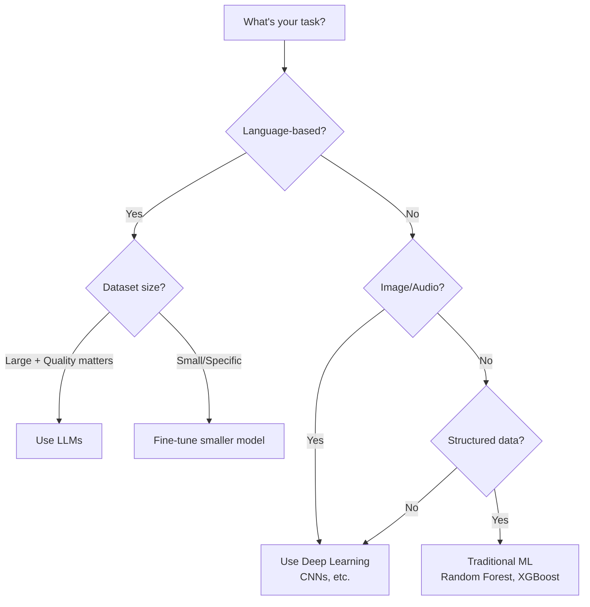

# Machine Learning vs. Deep Learning vs. LLMs

## Introduction

These three terms—Machine Learning, Deep Learning, and Large Language Models—are often used interchangeably, but they represent distinct (though related) concepts. Understanding their relationships helps you choose the right approach for different problems and communicate effectively with team members.

This section clarifies how these technologies relate to each other and when to use each.

### What We'll Cover

- Machine Learning fundamentals
- Deep Learning and neural networks
- Large Language Models explained
- How they relate to each other
- When to use each approach

---

## The Relationship: A Nested Hierarchy

These technologies nest inside each other like Russian dolls:



**The hierarchy:**
- **AI** is the broadest category
- **ML** is a subset of AI
- **DL** is a subset of ML
- **LLMs** are a specific type of DL model

---

## Machine Learning: Algorithms That Learn from Data

**Machine Learning (ML)** is AI that improves through experience. Instead of explicit programming, ML systems learn patterns from data.

### The Core Concept

```python
# Traditional programming
def is_spam(email):
    if "FREE MONEY" in email:
        return True
    if sender in known_spammers:
        return True
    return False

# Machine learning approach
def train_spam_classifier(labeled_emails):
    """Learn patterns from thousands of examples"""
    model = SpamClassifier()
    model.fit(labeled_emails)  # Model learns patterns
    return model

# Usage
model = train_spam_classifier(training_data)
prediction = model.predict(new_email)  # Uses learned patterns
```

### Types of Machine Learning

| Type | Description | Example |
|------|-------------|---------|
| **Supervised** | Learn from labeled examples | Spam/not-spam classification |
| **Unsupervised** | Find patterns in unlabeled data | Customer segmentation |
| **Reinforcement** | Learn from rewards/penalties | Game-playing agents |

### Common ML Algorithms

```python
# Examples of traditional ML (not deep learning)
from sklearn.ensemble import RandomForestClassifier
from sklearn.svm import SVC
from sklearn.linear_model import LogisticRegression

# These algorithms learn from data without neural networks
classifiers = {
    "random_forest": RandomForestClassifier(),
    "svm": SVC(),
    "logistic_regression": LogisticRegression()
}

# Training and prediction
model = classifiers["random_forest"]
model.fit(training_features, training_labels)
prediction = model.predict(new_data)
```

### When to Use Traditional ML

| Scenario | Why Traditional ML Works |
|----------|--------------------------|
| Small datasets | Deep learning needs large data |
| Interpretability required | Decision trees are explainable |
| Limited compute | ML algorithms are lighter |
| Structured data | Tables work well with traditional ML |

---

## Deep Learning: Neural Networks with Many Layers

**Deep Learning (DL)** uses artificial neural networks with multiple layers to learn complex patterns. It's called "deep" because of the many layers.

### Neural Network Basics

```
Input Layer → Hidden Layers → Output Layer

   [x1]         [h1]  [h1]  [h1]         [y1]
   [x2]    →    [h2]  [h2]  [h2]    →    [y2]
   [x3]         [h3]  [h3]  [h3]
   
   Input        Layer Layer Layer       Output
                  1     2     3
```

### How Deep Learning Works

```python
# Conceptual neural network
class SimpleNeuralNetwork:
    def __init__(self, layers):
        self.layers = layers
    
    def forward(self, input_data):
        """Pass data through all layers"""
        x = input_data
        for layer in self.layers:
            x = layer.activate(x)  # Transform through each layer
        return x
    
    def train(self, data, labels):
        """Adjust weights to minimize errors"""
        for epoch in range(epochs):
            predictions = self.forward(data)
            error = calculate_error(predictions, labels)
            self.backpropagate(error)  # Adjust weights
```

### Key Deep Learning Architectures

| Architecture | Purpose | Example Use |
|--------------|---------|-------------|
| **CNN (Convolutional)** | Image processing | Image classification, object detection |
| **RNN (Recurrent)** | Sequential data | Text, time series (older approach) |
| **Transformer** | Attention-based | LLMs, translation, most modern NLP |
| **GAN (Generative)** | Generate content | Image generation |
| **Autoencoder** | Compression/generation | Dimensionality reduction |

### When to Use Deep Learning

| Scenario | Why Deep Learning Works |
|----------|------------------------|
| Large datasets | More data improves performance |
| Complex patterns | Learns hierarchical features |
| Unstructured data | Images, audio, text |
| State-of-the-art needed | Best performance on many tasks |

---

## Large Language Models: Deep Learning for Text

**Large Language Models (LLMs)** are deep learning models trained on massive text datasets to understand and generate language.

### What Makes LLMs "Large"

```
Model Size Comparison:

GPT-1 (2018):         117 million parameters
GPT-2 (2019):         1.5 billion parameters
GPT-3 (2020):         175 billion parameters
GPT-4 (2023):         ~1 trillion parameters (estimated)
GPT-5 (2025):         Even larger

Parameters = learned values that determine model behavior
```

### How LLMs Work



**Training Phase:**
1. Model sees trillions of text tokens
2. Learns to predict "what comes next"
3. Captures patterns of language, knowledge, reasoning

**Inference Phase:**
1. You provide a prompt
2. Model generates probable continuations
3. Token by token, builds response

### Key LLM Concepts

```python
# LLM generation process (conceptual)
def generate_text(prompt, model, max_tokens=100):
    tokens = tokenize(prompt)
    
    for _ in range(max_tokens):
        # Predict probability of each possible next token
        probabilities = model.predict_next_token(tokens)
        
        # Sample from probabilities (temperature affects randomness)
        next_token = sample(probabilities, temperature=0.7)
        
        tokens.append(next_token)
        
        if next_token == END_TOKEN:
            break
    
    return detokenize(tokens)
```

### LLM Capabilities

| Capability | How It Emerges |
|------------|---------------|
| **Question answering** | Training on Q&A pairs |
| **Code generation** | Training on code repositories |
| **Translation** | Training on parallel texts |
| **Summarization** | Training on article-summary pairs |
| **Reasoning** | Chain-of-thought in training data |

---

## How They Relate

### The Full Picture

```
Artificial Intelligence
└── Machine Learning
    ├── Traditional ML (Random Forest, SVM, etc.)
    └── Deep Learning (Neural Networks)
        ├── CNNs (Images)
        ├── RNNs (Sequences - older)
        ├── GANs (Generation)
        └── Transformers (Attention-based)
            ├── Encoder models (BERT, embeddings)
            ├── Decoder models (GPT, Claude, Gemini) ← LLMs
            └── Encoder-Decoder (T5, translation)
```

### Key Distinctions

| Aspect | ML | Deep Learning | LLMs |
|--------|----|--------------:|------|
| **Data needed** | Thousands | Millions | Trillions of tokens |
| **Compute** | CPU works | GPU helpful | GPU/TPU required |
| **Interpretability** | Can be explainable | Hard to interpret | Black box |
| **Training time** | Minutes to hours | Days to weeks | Weeks to months |
| **Use case** | Structured data | Complex patterns | Language tasks |

---

## When to Use Each

### Decision Framework



### Practical Examples

| Task | Best Approach | Why |
|------|--------------|-----|
| Classify support tickets | LLM or fine-tuned smaller model | Language understanding |
| Detect fraud from transactions | Traditional ML (XGBoost) | Structured tabular data |
| Identify objects in images | Deep Learning (CNN) | Image pattern recognition |
| Generate marketing copy | LLM | Creative text generation |
| Predict customer churn | Traditional ML | Structured features |
| Build a chatbot | LLM | Conversational language |

### Cost-Performance Tradeoffs

```python
# Rough comparison (conceptual)
approaches = {
    "traditional_ml": {
        "training_cost": "low",
        "inference_cost": "very_low", 
        "accuracy_ceiling": "moderate",
        "flexibility": "low"
    },
    "custom_deep_learning": {
        "training_cost": "high",
        "inference_cost": "moderate",
        "accuracy_ceiling": "high",
        "flexibility": "moderate"
    },
    "llm_api": {
        "training_cost": "zero",  # Using pre-trained
        "inference_cost": "per_token",
        "accuracy_ceiling": "very_high",
        "flexibility": "very_high"
    },
    "fine_tuned_llm": {
        "training_cost": "moderate",
        "inference_cost": "per_token",
        "accuracy_ceiling": "very_high",
        "flexibility": "high"
    }
}
```

---

## Practical Implications for Developers

### Using LLMs (Most Common for This Course)

```python
# Modern approach: Use LLM APIs
from openai import OpenAI

client = OpenAI()

response = client.chat.completions.create(
    model="gpt-5",
    messages=[{"role": "user", "content": "Explain machine learning"}]
)

# No training needed—model already knows how to respond
```

### When Traditional ML Still Makes Sense

```python
# Example: Recommender system with user data
from sklearn.ensemble import GradientBoostingClassifier

# User features (structured data)
features = ["time_on_site", "pages_visited", "purchase_history"]

# Traditional ML is interpretable and efficient
model = GradientBoostingClassifier()
model.fit(user_features, conversion_labels)

# Fast inference, explainable decisions
prediction = model.predict(new_user_features)
explanation = model.feature_importances_
```

---

## Hands-on Exercise

### Your Task

Match each scenario to the most appropriate approach: Traditional ML, Deep Learning, or LLMs.

| Scenario | Best Approach? |
|----------|---------------|
| Predict house prices from features (bedrooms, location, etc.) | ? |
| Generate product descriptions from specifications | ? |
| Classify medical images for disease detection | ? |
| Answer customer questions in a chat interface | ? |
| Detect anomalies in server logs (structured metrics) | ? |

<details>
<summary>✅ Solution</summary>

| Scenario | Best Approach | Reasoning |
|----------|---------------|-----------|
| Predict house prices | **Traditional ML** | Structured tabular data, XGBoost/Random Forest work well |
| Generate product descriptions | **LLMs** | Creative text generation from specifications |
| Classify medical images | **Deep Learning (CNN)** | Image classification task |
| Answer customer questions | **LLMs** | Conversational language understanding |
| Detect server log anomalies | **Traditional ML** | Structured metrics, anomaly detection algorithms |

</details>

---

## Summary

✅ **Machine Learning** is AI that learns from data instead of explicit programming

✅ **Deep Learning** uses neural networks with many layers for complex patterns

✅ **LLMs** are large deep learning models trained on text for language tasks

✅ They form a nested hierarchy: AI → ML → DL → LLMs

✅ Choose based on: data type, dataset size, interpretability needs, and task type

✅ For language tasks, LLMs are usually the best modern choice

**Next:** [AI Capabilities and Limitations](./06-capabilities-limitations.md)

---

## Further Reading

- [Google ML Crash Course](https://developers.google.com/machine-learning/crash-course) — ML fundamentals
- [Deep Learning Book](https://www.deeplearningbook.org/) — Comprehensive DL resource
- [Hugging Face NLP Course](https://huggingface.co/learn/nlp-course) — Practical LLM usage

---

## Navigation

| Previous | Up | Next |
|----------|-------|------|
| [Types of AI](./04-types-of-ai.md) | [Introduction to AI](./00-introduction-to-artificial-intelligence.md) | [Capabilities & Limitations](./06-capabilities-limitations.md) |

