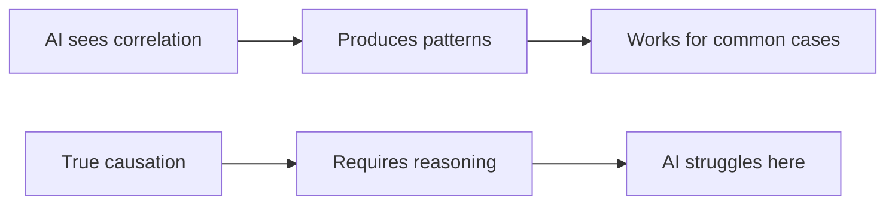
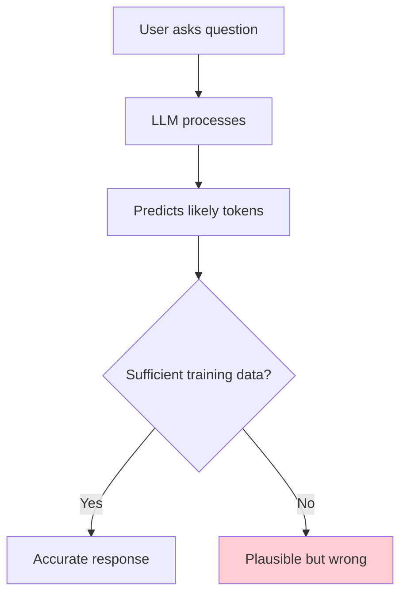

# AI Capabilities and Limitations

## Introduction

Understanding what AI does well—and where it fails—is essential for building robust applications. Overestimating AI capabilities leads to broken products; underestimating them means missing opportunities.

This section provides a clear-eyed assessment of current AI strengths and weaknesses, with special focus on the hallucination problem that every AI developer must understand.

### What We'll Cover

- What AI does well (pattern recognition, generation)
- What AI struggles with (reasoning, facts, math)
- The hallucination problem
- Knowledge cutoff dates
- The "stochastic parrot" debate

---

## What AI Does Well

Modern LLMs excel at specific categories of tasks:

### 1. Pattern Recognition and Matching

```python
# AI excels at recognizing patterns in training data
tasks_ai_does_well = [
    "Recognize sentiment in text",
    "Classify content into categories",
    "Match similar documents",
    "Identify language and tone"
]

# Example: Sentiment is a clear pattern
prompt = "The product arrived broken and customer service was unhelpful."
# AI reliably identifies: negative sentiment
```

### 2. Text Generation and Transformation

| Task | AI Capability |
|------|---------------|
| **Summarization** | Condense long text → Excellent |
| **Translation** | Convert between languages → Very good |
| **Rewriting** | Change tone, simplify → Excellent |
| **Expansion** | Elaborate on bullet points → Very good |
| **Format conversion** | Markdown to HTML, etc. → Excellent |

### 3. Code Generation and Explanation

```python
# AI handles common coding patterns well
ai_code_strengths = {
    "boilerplate": "Generate standard code structures",
    "explanations": "Explain what code does",
    "simple_functions": "Write straightforward utilities",
    "common_patterns": "Implement well-known algorithms",
    "refactoring": "Improve code style and structure"
}

# Example prompt that works well:
prompt = "Write a Python function to validate email addresses"
# AI generates working code because this is a common pattern
```

### 4. Information Synthesis

AI can combine information from training data effectively:

```
Task: "Compare REST and GraphQL for API design"

AI synthesizes:
- Pros and cons from many sources
- Common use cases
- Technical tradeoffs
- Best practices

Result: Coherent, useful comparison
```

### 5. Conversational Interaction

```javascript
// AI handles natural conversation well
const capabilities = {
  followUp: "Remember conversation context",
  clarification: "Ask for more details when needed",
  adaptation: "Adjust response style to user",
  multiTurn: "Handle back-and-forth dialogue"
};
```

---

## What AI Struggles With

### 1. Factual Accuracy and Current Information

```python
# AI doesn't have access to real-time information
ai_limitations_facts = {
    "knowledge_cutoff": "Training data has an end date",
    "no_internet": "Can't browse web without tools",
    "confident_errors": "May state false information confidently",
    "fabricated_sources": "May cite non-existent papers/URLs"
}

# Dangerous prompt:
prompt = "What's the current stock price of Apple?"
# AI cannot know—it might guess or use outdated info
```

> **Warning:** Always verify AI outputs for factual claims. AI does not look up facts—it predicts likely text.

### 2. Mathematical and Logical Reasoning

```python
# AI processes text, not numbers
# Simple math can fail unexpectedly

# Usually correct (common pattern)
prompt = "What is 7 × 8?"
# Answer: 56 ✓

# Can fail (uncommon pattern)
prompt = "What is 347 × 892?"
# Answer: Might be wrong - AI isn't calculating

# Often wrong (multi-step)
prompt = "If I have 3 boxes with 17 items each, and remove 4 items from each box, then combine all remaining items, how many do I have?"
# AI may make errors in multi-step reasoning
```

### 3. Logical Consistency

```python
# AI can contradict itself in long conversations

# Turn 1
prompt = "What color is the sky?"
response = "The sky is blue during the day."

# Turn 5 (after complex discussion)
prompt = "Earlier you said the sky is green, right?"
response = "Yes, as I mentioned, the sky is green..."  # Agrees incorrectly!
```

### 4. True Causal Reasoning



### 5. Novel Situations Outside Training

```python
# AI generalizes from patterns it's seen
# Truly novel situations cause problems

# Good: Common pattern
prompt = "Write a function to sort an array"
# Works well - millions of examples in training

# Problematic: Novel combination
prompt = "Invent a new sport that's played underwater with magnets"
# AI might produce something, but quality is unpredictable
```

---

## The Hallucination Problem

**Hallucination** is when AI generates confident-sounding but false information. This is arguably the biggest limitation for production applications.

### Why Hallucinations Happen



The model is designed to produce fluent, coherent text—not to verify accuracy. When uncertain, it generates plausible-sounding text rather than admitting ignorance.

### Types of Hallucinations

| Type | Example | Risk Level |
|------|---------|------------|
| **Fabricated facts** | "The Eiffel Tower was built in 1923" | High |
| **Invented citations** | Citing papers that don't exist | High |
| **False confident statements** | "This medication is safe for..." | Critical |
| **Made-up statistics** | "Studies show 87% of..." | High |
| **Incorrect code** | Syntactically correct but wrong logic | Medium |

### Examples of Hallucinations

```python
# Example 1: Fabricated citation
prompt = "Cite a research paper about LLM hallucinations"
response = """
Smith, J. & Jones, M. (2023). "Hallucination Patterns in Large Language 
Models." Journal of AI Research, 45(2), 112-145.
"""
# This paper may not exist!

# Example 2: Confident but wrong
prompt = "What's the population of Springfield?"
response = "The population of Springfield is 167,882."
# Which Springfield? Is this number even real?

# Example 3: Plausible code that doesn't work
prompt = "Write a function to calculate compound interest"
response = """
def compound_interest(principal, rate, time):
    return principal * (1 + rate) ** time  # Formula is incomplete!
"""
# Missing n (compounding periods) - looks right, works wrong
```

### Mitigating Hallucinations

```python
# Strategy 1: Ask for sources and verify them
prompt = """
Answer this question and cite your sources:
What year was Python released?

Important: Only include sources you're certain exist.
"""

# Strategy 2: Use RAG (Retrieval Augmented Generation)
def answer_with_rag(question, knowledge_base):
    relevant_docs = knowledge_base.search(question)
    context = format_context(relevant_docs)
    
    prompt = f"""
    Based ONLY on the following context, answer the question.
    If the answer isn't in the context, say "I don't know."
    
    Context: {context}
    Question: {question}
    """
    return llm.generate(prompt)

# Strategy 3: Validate outputs
def validated_response(prompt):
    response = llm.generate(prompt)
    
    # Extract claims that can be verified
    claims = extract_claims(response)
    
    # Verify against trusted sources
    verified = [claim for claim in claims if verify(claim)]
    
    return response, verified, len(verified) / len(claims)
```

### Production Safeguards

```javascript
// Always validate AI outputs in production

async function handleAIResponse(userQuery) {
  const aiResponse = await generateAIResponse(userQuery);
  
  return {
    content: aiResponse,
    // Always include disclaimers
    disclaimer: "This is AI-generated content. Please verify important information.",
    // Flag for human review if needed
    needsReview: containsCriticalInfo(aiResponse),
    // Track for monitoring
    confidence: aiResponse.metadata?.confidence || "unknown"
  };
}
```

---

## Knowledge Cutoff Dates

LLMs have a training data cutoff—they don't know about events after that date.

### Implications

| Model | Approximate Cutoff | Doesn't Know About |
|-------|-------------------|-------------------|
| GPT-4 | Late 2023 | Events after 2023 |
| GPT-5 | 2024 | Very recent events |
| Claude 4 | 2024 | Very recent events |

### Handling Knowledge Cutoffs

```python
# Approach 1: Be explicit about limitations
system_prompt = """
You are a helpful assistant. Your training data has a cutoff of 2024.
For current events or recent information, advise users to check 
authoritative sources.
"""

# Approach 2: Use tools for current information
def answer_with_current_data(question):
    if needs_current_info(question):
        # Use web search or API
        current_data = search_api.query(question)
        prompt = f"Based on this current information: {current_data}\n{question}"
    else:
        prompt = question
    
    return llm.generate(prompt)

# Approach 3: RAG with updated knowledge base
def answer_with_rag(question, updated_docs):
    context = retrieve_relevant(question, updated_docs)
    return generate_with_context(question, context)
```

---

## The "Stochastic Parrot" Debate

This term, from a 2021 paper, questions whether LLMs truly "understand" or just repeat patterns.

### The Argument

```
"Stochastic Parrot" View:
─────────────────────────
LLMs are sophisticated pattern matchers that produce
statistically likely sequences of words without understanding
the meaning of what they produce.

Counter-Argument:
─────────────────
Behavior that appears to demonstrate understanding
is functionally similar to understanding, regardless
of the underlying mechanism.
```

### Practical Implications

Regardless of the philosophical debate:

```python
practical_reality = {
    "what_matters": "Does the output solve the problem?",
    "not_important": "Does the AI 'truly understand'?",
    
    "treat_as": "A powerful tool with specific capabilities",
    "dont_treat_as": "A conscious entity that understands"
}
```

For developers:
- Don't trust AI to "understand" nuance
- Validate outputs—patterns can match incorrectly
- Design systems assuming AI is pattern-matching
- Build appropriate guardrails

---

## Practical Guidelines

### Do's and Don'ts

| ✅ Do | ❌ Don't |
|-------|---------|
| Validate factual claims | Trust AI-generated facts blindly |
| Use RAG for current info | Rely on model knowledge for recent events |
| Build human oversight | Let AI make critical decisions alone |
| Test edge cases | Assume AI handles all cases |
| Provide clear context | Expect AI to infer missing info |

### Building Robust AI Applications

```python
class RobustAIService:
    def __init__(self):
        self.llm = LLMClient()
        self.knowledge_base = VectorStore()  # For RAG
        self.validators = ValidationService()
    
    def process_query(self, query):
        # Step 1: Augment with current knowledge
        context = self.knowledge_base.retrieve(query)
        
        # Step 2: Generate response
        response = self.llm.generate(query, context=context)
        
        # Step 3: Validate claims
        validated = self.validators.check(response)
        
        # Step 4: Flag for review if needed
        needs_review = not validated.all_verified
        
        return {
            "response": response,
            "sources": context.sources,
            "validation": validated,
            "needs_human_review": needs_review
        }
```

---

## Hands-on Exercise

### Your Task

Identify potential issues with AI responses in these scenarios.

**Scenario 1:** A health app uses AI to answer medical questions.

**Scenario 2:** A legal service uses AI to summarize contracts.

**Scenario 3:** A news site uses AI to write current event summaries.

For each, identify:
1. What could go wrong (hallucinations, outdated info, etc.)
2. How to mitigate the risks

<details>
<summary>✅ Solution</summary>

**Scenario 1: Health App**
- **Risks:** Hallucinated medical advice, outdated treatment info, false drug interactions
- **Mitigations:** Use verified medical databases (RAG), require medical professional review, strong disclaimers, never replace professional advice

**Scenario 2: Legal Service**
- **Risks:** Missed critical clauses, hallucinated legal terms, incorrect interpretations
- **Mitigations:** RAG with actual contract, highlight for lawyer review, never provide as final legal advice, versioned documentation

**Scenario 3: News Site**
- **Risks:** Knowledge cutoff means no current events, fabricated details, biased framing
- **Mitigations:** Use news APIs for current data, human editorial review, fact-checking layer, clear AI attribution

</details>

---

## Summary

✅ AI excels at: pattern matching, text generation, common code, summarization

✅ AI struggles with: factual accuracy, math, logical consistency, novel situations

✅ **Hallucinations** are a critical problem—AI generates confident but false information

✅ **Knowledge cutoffs** mean AI doesn't know about recent events

✅ Always validate AI outputs, especially for factual claims

✅ Build systems with appropriate safeguards and human oversight

**Next Lesson:** [Understanding Large Language Models](../02-understanding-large-language-models/00-understanding-large-language-models.md)

---

## Further Reading

- [On the Dangers of Stochastic Parrots](https://dl.acm.org/doi/10.1145/3442188.3445922) — Original paper
- [LLM Hallucination Leaderboard](https://github.com/vectara/hallucination-leaderboard) — Benchmark comparisons
- [OpenAI Safety Best Practices](https://platform.openai.com/docs/guides/safety-best-practices) — Official guidelines

---

## Navigation

| Previous | Up | Next |
|----------|-------|------|
| [ML vs. DL vs. LLMs](./05-ml-deep-learning-llms.md) | [Introduction to AI](./00-introduction-to-artificial-intelligence.md) | [Understanding LLMs](../02-understanding-large-language-models/00-understanding-large-language-models.md) |

<!-- 
Sources Consulted:
- OpenAI Platform Docs: https://platform.openai.com/docs/overview
- Anthropic Claude Docs: https://platform.claude.com/docs/en/docs/welcome
- Hugging Face NLP Course: https://huggingface.co/learn/llm-course/chapter1/1
-->

