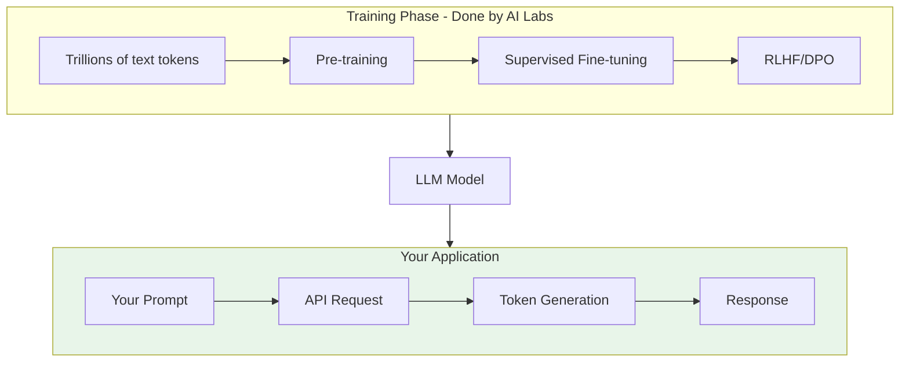

# Understanding Large Language Models

## Overview

Large Language Models (LLMs) are the foundation of modern AI applications. Before integrating them into your projects, you need to understand how they work—not at a PhD level, but enough to make informed decisions about architecture, prompting, and limitations.

This lesson demystifies LLMs for developers, explaining the key concepts behind models like GPT-5, Claude 4, and Gemini 2.5 without requiring machine learning expertise.

## What You'll Learn

This lesson covers six essential topics:

1. **[What Are LLMs?](./01-what-are-llms.md)** — Neural networks, statistical prediction, and the scale factor
2. **[The Training Process](./02-training-process.md)** — Pre-training, fine-tuning, RLHF, and model distillation
3. **[Transformer Architecture](./03-transformer-architecture.md)** — Attention mechanisms, encoder vs. decoder, and why it matters
4. **[Text Generation](./04-text-generation.md)** — How LLMs generate text one token at a time
5. **[Emergent Capabilities](./05-emergent-capabilities.md)** — Chain-of-thought, few-shot learning, and unexpected abilities
6. **[Limitations](./06-limitations.md)** — Hallucinations, knowledge cutoffs, and reasoning errors

## Prerequisites

Before starting this lesson, you should have:

- Completed [Introduction to Artificial Intelligence](../01-introduction-to-artificial-intelligence/00-introduction-to-artificial-intelligence.md)
- Basic understanding of what AI is and isn't
- No machine learning or neural network knowledge required

## Why Understanding LLMs Matters

As a developer integrating AI, knowing how LLMs work helps you:

| Benefit | Application |
|---------|-------------|
| **Write better prompts** | Understand why certain prompt patterns work |
| **Debug unexpected outputs** | Explain why models behave certain ways |
| **Choose appropriate models** | Match model characteristics to use cases |
| **Set realistic expectations** | Know what LLMs can and cannot do |
| **Architect robust systems** | Design around LLM limitations |

## Conceptual Model

Here's how LLMs fit into the AI ecosystem:



> **🤖 AI Context:** You don't need to train models—that's done by OpenAI, Anthropic, Google, etc. Your job is to use the trained models effectively through their APIs.

## Key Terminology

| Term | Definition |
|------|------------|
| **LLM** | Large Language Model — AI trained on text to understand/generate language |
| **Parameters** | Learned values (billions) that encode the model's knowledge |
| **Tokens** | Pieces of text the model processes (roughly 4 chars in English) |
| **Inference** | Using a trained model to generate outputs |
| **Training** | Teaching the model from data (done by AI labs) |
| **Fine-tuning** | Adapting a trained model for specific tasks |
| **RLHF** | Reinforcement Learning from Human Feedback |

## Learning Path

Complete topics in order:

```
01-what-are-llms.md
    ↓
02-training-process.md
    ↓
03-transformer-architecture.md
    ↓
04-text-generation.md
    ↓
05-emergent-capabilities.md
    ↓
06-limitations.md
```

Each topic builds on previous concepts for the best learning experience.

---

## Summary

This lesson provides the conceptual foundation for understanding how Large Language Models work. You'll learn about neural networks at a high level, the training process that creates intelligent models, the Transformer architecture that powers them, and both the emergent capabilities and limitations that affect your applications.

**Next:** [What Are LLMs?](./01-what-are-llms.md)

---

## Navigation

| Previous | Up | Next |
|----------|-------|------|
| [Introduction to AI](../01-introduction-to-artificial-intelligence/00-introduction-to-artificial-intelligence.md) | [AI/LLM Fundamentals](../00-overview.md) | [What Are LLMs?](./01-what-are-llms.md) |

