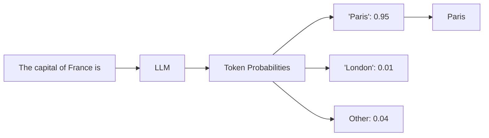
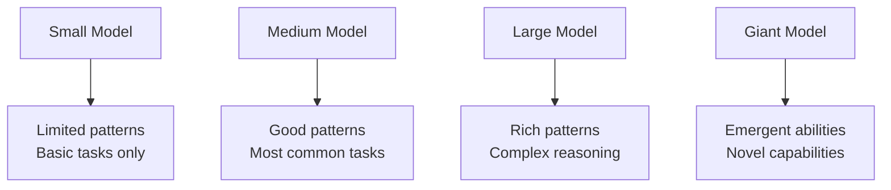

# What Are LLMs and How Do They Work?

## Introduction

Large Language Models are the technology behind ChatGPT, Claude, Gemini, and most AI applications you'll build. Despite their impressive capabilities, the core concept is surprisingly straightforward: LLMs are pattern-matching systems trained on massive amounts of text.

This section explains what LLMs actually are and provides the mental model you need to work with them effectively.

### What We'll Cover

- Neural networks trained on massive text data
- Statistical prediction of next words
- Pattern learning from training data
- The role of scale (parameters and data)
- Why LLMs don't truly "understand"

---

## Neural Networks Trained on Massive Text Data

An LLM is a neural network—a mathematical model loosely inspired by the brain—trained on enormous quantities of text.

### The Scale of Training Data

```
Training Data Scale (approximate):

GPT-3:   ~500 billion tokens
GPT-4:   ~10+ trillion tokens
GPT-5:   Even more

1 trillion tokens ≈ 750 billion words
             ≈ 7.5 million books
             ≈ Significant portion of the internet
```

### What's in the Training Data?

| Source | Examples |
|--------|----------|
| Web pages | Wikipedia, news, blogs, forums |
| Books | Fiction, non-fiction, textbooks |
| Code | GitHub repositories, documentation |
| Conversations | Forums, Q&A sites, chat logs |
| Scientific papers | Academic publications |

```python
# Conceptual training data structure
training_data = {
    "web_pages": "hundreds_of_billions_of_tokens",
    "books": "tens_of_billions_of_tokens",
    "code": "billions_of_tokens",
    "conversations": "billions_of_tokens",
    # ... more sources
}
```

### What the Neural Network Learns

Through training, the network learns:

1. **Language structure** — Grammar, syntax, common phrases
2. **World knowledge** — Facts, relationships, concepts
3. **Task patterns** — How to answer questions, write code, etc.
4. **Style variations** — Formal vs. casual, different domains

---

## Statistical Prediction of Next Words

At its core, an LLM is a next-token predictor. Given some text, it predicts what should come next.

### The Prediction Process



### How Probability Works

```python
# Conceptual: What the model actually computes
def predict_next_token(input_text):
    """
    For every possible token in vocabulary (~100,000 tokens),
    compute probability of it being the next token.
    """
    # Process input through neural network
    hidden_state = encode_input(input_text)
    
    # Compute probabilities for all possible next tokens
    probabilities = softmax(linear_layer(hidden_state))
    
    # Return distribution over all tokens
    return {
        "Paris": 0.95,
        "London": 0.01,
        "Berlin": 0.008,
        # ... ~100,000 more tokens
    }

# Example
input_text = "The capital of France is"
probs = predict_next_token(input_text)
# Most likely: "Paris" (95% probability)
```

### Generating Complete Responses

To generate a full response, the model predicts one token at a time:

```
Step 1: "The capital of France is" → predicts "Paris"
Step 2: "The capital of France is Paris" → predicts "."
Step 3: "The capital of France is Paris." → predicts "It"
Step 4: "The capital of France is Paris. It" → predicts "is"
...continues until done
```

Each new token becomes part of the input for predicting the next token.

---

## Pattern Learning from Training Data

LLMs learn by finding patterns in the training data. They don't store facts—they learn statistical associations.

### Pattern Recognition Example

```python
# During training, the model sees patterns like:
training_examples = [
    "Paris is the capital of France",
    "The capital of France is Paris",
    "France's capital, Paris, is...",
    "When visiting France, start in the capital: Paris",
    # ... millions more examples
]

# The model learns: "France" + "capital" → strongly associated with "Paris"
# This is pattern recognition, not factual memory
```

### What Patterns Enable

| Pattern Learned | Enables |
|----------------|---------|
| Question → Answer format | Question answering |
| Code + comment patterns | Code generation |
| Language A → Language B | Translation |
| Long text → short summary | Summarization |
| Prompt → continuation | General text generation |

### Pattern Matching Limitations

```python
# Patterns work when training data is sufficient
common_pattern = "What is 2 + 2?"  # Seen millions of times → "4"

# Patterns fail for rare cases
rare_pattern = "What is 8,347 × 9,182?"  # Not memorized → may be wrong

# Patterns can mislead
misleading = "If you're reading this in 2024, what year is it?"
# Model might follow "reading this in 2024" pattern and say "2024"
# Even if the actual year is different
```

---

## Scale as a Key Factor

What makes modern LLMs powerful is scale—more parameters and more training data.

### Parameters: The Model's Capacity

**Parameters** are the learned values in the neural network:

```
Model Size Comparison:

Small model:     ~100 million parameters
Medium model:    ~7 billion parameters
Large model:     ~70 billion parameters
GPT-4 class:     ~1 trillion+ parameters

More parameters = more capacity to learn patterns
```

### Scaling Laws

Research shows predictable improvements with scale:

```
Performance = f(Parameters, Data, Compute)

As you increase each by 10x:
- Parameters 10x → Significant improvement
- Training data 10x → Significant improvement
- Compute 10x → Significant improvement
```

### Why Scale Matters



### Trade-offs of Scale

| Larger Models | Trade-off |
|--------------|-----------|
| More capable | Higher API costs |
| Better at complex tasks | Slower inference |
| Fewer errors | More compute required |
| Better reasoning | Not always necessary |

---

## No True Understanding: Pattern Matching

A crucial concept: LLMs don't "understand" in the human sense. They match patterns.

### The Difference

```python
# Human understanding:
# - Knows WHY Paris is France's capital (history, government)
# - Can reason about implications
# - Has a model of the world

# LLM "understanding":
# - Learned pattern: France + capital → Paris
# - Can generate text about Paris convincingly
# - No actual knowledge of geography or politics
```

### Chinese Room Argument (Simplified)

Imagine a person in a room with a rulebook for responding to Chinese characters. They can produce perfect Chinese responses without understanding Chinese.

```
LLMs are similar:
Input → Apply learned patterns → Output

The patterns are sophisticated, but there's no "understanding" inside.
```

### Practical Implications

| Because LLMs are pattern matchers... | You should... |
|-------------------------------------|---------------|
| They can be confidently wrong | Always validate critical outputs |
| They don't "know" facts | Use RAG for current/specific info |
| They lack world models | Don't trust physical reasoning |
| They can't verify themselves | Implement external verification |

### What This Means for Development

```javascript
// Wrong approach: Trust AI as source of truth
const answer = await ai.ask("What's the current price of Bitcoin?");
displayAsFactual(answer); // Dangerous!

// Right approach: AI assists, system verifies
const aiSuggestion = await ai.ask("Analyze this data pattern");
const verified = await verifyWithActualData(aiSuggestion);
displayWithContext(verified, { isAiGenerated: true });
```

---

## How This Helps You as a Developer

Understanding LLM fundamentals enables better:

### Prompt Engineering

```python
# Understanding: LLMs predict likely continuations
# So structure prompts to make the desired output likely

# Less effective (vague continuation)
prompt = "Tell me about Python"

# More effective (specific pattern to match)
prompt = """
You are a Python expert. Explain the following concept:
Concept: List comprehensions
Audience: Beginner programmer
Format: Definition, syntax, 3 examples

Explanation:
"""
# The structured prompt creates a clear pattern to follow
```

### Error Diagnosis

```python
# LLM gives wrong answer. Why?

# Possibility 1: Rare pattern in training data
# → The topic wasn't well-represented

# Possibility 2: Conflicting patterns
# → Multiple valid continuations, chose wrong one

# Possibility 3: Context too complex
# → Couldn't track all information

# Knowing this helps you adjust approach
```

### Architecture Decisions

```python
# Because LLMs are pattern matchers with limitations:

architecture_decisions = {
    "factual_queries": "Use RAG, not raw LLM",
    "math_operations": "Use code execution, not LLM math",
    "critical_decisions": "Include human review",
    "current_data": "Integrate real-time APIs"
}
```

---

## Hands-on Exercise

### Your Task

Test your understanding of LLM pattern matching.

1. Go to [Claude](https://claude.ai) or [ChatGPT](https://chatgpt.com)
2. Try these experiments:

```
Experiment 1 (Common pattern):
"What is the capital of France?"
Expected: Correct, confident

Experiment 2 (Uncommon pattern):
"What is the capital of the fictional country Genovia?"
Expected: May make up an answer or recognize it's from a movie

Experiment 3 (Pattern interference):
"John is older than Mary. Mary is older than Bob. Is John older than Bob?"
Expected: Usually correct (common logic pattern)

Then try:
"In a room, Alice is taller than Beth. Carla is shorter than Beth. 
Diana is taller than Alice. Eve is shorter than Carla.
Who is the second shortest?"
Expected: May struggle with multi-step reasoning
```

### Questions to Consider

- Why were some answers more reliable than others?
- How does training data frequency affect accuracy?
- What strategies might help with difficult reasoning?

---

## Summary

✅ LLMs are neural networks trained on massive amounts of text

✅ They work by predicting the most likely next token

✅ Knowledge comes from patterns learned during training, not stored facts

✅ Scale (parameters + data + compute) drives capability

✅ LLMs don't truly "understand" — they match patterns

✅ This understanding helps you design better AI applications

**Next:** [The Training Process](./02-training-process.md)

---

## Further Reading

- [Scaling Laws for Neural Language Models](https://arxiv.org/abs/2001.08361) — Research on scale
- [On the Opportunities and Risks of Foundation Models](https://arxiv.org/abs/2108.07258) — Stanford overview
- [GPT-4 Technical Report](https://arxiv.org/abs/2303.08774) — OpenAI's documentation

---

## Navigation

| Previous | Up | Next |
|----------|-------|------|
| [Lesson Overview](./00-understanding-large-language-models.md) | [Understanding LLMs](./00-understanding-large-language-models.md) | [Training Process](./02-training-process.md) |

