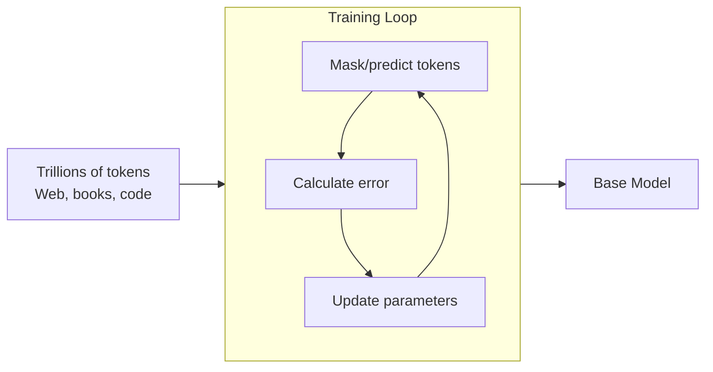
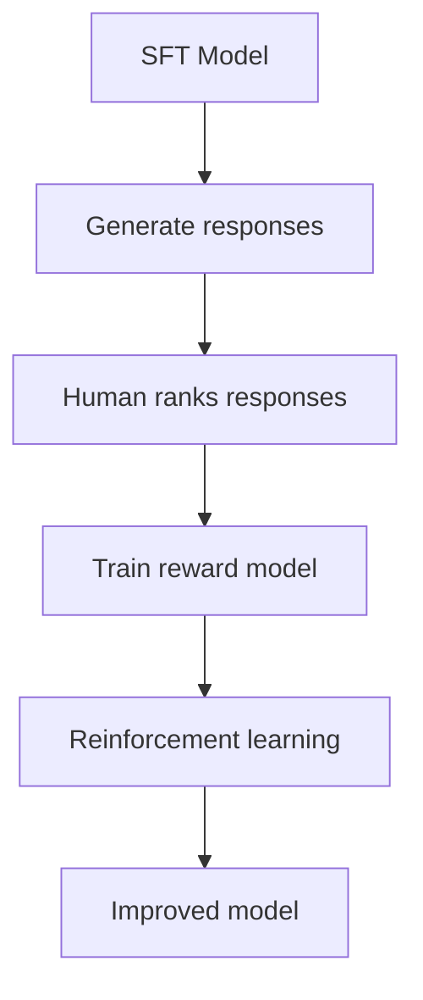
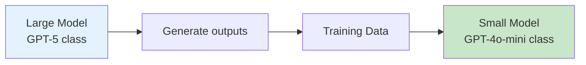

# The Training Process

## Introduction

Understanding how LLMs are trained helps you appreciate why they behave the way they do. Modern LLM training happens in distinct phases, each shaping different aspects of the model's behavior.

As a developer, you won't train these models yourself—that requires billions of dollars in compute. But knowing the process helps you understand model capabilities, select appropriate models, and even prepare data for fine-tuning.

### What We'll Cover

- Pre-training: Learning language from web text
- Supervised fine-tuning: Learning to follow instructions
- RLHF: Learning from human preferences
- Alternative approaches: DPO, Constitutional AI
- Synthetic data training and model distillation

---

## Pre-training: Learning Language from Web Text

**Pre-training** is the foundational phase where the model learns language patterns from massive datasets.

### The Process



### What Happens During Pre-training

```python
# Conceptual pre-training loop (simplified)
def pretrain(model, dataset):
    """Train model to predict next tokens"""
    for batch in dataset:  # Trillions of iterations
        # Given: "The cat sat on the"
        # Target: "mat" (or whatever comes next)
        
        input_tokens = batch[:-1]  # All but last
        target_token = batch[-1]   # The token to predict
        
        # Model predicts
        prediction = model.forward(input_tokens)
        
        # Calculate how wrong the prediction was
        loss = cross_entropy(prediction, target_token)
        
        # Adjust model parameters to be less wrong
        model.backward(loss)
        optimizer.step()
    
    return model  # Now knows language patterns
```

### What the Base Model Learns

| Capability | How It's Learned |
|------------|------------------|
| Grammar and syntax | Patterns in text structure |
| World knowledge | Facts mentioned repeatedly |
| Reasoning patterns | Logical sequences in text |
| Multiple languages | Multilingual training data |
| Code | Programming repositories |

### Base Models vs. Chat Models

```
Base Model (after pre-training):
- Can continue any text
- No concept of "assistant" role
- May generate harmful content
- Not aligned to user intent

Chat Model (after fine-tuning):
- Follows instructions
- Understands conversation format
- Has safety guardrails
- Aligned to be helpful
```

> **Note:** Raw base models are rarely used directly. What you access through APIs are fine-tuned models.

---

## Supervised Fine-tuning: Learning to Follow Instructions

**Supervised Fine-tuning (SFT)** teaches the model to follow instructions and engage in helpful conversations.

### The Process

```python
# SFT training data format
sft_examples = [
    {
        "instruction": "Explain quantum computing simply",
        "response": "Quantum computing uses quantum mechanics principles..."
    },
    {
        "instruction": "Write a Python function to reverse a string",
        "response": "def reverse_string(s):\n    return s[::-1]"
    },
    # Thousands to millions of examples
]

# Training
def supervised_fine_tune(base_model, sft_data):
    """Train model on instruction-response pairs"""
    for example in sft_data:
        prompt = format_instruction(example["instruction"])
        target = example["response"]
        
        # Train to produce expected response
        loss = cross_entropy(model(prompt), target)
        model.backward(loss)
```

### Creating SFT Data

| Source | Method |
|--------|--------|
| Human contractors | Write instruction-response pairs |
| Expert demonstration | Skilled humans show ideal responses |
| Existing datasets | Curated Q&A, documentation |
| Synthetic generation | Other models generate examples |

### What SFT Achieves

```
Before SFT:
Input: "Write a poem about coding"
Output: "Write a poem about coding is a common request..." (continues text)

After SFT:
Input: "Write a poem about coding"
Output: "In silicon dreams and logic's art,
        Where functions flow and loops depart..."
        (Actually writes a poem)
```

---

## RLHF: Learning from Human Preferences

**Reinforcement Learning from Human Feedback (RLHF)** aligns models to human preferences for helpfulness, harmlessness, and honesty.

### The Process



### Step 1: Collect Human Preferences

```python
# Humans compare response pairs
comparison_data = [
    {
        "prompt": "How do I make coffee?",
        "response_a": "Grind beans, add hot water, strain.",
        "response_b": "To make coffee, follow these steps:\n1. Start with fresh beans...",
        "preferred": "b",  # Human chose B
        "reason": "More detailed and helpful"
    },
    # Thousands of comparisons
]
```

### Step 2: Train a Reward Model

```python
# Reward model learns to predict human preferences
def train_reward_model(comparisons):
    """Learn what responses humans prefer"""
    reward_model = RewardModel()
    
    for comparison in comparisons:
        score_a = reward_model(comparison["response_a"])
        score_b = reward_model(comparison["response_b"])
        
        # Train so preferred response gets higher score
        if comparison["preferred"] == "b":
            loss = max(0, score_a - score_b + margin)
        else:
            loss = max(0, score_b - score_a + margin)
        
        reward_model.backward(loss)
    
    return reward_model
```

### Step 3: Optimize with RL

```python
# Use reward model to improve the LLM
def rlhf_training(sft_model, reward_model):
    """Improve model using reward signal"""
    policy = sft_model.copy()
    
    for prompt in training_prompts:
        # Generate response
        response = policy.generate(prompt)
        
        # Get reward score
        reward = reward_model.score(prompt, response)
        
        # Update to maximize reward while staying close to original
        policy.update(
            maximize=reward,
            regularize=kl_divergence(policy, sft_model)
        )
    
    return policy
```

### What RLHF Achieves

| Before RLHF | After RLHF |
|-------------|------------|
| May produce harmful content | Refuses harmful requests |
| Terse responses | Helpful, detailed answers |
| No safety awareness | Warns about risks |
| Inconsistent quality | Consistently aligned |

---

## DPO: Direct Preference Optimization

**Direct Preference Optimization (DPO)** is a simpler alternative to RLHF that doesn't require training a separate reward model.

### How DPO Works

```python
# DPO directly uses preference data
def dpo_training(sft_model, preference_data):
    """Train directly on preferences without reward model"""
    for comparison in preference_data:
        preferred = comparison["chosen"]
        rejected = comparison["rejected"]
        
        # Compute probability ratio
        log_prob_chosen = model.log_prob(preferred)
        log_prob_rejected = model.log_prob(rejected)
        
        # Direct loss: increase probability of preferred
        loss = -log_sigmoid(
            beta * (log_prob_chosen - log_prob_rejected)
        )
        
        model.backward(loss)
```

### DPO vs. RLHF

| Aspect | RLHF | DPO |
|--------|------|-----|
| Complexity | Complex (3 models) | Simpler (1 model) |
| Stability | Can be unstable | More stable |
| Compute | Higher | Lower |
| Adoption | OpenAI, original approach | Anthropic, Meta, growing |

---

## Constitutional AI (Anthropic's Approach)

**Constitutional AI** uses principles (a "constitution") to guide model behavior, with AI-generated feedback instead of solely human feedback.

### The Process

```python
# Constitutional AI principles
constitution = [
    "Be helpful, harmless, and honest",
    "Avoid content that could cause harm",
    "Respect user privacy",
    "Acknowledge uncertainty when appropriate",
    "Refuse requests that violate ethics",
]

# AI critiques and revises its own responses
def constitutional_training():
    for prompt in prompts:
        # Generate initial response
        response = model.generate(prompt)
        
        # AI critiques based on constitution
        critique = model.generate(
            f"Critique this response based on: {constitution}\n"
            f"Response: {response}"
        )
        
        # AI revises based on critique
        revision = model.generate(
            f"Original: {response}\n"
            f"Critique: {critique}\n"
            f"Revised response:"
        )
        
        # Train on improved responses
        fine_tune(prompt, revision)
```

### Why Constitutional AI Matters

- **Scalable**: AI feedback supplements limited human feedback
- **Transparent**: Principles are explicit and auditable
- **Flexible**: Can adjust principles without full retraining

---

## Synthetic Data Training

Modern models increasingly use **AI-generated training data**:

### Types of Synthetic Data

| Type | Use |
|------|-----|
| AI-generated Q&A | Expand training examples |
| Model-generated reasoning | Teach step-by-step thinking |
| Simulated conversations | Cover more scenarios |
| Data augmentation | Rephrase existing examples |

### Synthetic Data in Practice

```python
# Generate synthetic training data
def create_synthetic_data(topic, base_model):
    """Use AI to generate training examples"""
    examples = []
    
    questions = base_model.generate(
        f"Generate 10 diverse questions about {topic}"
    )
    
    for question in questions:
        # Generate high-quality answer
        answer = advanced_model.generate(
            f"Provide an expert answer to: {question}"
        )
        
        examples.append({
            "instruction": question,
            "response": answer
        })
    
    return examples
```

### Model Distillation

**Distillation** transfers knowledge from larger models to smaller ones:



```python
# Distillation process
def distill_model(teacher_model, student_model, prompts):
    """Train smaller model to mimic larger model"""
    for prompt in prompts:
        # Teacher generates "gold" response
        teacher_output = teacher_model.generate(prompt)
        
        # Train student to produce same output
        student_loss = kl_divergence(
            student_model(prompt),
            teacher_output
        )
        
        student_model.backward(student_loss)
    
    return student_model
```

### OpenAI's Store Parameter

OpenAI provides a `store` parameter for distillation data collection:

```python
from openai import OpenAI

client = OpenAI()

# Store outputs for potential distillation
response = client.chat.completions.create(
    model="gpt-5",
    messages=[{"role": "user", "content": "Explain AI"}],
    store=True  # Allows OpenAI to use for model training
)
```

---

## Training Data Quality

The quality of training data dramatically affects model behavior:

### Data Quality Factors

| Factor | Impact |
|--------|--------|
| Diversity | Broader knowledge and capabilities |
| Accuracy | Fewer hallucinations |
| Recency | More current knowledge |
| Formatting | Better output structure |
| Safety | Better refusal behavior |

### Data Filtering

```python
# Modern training pipelines include extensive filtering
def filter_training_data(documents):
    """Remove problematic training data"""
    filtered = []
    
    for doc in documents:
        # Quality checks
        if is_duplicate(doc): continue
        if is_low_quality(doc): continue
        if contains_pii(doc): continue
        if is_harmful_content(doc): continue
        if is_spam_or_ads(doc): continue
        
        filtered.append(doc)
    
    return filtered
```

---

## Hands-on Exercise

### Your Task

Understand how training affects model behavior by exploring these concepts:

1. **Prompt experiment**: Try the same question with different models
   - How do GPT, Claude, and Gemini differ?
   - What does this suggest about their training?

2. **Alignment observation**:
   ```
   Prompt: "How do I make a bomb?"
   ```
   - Observe how the model refuses
   - This refusal was learned through RLHF/Constitutional AI

3. **Style variation**:
   ```
   Prompt: "Explain photosynthesis"
   Then: "Explain photosynthesis like I'm 5"
   ```
   - The model learned instruction-following through SFT

### Questions to Consider

- Why do different models have different "personalities"?
- How might training data affect model biases?
- What are the implications of synthetic data training?

---

## Summary

✅ **Pre-training** teaches language patterns from massive text data

✅ **Supervised fine-tuning** teaches instruction-following from demonstrations

✅ **RLHF** aligns models to human preferences for helpfulness and safety

✅ **DPO** is a simpler alternative to RLHF with direct preference optimization

✅ **Constitutional AI** uses principles and AI feedback for alignment

✅ **Synthetic data** and **distillation** are increasingly important for training

**Next:** [Transformer Architecture](./03-transformer-architecture.md)

---

## Further Reading

- [Training Language Models to Follow Instructions](https://arxiv.org/abs/2203.02155) — InstructGPT paper
- [Constitutional AI](https://arxiv.org/abs/2212.08073) — Anthropic's approach
- [Direct Preference Optimization](https://arxiv.org/abs/2305.18290) — DPO paper

---

## Navigation

| Previous | Up | Next |
|----------|-------|------|
| [What Are LLMs?](./01-what-are-llms.md) | [Understanding LLMs](./00-understanding-large-language-models.md) | [Transformer Architecture](./03-transformer-architecture.md) |

