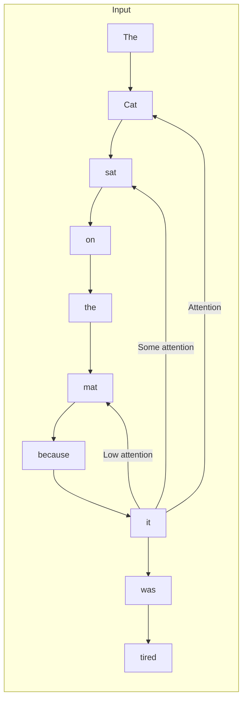
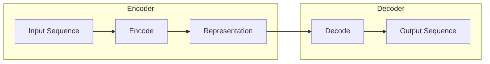
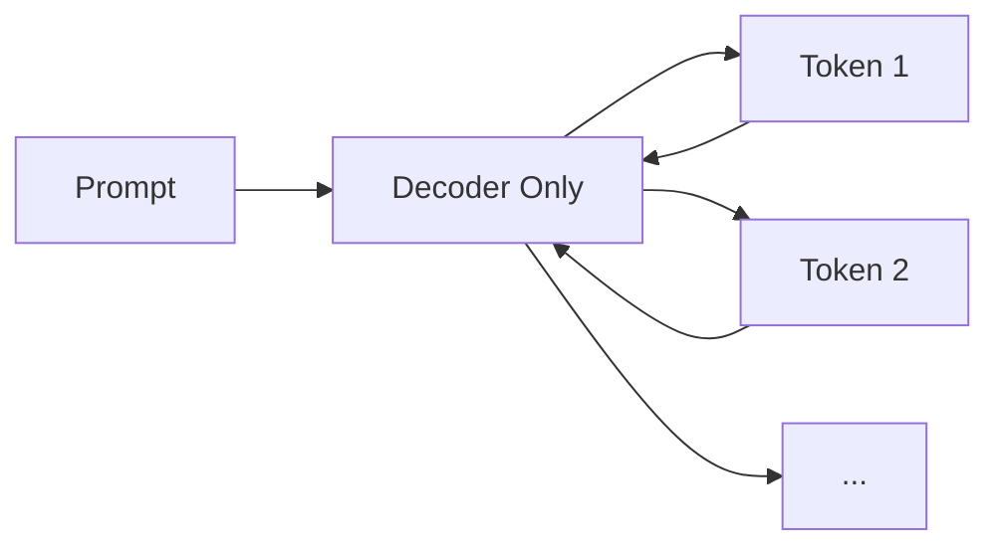
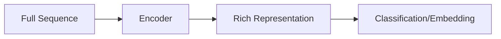
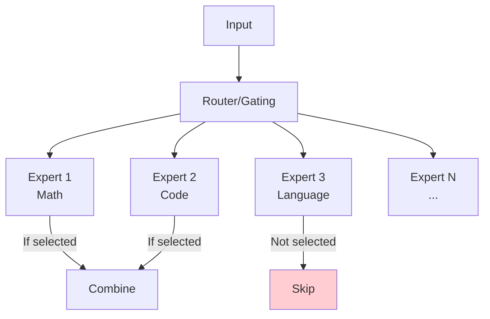
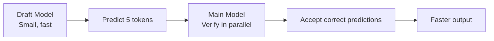

# Transformer Architecture

## Introduction

The Transformer is the neural network architecture that powers all modern LLMs. Introduced in the 2017 paper "Attention Is All You Need," it revolutionized AI by enabling efficient processing of sequences—particularly text.

You don't need to understand every mathematical detail, but grasping the core concepts helps you understand why LLMs behave the way they do.

### What We'll Cover

- The attention mechanism intuition
- Self-attention and context processing
- Encoder-decoder vs. decoder-only models
- Mixture of Experts (MoE) architecture
- Quantization and efficiency concepts

---

## The Attention Mechanism

**Attention** is the key innovation of Transformers. It allows the model to focus on relevant parts of the input when producing each output.

### Intuition: Human Reading

When you read "The cat sat on the mat because it was tired," you automatically connect "it" to "cat." Your attention focuses on the relevant context.

Transformers do this computationally:



### How Attention Works (Conceptual)

```python
# Simplified attention mechanism
def attention(query, keys, values):
    """
    Query: What are we looking for?
    Keys: What information is available?
    Values: The actual content to retrieve
    
    Returns: Weighted combination of values
    """
    # How relevant is each key to our query?
    scores = dot_product(query, keys)
    
    # Convert to probabilities (weights)
    weights = softmax(scores)
    
    # Weighted sum of values
    output = sum(weights * values)
    
    return output

# Example: Processing "it" in "The cat sat... it"
query = embedding("it")  # What does "it" refer to?
keys = [embedding(word) for word in ["The", "cat", "sat", ...]]
values = keys  # In self-attention, keys = values

# Attention finds "cat" is most relevant to "it"
```

### Self-Attention

In **self-attention**, a sequence attends to itself—each word can look at all other words:

```
"The cat sat on the mat"

Processing "sat":
- Looks at "The" → Low relevance
- Looks at "cat" → High relevance (subject)
- Looks at itself "sat" → Some relevance
- Looks at "on" → Moderate relevance
- Looks at "the" → Low relevance
- Looks at "mat" → Moderate relevance (destination)
```

### Multi-Head Attention

Transformers use multiple attention "heads" that look for different patterns:

```python
# Multiple attention heads capture different relationships
attention_heads = {
    "head_1": "Subject-verb relationships",
    "head_2": "Adjective-noun connections",
    "head_3": "Pronoun references",
    "head_4": "Long-distance dependencies",
    # ... many more heads
}

# Combined output integrates all perspectives
output = combine(head_1_output, head_2_output, ...)
```

---

## Self-Attention and Context Processing

Self-attention is what allows LLMs to process context effectively.

### Parallel Processing Advantage

Before Transformers, models like RNNs processed text sequentially:

```
RNN (Sequential):
"The" → process → "cat" → process → "sat" → process → ...
     Step 1        Step 2        Step 3

Transformer (Parallel):
"The cat sat on the mat"
   ↓   ↓   ↓  ↓   ↓   ↓
 Process all at once (GPU parallelism)
```

This parallelism enables:
- **Faster training** — Process entire sequences simultaneously
- **Better context** — All words see all other words
- **Scalability** — Efficiently use modern GPUs

### Context Window = Attention Span

The **context window** is how many tokens the model can attend to:

```python
# Context window determines what the model can "see"
context_window_sizes = {
    "GPT-3": 4096,      # ~3000 words
    "GPT-4": 128000,    # ~96000 words
    "Claude 3": 200000, # ~150000 words
    "Gemini 1.5": 1000000  # ~750000 words
}

# Larger context = can process more but costs more
```

### Positional Information

Since attention processes all tokens simultaneously, position must be encoded explicitly:

```python
# Tokens need position information
def add_position_encoding(embeddings, positions):
    """
    Without position encoding:
    "cat sat mat" = "mat sat cat" = "sat cat mat"
    
    With position encoding:
    Each position gets unique encoding
    """
    positional_encodings = get_position_encoding(positions)
    return embeddings + positional_encodings
```

---

## Encoder-Decoder vs. Decoder-Only Models

Transformers come in different architectures:

### Encoder-Decoder (Original Transformer)



**Use cases:**
- Translation (input language → output language)
- Summarization (long text → short text)
- T5, BART models

### Decoder-Only (GPT, Claude, LLaMA)



**Why decoder-only dominates:**
- Simpler architecture
- Scales better
- Natural for generation tasks

**Examples:** GPT series, Claude, LLaMA, Gemini

### Encoder-Only (BERT style)



**Use cases:**
- Embeddings
- Classification
- Search/retrieval

---

## Mixture of Experts (MoE)

**MoE** architectures use multiple specialized "expert" networks, activating only some for each input.

### How MoE Works



```python
# MoE routing (conceptual)
def moe_forward(input, experts, router):
    """
    Instead of using all parameters for every token,
    route each token to a subset of experts.
    """
    # Router decides which experts to use
    expert_weights = router(input)  # e.g., [0.7, 0.2, 0.1, 0, 0, ...]
    
    # Only activate top-k experts (e.g., top 2)
    top_experts = select_top_k(expert_weights, k=2)
    
    # Run only selected experts
    outputs = []
    for expert_id, weight in top_experts:
        output = experts[expert_id](input)
        outputs.append(weight * output)
    
    return sum(outputs)
```

### MoE Trade-offs

| Advantage | Trade-off |
|-----------|-----------|
| More total parameters | Only subset active per token |
| Larger capacity | Complex routing |
| Efficient inference | Higher memory requirements |
| Specialized experts | Training complexity |

**Models using MoE:** Mixtral, some GPT-4 variants, Gemini

---

## Quantization and Efficiency

**Quantization** reduces model size by using lower-precision numbers.

### Precision Levels

```
Full Precision (32-bit float):
├── Maximum accuracy
├── 4 bytes per parameter
└── 70B model = 280 GB

8-bit Quantization:
├── Slight accuracy loss
├── 1 byte per parameter
└── 70B model = 70 GB

4-bit Quantization:
├── Some accuracy loss
├── 0.5 bytes per parameter
└── 70B model = 35 GB
```

### Quantization Formats

| Format | Description | Use Case |
|--------|-------------|----------|
| **GGUF** | General format for local inference | Ollama, llama.cpp |
| **GPTQ** | GPU-optimized quantization | Fast GPU inference |
| **AWQ** | Activation-aware quantization | Balanced speed/quality |
| **GGML** | Older format (replaced by GGUF) | Legacy |

### When Quantization Matters

```python
# For API users: Not your concern
# OpenAI, Anthropic handle optimization

# For local models: Very relevant
local_model_options = {
    "q4_k_m": "4-bit, good balance of quality/size",
    "q5_k_m": "5-bit, better quality, larger",
    "q8_0": "8-bit, near full quality",
    "f16": "16-bit, high quality"
}
```

---

## Advanced Concepts

### Key-Value (KV) Cache

For faster generation, models cache computed attention values:

```python
# Without cache: Recompute everything each token
def generate_slow(prompt, n_tokens):
    for i in range(n_tokens):
        # Reprocess entire sequence each time
        full_sequence = prompt + generated_so_far
        next_token = model(full_sequence)  # Wasteful!

# With KV cache: Reuse previous computations
def generate_fast(prompt, n_tokens, kv_cache):
    for i in range(n_tokens):
        # Only process new token, reuse cache
        next_token = model(new_token, cache=kv_cache)
        kv_cache.update(new_token)  # Efficient!
```

### Speculative Decoding

Use a small "draft" model to speed up generation:



---

## Why Architecture Matters for Developers

### Understanding Behavior

```python
# Why does the model sometimes "forget" early context?
# Attention dilution: With many tokens, attention spreads thin

# Why do some prompts work better?
# Structure helps attention focus on relevant parts

# Why different context window costs?
# Attention is O(n²) — quadratic in context length
```

### Choosing Models

| Architecture Feature | Implication |
|---------------------|-------------|
| Larger context window | Can handle longer documents, costs more |
| MoE | Efficient inference but higher memory |
| Decoder-only | Best for generation tasks |
| Encoder (BERT-style) | Best for embeddings/classification |

---

## Hands-on Exercise

### Your Task

Explore how Transformer architecture affects model behavior:

1. **Context window experiment**:
   ```
   Provide a very long document (try 10+ pages)
   Ask a question about the beginning
   Ask a question about the middle
   Ask a question about the end
   
   Compare accuracy across positions
   (Tests "Lost in the Middle" phenomenon)
   ```

2. **Attention visualization**:
   - Try [BertViz](https://github.com/jessevig/bertviz) or similar tools
   - See how attention patterns form

### Questions to Consider

- Why might questions about the middle of a document be less accurate?
- How does the context window affect application design?
- What are the trade-offs of larger context windows?

---

## Summary

✅ **Attention** allows models to focus on relevant parts of input

✅ **Self-attention** enables each token to attend to all others

✅ **Parallel processing** makes Transformers efficient on GPUs

✅ **Decoder-only** architecture dominates modern LLMs (GPT, Claude)

✅ **MoE** uses sparse expert networks for efficiency

✅ **Quantization** reduces model size for local deployment

**Next:** [Text Generation](./04-text-generation.md)

---

## Further Reading

- [The Illustrated Transformer](https://jalammar.github.io/illustrated-transformer/) — Visual explanation
- [Attention Is All You Need](https://arxiv.org/abs/1706.03762) — Original paper
- [The Annotated Transformer](https://nlp.seas.harvard.edu/annotated-transformer/) — Code walkthrough

---

## Navigation

| Previous | Up | Next |
|----------|-------|------|
| [Training Process](./02-training-process.md) | [Understanding LLMs](./00-understanding-large-language-models.md) | [Text Generation](./04-text-generation.md) |

