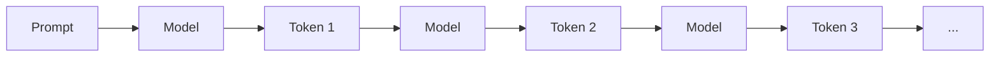
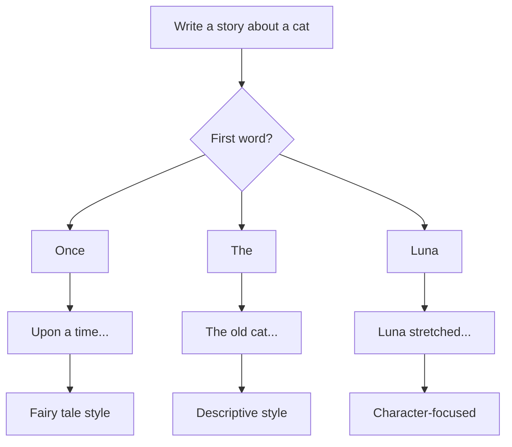

# How LLMs Generate Text

## Introduction

Understanding how LLMs generate text—one token at a time—helps you predict behavior, optimize prompts, and explain why certain outputs occur. This process is called **autoregressive generation**, and it's the foundation of every conversation you have with an AI.

### What We'll Cover

- One token at a time generation
- Probability distributions over vocabulary
- Sampling from distributions
- Autoregressive generation loop
- Why generation feels creative

---

## One Token at a Time Generation

LLMs don't generate entire responses at once. They produce one token at a time, each token influencing the next.

### The Token-by-Token Process



### Concrete Example

```
Prompt: "The quick brown fox"

Generation steps:
Step 1: Input = "The quick brown fox"
        Output token = "jumps"

Step 2: Input = "The quick brown fox jumps"
        Output token = "over"

Step 3: Input = "The quick brown fox jumps over"
        Output token = "the"

Step 4: Input = "The quick brown fox jumps over the"
        Output token = "lazy"

Step 5: Input = "The quick brown fox jumps over the lazy"
        Output token = "dog"

Step 6: Input = "The quick brown fox jumps over the lazy dog"
        Output token = "." (end)
```

### Code Illustration

```python
def generate_response(model, prompt, max_tokens=100):
    """Generate text one token at a time"""
    current_text = prompt
    generated_tokens = []
    
    for _ in range(max_tokens):
        # Model predicts next token distribution
        next_token_probs = model.predict_next(current_text)
        
        # Select next token (various strategies)
        next_token = sample_from(next_token_probs)
        
        # Check for end of generation
        if next_token == "<END>":
            break
        
        # Add token to output
        generated_tokens.append(next_token)
        current_text = current_text + next_token
    
    return "".join(generated_tokens)
```

### Why This Matters

Understanding token-by-token generation explains:

| Behavior | Explanation |
|----------|-------------|
| Streaming responses | Each token appears as generated |
| Early mistakes compound | Wrong token influences all following |
| Coherent text | Each token considers all previous context |
| Generation can diverge | Different early choices lead to different paths |

---

## Probability Distributions Over Vocabulary

For each token, the model outputs a probability distribution over its entire vocabulary.

### What the Distribution Looks Like

```python
# Model vocabulary might have ~100,000 tokens
# For each position, model outputs probability for each

example_distribution = {
    # After "The capital of France is"
    "Paris": 0.85,     # Very likely
    "the": 0.03,       # Less likely
    "a": 0.02,         # Less likely
    "Lyon": 0.01,      # Possible but unlikely
    "Berlin": 0.001,   # Wrong but plausible
    # ... 99,995 more tokens with tiny probabilities
}

# Probabilities sum to 1.0
assert sum(distribution.values()) == 1.0
```

### Visualizing Token Probabilities

```
Token Probabilities for "The capital of France is ___":

Paris    ████████████████████████████████████ 85%
the      ███ 3%
a        ██ 2%
Lyon     █ 1%
Berlin   ▏ 0.1%
Tokyo    ▏ 0.05%
...      ▏ remaining
```

### How Probability is Computed

```python
# Simplified: Final layer produces "logits"
def compute_probabilities(model, input_tokens):
    # Process input through all layers
    hidden_state = model.transformer(input_tokens)
    
    # Project to vocabulary size
    logits = model.output_layer(hidden_state)  # Shape: [vocab_size]
    # logits might be: [12.5, 8.3, 7.1, 3.2, ...]
    
    # Convert to probabilities with softmax
    probabilities = softmax(logits)  # Now sums to 1.0
    
    return probabilities
```

---

## Sampling from Distributions

Given the probability distribution, how do we choose the next token? This is where **sampling strategies** come in.

### Greedy Decoding

Always pick the highest probability token:

```python
def greedy_sample(probabilities):
    """Always choose most likely token"""
    return max(probabilities, key=probabilities.get)

# Example
probs = {"Paris": 0.85, "Lyon": 0.1, "Marseille": 0.05}
selected = greedy_sample(probs)  # Always "Paris"
```

**Pros:** Deterministic, consistent
**Cons:** Can be repetitive, boring

### Temperature Sampling

Adjust randomness by reshaping the distribution:

```python
def temperature_sample(logits, temperature):
    """
    Temperature controls randomness:
    - temp < 1: More deterministic (peaks sharper)
    - temp = 1: Original distribution
    - temp > 1: More random (peaks flatter)
    """
    adjusted_logits = logits / temperature
    probabilities = softmax(adjusted_logits)
    return random_choice(probabilities)

# Temperature effect
temp_0_1 = {"Paris": 0.99, "Lyon": 0.01, ...}  # Very peaked
temp_1_0 = {"Paris": 0.85, "Lyon": 0.10, ...}  # Original
temp_2_0 = {"Paris": 0.50, "Lyon": 0.25, ...}  # Flatter
```

```
Temperature Visualization:

Low temp (0.1):  Paris ████████████████████████ (99%)
                 Lyon  ▏ (1%)

Medium (1.0):    Paris ████████████████████ (85%)
                 Lyon  ███ (10%)

High temp (2.0): Paris ████████████ (50%)
                 Lyon  ██████ (25%)
```

### Top-p (Nucleus) Sampling

Only consider tokens that comprise the top P% of probability mass:

```python
def top_p_sample(probabilities, p=0.9):
    """
    Only consider tokens that sum to probability p.
    """
    # Sort by probability
    sorted_tokens = sorted(probabilities.items(), 
                          key=lambda x: x[1], 
                          reverse=True)
    
    # Find cutoff
    cumulative = 0
    nucleus = []
    for token, prob in sorted_tokens:
        nucleus.append((token, prob))
        cumulative += prob
        if cumulative >= p:
            break
    
    # Sample from nucleus only
    return weighted_random_choice(nucleus)

# With p=0.9, might only consider top 3-5 tokens
# Long tail of improbable tokens is ignored
```

### Top-k Sampling

Only consider the top K tokens:

```python
def top_k_sample(probabilities, k=50):
    """Only consider top k most likely tokens"""
    sorted_tokens = sorted(probabilities.items(),
                          key=lambda x: x[1],
                          reverse=True)[:k]
    
    # Renormalize probabilities
    total = sum(p for _, p in sorted_tokens)
    normalized = [(t, p/total) for t, p in sorted_tokens]
    
    return weighted_random_choice(normalized)
```

### Combining Strategies

In practice, multiple strategies are often combined:

```python
# Common API parameters
response = client.chat.completions.create(
    model="gpt-5",
    messages=[...],
    temperature=0.7,  # Moderate randomness
    top_p=0.9,        # Nucleus sampling
    # top_k is less common in APIs
)
```

---

## Autoregressive Generation Loop

The complete generation process is called **autoregressive** because each step depends on previous outputs.

### The Full Loop

```python
def autoregressive_generate(model, prompt, params):
    """Complete generation process"""
    tokens = tokenize(prompt)
    generated = []
    kv_cache = None  # For efficiency
    
    while len(generated) < params.max_tokens:
        # 1. Get probability distribution
        logits, kv_cache = model.forward(tokens, cache=kv_cache)
        
        # 2. Apply temperature
        logits = logits / params.temperature
        
        # 3. Apply top-p filtering
        filtered_logits = top_p_filter(logits, params.top_p)
        
        # 4. Convert to probabilities
        probs = softmax(filtered_logits)
        
        # 5. Sample next token
        next_token = sample(probs)
        
        # 6. Check stopping conditions
        if next_token == EOS_TOKEN:
            break
        if matches_stop_sequence(generated, params.stop):
            break
        
        # 7. Append and continue
        generated.append(next_token)
        tokens = [next_token]  # Only need new token with cache
    
    return detokenize(generated)
```

### Stopping Conditions

Generation stops when:

```python
stopping_conditions = [
    "max_tokens reached",    # Length limit
    "EOS token generated",   # Model signals completion
    "stop sequence matched", # Custom stop strings
    "timeout exceeded",      # API time limits
]
```

---

## Why Generation Feels Creative

Given that LLMs just predict the next token, why do outputs feel creative?

### The Randomness Factor

```python
# Same prompt, different outputs
prompt = "Write a poem about the moon"

# With temperature > 0, each generation differs
attempt_1 = generate(prompt)  # "Silver orb in midnight sky..."
attempt_2 = generate(prompt)  # "Luna's gentle glow descends..."
attempt_3 = generate(prompt)  # "The pale moon rises soft..."
```

### Path Divergence

Early token choices create different generation paths:



### "Creativity" is Exploration

```python
# Model explores the space of possible continuations
# "Creative" outputs are unusual but plausible paths

creativity_factors = {
    "temperature": "Higher = more unusual choices",
    "top_p": "Wider = more diverse vocabulary",
    "prompt_structure": "Open prompts = more paths to explore",
    "training_data": "Diverse data = richer possibilities"
}
```

### The Illusion of Intent

When an LLM produces:
- A clever metaphor
- An unexpected plot twist
- A creative solution

It's finding statistically plausible paths through learned patterns—not expressing creative intent.

---

## Practical Implications

### For Prompt Engineering

```python
# Understanding generation helps craft prompts

# Start strong - first tokens influence everything
"Write a compelling story about..." 
# vs
"Story:"

# Provide structure for the model to follow
"Generate a haiku (5-7-5 syllables):\n\n"
# Clear pattern to complete

# Stop sequences prevent overgeneration
response = generate(
    "List three items:",
    stop=["\n4.", "\n\n"]  # Stop after three
)
```

### For Application Design

```python
# Design around token-by-token nature

# 1. Streaming for UX
async def stream_response(prompt):
    async for token in model.generate_stream(prompt):
        yield token  # Show each token as generated

# 2. Handle partial responses
def robust_parse(response):
    try:
        return json.loads(response)
    except:
        # Response might be truncated
        return {"error": "incomplete", "partial": response}

# 3. Set appropriate max_tokens
max_tokens = estimate_response_length(task)
```

---

## Hands-on Exercise

### Your Task

Experiment with generation parameters:

1. **Temperature exploration**:
   ```
   Prompt: "Write one sentence about artificial intelligence."
   
   Try:
   - temperature=0 (generate 3 times - notice they're identical)
   - temperature=0.5 (slightly varied)
   - temperature=1.0 (more varied)
   - temperature=1.5 (very creative/weird)
   ```

2. **Observe token-by-token**:
   - Use streaming in the API or watch ChatGPT generate
   - Notice how the model "decides" mid-sentence

3. **Stop sequences**:
   ```python
   # Generate a list and stop at specific count
   prompt = "List 5 programming languages:\n1."
   stop = ["\n6."]  # Stop before 6
   ```

### Questions to Consider

- How does temperature affect output quality vs. creativity?
- When would you want deterministic (temp=0) outputs?
- How might early tokens affect the entire response?

---

## Summary

✅ LLMs generate text **one token at a time** (autoregressive)

✅ Each token position has a **probability distribution** over vocabulary

✅ **Sampling strategies** (temperature, top-p, top-k) control randomness

✅ The **generation loop** continues until stopping conditions are met

✅ "Creativity" emerges from exploring probabilistic paths

✅ Understanding generation helps design better prompts and applications

**Next:** [Emergent Capabilities](./05-emergent-capabilities.md)

---

## Further Reading

- [How GPT3 Works - Visualizations](https://jalammar.github.io/how-gpt3-works-visualizations-animations/) — Animated explanation
- [The Curious Case of Neural Text Degeneration](https://arxiv.org/abs/1904.09751) — On sampling strategies
- [OpenAI API Documentation](https://platform.openai.com/docs) — Generation parameters

---

## Navigation

| Previous | Up | Next |
|----------|-------|------|
| [Transformer Architecture](./03-transformer-architecture.md) | [Understanding LLMs](./00-understanding-large-language-models.md) | [Emergent Capabilities](./05-emergent-capabilities.md) |

