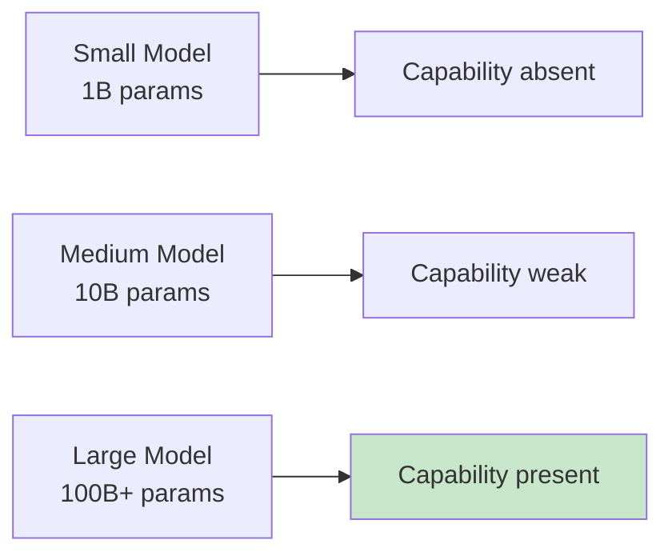
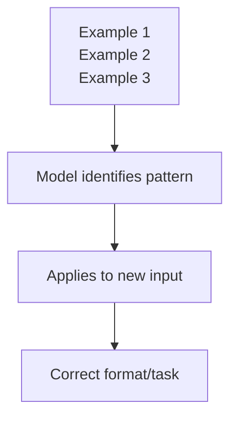

# Emergent Capabilities and Reasoning

## Introduction

As language models scaled up, they developed capabilities that weren't explicitly trained—abilities that "emerged" from the training process. Understanding these emergent capabilities helps you leverage LLMs effectively and know when they'll succeed or fail.

### What We'll Cover

- Chain-of-thought reasoning
- Few-shot learning
- In-context learning
- Code generation abilities
- Multi-step problem solving

---

## What Are Emergent Capabilities?

**Emergent capabilities** are abilities that appear in larger models but are absent in smaller ones—without being explicitly taught.



### Examples of Emergence

| Capability | Emerged At Scale |
|------------|------------------|
| Multi-step math | ~10B parameters |
| Code generation | ~10B parameters |
| Chain-of-thought | ~100B parameters |
| Complex reasoning | ~100B parameters |
| Following complex instructions | ~100B parameters |

### Why Emergence Happens

```python
# Theory: More parameters = more patterns captured
# At certain scales, enough patterns combine for new abilities

# Analogy: Learning to read
reading_stages = {
    "letter_recognition": "Early stage",
    "word_recognition": "More exposure",
    "sentence_understanding": "Pattern combination",
    "reading_comprehension": "Emergent from above"
}
# Reading comprehension "emerges" from combining simpler skills
```

---

## Chain-of-Thought Reasoning

**Chain-of-thought (CoT)** prompting encourages the model to show its reasoning step by step.

### Without CoT

```
Prompt: "If John has 3 apples and gives away 1, then buys 4 more, 
         how many does he have?"
Response: "6 apples" (might be wrong without reasoning)
```

### With CoT

```
Prompt: "If John has 3 apples and gives away 1, then buys 4 more, 
         how many does he have? Let's think step by step."

Response: "Let's work through this:
1. John starts with 3 apples
2. He gives away 1: 3 - 1 = 2 apples
3. He buys 4 more: 2 + 4 = 6 apples
Therefore, John has 6 apples."
```

### Why CoT Works

```python
# CoT provides intermediate tokens that guide generation
# Each step creates context for the next

cot_benefits = {
    "intermediate_steps": "Model can 'check' its work",
    "pattern_matching": "Math patterns are tokenized explicitly",
    "error_visibility": "Mistakes are visible in reasoning",
    "complexity_breakdown": "Complex problems → simple steps"
}
```

### CoT Prompting Techniques

```python
# Technique 1: "Let's think step by step"
prompt_1 = """
Question: {question}
Let's think step by step.
"""

# Technique 2: Structured reasoning
prompt_2 = """
Question: {question}

Work through this problem:
1. Identify what we know
2. Determine what we need to find
3. Apply relevant formulas/logic
4. Calculate the answer
5. Verify the result
"""

# Technique 3: Zero-shot CoT
prompt_3 = """
{question}
Think carefully and explain your reasoning.
"""
```

### When to Use CoT

| Use CoT For | Skip CoT For |
|-------------|--------------|
| Math problems | Simple Q&A |
| Logic puzzles | Direct information retrieval |
| Multi-step reasoning | Creative writing |
| Complex analysis | Translation |
| Debugging code | Summarization |

---

## Few-Shot Learning

**Few-shot learning** is the ability to learn new tasks from just a few examples in the prompt.

### Zero-Shot (No Examples)

```python
prompt = """
Classify the sentiment of this review as 'positive' or 'negative':
Review: "This product exceeded my expectations!"
Sentiment:"""
```

### Few-Shot (With Examples)

```python
prompt = """
Classify the sentiment of reviews as 'positive' or 'negative'.

Review: "I love this product! Best purchase ever."
Sentiment: positive

Review: "Terrible quality. Broke after one day."
Sentiment: negative

Review: "Absolutely amazing, will buy again!"
Sentiment: positive

Review: "This product exceeded my expectations!"
Sentiment:"""
# Model learns the pattern and continues correctly
```

### Why Few-Shot Works



The model:
1. Identifies the pattern from examples
2. Infers the task requirement
3. Applies the pattern to new inputs

### Few-Shot Best Practices

```python
# 1. Use consistent formatting
examples = """
Input: apple
Category: fruit

Input: carrot
Category: vegetable

Input: banana
Category:"""  # Model follows format

# 2. Include diverse examples
examples = """
Input: The movie was amazing!
Sentiment: positive

Input: Worst film I've ever seen.
Sentiment: negative

Input: It was okay, nothing special.
Sentiment: neutral"""  # Cover edge cases

# 3. Order can matter
# Put most relevant examples closer to the query
# More recent examples may have more influence
```

### How Many Examples?

| Shots | When to Use |
|-------|-------------|
| 0 (zero-shot) | Simple, well-defined tasks |
| 1-3 (few-shot) | Most tasks, format examples |
| 5-10 | Complex or nuanced tasks |
| 10+ | Rarely needed, increases cost |

---

## In-Context Learning

**In-context learning (ICL)** is the model's ability to learn from information provided in the prompt, without any weight updates.

### How It Differs from Training

```python
# Traditional machine learning:
model.train(data)  # Updates model parameters
model.predict(input)

# In-context learning:
model.predict(context + input)  # No parameter updates!
# The "learning" happens through attention mechanisms
```

### In-Context Learning Examples

```python
# Teaching a format
prompt = """
Convert temperatures from Celsius to Fahrenheit.
Formula: F = (C × 9/5) + 32

Example:
Celsius: 0
Fahrenheit: 32

Example:
Celsius: 100
Fahrenheit: 212

Now convert:
Celsius: 25
Fahrenheit:"""

# Teaching domain knowledge
prompt = """
In our company, project codes follow this format:
- First 3 letters: department (ENG, MKT, FIN)
- Next 4 digits: year
- Last 2 digits: sequence number

Examples:
ENG-2024-01: Engineering project, 2024, first project
MKT-2023-15: Marketing project, 2023, fifteenth project

What does FIN-2025-03 mean?"""
```

### ICL for Custom Tasks

```python
# Custom classification without fine-tuning
prompt = """
Classify support tickets into categories.

Our categories are:
- billing: Payment, invoices, refunds
- technical: Bugs, errors, how-to
- account: Login, password, settings
- shipping: Delivery, tracking, returns

Examples:
"I can't log into my account" → account
"The button doesn't work" → technical
"Where is my package?" → shipping
"Charge me twice" → billing

Classify: "I need to reset my password"
Category:"""
```

---

## Code Generation Abilities

LLMs have surprisingly strong code generation capabilities—an emergent ability from training on code repositories.

### What Models Can Do

```python
# 1. Generate functions from descriptions
prompt = "Write a Python function to check if a string is a palindrome"

response = """
def is_palindrome(s: str) -> bool:
    # Remove non-alphanumeric and lowercase
    cleaned = ''.join(c.lower() for c in s if c.isalnum())
    return cleaned == cleaned[::-1]
"""

# 2. Explain existing code
prompt = """
Explain what this code does:
```python
result = [x**2 for x in range(10) if x % 2 == 0]
```
"""

# 3. Debug code
prompt = """
This code has a bug. Find and fix it:
def factorial(n):
    if n == 0:
        return 0  # Bug!
    return n * factorial(n-1)
"""

# 4. Convert between languages
prompt = "Convert this Python to JavaScript: ..."

# 5. Write tests
prompt = "Write pytest tests for this function: ..."
```

### Why Code Emergence Happened

| Factor | Contribution |
|--------|--------------|
| Massive code in training | GitHub, documentation, Stack Overflow |
| Structured patterns | Code follows strict syntax rules |
| Comment patterns | Natural language → code mapping |
| Test patterns | Input-output examples |

### Code Generation Limitations

```python
# LLMs struggle with:
limitations = {
    "novel_algorithms": "Can combine known patterns, not invent",
    "complex_state": "Tracking many variables over time",
    "subtle_bugs": "Logic errors in edge cases",
    "system_design": "Large-scale architecture decisions",
    "verification": "Cannot run or test their code"
}

# Always review and test generated code!
```

---

## Multi-Step Problem Solving

LLMs can decompose complex problems into steps—another emergent capability.

### Problem Decomposition

```python
prompt = """
Task: Create a web scraper that:
1. Fetches a webpage
2. Extracts all links
3. Filters for external links only
4. Saves to a CSV file

Let's break this down into steps and implement each:

Step 1: Fetch webpage
"""

# Model will naturally continue through steps
```

### Agentic Problem Solving

```python
# LLMs can plan and execute multi-step tasks
task = "Analyze this dataset and create a visualization"

steps = """
1. First, I'll examine the data structure
2. Then, identify key columns and their types
3. Clean any missing or invalid data
4. Calculate relevant statistics
5. Choose appropriate visualization type
6. Create the plot with proper labels
"""

# Each step builds on previous work
```

### When Multi-Step Works

| Works Well | Struggles |
|------------|-----------|
| Clear subtasks | Ambiguous requirements |
| Sequential steps | Parallel considerations |
| Known patterns | Novel combinations |
| Explicit instructions | Implicit constraints |

---

## Leveraging Emergent Capabilities

### Practical Strategies

```python
# 1. Use CoT for reasoning tasks
def solve_with_cot(problem):
    return query_model(f"{problem}\n\nLet's solve this step by step:")

# 2. Use few-shot for custom formats
def classify_with_examples(text, examples):
    prompt = format_examples(examples) + f"\nClassify: {text}"
    return query_model(prompt)

# 3. Leverage in-context learning for domain-specific tasks
def domain_query(question, domain_context):
    prompt = f"{domain_context}\n\nQuestion: {question}"
    return query_model(prompt)

# 4. Decompose complex code tasks
def generate_complex_code(requirements):
    return query_model(f"""
    Requirements: {requirements}
    
    Let's implement this in steps:
    1. First, outline the approach
    2. Then implement core functions
    3. Add error handling
    4. Include usage examples
    """)
```

---

## Hands-on Exercise

### Your Task

Experiment with emergent capabilities:

1. **Chain-of-thought**:
   ```
   Without CoT: "What's 17 * 24 + 156 / 12?"
   With CoT: "What's 17 * 24 + 156 / 12? Show your work step by step."
   Compare accuracy
   ```

2. **Few-shot learning**:
   ```
   Create a custom classifier:
   - Give 3 examples of your own categories
   - Test with new inputs
   - See how well the model generalizes
   ```

3. **Code generation**:
   ```
   "Write a function to find the second-largest element in a list"
   - Did it handle edge cases?
   - Is the code idiomatic?
   ```

### Questions to Consider

- How many examples do you need for reliable few-shot?
- When does CoT improve accuracy?
- What code patterns are LLMs best/worst at?

---

## Summary

✅ **Emergent capabilities** appear at scale without explicit training

✅ **Chain-of-thought** improves reasoning by making steps explicit

✅ **Few-shot learning** enables task adaptation from examples

✅ **In-context learning** allows custom behavior without fine-tuning

✅ **Code generation** emerged from training on repositories

✅ **Multi-step reasoning** enables complex problem decomposition

**Next:** [Limitations](./06-limitations.md)

---

## Further Reading

- [Chain-of-Thought Prompting](https://arxiv.org/abs/2201.11903) — Original CoT paper
- [Emergent Abilities of Large Language Models](https://arxiv.org/abs/2206.07682) — Research on emergence
- [Language Models are Few-Shot Learners](https://arxiv.org/abs/2005.14165) — GPT-3 paper on ICL

---

## Navigation

| Previous | Up | Next |
|----------|-------|------|
| [Text Generation](./04-text-generation.md) | [Understanding LLMs](./00-understanding-large-language-models.md) | [Limitations](./06-limitations.md) |

