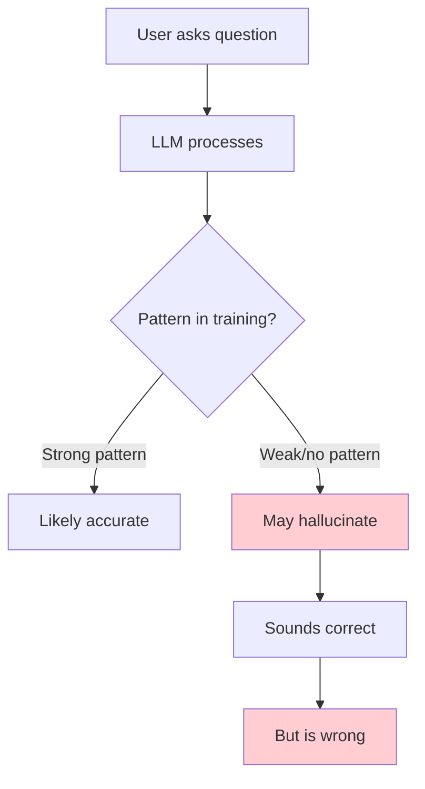
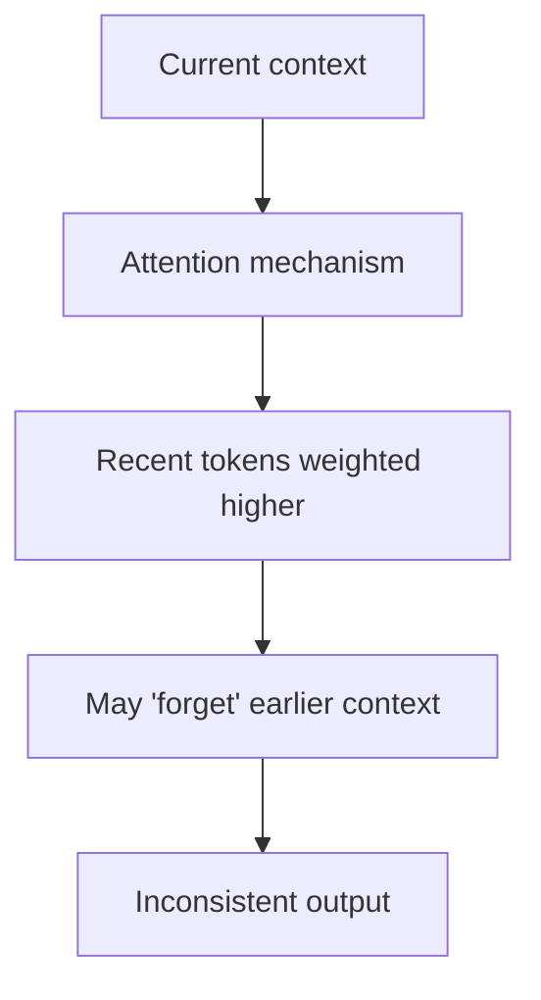

# LLM Limitations

## Introduction

Understanding LLM limitations is as important as knowing their capabilities. Overestimating what LLMs can do leads to broken applications and frustrated users. This section provides a clear-eyed view of where LLMs fail and how to design around these limitations.

### What We'll Cover

- Hallucinations: Confident but wrong outputs
- Knowledge cutoffs: Frozen in time
- Mathematical reasoning limitations
- Logical consistency issues
- Bias in training data

---

## Hallucinations: Confident but Wrong

**Hallucinations** occur when LLMs generate plausible-sounding but factually incorrect information. This is perhaps the most critical limitation for production applications.

### Why Hallucinations Happen



LLMs are trained to produce fluent, coherent text—not to verify facts. When uncertain, they generate text that *sounds* right rather than admitting ignorance.

### Types of Hallucinations

```python
hallucination_types = {
    "fabricated_facts": {
        "example": "The Eiffel Tower was completed in 1923",
        "reality": "1889",
        "cause": "Weak pattern or confusion"
    },
    "invented_citations": {
        "example": "According to Smith et al. (2022) in Nature...",
        "reality": "Paper doesn't exist",
        "cause": "Learned citation format, not actual papers"
    },
    "false_statistics": {
        "example": "87% of developers prefer...",
        "reality": "Number is made up",
        "cause": "Statistical phrases common in training"
    },
    "confident_uncertainty": {
        "example": "The answer is definitely X",
        "reality": "Model is guessing",
        "cause": "Trained to sound confident"
    }
}
```

### Hallucination Examples

```python
# Example 1: Made-up citation
prompt = "Cite a paper about transformer architectures"
response = """
Smith, J., & Johnson, M. (2021). "Advances in Transformer 
Architectures for NLP." Journal of Machine Learning, 15(3), 
245-267. doi:10.1234/jml.2021.15.3.245
"""
# This paper, journal, and DOI likely don't exist!

# Example 2: Plausible but wrong code
prompt = "How do I use the async_foreach function in Python?"
response = """
from asyncio import async_foreach  # Doesn't exist!

async def process_items(items):
    await async_foreach(items, process_item)
"""
# Sounds right, but async_foreach is not a real function

# Example 3: Historical fabrication
prompt = "Who said 'The only thing we have to fear is fear itself'?"
response = "Winston Churchill said this in his famous 1940 speech."
# Actually FDR, 1933
```

### Mitigating Hallucinations

```python
# Strategy 1: RAG (Retrieval-Augmented Generation)
def answer_with_sources(question, knowledge_base):
    """Ground answers in retrieved documents"""
    docs = knowledge_base.retrieve(question)
    
    prompt = f"""
    Answer based ONLY on these sources. If the answer isn't 
    in the sources, say "I don't have information about that."
    
    Sources:
    {format_docs(docs)}
    
    Question: {question}
    """
    return generate(prompt)

# Strategy 2: Fact extraction and verification
def verified_answer(question):
    response = generate(question)
    
    # Extract factual claims
    claims = extract_claims(response)
    
    # Verify each claim
    verified = []
    for claim in claims:
        if verify_claim(claim, trusted_sources):
            verified.append(claim)
        else:
            verified.append(f"[UNVERIFIED: {claim}]")
    
    return format_response(verified)

# Strategy 3: Prompt for uncertainty
prompt = """
Answer this question. If you're not certain, say "I'm not sure" 
and explain your uncertainty level.

Question: {question}
"""
```

### When Hallucinations Are Most Likely

| High Risk | Lower Risk |
|-----------|------------|
| Obscure facts | Common knowledge |
| Recent events | Well-documented topics |
| Specific numbers | General concepts |
| Exact quotes | Paraphrased ideas |
| Technical details | High-level overviews |

---

## Knowledge Cutoff: Frozen in Time

LLMs have a **knowledge cutoff date**—they don't know about events after their training data ends.

### Current Cutoffs (Approximate)

| Model | Cutoff |
|-------|--------|
| GPT-4 (base) | ~April 2023 |
| GPT-4o | ~October 2023 |
| GPT-5 | ~2024 |
| Claude 3 | ~Early 2024 |
| Claude 4 | ~2024 |

### Implications

```python
# Questions about recent events fail
problematic_queries = [
    "What were the 2024 election results?",  # After some cutoffs
    "What's the current Bitcoin price?",     # Changes constantly
    "What's the latest iPhone model?",       # Depends on when asked
    "Did that celebrity win an award?",      # Recent events
]

# Model might:
# 1. Admit it doesn't know (ideal)
# 2. Give outdated information
# 3. Hallucinate current events
```

### Handling Knowledge Cutoffs

```python
# Approach 1: Use web search integration
async def answer_current(question):
    if needs_current_info(question):
        search_results = await web_search(question)
        prompt = f"""
        Based on this current information:
        {search_results}
        
        Answer: {question}
        """
        return generate(prompt)
    return generate(question)

# Approach 2: Clear disclaimers
system_prompt = """
You are a helpful assistant. Your knowledge has a cutoff date.
For current events, prices, or recent news, advise users to 
check current sources. Be explicit about your limitations.
"""

# Approach 3: RAG with current data
def answer_with_current_data(question, live_database):
    """Use up-to-date database for current information"""
    current_data = live_database.query(question)
    return generate_with_context(question, current_data)
```

---

## Mathematical Reasoning Limitations

LLMs process language, not mathematics. They can perform some math but are unreliable for complex calculations.

### What Works

```python
# Simple arithmetic (memorized patterns)
prompt = "What is 7 × 8?"
response = "56"  # ✓ Correct (common multiplication)

# Word problems with simple math
prompt = "If I have 5 apples and buy 3 more, how many do I have?"
response = "8 apples"  # ✓ Correct (simple addition)
```

### What Fails

```python
# Multi-digit arithmetic
prompt = "What is 4,847 × 2,931?"
response = "14,212,257"  # ❌ Correct answer is 14,209,557

# Complex word problems
prompt = """
A train leaves station A at 9 AM going 60 mph. Another train 
leaves station B (120 miles away) at 10 AM going 80 mph toward 
station A. When do they meet?
"""
response = "They meet at 10:51 AM"  # ❌ Often wrong

# Precise calculations
prompt = "What is the square root of 2 to 10 decimal places?"
response = "1.4142135624"  # ❌ May be imprecise
```

### Why Math Fails

```python
# LLMs work with tokens, not numbers
# "4847" might be tokenized as ["48", "47"] or ["4", "847"]
# No actual arithmetic hardware

# The model learned patterns like:
# "7 × 8 = 56" (seen thousands of times)
# But didn't learn: "4847 × 2931 = ?" (probably never seen)
```

### Handling Math Requirements

```python
# Solution 1: Use code execution
def math_with_code(problem):
    # Let LLM write code, execute for answer
    code = generate(f"Write Python code to solve: {problem}")
    result = execute_safely(code)
    return result

# Solution 2: External calculator
def math_with_calculator(expression):
    # Parse expression and use actual calculator
    parsed = parse_math(expression)
    return calculate(parsed)

# Solution 3: Hybrid approach
def smart_math(question):
    # LLM extracts the math, tool computes it
    expression = generate(f"Extract the mathematical expression from: {question}")
    result = calculator.evaluate(expression)
    return generate(f"The calculation {expression} = {result}. Now explain...")
```

---

## Logical Consistency Issues

LLMs can contradict themselves, especially in long conversations or complex reasoning.

### Examples of Inconsistency

```python
# Example 1: Self-contradiction
user: "Is Python statically typed?"
ai: "No, Python is dynamically typed."

# Later in conversation...
user: "So Python catches type errors at compile time?"
ai: "Yes, Python's static typing catches errors at compile time."
# ❌ Contradicts earlier statement

# Example 2: Agreeing with false premises
user: "Since the Earth is flat, how does gravity work?"
ai: "On the flat Earth, gravity would work by..."
# ❌ Accepted false premise instead of correcting

# Example 3: Losing track
# In a long conversation about a red car...
user: "What color was the car again?"
ai: "The blue car you mentioned..."
# ❌ Changed the color
```

### Why Inconsistency Happens



- Attention dilutes over long contexts
- No persistent memory of stated facts
- Pattern matching can override earlier statements

### Mitigating Inconsistency

```python
# Approach 1: Explicit state tracking
def chat_with_state(messages, state):
    """Maintain explicit state in system prompt"""
    system_prompt = f"""
    Current conversation state:
    - User's name: {state.get('name')}
    - Topic: {state.get('topic')}
    - Key facts established: {state.get('facts')}
    
    Maintain consistency with these facts.
    """
    return generate(system_prompt + format_messages(messages))

# Approach 2: Summarization checkpoints
def long_conversation(messages):
    if len(messages) > 10:
        # Summarize and reset context
        summary = summarize(messages)
        return generate(summary + recent_messages(messages, 5))
    return generate(messages)

# Approach 3: Self-consistency checking
def consistent_answer(question, n=5):
    """Generate multiple answers and check for agreement"""
    answers = [generate(question, temp=0.7) for _ in range(n)]
    if all_agree(answers):
        return answers[0]
    return "I'm uncertain - my reasoning gives different answers"
```

---

## Bias in Training Data

LLMs inherit biases from their training data, which can lead to unfair or problematic outputs.

### Types of Bias

| Type | Example |
|------|---------|
| **Demographic** | Associating certain jobs with genders |
| **Cultural** | Centering Western perspectives |
| **Temporal** | Reflecting attitudes of training data era |
| **Representational** | Over/under-representing groups |

### Bias Examples

```python
# Prompt completion bias
prompt = "The doctor walked in. He..."
# Model more likely to use "he" than "she" for doctor

prompt = "The nurse walked in. She..."
# Model more likely to use "she" for nurse

# Cultural assumptions
prompt = "What's a typical breakfast?"
response = "Eggs, bacon, toast..."
# Assumes Western/American context
```

### Detecting Bias

```python
def test_for_bias(prompt_template, variations):
    """Test if model responds differently to variations"""
    results = {}
    for variation in variations:
        prompt = prompt_template.format(variation=variation)
        results[variation] = generate(prompt)
    
    return analyze_differences(results)

# Example: Test for name bias
test_for_bias(
    "Write a recommendation letter for {variation}",
    ["John Smith", "Jamal Washington", "Maria Garcia"]
)
```

### Mitigating Bias

```python
# Approach 1: Explicit instructions
system_prompt = """
Respond without making assumptions about gender, race, 
or cultural background. Use inclusive language.
"""

# Approach 2: Diverse few-shot examples
examples = """
Example 1: Dr. Chen is a surgeon who...
Example 2: Engineer Sarah Johnson developed...
Example 3: CEO Michael Williams announced...
Example 4: Dr. Fatima Al-Hassan discovered...
"""

# Approach 3: Post-processing review
def review_for_bias(response):
    """Flag potential biased content"""
    bias_indicators = check_bias_patterns(response)
    if bias_indicators:
        return response, {"warning": "Potential bias detected"}
    return response, None
```

---

## Building Robust Systems

### Defense in Depth

```python
class RobustLLMSystem:
    """System designed around LLM limitations"""
    
    def __init__(self):
        self.rag_store = VectorStore()
        self.calculator = Calculator()
        self.fact_checker = FactChecker()
    
    def process_query(self, query):
        # 1. Classify query type
        query_type = classify(query)
        
        # 2. Route appropriately
        if query_type == "current_events":
            return self.handle_with_search(query)
        elif query_type == "math":
            return self.handle_with_calculator(query)
        elif query_type == "factual":
            return self.handle_with_rag(query)
        else:
            return self.handle_general(query)
    
    def handle_general(self, query):
        response = generate(query)
        
        # Post-processing
        response = self.fact_checker.flag_uncertain(response)
        response = self.add_disclaimers(response)
        
        return response
```

### User Communication

```python
# Be transparent about limitations
response_template = """
{ai_response}

---
Note: AI-generated response. Please verify important 
information from authoritative sources.
"""
```

---

## Hands-on Exercise

### Your Task

Test LLM limitations firsthand:

1. **Hallucination test**:
   ```
   "Tell me about the 2019 Nobel Prize in Literature winner's 
   fourth novel published in 2010"
   
   Verify the response - is it accurate?
   ```

2. **Math test**:
   ```
   "What is 847 × 293?"
   
   Check with a calculator - was it correct?
   ```

3. **Consistency test**:
   ```
   Start a conversation about a fictional character.
   Ask many questions.
   Later, change a detail and see if the model notices.
   ```

### Questions to Consider

- How confident did the model sound when wrong?
- What strategies could prevent these errors?
- How would you design around these limitations?

---

## Summary

✅ **Hallucinations** are confident but wrong outputs—always verify facts

✅ **Knowledge cutoffs** mean LLMs don't know recent events—use RAG or search

✅ **Math limitations** require using code execution or calculators

✅ **Logical inconsistency** occurs in long contexts—track state explicitly

✅ **Training bias** can affect outputs—use inclusive prompting and monitoring

✅ Build systems that acknowledge and work around these limitations

**Next Lesson:** [Tokenization](../03-tokenization/00-tokenization.md)

---

## Further Reading

- [LLM Hallucination Leaderboard](https://github.com/vectara/hallucination-leaderboard) — Benchmark comparisons
- [On the Dangers of Stochastic Parrots](https://dl.acm.org/doi/10.1145/3442188.3445922) — Bias analysis
- [Measuring Massive Multitask Language Understanding](https://arxiv.org/abs/2009.03300) — MMLU benchmark

---

## Navigation

| Previous | Up | Next |
|----------|-------|------|
| [Emergent Capabilities](./05-emergent-capabilities.md) | [Understanding LLMs](./00-understanding-large-language-models.md) | [Tokenization](../03-tokenization/00-tokenization.md) |

<!-- 
Sources Consulted:
- OpenAI Platform Docs: https://platform.openai.com/docs/overview
- Anthropic Claude Docs: https://platform.claude.com/docs/en/docs/welcome  
- Hugging Face NLP Course: https://huggingface.co/learn/llm-course/chapter1/1
-->

