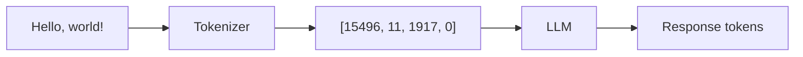

# Tokenization

## Overview

Tokenization is how LLMs convert text into numbers they can process. Understanding tokenization is essential because it directly affects cost, context limits, and model behavior.

Every API call you make is measured in tokens, every context window is a token limit, and every pricing model charges by token count. Knowing how tokenization works helps you estimate costs, optimize prompts, and debug unexpected behaviors.

## What You'll Learn

This lesson covers six essential topics:

1. **[What Are Tokens?](./01-what-are-tokens.md)** — The smallest units of text processing
2. **[How Text Becomes Tokens](./02-text-to-tokens.md)** — BPE, SentencePiece, and tokenization algorithms
3. **[Token Counting](./03-token-counting.md)** — Tiktoken library and estimation rules
4. **[Impact on Cost](./04-impact-on-cost.md)** — Input/output pricing and optimization
5. **[Impact on Context](./05-impact-on-context.md)** — Context windows and truncation strategies
6. **[Tokenization Across Models](./06-tokenization-differences.md)** — Why different models tokenize differently

## Prerequisites

Before starting this lesson, you should have:

- Completed [Understanding Large Language Models](../02-understanding-large-language-models/00-understanding-large-language-models.md)
- Basic understanding of how LLMs generate text
- Familiarity with API concepts

## Why Tokenization Matters

| Concept | Why It's Important |
|---------|-------------------|
| **Cost estimation** | Tokens determine API pricing |
| **Context limits** | Context windows are measured in tokens |
| **Prompt optimization** | Fewer tokens = lower cost and more room |
| **Debugging** | Token boundaries affect model behavior |
| **Multilingual apps** | Non-English uses more tokens |

## Quick Token Overview



### What Are Tokens?

Tokens are pieces of text—not quite characters, not quite words. They're subword units that the model actually processes.

```
"Hello, world!" → ["Hello", ",", " world", "!"] → [15496, 11, 1917, 0]
                   ↑ Words/pieces               ↑ Token IDs (integers)
```

### Token Rules of Thumb

| Content Type | Approximate Rate |
|--------------|-----------------|
| English text | ~4 characters per token |
| Common words | 1 token each |
| Rare words | 2-4 tokens |
| Code | More tokens per character |
| Non-English | 1.5-4x more tokens |

## Practical Example

```python
# Same meaning, different token counts
prompt_a = "Please explain quantum computing to me"  # ~8 tokens
prompt_b = "Explain quantum computing"               # ~5 tokens
prompt_c = "QC explanation"                          # ~3 tokens

# If GPT-5 costs $0.01 per 1K input tokens:
# prompt_a: $0.00008
# prompt_c: $0.00003

# Small difference, but at scale matters!
```

> **🤖 AI Context:** Token efficiency isn't just about cost—fewer tokens leave more room in the context window for important content like retrieved documents or conversation history.

## Learning Path

Complete topics in order:

```
01-what-are-tokens.md
    ↓
02-text-to-tokens.md
    ↓
03-token-counting.md
    ↓
04-impact-on-cost.md
    ↓
05-impact-on-context.md
    ↓
06-tokenization-differences.md
```

---

## Summary

This lesson explains how text is converted to tokens, how to count and estimate tokens, and how tokenization affects cost and context. Understanding these concepts is fundamental for building cost-effective AI applications.

**Next:** [What Are Tokens?](./01-what-are-tokens.md)

---

## Navigation

| Previous | Up | Next |
|----------|-------|------|
| [Understanding LLMs](../02-understanding-large-language-models/00-understanding-large-language-models.md) | [AI/LLM Fundamentals](../00-overview.md) | [What Are Tokens?](./01-what-are-tokens.md) |

