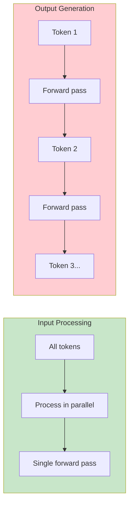

# Impact on Cost

## Introduction

Token counts directly determine your API costs. Understanding how tokens translate to dollars helps you budget accurately, optimize prompts, and choose cost-effective architectures.

### What We'll Cover

- Input vs. output token pricing
- Why output tokens cost more
- Calculating expected costs
- Cost optimization strategies

---

## Input Tokens vs. Output Tokens

Most LLM APIs charge differently for input (prompt) and output (completion) tokens.

### Current Pricing Structure (Example Rates)

```python
# Typical 2025 pricing (per 1M tokens)
pricing = {
    "gpt-5": {
        "input": 10.00,    # $10 per 1M input tokens
        "output": 30.00    # $30 per 1M output tokens
    },
    "gpt-5-mini": {
        "input": 0.50,     # $0.50 per 1M input tokens
        "output": 1.50     # $1.50 per 1M output tokens
    },
    "gpt-4o": {
        "input": 2.50,
        "output": 10.00
    },
    "claude-4-sonnet": {
        "input": 3.00,
        "output": 15.00
    },
    "claude-4-haiku": {
        "input": 0.25,
        "output": 1.25
    }
}
```

> **Note:** Pricing changes frequently. Always check current rates on provider websites.

### Price Ratio

```
Output tokens typically cost 2-4x more than input tokens

Why? Output generation requires:
- More compute per token (generation vs encoding)
- Sequential processing (can't parallelize)
- Multiple sampling steps
```

---

## Why Output Tokens Cost More

### Computational Difference



**Input tokens:**
- Processed in parallel (GPU-efficient)
- One forward pass for entire prompt
- Relatively fast

**Output tokens:**
- Generated sequentially
- Each token requires a forward pass
- Can't be parallelized
- More compute per token

---

## Calculating Expected Costs

### Basic Cost Formula

```python
def calculate_cost(
    input_tokens: int,
    output_tokens: int,
    model: str,
    pricing: dict
) -> float:
    """Calculate cost for an API call"""
    model_pricing = pricing[model]
    
    input_cost = (input_tokens / 1_000_000) * model_pricing["input"]
    output_cost = (output_tokens / 1_000_000) * model_pricing["output"]
    
    return input_cost + output_cost

# Example calculation
cost = calculate_cost(
    input_tokens=1000,
    output_tokens=500,
    model="gpt-4o",
    pricing={"gpt-4o": {"input": 2.50, "output": 10.00}}
)
print(f"Cost: ${cost:.6f}")  # $0.007500
```

### Cost Estimator Tool

```python
def estimate_monthly_cost(
    requests_per_day: int,
    avg_input_tokens: int,
    avg_output_tokens: int,
    model: str,
    pricing: dict
) -> dict:
    """Estimate monthly API costs"""
    
    # Daily calculations
    daily_input = requests_per_day * avg_input_tokens
    daily_output = requests_per_day * avg_output_tokens
    daily_cost = calculate_cost(daily_input, daily_output, model, pricing)
    
    # Monthly (30 days)
    monthly_requests = requests_per_day * 30
    monthly_input = daily_input * 30
    monthly_output = daily_output * 30
    monthly_cost = daily_cost * 30
    
    return {
        "daily_requests": requests_per_day,
        "daily_tokens": daily_input + daily_output,
        "daily_cost": daily_cost,
        "monthly_requests": monthly_requests,
        "monthly_tokens": monthly_input + monthly_output,
        "monthly_cost": monthly_cost
    }

# Example: Chatbot with 1000 conversations/day
estimate = estimate_monthly_cost(
    requests_per_day=1000,
    avg_input_tokens=500,    # User message + context
    avg_output_tokens=200,   # Bot response
    model="gpt-4o",
    pricing={"gpt-4o": {"input": 2.50, "output": 10.00}}
)

print(f"Monthly cost: ${estimate['monthly_cost']:.2f}")
print(f"Monthly tokens: {estimate['monthly_tokens']:,}")
```

---

## Cost Optimization Strategies

### 1. Choose the Right Model

```python
# Same task, different costs
models_comparison = {
    "gpt-5": {
        "quality": "highest",
        "cost_1k_calls": 40.00,  # 1K input + 500 output each
        "use_when": "Complex reasoning, critical accuracy"
    },
    "gpt-5-mini": {
        "quality": "good",
        "cost_1k_calls": 1.25,
        "use_when": "Simple tasks, high volume"
    },
    "claude-4-haiku": {
        "quality": "good",
        "cost_1k_calls": 0.88,
        "use_when": "Fast responses, cost-sensitive"
    }
}

# 32x cost difference between top and budget models!
```

### 2. Optimize Prompt Length

```python
# Verbose prompt
verbose_prompt = """
I would like you to please help me with something. What I need 
is for you to take the following text and summarize it for me. 
The text is about various topics and I need a brief summary.
Please make sure the summary captures all the key points.

Text to summarize:
{text}

Please provide a comprehensive yet concise summary.
"""

# Optimized prompt
efficient_prompt = """
Summarize this text in 2-3 sentences:

{text}
"""

# Token savings: ~50 tokens per request
# At 10K requests/day: significant savings
```

### 3. Control Output Length

```python
from openai import OpenAI

client = OpenAI()

# Without limit (model decides length)
response = client.chat.completions.create(
    model="gpt-4o",
    messages=[{"role": "user", "content": "Explain AI"}]
)
# Might generate 500+ tokens

# With limit
response = client.chat.completions.create(
    model="gpt-4o",
    messages=[{"role": "user", "content": "Explain AI in one paragraph"}],
    max_tokens=150
)
# Bounded output = predictable cost
```

### 4. Cache Repeated Requests

```python
import hashlib
from functools import lru_cache

# Simple in-memory cache
@lru_cache(maxsize=1000)
def cached_completion(prompt_hash: str) -> str:
    # In production, use Redis or database
    pass

def get_completion(prompt: str) -> str:
    # Hash the prompt
    prompt_hash = hashlib.sha256(prompt.encode()).hexdigest()
    
    # Check cache first
    cached = cached_completion(prompt_hash)
    if cached:
        return cached  # Free!
    
    # Otherwise call API (costs money)
    response = call_api(prompt)
    cached_completion(prompt_hash)  # Cache for next time
    return response
```

### 5. Use Batch APIs

```python
# OpenAI Batch API: 50% discount for async processing
# Good for non-real-time tasks

batch_request = {
    "custom_id": "request-1",
    "method": "POST",
    "url": "/v1/chat/completions",
    "body": {
        "model": "gpt-4o",
        "messages": [{"role": "user", "content": "..."}]
    }
}

# Submit batch, get results within 24 hours
# Half the cost of real-time API
```

### 6. Implement Tiered Processing

```python
def smart_routing(query: str) -> str:
    """Route to appropriate model based on complexity"""
    
    # Estimate query complexity
    complexity = estimate_complexity(query)
    
    if complexity == "simple":
        # Use cheapest model
        return call_model("gpt-5-nano", query)
    elif complexity == "medium":
        # Use mid-tier
        return call_model("gpt-5-mini", query)
    else:
        # Only use expensive model when needed
        return call_model("gpt-5", query)

# Result: Most queries use cheap models
# Only complex queries use expensive ones
```

---

## Cost Monitoring

### Track Usage

```python
import logging
from datetime import datetime

class CostTracker:
    def __init__(self):
        self.total_input_tokens = 0
        self.total_output_tokens = 0
        self.total_cost = 0.0
        self.request_count = 0
    
    def log_request(
        self, 
        input_tokens: int, 
        output_tokens: int,
        model: str,
        pricing: dict
    ):
        cost = calculate_cost(input_tokens, output_tokens, model, pricing)
        
        self.total_input_tokens += input_tokens
        self.total_output_tokens += output_tokens
        self.total_cost += cost
        self.request_count += 1
        
        logging.info(
            f"API Call: {input_tokens}+{output_tokens} tokens, "
            f"${cost:.6f}, Total: ${self.total_cost:.2f}"
        )
    
    def get_summary(self) -> dict:
        return {
            "requests": self.request_count,
            "total_input_tokens": self.total_input_tokens,
            "total_output_tokens": self.total_output_tokens,
            "total_cost": self.total_cost,
            "avg_cost_per_request": self.total_cost / max(1, self.request_count)
        }

# Usage
tracker = CostTracker()

# After each API call
tracker.log_request(
    input_tokens=response.usage.prompt_tokens,
    output_tokens=response.usage.completion_tokens,
    model="gpt-4o",
    pricing=pricing
)
```

### Set Budget Alerts

```python
class BudgetManager:
    def __init__(self, daily_budget: float, monthly_budget: float):
        self.daily_budget = daily_budget
        self.monthly_budget = monthly_budget
        self.daily_spent = 0.0
        self.monthly_spent = 0.0
    
    def check_budget(self, estimated_cost: float) -> bool:
        """Check if we can afford this request"""
        if self.daily_spent + estimated_cost > self.daily_budget:
            logging.warning("Daily budget exceeded!")
            return False
        if self.monthly_spent + estimated_cost > self.monthly_budget:
            logging.warning("Monthly budget exceeded!")
            return False
        return True
    
    def record_spend(self, cost: float):
        self.daily_spent += cost
        self.monthly_spent += cost

# Example
budget = BudgetManager(daily_budget=100.0, monthly_budget=2000.0)

if budget.check_budget(estimated_cost=0.05):
    response = call_api(prompt)
    budget.record_spend(response.cost)
else:
    # Use fallback (cached response, cheaper model, etc.)
    pass
```

---

## Hands-on Exercise

### Your Task

Build a cost calculator for a real scenario:

```python
def project_cost_analysis():
    """
    Scenario: Building a customer support chatbot
    - 5,000 conversations per day
    - Average 8 message exchanges per conversation
    - System prompt: 200 tokens
    - Avg user message: 50 tokens
    - Avg bot response: 150 tokens
    """
    
    conversations_per_day = 5000
    exchanges_per_conversation = 8
    system_prompt_tokens = 200
    avg_user_tokens = 50
    avg_bot_tokens = 150
    
    # Calculate daily tokens
    # Per conversation: system + (user + bot) * exchanges
    tokens_per_conv = system_prompt_tokens + (avg_user_tokens + avg_bot_tokens) * exchanges_per_conversation
    
    # TODO: Calculate input vs output split
    # TODO: Calculate daily and monthly costs for different models
    # TODO: Compare gpt-4o vs gpt-5-mini vs claude-haiku
    
    pass

# Complete the analysis
```

### Questions to Consider

- What's the cost difference between premium and budget models?
- How much would prompt optimization save?
- What's the break-even point for hosting your own model?

---

## Summary

✅ **Output tokens cost 2-4x more** than input tokens

✅ Cost = (input_tokens × input_rate) + (output_tokens × output_rate)

✅ **Choose appropriate models** for each task (not always the most expensive)

✅ **Optimize prompts** to reduce input tokens

✅ **Control output length** with max_tokens and prompt design

✅ **Cache, batch, and route** to minimize costs

✅ **Monitor and budget** to avoid surprises

**Next:** [Impact on Context](./05-impact-on-context.md)

---

## Further Reading

- [OpenAI Pricing](https://openai.com/pricing) — Current rates
- [Anthropic Pricing](https://anthropic.com/pricing) — Claude rates
- [AI Cost Calculator](https://huggingface.co/spaces/philschmid/llm-pricing) — Compare models

---

## Navigation

| Previous | Up | Next |
|----------|-------|------|
| [Token Counting](./03-token-counting.md) | [Tokenization](./00-tokenization.md) | [Impact on Context](./05-impact-on-context.md) |

