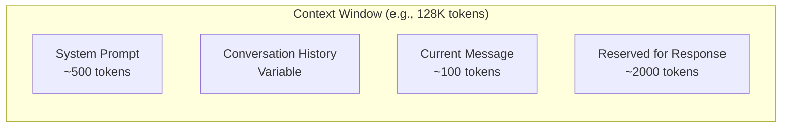

# Impact on Context

## Introduction

Context windows are measured in tokens, not words or characters. Understanding how tokens fill your context window is essential for building applications that handle long conversations, documents, and complex prompts.

### What We'll Cover

- Context as prompt + conversation + response
- Running out of context window
- Conversation truncation strategies
- Reserving space for responses

---

## What Fills the Context Window

The context window is shared between all parts of the conversation:



### Components

```python
context_budget = {
    "total": 128000,  # GPT-4 context window
    
    "system_prompt": 500,      # Your instructions
    "rag_context": 3000,       # Retrieved documents
    "conversation_history": 0, # Grows over time!
    "current_message": 100,    # User's current input
    "response_reserve": 4000,  # Space for model's response
}

available_for_history = (
    context_budget["total"] 
    - context_budget["system_prompt"]
    - context_budget["rag_context"]
    - context_budget["current_message"]
    - context_budget["response_reserve"]
)
# = 128000 - 500 - 3000 - 100 - 4000 = 120,400 tokens for history
```

---

## Running Out of Context

Long conversations eventually exceed the context window:

### The Problem

```python
# Each exchange adds tokens
conversation = []
tokens_per_exchange = 250  # Average: 100 user + 150 assistant

for i in range(1000):  # 1000 exchanges
    # User message
    conversation.append({"role": "user", "content": f"Message {i}"})
    # Assistant response
    conversation.append({"role": "assistant", "content": f"Response {i}"})
    
    total_tokens = i * tokens_per_exchange
    
    if total_tokens > 128000:
        print(f"Context exceeded at exchange {i}")
        break

# Context exceeded at exchange ~512
```

### What Happens When Exceeded

```python
# Option 1: API returns error
# OpenAI: "This model's maximum context length is 128000 tokens"

# Option 2: Automatic truncation (some providers)
# Oldest messages silently dropped

# Option 3: Your app crashes
# Unhandled exception
```

---

## Truncation Strategies

When context is exceeded, you must decide what to remove:

### Strategy 1: Simple Truncation

```python
def simple_truncate(messages: list, max_tokens: int, enc) -> list:
    """Keep most recent messages that fit"""
    # Always keep system message
    system = [m for m in messages if m["role"] == "system"]
    other = [m for m in messages if m["role"] != "system"]
    
    system_tokens = sum(len(enc.encode(m["content"])) for m in system)
    available = max_tokens - system_tokens - 1000  # Reserve for response
    
    # Start from most recent, add until full
    kept = []
    current_tokens = 0
    
    for message in reversed(other):
        msg_tokens = len(enc.encode(message["content"]))
        if current_tokens + msg_tokens <= available:
            kept.insert(0, message)
            current_tokens += msg_tokens
        else:
            break
    
    return system + kept
```

**Pros:** Simple, preserves recent context  
**Cons:** Loses early important context

### Strategy 2: Smart Truncation

```python
def smart_truncate(messages: list, max_tokens: int, enc) -> list:
    """Keep important messages + recent messages"""
    
    # Categorize messages
    system = [m for m in messages if m["role"] == "system"]
    first_exchange = messages[1:3] if len(messages) > 2 else []  # Keep first Q&A
    recent = messages[-10:]  # Always keep last 10
    middle = messages[3:-10] if len(messages) > 13 else []
    
    # Calculate tokens
    system_tokens = count_tokens(system, enc)
    first_tokens = count_tokens(first_exchange, enc)
    recent_tokens = count_tokens(recent, enc)
    
    available_for_middle = max_tokens - system_tokens - first_tokens - recent_tokens - 1000
    
    # Select from middle based on importance
    scored_middle = [(m, score_importance(m)) for m in middle]
    scored_middle.sort(key=lambda x: x[1], reverse=True)
    
    kept_middle = []
    middle_tokens = 0
    for msg, score in scored_middle:
        msg_tokens = len(enc.encode(msg["content"]))
        if middle_tokens + msg_tokens <= available_for_middle:
            kept_middle.append(msg)
            middle_tokens += msg_tokens
    
    # Reconstruct in original order
    kept_middle.sort(key=lambda m: messages.index(m))
    
    return system + first_exchange + kept_middle + recent
```

### Strategy 3: Progressive Summarization

```python
async def summarize_and_compact(
    messages: list, 
    max_tokens: int,
    summarizer_model: str
) -> list:
    """Summarize old messages to save space"""
    
    system = [m for m in messages if m["role"] == "system"]
    other = [m for m in messages if m["role"] != "system"]
    
    if len(other) < 20:
        return messages  # Not enough to summarize
    
    # Split into old and recent
    old_messages = other[:-10]
    recent_messages = other[-10:]
    
    # Summarize old messages
    summary_prompt = f"""
    Summarize this conversation history in a concise paragraph, 
    keeping key facts, decisions, and context:
    
    {format_messages(old_messages)}
    """
    
    summary = await generate(summarizer_model, summary_prompt)
    
    # Create summary message
    summary_message = {
        "role": "system",
        "content": f"[Previous conversation summary: {summary}]"
    }
    
    return system + [summary_message] + recent_messages
```

**Example result:**
```python
# Before: 50 messages, 15,000 tokens
# After: System + summary (500 tokens) + 10 recent (2,500 tokens)
# Saved: ~12,000 tokens
```

### Strategy 4: Sliding Window

```python
def sliding_window(messages: list, window_size: int) -> list:
    """Keep only the last N messages"""
    system = [m for m in messages if m["role"] == "system"]
    other = [m for m in messages if m["role"] != "system"]
    
    return system + other[-window_size:]

# Usage
messages = sliding_window(messages, window_size=20)
# Always keeps last 20 messages (10 exchanges)
```

---

## Reserving Space for Responses

Always leave room for the model's response:

### Why Reserve Space

```python
# BAD: Pack context to the limit
context_tokens = 127900  # Almost full
response = generate(context)  # Might get truncated!

# GOOD: Leave response space
max_input = 128000 - 4000  # Reserve 4000 for response
context_tokens = 124000  # Safe margin
response = generate(context)  # Has room to complete
```

### Calculating Safe Limits

```python
def safe_context_limit(
    model: str,
    expected_response_tokens: int,
    safety_margin: float = 0.05
) -> int:
    """Calculate safe maximum input tokens"""
    
    context_windows = {
        "gpt-4": 128000,
        "gpt-4o": 128000,
        "gpt-5": 256000,
        "claude-4": 200000,
        "claude-4-opus": 200000,
    }
    
    window = context_windows.get(model, 128000)
    margin = int(window * safety_margin)
    
    safe_input = window - expected_response_tokens - margin
    return safe_input

# Example
limit = safe_context_limit("gpt-4", expected_response_tokens=4000)
print(f"Safe input limit: {limit:,} tokens")  # 117,600 tokens
```

---

## Managing Conversation Memory

### Conversation Manager Class

```python
import tiktoken

class ConversationManager:
    def __init__(
        self, 
        model: str = "gpt-4",
        max_context: int = 128000,
        response_reserve: int = 4000
    ):
        self.model = model
        self.max_context = max_context
        self.response_reserve = response_reserve
        self.encoding = tiktoken.encoding_for_model(model)
        self.messages = []
        self.system_prompt = None
    
    def set_system_prompt(self, content: str):
        self.system_prompt = {"role": "system", "content": content}
    
    def add_user_message(self, content: str):
        self._add_message("user", content)
    
    def add_assistant_message(self, content: str):
        self._add_message("assistant", content)
    
    def _add_message(self, role: str, content: str):
        self.messages.append({"role": role, "content": content})
        self._ensure_within_limit()
    
    def _count_tokens(self, messages: list) -> int:
        total = 0
        for msg in messages:
            total += len(self.encoding.encode(msg["content"]))
            total += 4  # Message overhead
        return total
    
    def _ensure_within_limit(self):
        max_input = self.max_context - self.response_reserve
        
        while True:
            all_messages = ([self.system_prompt] if self.system_prompt else []) + self.messages
            current_tokens = self._count_tokens(all_messages)
            
            if current_tokens <= max_input:
                break
            
            if len(self.messages) <= 2:
                break  # Keep at least one exchange
            
            # Remove oldest non-system message
            self.messages.pop(0)
    
    def get_messages(self) -> list:
        """Get messages ready for API call"""
        result = []
        if self.system_prompt:
            result.append(self.system_prompt)
        result.extend(self.messages)
        return result
    
    def get_stats(self) -> dict:
        messages = self.get_messages()
        tokens = self._count_tokens(messages)
        return {
            "message_count": len(self.messages),
            "token_count": tokens,
            "remaining_input": self.max_context - self.response_reserve - tokens,
            "utilization": tokens / (self.max_context - self.response_reserve)
        }

# Usage
manager = ConversationManager()
manager.set_system_prompt("You are a helpful assistant.")

for i in range(100):
    manager.add_user_message(f"Question {i}: What is {i}+{i}?")
    manager.add_assistant_message(f"The answer is {i*2}.")
    
    stats = manager.get_stats()
    print(f"Exchange {i}: {stats['token_count']} tokens, {stats['message_count']} messages")
```

---

## Hands-on Exercise

### Your Task

Implement a context management system:

```python
def design_context_strategy(
    use_case: str,
    context_window: int,
    avg_user_tokens: int,
    avg_response_tokens: int,
    system_prompt_tokens: int
) -> dict:
    """
    Design a context management strategy for a use case.
    
    Consider:
    - How many exchanges can fit?
    - When to start truncating?
    - What truncation method to use?
    - How much to reserve for responses?
    """
    
    # Calculate exchanges that fit
    tokens_per_exchange = avg_user_tokens + avg_response_tokens
    available = context_window - system_prompt_tokens - avg_response_tokens
    max_exchanges = available // tokens_per_exchange
    
    # Design strategy
    strategy = {
        "max_exchanges_before_truncation": max_exchanges,
        "truncation_method": "?",  # sliding_window, smart, summarize
        "window_size": "?",  # If using sliding window
        "summarize_after": "?",  # If using summarization
        "response_reserve": avg_response_tokens,
    }
    
    return strategy

# Test for different use cases
customer_support = design_context_strategy(
    use_case="customer_support_chat",
    context_window=128000,
    avg_user_tokens=100,
    avg_response_tokens=300,
    system_prompt_tokens=500
)
```

### Questions to Consider

- When is sliding window sufficient vs. when do you need summarization?
- How does the choice affect user experience?
- What information is critical to preserve?

---

## Summary

✅ **Context window** is shared by system prompt, history, current message, and response

✅ Long conversations will **exceed context limits**

✅ **Truncation strategies**: simple, smart, summarization, sliding window

✅ Always **reserve space for responses** (4000+ tokens typically)

✅ **Implement automatic management** to handle growth seamlessly

✅ Consider **summarization** for very long conversations

**Next:** [Tokenization Across Models](./06-tokenization-differences.md)

---

## Further Reading

- [Managing Long Context](https://platform.openai.com/docs/guides/text-generation) — OpenAI guidance
- [Lost in the Middle](https://arxiv.org/abs/2307.03172) — Research on long context
- [Context Window Comparison](https://artificialanalysis.ai) — Model comparison

---

## Navigation

| Previous | Up | Next |
|----------|-------|------|
| [Impact on Cost](./04-impact-on-cost.md) | [Tokenization](./00-tokenization.md) | [Tokenization Differences](./06-tokenization-differences.md) |

