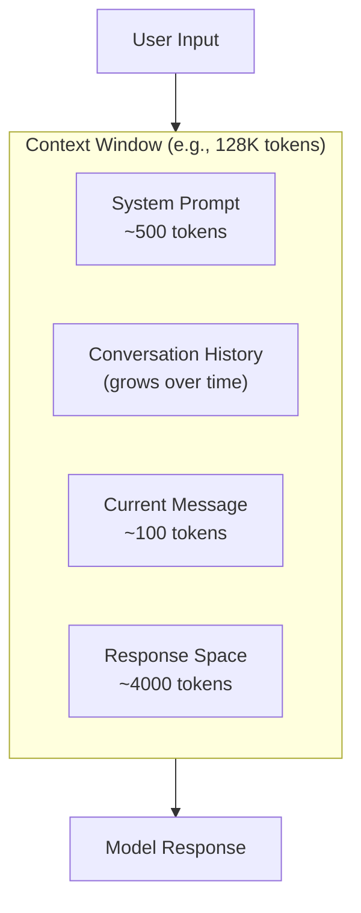

# Context Windows

## Overview

The context window is the model's working memory—the maximum amount of text it can process and respond to in a single interaction. Understanding context windows is essential for building applications that handle long conversations, documents, and complex multi-turn interactions.

Context window limits affect every aspect of AI application design, from how you structure conversations to how you handle document processing and manage costs.

## What You'll Learn

This lesson covers six essential topics:

1. **[What Is a Context Window?](./01-what-is-context-window.md)** — The model's working memory explained
2. **[Context Window Sizes](./02-context-window-sizes.md)** — Comparing models and their limits
3. **[Context Quality](./03-context-quality.md)** — "Lost in the Middle" and effective context
4. **[Managing Long Conversations](./04-managing-long-conversations.md)** — Strategies when context fills up
5. **[Context Window Strategies](./05-context-strategies.md)** — Truncation, summarization, and hybrid approaches
6. **[Impact on Application Design](./06-application-design.md)** — Building context-aware applications

## Prerequisites

Before starting this lesson, you should have:

- Completed [Tokenization](../03-tokenization/00-tokenization.md)
- Understanding of how tokens work
- Familiarity with LLM API concepts

## Why Context Windows Matter

| Aspect | Why It's Important |
|--------|-------------------|
| **Conversation length** | Determines how much history the model remembers |
| **Document processing** | Limits size of documents that can be analyzed |
| **Cost** | Larger context = higher cost per request |
| **Latency** | Larger context = slower response times |
| **Quality** | Context position affects model attention |

## Quick Context Overview



### Context Window in Action

```python
# Example context allocation
context_window = 128_000  # GPT-4 Turbo

# What fills it:
system_prompt = 500
conversation_history = 50_000  # After many exchanges
current_message = 200
reserved_for_response = 4_000

used = system_prompt + conversation_history + current_message + reserved_for_response
remaining = context_window - used

print(f"Context usage: {used:,} / {context_window:,} tokens")
print(f"Remaining: {remaining:,} tokens ({remaining/context_window*100:.1f}%)")
```

> **🤖 AI Context:** The context window is like a fixed-size buffer—when it fills up, something has to go. Your application must decide what to keep and what to discard.

## Learning Path

Complete topics in order:

```
01-what-is-context-window.md
    ↓
02-context-window-sizes.md
    ↓
03-context-quality.md
    ↓
04-managing-long-conversations.md
    ↓
05-context-strategies.md
    ↓
06-application-design.md
```

---

## Summary

This lesson explains how context windows work, their sizes across different models, quality considerations, and strategies for managing long conversations. These concepts are fundamental for building robust AI applications.

**Next:** [What Is a Context Window?](./01-what-is-context-window.md)

---

## Navigation

| Previous | Up | Next |
|----------|-------|------|
| [Tokenization](../03-tokenization/00-tokenization.md) | [AI/LLM Fundamentals](../00-overview.md) | [What Is a Context Window?](./01-what-is-context-window.md) |

