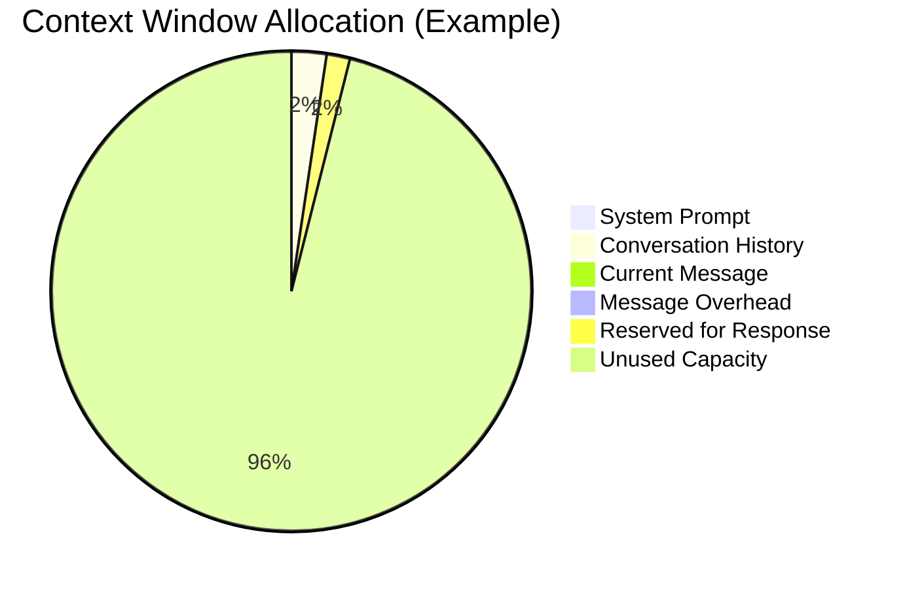
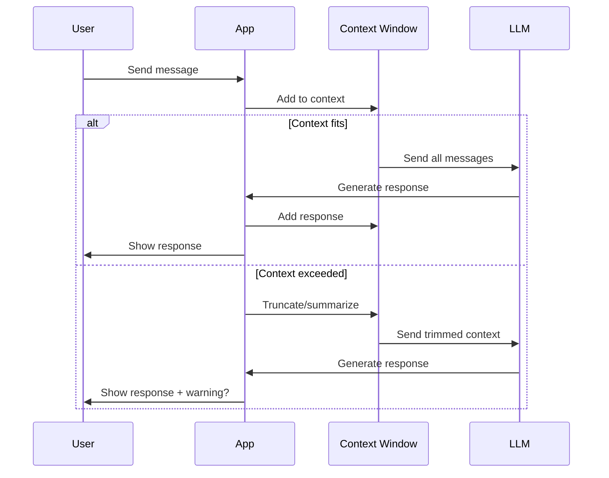

# What Is a Context Window?

## Introduction

The context window is the maximum amount of text an LLM can process in a single interaction. It's measured in tokens and includes everything—your input, the conversation history, and the model's response.

### What We'll Cover

- Context window as the model's "working memory"
- What fills the context window
- Hard limits and what happens when exceeded
- Input vs. output allocation

---

## The Model's Working Memory

Think of the context window as the model's short-term memory during a conversation:

```
┌─────────────────────────────────────────────────────┐
│                 Context Window                       │
│  ┌─────────────────────────────────────────────┐    │
│  │ Everything the model can "see" right now    │    │
│  │                                              │    │
│  │ • System prompt                              │    │
│  │ • Previous messages                          │    │
│  │ • Current user message                       │    │
│  │ • (Space for response)                       │    │
│  └─────────────────────────────────────────────┘    │
│                                                      │
│  Total capacity: e.g., 128,000 tokens               │
└─────────────────────────────────────────────────────┘
```

### Key Characteristics

| Property | Description |
|----------|-------------|
| **Fixed size** | Cannot be expanded beyond the model's limit |
| **Measured in tokens** | Not characters or words |
| **Shared space** | Input AND output come from the same pool |
| **Stateless** | Resets completely between API calls |

---

## What Fills the Context Window

Every token counts toward your context limit:

```python
# Components of a typical API call
context_components = {
    "system_prompt": "You are a helpful assistant...",  # ~50-500 tokens
    "conversation_history": [
        {"role": "user", "content": "Hello"},
        {"role": "assistant", "content": "Hi! How can I help?"},
        # ... more messages
    ],  # Variable, grows over time
    "current_message": "What's the weather like?",  # ~10 tokens
    "message_overhead": 4 * len(messages),  # ~4 tokens per message for formatting
    "response": "",  # Reserved space for output
}
```

### Visualizing Context Allocation



### Hidden Token Costs

```python
# Things that consume tokens (often unexpectedly):

# 1. Message formatting
# Each message adds overhead tokens:
# <|im_start|>user\n...<|im_end|>

# 2. JSON in function calls
# {"name": "get_weather", "parameters": {"city": "NYC"}}
# All those quotes and brackets are tokens!

# 3. Whitespace and formatting
long_prompt = """
    This prompt has
    lots of whitespace
    and newlines
"""
# Each newline and space counts

# 4. Repeated context
# If you include the same instructions in every message,
# they consume tokens every time
```

---

## Hard Limits

The context window is a hard limit—it cannot be exceeded:

### What Happens When Exceeded

```python
from openai import OpenAI

client = OpenAI()

try:
    response = client.chat.completions.create(
        model="gpt-4",
        messages=[
            {"role": "user", "content": "x" * 500000}  # Way too long
        ]
    )
except Exception as e:
    print(f"Error: {e}")
    # "This model's maximum context length is 128000 tokens. 
    #  However, your messages resulted in 142857 tokens."
```

### Context Limit Errors

| Provider | Error Type |
|----------|------------|
| OpenAI | `InvalidRequestError: context_length_exceeded` |
| Anthropic | `BadRequestError: prompt is too long` |
| Google | `ValueError: Request payload size exceeds the limit` |

### Prevention Strategies

```python
import tiktoken

def check_context_fit(messages: list, model: str, max_context: int) -> bool:
    """Check if messages fit within context window"""
    enc = tiktoken.encoding_for_model(model)
    
    total_tokens = 0
    for message in messages:
        # Count content tokens
        total_tokens += len(enc.encode(message["content"]))
        # Add message overhead
        total_tokens += 4
    
    # Reserve space for response
    response_reserve = 4000
    
    available = max_context - response_reserve
    fits = total_tokens <= available
    
    if not fits:
        print(f"Warning: {total_tokens} tokens exceeds limit of {available}")
    
    return fits
```

---

## Input vs. Output Allocation

The context window is shared between input and output:

```
Context Window: 128,000 tokens
├── Input (your messages): Up to ~124,000 tokens
└── Output (model response): Whatever remains

Example scenarios:
┌────────────────────────────────────────────────┐
│ Short input (1,000 tokens)                     │
│ → Room for 127,000 token response              │
│ → But model typically generates 100-2,000      │
└────────────────────────────────────────────────┘

┌────────────────────────────────────────────────┐
│ Long input (120,000 tokens)                    │
│ → Only 8,000 tokens for response               │
│ → If response needs more, it gets truncated!   │
└────────────────────────────────────────────────┘
```

### max_tokens Parameter

```python
# Control maximum output length
response = client.chat.completions.create(
    model="gpt-4",
    messages=[...],
    max_tokens=1000  # Limit response to 1000 tokens
)

# Why use max_tokens?
# 1. Control costs (output tokens cost more)
# 2. Ensure predictable response sizes
# 3. Leave room for conversation continuation
```

### Calculating Available Space

```python
def calculate_available_tokens(
    context_window: int,
    input_tokens: int,
    desired_output: int
) -> dict:
    """Calculate if request fits and what's available"""
    
    # Total needed
    total_needed = input_tokens + desired_output
    
    # Check fit
    fits = total_needed <= context_window
    
    # Maximum possible output
    max_output = context_window - input_tokens
    
    return {
        "fits": fits,
        "input_tokens": input_tokens,
        "max_possible_output": max_output,
        "requested_output": desired_output,
        "remaining_after_output": context_window - total_needed if fits else 0
    }

# Example
result = calculate_available_tokens(
    context_window=128000,
    input_tokens=100000,
    desired_output=4000
)
print(f"Fits: {result['fits']}")
print(f"Max possible output: {result['max_possible_output']:,}")
```

---

## Analogy: The Model's Desk

Think of the context window as a fixed-size desk:

```
┌────────────────────────────────────────────┐
│              THE MODEL'S DESK              │
│                                            │
│  ┌──────────────────────────────────────┐ │
│  │ Papers on desk = tokens in context   │ │
│  │                                      │ │
│  │ • Can only fit so many papers        │ │
│  │ • New papers push old ones off       │ │
│  │ • Once off the desk, forgotten       │ │
│  │ • Must leave room to write response  │ │
│  └──────────────────────────────────────┘ │
│                                            │
│  Desk size varies by model:               │
│  • Small desk: 4K tokens (GPT-3)          │
│  • Large desk: 128K tokens (GPT-4 Turbo)  │
│  • Huge desk: 1M tokens (Gemini 1.5)      │
└────────────────────────────────────────────┘
```

### What This Means in Practice

```python
# In a chatbot:
# - Each message exchange adds papers to the desk
# - Eventually desk fills up
# - Old messages must be removed
# - But removing them = model forgets!

# Your job: Manage the desk wisely
# - Keep important papers visible
# - Summarize old content
# - Know what the model needs to remember
```

---

## Context Window Lifecycle



---

## Hands-on Exercise

### Your Task

Build a context monitor:

```python
import tiktoken

class ContextMonitor:
    def __init__(self, model: str, context_window: int):
        self.model = model
        self.context_window = context_window
        self.enc = tiktoken.encoding_for_model(model)
        self.messages = []
    
    def add_message(self, role: str, content: str):
        """Add a message and check context status"""
        self.messages.append({"role": role, "content": content})
        return self.get_status()
    
    def count_tokens(self) -> int:
        """Count total tokens in context"""
        total = 0
        for msg in self.messages:
            total += len(self.enc.encode(msg["content"]))
            total += 4  # Message overhead
        return total
    
    def get_status(self) -> dict:
        """Get current context status"""
        tokens = self.count_tokens()
        return {
            "tokens_used": tokens,
            "tokens_remaining": self.context_window - tokens,
            "utilization_pct": (tokens / self.context_window) * 100,
            "message_count": len(self.messages),
            "can_continue": tokens < self.context_window * 0.9
        }

# Test it
monitor = ContextMonitor("gpt-4", 128000)

# Simulate a conversation
for i in range(50):
    monitor.add_message("user", f"This is message number {i}. " * 20)
    monitor.add_message("assistant", f"Response to message {i}. " * 30)
    
    status = monitor.get_status()
    print(f"Exchange {i+1}: {status['utilization_pct']:.1f}% used")
    
    if not status['can_continue']:
        print("⚠️ Context nearly full!")
        break
```

### Questions to Consider

- At what point should you warn users about context limits?
- How many typical exchanges fit in different context windows?
- What happens to conversation quality as context fills up?

---

## Summary

✅ **Context window** = maximum tokens the model can process at once

✅ It's the model's **working memory**, shared between input and output

✅ It's a **hard limit**—exceeding it causes errors

✅ The window is **stateless**—resets completely between API calls

✅ Always **reserve space** for the model's response

✅ **Hidden costs**: message formatting, whitespace, repeated context

**Next:** [Context Window Sizes](./02-context-window-sizes.md)

---

## Further Reading

- [OpenAI Token Limits](https://platform.openai.com/docs/models) — Official model specs
- [Anthropic Context Windows](https://docs.anthropic.com/en/docs/models-overview) — Claude specifications

---

## Navigation

| Previous | Up | Next |
|----------|-------|------|
| [Lesson Overview](./00-context-windows.md) | [Context Windows](./00-context-windows.md) | [Context Window Sizes](./02-context-window-sizes.md) |

