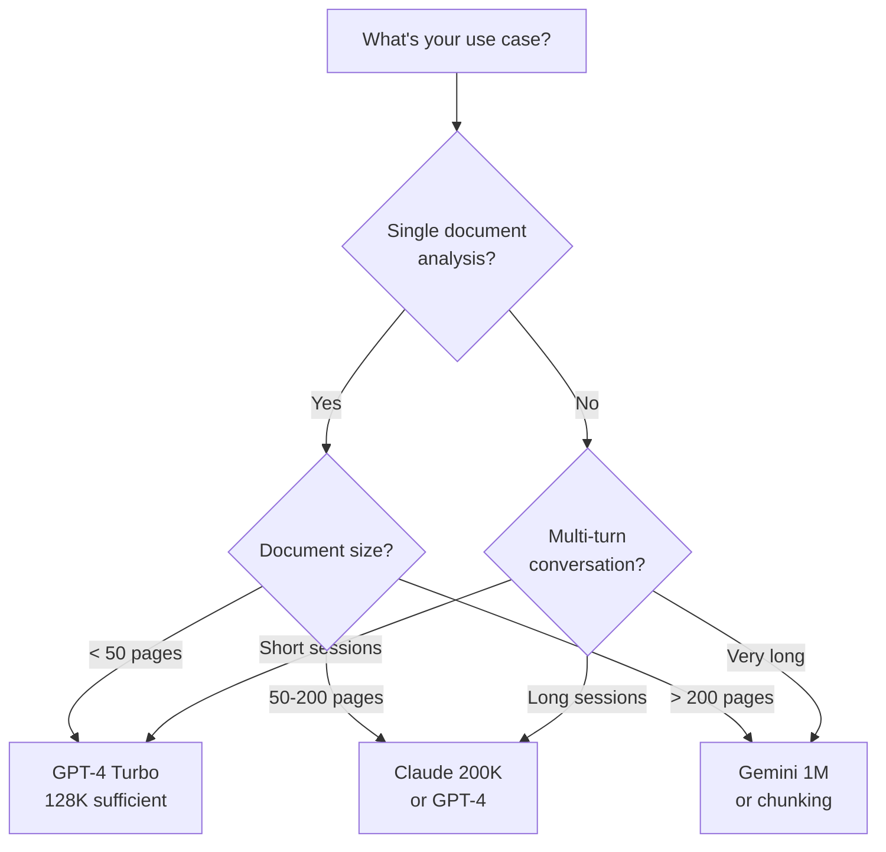

# Context Window Sizes Across Models

## Introduction

Different models offer different context window sizes. Understanding these differences helps you choose the right model for your use case and design applications that work within each model's constraints.

### What We'll Cover

- Context window sizes by model
- Trade-offs of larger context windows
- Cost implications
- Open source vs. commercial models

---

## Context Window Comparison

### Major Commercial Models (2025)

```python
context_windows = {
    # OpenAI
    "gpt-4": 8_192,          # Original
    "gpt-4-32k": 32_768,     # Extended
    "gpt-4-turbo": 128_000,  # Most common
    "gpt-4o": 128_000,       # Optimized
    "gpt-5": 256_000,        # Latest
    
    # Anthropic
    "claude-3-haiku": 200_000,
    "claude-3-sonnet": 200_000,
    "claude-3-opus": 200_000,
    "claude-4": 200_000,
    
    # Google
    "gemini-1.5-flash": 1_000_000,
    "gemini-1.5-pro": 1_000_000,
    "gemini-2.0": 1_000_000,
    
    # Others
    "mistral-large": 128_000,
    "cohere-command-r+": 128_000,
}
```

### Visual Comparison

```
Context Window Sizes (tokens):
──────────────────────────────────────────────────────
GPT-4 (8K)        ████
GPT-4 Turbo       ████████████████████████████████
Claude 3          ████████████████████████████████████████████████████
Gemini 1.5        ████████████████████████████████████████████████████████████████████████████████
                  └────────────────────────────────────────────────────────────────────────────────┘
                  0        100K       200K       400K       600K       800K       1M
```

### What These Numbers Mean in Practice

```python
# Approximate capacity (using 750 words ≈ 1000 tokens rule)

context_in_words = {
    "8K tokens": "6,000 words (12 pages)",
    "32K tokens": "24,000 words (48 pages)", 
    "128K tokens": "96,000 words (200 pages)",
    "200K tokens": "150,000 words (300 pages)",
    "1M tokens": "750,000 words (1,500 pages)",
}

# Real-world equivalents:
examples = {
    "8K": "A long article or short story",
    "32K": "A novella or detailed report",
    "128K": "A novel (The Great Gatsby is ~47K words)",
    "200K": "Lord of the Rings: Fellowship (~188K words)",
    "1M": "Several novels or a comprehensive codebase",
}
```

---

## Trade-offs of Larger Context

Bigger isn't always better. Larger context windows come with costs:

### Speed vs. Size

```python
# Approximate latency by context usage
latency_factors = {
    "10% context used": "baseline speed",
    "50% context used": "~1.5x slower",
    "90% context used": "~3x slower or more",
}

# Why?
# - Attention mechanism is O(n²) in context length
# - More tokens = more computation
# - Memory bandwidth limitations
```

### Cost Implications

```python
# Larger context = more expensive
# Both input AND output tokens are charged

# Example: Processing a 100K token document with GPT-4 Turbo
input_tokens = 100_000
output_tokens = 2_000
input_rate = 10.00  # per million tokens
output_rate = 30.00

cost = (input_tokens / 1_000_000 * input_rate) + (output_tokens / 1_000_000 * output_rate)
print(f"Cost for one request: ${cost:.2f}")  # $1.06

# Same task 100 times = $106
# With caching/optimization, much less
```

### Quality Considerations

```python
# "Lost in the middle" phenomenon
# Models pay less attention to middle of long contexts

attention_distribution = {
    "beginning": "High attention",
    "middle": "Lower attention (!)",
    "end": "High attention",
}

# Practical implications:
# - Put important info at start or end
# - Don't assume all 200K tokens are equally useful
# - Effective context < advertised context
```

---

## Choosing the Right Context Size

### Decision Framework



### Use Case Recommendations

| Use Case | Recommended Context | Why |
|----------|-------------------|-----|
| Chatbot (simple) | 8-32K | Most conversations fit |
| Chatbot (complex) | 128K | Room for context, history |
| Document Q&A | 128-200K | Fit entire documents |
| Code analysis | 128-200K | Full file context |
| Book analysis | 200K-1M | Entire books |
| Codebase analysis | 1M | Multiple files |

---

## Open Source Models

Open source models typically have smaller context windows:

### Popular Open Source Models

```python
open_source_context = {
    # LLaMA family
    "llama-2-7b": 4_096,
    "llama-2-13b": 4_096,
    "llama-2-70b": 4_096,
    "llama-3-8b": 8_192,
    "llama-3-70b": 8_192,
    "llama-3.1-70b": 128_000,  # Extended!
    
    # Mistral family
    "mistral-7b": 32_768,
    "mistral-8x7b": 32_768,
    "mistral-large": 128_000,
    
    # Others
    "qwen-2.5-72b": 128_000,
    "deepseek-v2": 128_000,
}
```

### Context Extension Techniques

```python
# Open source models often use extensions to increase context

techniques = {
    "RoPE scaling": "Rotate position embeddings to handle longer sequences",
    "ALiBi": "Attention with Linear Biases for position",
    "YaRN": "Yet another RoPE extensioN",
    "LongLoRA": "Efficient fine-tuning for long context",
}

# Trade-offs:
# - Extended context often has lower quality
# - May need fine-tuning for best results
# - Inference becomes slower
```

---

## Context Window Evolution

### Historical Progression

```
Year    Model               Context
────────────────────────────────────
2020    GPT-3               4,096
2022    GPT-3.5             4,096
2023    GPT-4               8,192
2023    GPT-4-32K           32,768
2023    Claude 2            100,000
2023    GPT-4 Turbo         128,000
2024    Claude 3            200,000
2024    Gemini 1.5          1,000,000
2025    GPT-5               256,000+
```

### Trend Analysis

```python
# Context windows have grown ~100x in 5 years
# Following an exponential trend

# Future expectations:
# - 10M token context within 2-3 years
# - Efficient attention mechanisms
# - Hardware optimizations
# - Possibly unlimited with retrieval
```

---

## Practical Sizing Guide

### How Much Context Do You Actually Need?

```python
def estimate_context_needs(
    avg_user_message_tokens: int,
    avg_response_tokens: int,
    system_prompt_tokens: int,
    target_conversation_length: int,
    safety_margin: float = 0.2
) -> int:
    """Estimate required context window size"""
    
    # Tokens per exchange
    per_exchange = avg_user_message_tokens + avg_response_tokens + 10  # overhead
    
    # Total for conversation
    conversation_tokens = per_exchange * target_conversation_length
    
    # Add system prompt
    total = system_prompt_tokens + conversation_tokens
    
    # Add safety margin
    with_margin = int(total * (1 + safety_margin))
    
    # Round up to nearest available size
    available_sizes = [8192, 32768, 128000, 200000, 1000000]
    for size in available_sizes:
        if size >= with_margin:
            return size
    
    return available_sizes[-1]

# Example: Customer support chatbot
needed = estimate_context_needs(
    avg_user_message_tokens=100,
    avg_response_tokens=300,
    system_prompt_tokens=500,
    target_conversation_length=20  # 20 back-and-forth exchanges
)
print(f"Recommended context: {needed:,} tokens")  # 8,192 (smallest that fits)

# Example: Document analysis
needed = estimate_context_needs(
    avg_user_message_tokens=50000,  # Document
    avg_response_tokens=2000,
    system_prompt_tokens=500,
    target_conversation_length=5
)
print(f"Recommended context: {needed:,} tokens")  # 128,000 or 200,000
```

---

## Hands-on Exercise

### Your Task

Create a model selector based on requirements:

```python
def select_model_for_context(
    required_input_tokens: int,
    expected_output_tokens: int,
    priority: str  # "cost", "speed", "quality"
) -> dict:
    """
    Select the best model based on context needs and priorities.
    
    Args:
        required_input_tokens: How many tokens your input needs
        expected_output_tokens: Expected response length
        priority: What matters most - cost, speed, or quality
    
    Returns:
        Dictionary with model recommendation and reasoning
    """
    
    total_needed = required_input_tokens + expected_output_tokens
    
    # Model options with characteristics
    models = [
        {"name": "gpt-4o-mini", "context": 128000, "speed": 5, "quality": 3, "cost": 1},
        {"name": "gpt-4o", "context": 128000, "speed": 4, "quality": 5, "cost": 3},
        {"name": "claude-3-haiku", "context": 200000, "speed": 5, "quality": 3, "cost": 1},
        {"name": "claude-3-sonnet", "context": 200000, "speed": 4, "quality": 4, "cost": 2},
        {"name": "gemini-1.5-flash", "context": 1000000, "speed": 5, "quality": 4, "cost": 2},
    ]
    
    # Filter by context requirement
    suitable = [m for m in models if m["context"] >= total_needed]
    
    if not suitable:
        return {"error": "No model has sufficient context window"}
    
    # Sort by priority
    priority_key = priority  # "cost", "speed", or "quality"
    reverse = priority == "quality"  # Higher quality is better
    suitable.sort(key=lambda m: m[priority_key], reverse=reverse)
    
    best = suitable[0]
    return {
        "recommended_model": best["name"],
        "context_window": best["context"],
        "utilization": f"{(total_needed/best['context'])*100:.1f}%",
        "reason": f"Best {priority} for your needs"
    }

# Test it
result = select_model_for_context(
    required_input_tokens=50000,
    expected_output_tokens=2000,
    priority="cost"
)
print(result)
```

### Questions to Consider

- When would you choose a smaller context window despite having larger options?
- How does context size affect your application architecture?
- What's the sweet spot between context size and cost?

---

## Summary

✅ Context windows range from **8K to 1M tokens** across models

✅ **Larger context = slower and more expensive** processing

✅ **Quality degrades** for content in the middle of long contexts

✅ **Open source models** typically have smaller context windows

✅ Choose context size based on **actual needs**, not maximum available

✅ Context windows continue to **grow rapidly** year over year

**Next:** [Context Quality](./03-context-quality.md)

---

## Further Reading

- [OpenAI Models](https://platform.openai.com/docs/models) — Official specifications
- [Anthropic Models](https://docs.anthropic.com/en/docs/models-overview) — Claude specifications
- [Google AI Models](https://ai.google.dev/models) — Gemini specifications

---

## Navigation

| Previous | Up | Next |
|----------|-------|------|
| [What Is a Context Window?](./01-what-is-context-window.md) | [Context Windows](./00-context-windows.md) | [Context Quality](./03-context-quality.md) |

